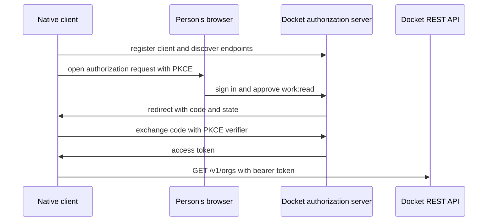

This quickstart uses the public REST bearer canary: `GET /v1/orgs`. It does not create a task.
Task creation and other business REST operations still require a first-party session until Docket
publishes their OAuth operation contracts.

## Register a native client

Fetch `https://api.clearthedocket.com/.well-known/oauth-protected-resource/v1` and then the
authorization-server metadata it names. Register a native public client at the discovered
registration endpoint:

```bash
curl https://api.clearthedocket.com/api/auth/oauth2/register \
  -H 'content-type: application/json' \
  --data '{
    "client_name":"Docket quickstart",
    "redirect_uris":["http://127.0.0.1/callback"],
    "token_endpoint_auth_method":"none",
    "grant_types":["authorization_code","refresh_token"],
    "response_types":["code"],
    "type":"native"
  }'
```

Save the returned `client_id`. Generate a high-entropy PKCE verifier and its SHA-256 base64url
`code_challenge`. Keep the verifier local.

## Send the person to Docket

Build a browser URL from the discovered `authorization_endpoint`. Include `response_type=code`,
the returned `client_id`, your registered `redirect_uri`, `scope=work:read offline_access`,
`resource=https://api.clearthedocket.com/v1`, `code_challenge`, `code_challenge_method=S256`, and
an unpredictable `state`. Verify the returned `state` before using the code.



## Exchange the code and call the canary

POST the code, registered redirect URI, `client_id`, PKCE verifier, and resource to the discovered
token endpoint. Then list the organizations the person can read:

```bash
curl https://api.clearthedocket.com/v1/orgs \
  -H "Authorization: Bearer $ACCESS_TOKEN" \
  -H 'Docket-Version: 0.1.0'
```

The response is a standard `{ "items": [...] }` page envelope. `HEAD /v1/orgs` accepts the same
token when a client only needs the response headers.

<Note>
  A token cannot exceed the person's current grants. Revocation, scope reduction, client
  disablement, user removal, and a live grant reduction invalidate it immediately.
</Note>

Continue with [Authentication](/developers/authentication) for discovery and lifetime behavior, or
use [MCP](/developers/connect-an-agent-mcp) for task and time actions.
