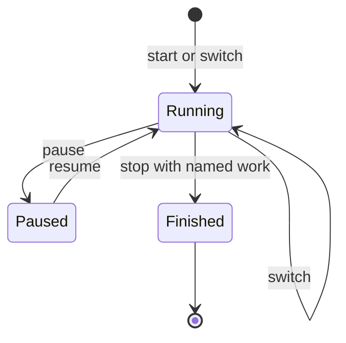

Time tracking is available through the MCP `track` tool. It belongs to a person, not an agent
principal. Use `work:read` for `status` and `segments`; use `work:write` for time-changing actions.

## Timer actions

| Action     | Result                                                                     |
| ---------- | -------------------------------------------------------------------------- |
| `start`    | Starts a timer for `taskId`, a new task named by `label`, or unnamed work. |
| `pause`    | Pauses the running timer.                                                  |
| `resume`   | Resumes it.                                                                |
| `switch`   | Starts tracking different work. Pass `taskId` or `label`.                  |
| `stop`     | Stops the timer. An unnamed session needs `label` before it can finish.    |
| `status`   | Returns the active timer and an optional personal suggestion.              |
| `segments` | Lists recorded segments in an ISO-8601 `start` and `end` period.           |

Starting the same task again within a minute continues its previous segment instead of recording a
break. A `status` suggestion comes from the person's own calendar and day plan. It is a suggestion,
not an instruction to start tracking.



## Examples

Start a timer for an existing task:

```json
{ "action": "start", "taskId": "01H..." }
```

Start an unnamed timer and name it when stopping:

```json
{ "action": "start" }
```

```json
{ "action": "stop", "label": "Investigate production alert" }
```

Use [Connect an AI agent](/developers/connect-an-agent-mcp) to configure the MCP transport and
[MCP tools and resources](/developers/mcp-tools-and-resources) for authority behavior.
