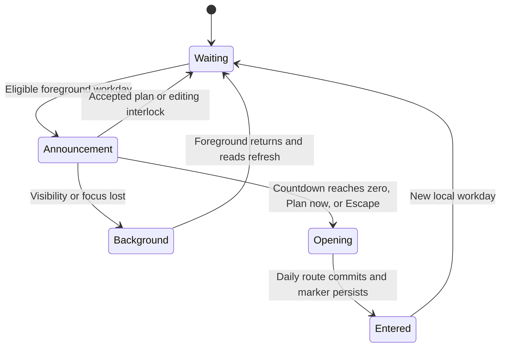

# Daily planning

This is for product designers and engineers changing the daily flow. They should preserve the existing daily planner and its saved stages. Today remains the default home after planning.

Docket automatically opens the daily planner once per eligible local workday. The authenticated application shell shows “It’s time to plan your day” and “Opening planner in 5 seconds.” Plan now opens the planner immediately. Escape also proceeds immediately. The dialog has no Later, close, skip, or dismissal action. Outside clicks leave it open.

Eligibility uses the scheduling timezone and the outer bounds of today’s non-personal availability windows. The API supplies its existing defaults when preferences are unset. An accepted day suppresses entry even when an adjustment draft exists. A loading or failed read never counts as an unplanned day. A person already in the daily planner continues there.

The countdown runs only while the document is visible and the window has focus. Losing either cancels entry without navigation. Returning reloads eligibility and starts a fresh five-second countdown. An active editor, another dialog, or an authentication transition prevents entry. Confirmation arriving during the countdown cancels it.

Navigation uses `/plan?view=day&date=YYYY-MM-DD` and the existing controller resumes the saved stage. A browser marker scoped to the user, timezone, and date records the committed destination and prevents repeated entry across reloads and tabs. Unavailable browser storage falls back to an in-memory marker. Automatic entry does not accept a plan or start tracking. The planner keeps its existing exit behavior.

This state machine shows the automatic entry lifecycle. Eligibility and successful reads allow the announcement. Leaving the foreground cancels it. Navigation records entry when the daily route commits.

The standard path is Review yesterday → Plan today → Review plan → Confirmation. A new user with no recent work starts by adding work. A returning user resumes the saved draft at its last stage. A person who starts late sees the time still available before their chosen finish time. Work already completed or tracked stays visible as recorded work and does not become a new planned session. Tomorrow uses the same flow with tomorrow's date shown throughout.

Plan today keeps work and the agenda on the same screen at desktop width. A phone puts the compact work rows before the agenda during review. Add work opens a separate searchable view and can create a task through the normal composer. A person can leave work under Unscheduled and still confirm. Each row can edit its title and planned minutes directly. Each block has explicit controls for scheduling, moving, changing duration, pinning, and removing. A task may have two planned sessions, and a block may hold two tasks.

Review plan opens with a short account of the day's shape. It describes what comes first and whether work remains unscheduled or exceeds the available time. Time totals stay beside the work rows, where they help make a concrete adjustment. An adjustment shows what changed from the accepted plan before confirmation. Confirmation has its own screen and offers an explicit Start or Continue action when a task is next. Confirming by itself never starts a timer.

Today uses the accepted plan. A missed unpinned block offers Done, Still working, and Not started. Done opens exact-time entry so the person can correct what happened; it does not complete the task. Not started opens an agenda preview with that block unscheduled. Fixed events and pinned blocks stay in place. Confirming the change offers Undo. The original plan and recorded time remain intact as separate facts.

Athena can support planning later, but no step requires it. Labels name work or actions. Supporting copy states a condition or consequence, and it avoids claims about what the interface is doing on the person's behalf.
