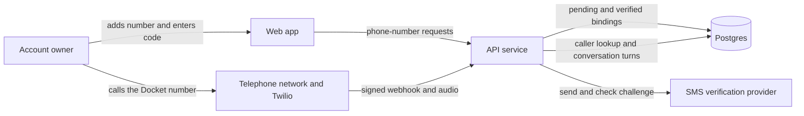

# Athena phone verification and linking audit — 2026-08-28

**Verdict: DO NOT SHIP.** The launch owner must keep phone linking and inbound telephone access
disabled until the P0 findings in this audit are closed. The current code proves control of a
handset once. It does not provide a safe account credential, a working production delivery path,
or a complete settings experience.

## Current state

The codebase has the basic pieces. The Settings page can add, resume, verify, list, and remove
numbers. The API stores redacted account bindings, sends six-digit challenges, limits attempts,
checks Twilio webhook signatures, resolves verified caller IDs, checks the personal workspace's
voice entitlement, and opens the canonical Athena conversation.

The production API is healthy and exposes the phone routes. An unauthenticated request to
`/v1/me/phone-numbers` returns 401, and the Twilio voice route returns 405 to a GET. Those responses
prove that the routes exist. They do not prove that SMS delivery or a live phone call works.

The production GitHub environment currently binds only
`DATABASE_URL=docket-database-url:latest` through `API_SECRET_BINDINGS`. It has no `SMS_*` or
`TWILIO_*` secret names. The deployment workflow writes no phone provider variables. A future
deployment therefore cannot construct the production SMS sender, and it cannot validate Twilio
webhooks. The current Cloud Run revision's environment remains unverified because the local
`gcloud` session requires interactive reauthentication.

The voice specification also states that no Docket-owned number has been provisioned. The web app
does not render `TWILIO_PHONE_NUMBER`, so a verified user would still have no number to call.

### C4 container diagram

The SMS provider container and the provisioned Docket number are absent in production. The API
also treats the telephone network's caller ID as the account credential after the call reaches
Twilio.

## Ship blockers

### P0 — Caller ID is not user authentication

The inbound route resolves `From` by exact E.164 equality and immediately opens the account's
canonical Athena conversation. The repository already admits that caller ID is spoofable. Exact
matching does nothing to fix spoofing. The Twilio signature proves that Twilio sent the webhook. It
does not prove that the caller controls the claimed `From` number.

This is not a read-only channel. The phone tool surface can list work, create tasks, and complete
tasks immediately. A spoofed call can therefore read private conversation context and mutate the
account. Athena needs a second per-call proof before it loads private context or enables tools. A
spoken PIN is weak but better than caller ID alone. A passkey approval or one-time in-app call
approval would provide a defensible account credential.

Twilio documents webhook signatures as service authentication. Twilio separately describes
SHAKEN/STIR as the mechanism that addresses falsified caller identity. Athena currently checks the
first and does not consume an attestation from the second:

- [Twilio webhook security](https://www.twilio.com/docs/usage/webhooks/webhooks-security)
- [Twilio trusted calling with SHAKEN/STIR](https://www.twilio.com/docs/voice/trusted-calling-with-shakenstir)

### P0 — Linking and unlinking skip step-up authentication

Adding a phone number changes an account credential. Removing one revokes that credential. Both
routes require only an authenticated session. Athena already requires a passkey-fresh session to
unlink an OAuth identity, generate recovery codes, or schedule account deletion. Phone binding
must use the same five-minute step-up gate. Otherwise, anyone with a stolen browser session can
bind their own handset, verify it, and call into the victim's account later.

The API must enforce step-up. The settings page must run the existing passkey reauthentication
flow and retry the request after the API returns `reauth_required`. A client-only prompt is not a
security boundary.

### P0 — Pause and removal do not revoke an active call

The API description says that removal stops calls immediately. The implementation only deletes the
phone row. Postgres sets `voice_session.phone_number_id` to null, while the in-memory voice engine
and Twilio relay remain open. The calling toggle has the same defect. A person can remove or pause a
number and the current caller can continue reading the conversation and running tools.

The API must find every active voice session for the binding, end its engine, close its relay, and
record a stable revocation reason in the same operation. A provider disconnect failure must remain
visible to operators until the call ends.

### P0 — Production has no working verification or telephone provider

The generic SMS adapter requires `SMS_ENDPOINT`, `SMS_API_KEY`, and `SMS_FROM`. The Twilio front
door requires the account SID, auth token, and phone number. The production deployment config binds
none of them. The challenge service catches every send error and still returns a successful API
shape with `deliveryFailed`, so the product exposes a dead verification flow instead of disabling
it.

The launch owner must choose and configure the Hypertext Studio provider account, provision the
Docket-owned number, bind all secrets, configure both callbacks, and publish the number in the
product. The release needs a real handset canary that sends a code, verifies the number, places a
call, takes a harmless action, pauses the number, and proves that the active call ends. A route
probe or fixture call cannot replace that canary.

The code should use a managed verification service instead of the generic SMS sender for this
credential flow. Twilio Verify supports provider-side check state, delivery outcomes, fraud guard,
geo controls, and limits keyed by number, user, IP address, or another application identifier:

- [Twilio Verify best practices](https://www.twilio.com/docs/verify/developer-best-practices)
- [Twilio Verify service rate limits](https://www.twilio.com/docs/verify/api/programmable-rate-limits)

Carrier-backed number verification should be a progressive enhancement. The GSMA Open Gateway
and CAMARA Number Verification API can prove in real time that the app's handset and SIM currently
hold the claimed number. Its access token is single-use and expires within five minutes. Twilio
exposes the same class of proof through Verify Silent Network Authentication. Twilio still labels
SNA as beta and documents limited country and carrier coverage, so Athena needs SMS as the fallback:

- [GSMA Open Gateway Number Verification](https://open-gateway.gsma.com/docs/number-verification/api-reference)
- [Twilio Verify Silent Network Authentication](https://www.twilio.com/docs/verify/sna)

A wallet-held digital credential does not replace either control. The W3C Digital Credentials API
can mediate a signed credential presentation to a website, but it remains a working draft, and a
normal PSTN call has no channel for presenting that wallet credential. A long-lived credential that
claims ownership of a recycled phone number would also outlive the carrier's assignment. Athena may
later accept a short-lived, issuer-status-checked phone claim during web linking. It must still bind
the account to a passkey and require a fresh per-call proof:

- [W3C Digital Credentials](https://www.w3.org/TR/digital-credentials/)

### P0 — The Settings page cannot control the credential it creates

The API supports `POST /:id/calling`, but the web app never calls it. Every new binding defaults to
`callingEnabled: true`, and the UI labels every verified row only as `Verified`. A user cannot pause
phone access without deleting the proof. The page also does not show the Docket number to call.

The verified state needs a clear on/off control, the destination number, the last successful call,
the verification date, and a statement that telephone access uses the personal workspace. The
default should remain off until the product explains the caller-authentication boundary and the
user opts in.

## Serious correctness and abuse defects

### P1 — Delete and re-add resets the SMS limit

The send limiter counts challenges by `phone_number_id`. Deleting a pending number cascades its
challenge history. Re-adding the same E.164 value creates a new row and a fresh budget. Another
account can also create its own pending row for the same number. Concurrent requests can pass the
read-before-insert check together. These paths allow SMS harassment, toll pumping, and provider
cost abuse.

Rate limits must survive row deletion. They must cover normalized E.164, account, IP address,
country prefix, and provider account. The send reservation must be atomic. Provider-side fraud
controls should backstop the application limits.

### P1 — A recycled number cannot transfer to its new owner

Postgres allows multiple pending rows for one E.164 value and one verified row. When the new owner
submits the correct code, the update collides with the old verified row's unique index and returns
an unhandled server error. The old account keeps the credential indefinitely.

Successful proof needs an explicit transfer policy. At minimum, Athena must revoke the old
binding, end its calls, notify both accounts, write an audit event, and make the new binding
verified in one transaction. The product also needs periodic re-verification for stale numbers.

### P1 — International normalization corrupts valid numbers

The country picker claims broad international support, but `composeE164` strips every leading zero
from the national number and validates only total digit count. Italy keeps a significant leading
zero in E.164, so Athena changes valid Italian numbers. The list also models several North American
Numbering Plan territories as fixed prefixes and omits alternate area codes.

Athena must parse and validate with a maintained phone-number library against the selected region.
If launch supports only the United States, the UI and API must enforce that scope instead of
offering countries that the code cannot handle.

### P1 — Six-digit codes are cheap to recover from a database read

The database stores an unkeyed SHA-256 hash of a six-digit value. An attacker with read access can
hash all one million possibilities offline. The schema comment that a database read cannot verify a
number is false. Use a keyed HMAC with a separately managed pepper, or let the verification provider
own the code. Keep the online attempt limit as a separate defense.

### P1 — Delivery state stops at HTTP acceptance

The generic sender records an ID after any successful HTTP response. The verification row stores
only `deliveryFailed`. A carrier rejection after provider acceptance still leaves the UI claiming
that Docket texted the code. Athena needs a provider attempt ID, status callbacks or polling, final
delivery state, and application-owned guidance for landlines, blocked destinations, and delayed
delivery.

## UI and interaction findings

### P1 — A failed read renders the add form as though no numbers exist

The component reduces missing query data to an empty array. It never renders the query's pending or
error state. A probe that forced all three list requests to return 503 still showed the normal
country, phone-number, and “Send me a code” controls. The page showed no alert and no retry action.
This can hide an existing credential and prompt a duplicate bind attempt.

The surface needs a skeleton while the list loads. A failed load needs application-owned copy and a
retry action. The add form must not appear until the server has returned the list.

### P1 — Pending rows lose actions on a 390 px phone

The row forces the masked number, badge, resend button, and trash button into one non-wrapping flex
line. The card then clips overflow. At 390×844, the pending row measures 326 px wide and has 401 px
of content. The resend button loses 9 px, and the remove button has zero visible width. The document
does not overflow because the card hides the broken controls.

The phone layout must keep the identity and status on one line and move secondary actions into a
`More phone controls` menu. It must not wrap a toolbar into an accidental second line.

### P1 — Removal is an unconfirmed 28 px-wide destructive target

The trash action runs immediately. It has no confirmation, Undo, or step-up. Its measured target is
28×40 px, which fails the 40×40 px touch target rule. The pending version can still receive keyboard
focus after it has been clipped out of view.

Use a visible or overflow-menu “Remove phone number” action. Require step-up, show the masked number
in a confirmation dialog, and keep the target at least 40×40 px.

### P2 — The forms ignore Enter and mutation feedback is weak

The add and verify controls use click handlers inside `div` elements instead of semantic forms.
Pressing Enter in either field does nothing. Buttons disable during requests but keep static labels,
and successful changes are not announced through a live region. Use `form` submission, pending
labels such as “Sending code…” and “Verifying…”, and an application-owned status region.

### P2 — The country picker is slow and the redaction can be ambiguous

The native country select contains roughly 200 entries with no search and always defaults to the
United States. The account receives only the country code and final two digits for display. Two
numbers can therefore render identically. Use a searchable country control, derive a safe initial
country from locale when possible, and show enough digits after step-up to distinguish the owner's
bindings.

## Screenshot evidence

The screenshots use a local, disposable account fixture. No production account or phone binding
was changed. Evidence lives in
`docs/design/audits/screenshots/2026-08-28-phone-linking/`.

The empty, pending, and verified states each have 1440×900 and 390×844 captures in light and dark
themes. `settings-athena-390x844-load-failure.png` records the hidden 503 state.
`probe-report.json` records the measured clipping, touch targets, focus treatment, and failed-read
result.

## Craft scores

| Dimension                 | Score | Evidence                                                                                                                          |
| ------------------------- | ----- | --------------------------------------------------------------------------------------------------------------------------------- |
| 1. Brand identity & voice | 3     | The page uses Docket's settings cards, tokens, icon language, and direct product copy.                                            |
| 2. Typographic craft      | 3     | Heading, field, badge, and helper text hierarchy remain readable at both widths and in both themes.                               |
| 3. Spatial rhythm         | 2     | Empty and verified states align, but a pending row overfills its container and the masked value can break across three lines.     |
| 4. Hierarchy              | 2     | Verification is clear, but the verified state omits the call destination, access toggle, recency, and credential consequences.    |
| 5. Color discipline       | 3     | Existing surface, outline, status, and error tokens preserve contrast and depth in light and dark themes.                         |
| 6. Motion & feedback      | 2     | Errors use an alert, but loading, send, verify, pause, remove, and success states lack useful progress or announcement treatment. |
| 7. States completeness    | 1     | Loading and failed reads are absent. Paused, transferred, stale, delivery-delayed, and production-disabled states have no UI.     |
| 8. Detail craft           | 1     | Mobile clipping hides removal, destructive targets are undersized, Enter does nothing, and active-call revocation is false.       |

## Hard gates

| Gate                | Result | Evidence                                                                                                             |
| ------------------- | ------ | -------------------------------------------------------------------------------------------------------------------- |
| A11y                | Fail   | Remove is 28 px wide, and the pending target can take focus while fully clipped. The forms do not submit with Enter. |
| Responsive          | Fail   | A 390 px pending row hides part of resend and all of remove inside `overflow-hidden`.                                |
| Theme parity        | Pass   | Empty, pending, and verified states were captured at both widths in light and dark themes.                           |
| No placeholder      | Pass   | The audit used local fixture responses, and no fake phone data or provider state was added to production.            |
| Screenshot-verified | Pass   | Twelve state captures, one forced-failure capture, and the browser measurement report support the visual findings.   |

## Required launch sequence

1. Replace caller ID authentication with a per-call user proof, and require step-up for credential
   changes.
2. Make pause and removal terminate active calls. Define transfer, stale-number, and re-verification
   policy.
3. Move challenge delivery and checking onto a managed verification adapter. Add durable,
   multi-key rate limits and keyed code storage if Docket retains codes.
4. Use region-aware number parsing, or reduce the launch scope to countries that the product can
   validate.
5. Add the call destination, opt-in toggle, last-call state, loading/error states, confirmation,
   semantic forms, progress feedback, and a mobile overflow menu.
6. Provision the Hypertext Studio provider account and Docket number. Bind production secrets, run
   provider callbacks, and complete a real-handset round trip with revocation proof.

The focused contract, API, inbound-call, and settings tests pass with 59 assertions. The missing
tests are the security and lifecycle cases named above. The launch suite must add them before the
real-handset canary can count as evidence.
