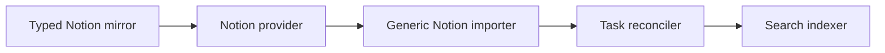

# Search duplicates and mention discovery

This audit is for the Docket maintainer fixing imported duplicates and search discovery. Use the evidence below to stop duplicate creation before repairing existing records.

## Duplicate tasks exist in production

On 2026-09-19, searching `Tactical Urbanism` in the signed-in LVBT workspace returned two copies each of Tactical Urbanism Launch, Tactical Urbanism Research Project, Actionable Report for Southern Nevada Complete, and Study of Other Cities Complete.

The first Tactical Urbanism Launch result opens task `01M2RXWTE3DGPX4Q6ZAR7J9AE4`. The task has Todo status, no project, a June 30, 2027 due date, and the initiative description. More Task properties shows a September 17, 2026 creation date and an origin link to Notion page `3dac7791208f8133a943ff0afd2eb030`. The existing initiative has id `01M2CQESEARV6CAMJ31X442KVB`. Both belong to organization `01KY1N724K30F3MCPQMRC7GVD3`.

The workspace Notion settings show nine Docket-built tables, including Tasks, Projects, Initiatives, and Milestones. The interface reports an active hourly sync. The exact generic-import list selection and the duplicate page's mirror-row association were not exposed in the inspected UI.

## The importer can read exported entities back as tasks

`packages/integrations/src/notion.ts` imports every accessible data source when `listIds` is absent or empty. `notion-mapping.ts` assigns every imported page `kind: issue`. The flat sync in `apps/api/src/routes/integration-sync.ts` passes those items to `reconcileTasks`. Neither module excludes databases recorded in `notion_mirror_database`. The separate mirror tables retain the original entity type, but the generic importer never consults them.

This is a concrete path for an exported initiative or milestone to become a task. Production evidence confirms a real Notion-linked task duplicate. A direct join between its external page id and `notion_mirror_row` remains necessary to prove which export created that particular page.

The following component diagram shows the two sync paths and their shared provider boundary.

Exclude owned mirror data sources from generic imports before fetching their rows. Require an explicit selection of task databases for generic Notion task import. Keep typed mirror reconciliation responsible for its own tables. Inventory existing duplicates through source ids and mirror mappings, preserve references and user edits, and prepare a reversible repair. Do not delete records by matching titles: distinct tasks can legitimately share a title.

## Search amplifies the bad data

- `search/projectors/work.ts` labels every task source as Docket and drops its external origin. The live palette therefore labels the imported copy Docket too. Preserve provider provenance in the search projection.
- `search/rank.ts` gives tasks a base score of 100, projects 95, initiatives 72, and milestones 68. A duplicate task gains a 28-point advantage over its initiative before text relevance and recency. Let exact title relevance dominate type preferences.
- `resultHint` in `use-hub-search.ts` uses description text instead of a persistent entity-type label. Show type and parent context alongside a short snippet.
- `collapseActivityRows` suppresses activity duplicates only within retained candidates for one page. Its documented limitations include short pages, facet overcounts, and repeats across pages. Deduplicate by canonical identity while scanning and filling pages.

## Inline mentions lose useful candidates

- `use-mention-search.ts` requests eight local results. `mention-merge.ts` then caps each group at five. The menu reports hidden entries but provides no way to reveal them. Provide keyboard-accessible expansion or scoped continuation.
- Palette diversity counts families, while tasks, projects, programs, and initiatives all share the work family. It cannot reserve room for a project among many task matches. Retrieve and balance candidates by entity kind for mentions.
- Groups always put tasks before projects and initiatives. That can place a weaker task match above an exact initiative match. Order groups by their best match while preserving the highlighted identity after keyboard navigation.
- `MENTIONABLE_KINDS` excludes local external resources and attachments. The external wave searches connected providers separately, so a saved Library resource is not supplied by the local search path. Include accessible saved resources before contacting providers.
- `toMentionItem` reads parent context from `subject.title`, but `toSearchResult` initializes that field to null. Resolve parent labels so identically named tasks can be distinguished.
- Search candidates use literal substring matching and simple full-text matching. They have no typo-distance match. Typo tolerance would help after identity, ranking, and candidate loss are fixed.

## A separate write-on-open symptom needs isolation

Opening the duplicate task produced a Description changed activity entry marked just now without an intentional description edit. The rich-text editor serializes Markdown in its update callback. This observation warrants an isolated mount/normalization reproduction; the precise writer is not proven by the activity display alone. Do not treat it as a confirmed editor root cause yet.

## Validation and limits

The duplicate task, original initiative URL, linked Notion origin, and enabled typed mirror tables were inspected in the production UI. Source inspection established the import path and search/mention behavior above. No production configuration was changed intentionally, no records were repaired, and no implementation was deployed. The description activity noted above appeared during navigation.

At the investigation stage, this checkout had no node_modules and no automated tests or production SQL queries had run. The cleanup validation below supersedes that implementation status; production SQL remains unverified.

## Cleanup implementation

The cleanup requires explicit Notion task database selection at manual import and scheduled sync.
The shared scope excludes owned database ids and page ids across connections, including disabled
mirrors. Reconciliation applies the same scope to existing linked tasks, incoming records, and
native-create destinations. This prevents canceling an old false task from archiving its original
mirror page. Clearing the task selection pauses generic imports without disabling typed sync.

Search projections now retain linked provider identity and external URLs. The palette includes an
entity-type label. Mention search preserves candidates by kind, retains all fetched rows, ranks
groups by their strongest match, includes saved external resources, and scrolls keyboard selection
into view.

Production repair still requires an exact source-id inventory and access to the Docket database.
The Hypertext Studio GCP credential requires interactive reauthentication. The personal and
default GCP accounts cannot read the database secret. Direct access to the configured Docket Neon
project was also denied. No production records or configuration have been changed by this cleanup.
Existing search documents require reindexing after deployment to gain provider facets.

Cross-page activity deduplication, parent-label hydration, typo tolerance, and the observed
write-on-open activity remain separate work. This cleanup does not claim to resolve them.

## Cleanup verification

The implementation passed 86 API tests, 38 web tests, four functional mention browser tests,
and five visual browser checks. API and web builds and typechecks passed. Web lint passed.
API lint has 23 pre-existing violations, reproduced on the untouched audit commit. Checks ran
in an isolated WillieStudio worktree after local memory pressure blocked reliable validation.

Seeded authenticated search screenshots at 1440, 390, and 320 pixel widths showed another
existing usability defect: expanded facets put results below the first viewport and expose raw
owner identifiers. Fix that layout and resolve person labels in a separate search presentation
change. The current cleanup changes provenance and discovery, not that filter layout.

Push preparation rebased the cleanup onto `7c32363a4`. All 57 repository build, typecheck,
and lint tasks passed there, including API lint. The full web suite found that jsdom lacked
`scrollIntoView`; the shared test setup now supplies that browser method, and both affected
editor regressions pass. The production-access and data-repair limitations above still apply.
