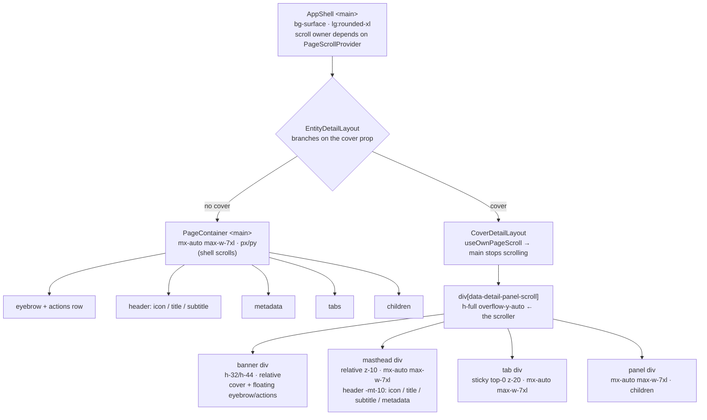

# Entity-detail layout: what actually renders today

> **Status**: describes the tree as built, including the parts that are wrong.
> **Read this before**: changing `EntityDetailLayout` or adding a banner to another detail page.

## The tree

## What is wrong with it

**The two branches share nothing.** `EntityDetailLayout` returns one of two unrelated trees. The
masthead markup — icon, title token, subtitle, metadata — is written twice, once in each. They have
already drifted: the plain branch puts `actions` in a row with `eyebrow`, the cover branch floats
them over the banner; the plain branch relies on `PageContainer`, the cover branch re-implements
`mx-auto max-w-7xl px-3 @2xl:px-6 @4xl:px-8` inline, three times.

**`max-w-7xl` and the page gutter are repeated four times** in the cover branch instead of being one
container. Any change to the measure has to be made in four places or the banner, masthead, tabs and
panel stop agreeing.

**The cover branch does not use `PageContainer`.** It cannot, because `PageContainer` applies padding
that a full-bleed banner has to escape. That is a real constraint, but the answer is a container that
knows about full-bleed children, not a second layout that opts out of the system.

**Nothing here is collapse.** The banner has one fixed height and scrolls away; the tab bar pins. The
identity — icon, title, subtitle — scrolls off and is gone. A collapsing header keeps identity
present and _shrinks_ it.

## What it should be

One layout, one container, one masthead, with the header height driven by scroll position rather
than by which branch was taken. The identity block collapses from the expressive size to a compact
row and stays pinned; the subtitle and metadata are what fall away.

Prefer CSS for the collapse. `animation-timeline: view()` / `scroll()` expresses "shrink the header
as the panel scrolls" without a scroll listener or React state, which is what makes it smooth and
what keeps the header out of the re-render path.
