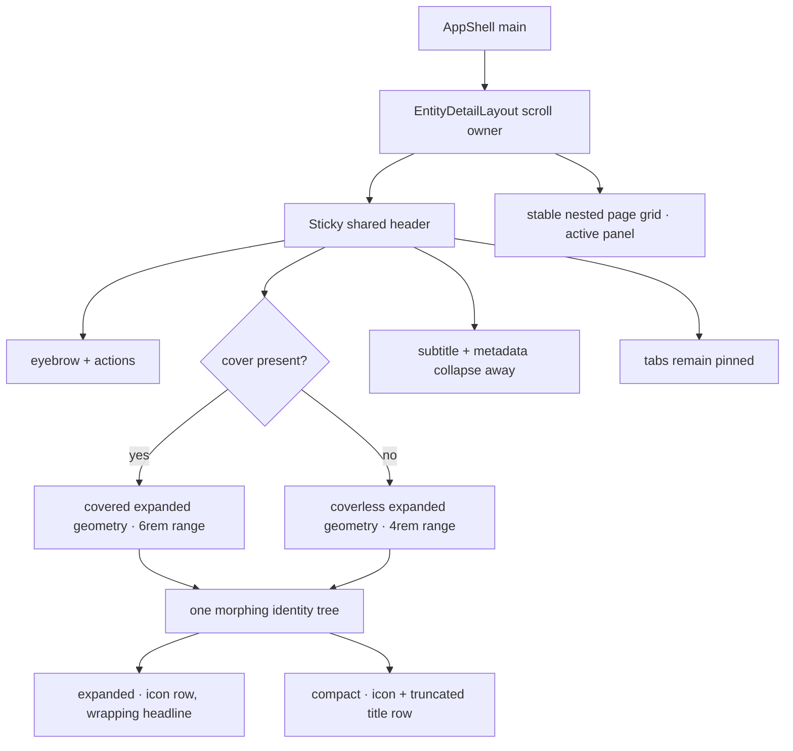

# Entity-detail layout hierarchy

> **Status**: describes the shared detail tree and its two expanded geometries.
> **Read this before**: changing `EntityDetailLayout`, its scroll collapse, or a detail cover.

## The tree

## One layout, two expanded geometries

Every core entity route supplies the same slots: optional cover and eyebrow, icon, title, subtitle,
metadata, actions, tabs, and active panel content. The route does not decide whether the header
collapses or tune its animation. `EntityDetailLayout` owns one scroll container and marks only
whether a cover is present.

The coverless state uses a four-rem collapse range. It begins with the icon on its own row above a
wrapping headline, followed by subtitle, metadata, and tabs. The covered state adds the backdrop
stage and uses a six-rem range. Both resolve to the same compact identity: scaled glyph beside a
single-line title, secondary context gone, and tabs pinned beneath it.

## Stable scroll geometry

One passive scroll listener converts absolute offset into a zero-to-one fraction, coalesces updates
through `requestAnimationFrame`, and writes a negative delay for paused CSS keyframes. It does not
set React state or rerender the tree. The title's font size and placement, glyph scale, secondary
grid row, and optional backdrop space all read the same progress.

A native CSS scroll timeline is intentionally not used. Its percentage derives from total scroll
range, and that range changes while these keyframes reduce the header's height. Runtime verification
showed the endpoint moving during sampling even after adding overflow; absolute pixel progress does
not have that circular dependency.

Those animated rows reduce the header's layout height. If nothing compensated for that loss, a
short page could reduce its own maximum scroll offset before reaching the animation endpoint and
become stranded half-collapsed. The nested `.detail-body` grid therefore has a minimum block size
derived from the pane height and the selected collapse range. It extends only the end of a short
panel; it adds no space between the header and the panel. The scroll owner also opts out of scroll
anchoring so the browser does not counteract this intentional height change. Both variants can
always reach their compact endpoint while visible content rises beneath the sticky header.

## Motion and fallback

Paused CSS keyframes interpolate the title continuously from the headline token to the compact title
token. The expanded title may wrap; the compact endpoint truncates to one line. For
`prefers-reduced-motion`, the sampler selects the expanded endpoint at zero and the compact endpoint
after the first scroll pixel instead of producing intermediate frames.

## Invariants

- Do not branch the component tree by entity type or duplicate identity content.
- Do not make page routes provide collapse ranges or compact styles.
- Keep the glyph above the title when expanded and inline with it when compact.
- Keep title-size interpolation on the same progress value as the rest of the header.
- Keep secondary context out of the compact header.
- Preserve the stable body minimum whenever a collapsing row changes header height.
