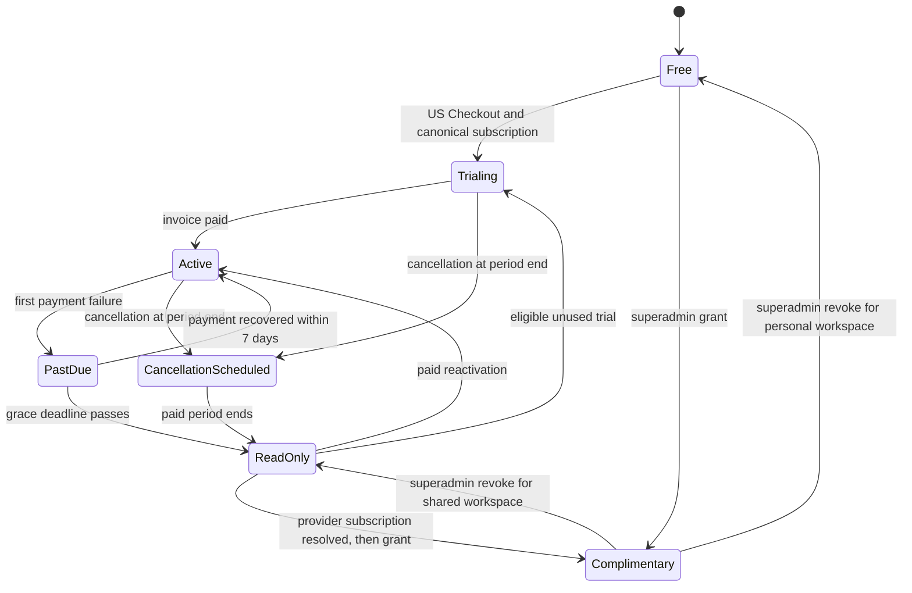
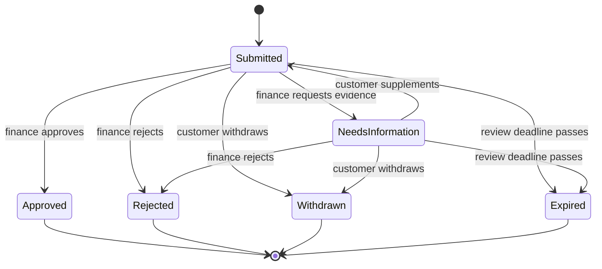
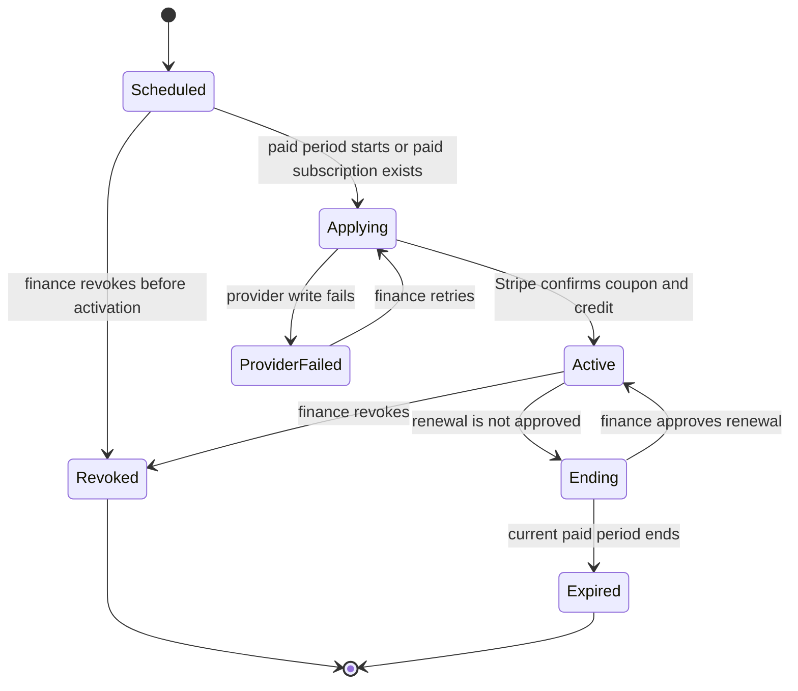

# Billing state machine

> **Reader:** Engineers who change subscription access or customer billing copy.
>
> **Action:** Preserve these transitions and keep account deletion outside this machine.

This state machine covers Docket Pro access. It does not cover account deletion. Billing events
never write organization retention fields.

The webhook retrieves the current Stripe subscription before it changes access. The scheduled
reconciler repairs the same mirror when Stripe has zero or one current subscription. It alerts and
does nothing when Stripe has duplicates.

This state machine covers a customer discount application. An approved application is final. A
renewal creates another application instead of reopening the old decision.

This state machine covers the provider-backed award created by an approved application or private
partner decision. Public awards stay scheduled during a free trial. The first paid period starts
their review clock.

