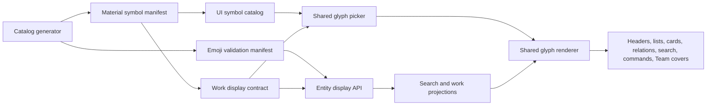

# Entity display glyph architecture

This document is for maintainers who change a customizable entity, a projection, or an identity
renderer. They must preserve one canonical `glyph` from persistence through every read surface.

## Decision

Docket stores one `EntityDisplayGlyph` for each customizable entity. A glyph is either a Material
Symbol name from the pinned manifest or an uppercase, hyphen-separated, fully qualified Unicode 17
emoji sequence. The API validates both catalogs. The web app renders the same value in headers,
lists, cards, relation pickers, search, command results, and Team covers.

The first release keeps `icon_key`. The migration backfills all 102 legacy keys through an explicit
visible-meaning map. The API reads `glyph_kind` and `glyph_value` first, accepts both request shapes,
and dual-writes a valid legacy fallback. The cleanup migration can remove `icon_key` and the legacy
parser only after the new API and web client have both been live for 30 days. The cleanup date is
open until this compatibility release reaches production.

We rejected storing raw Unicode strings because skin-tone and joined emoji sequences need one
canonical key across databases and runtimes. We rejected thousands of database enum values because
catalog upgrades would require schema migrations. We also rejected runtime Google Fonts requests
because they add an external availability and privacy dependency to every identity surface.

## Component diagram

This component diagram shows the modules that own the feature. Every node is a module or generated
artifact inside the Docket codebase.

## Data-flow diagram

This data-flow diagram shows one update and the compatibility read that follows it.

```mermaid
flowchart LR
  Person[Person] -->|Select glyph or committed color| Picker[Web picker]
  Picker -->|glyph, colorKey, customColor| Mutation[Optimistic mutation]
  Mutation -->|Validated update| API[Entity display API]
  API -->|glyph kind and value plus legacy fallback| Database[(entity_display)]
  Database -->|Compatibility row| Composer[Display output composer]
  Composer -->|Canonical glyph| Reads[Detail, list, search, work-view, and export reads]
  Reads -->|Same glyph| Renderer[Shared renderer]
```

## Catalog and bundle boundaries

`@material-symbols/font-400` and `@material-symbols/metadata` are pinned to `0.47.1`. The build
self-hosts only `material-symbols-rounded.woff2` at weight 400 and fill 0. `font-display: block`
prevents raw ligature names from appearing while the font loads. The generated manifest contains
3,905 symbols. `emojibase-data` is pinned to `17.0.0`. The generated API manifest contains 3,953
base and skin-tone sequences.

The browser does not import the generated emoji validation manifest. It dynamically loads only the
English compact catalog, group messages, and CLDR shortcodes when a person opens Emoji or starts a
combined search. `pnpm glyphs:verify-bundle` checks that emoji data stays outside initial route
chunks and that the emitted Rounded font remains below 750KB. The service worker keeps the existing
12MB precache limit. It treats the four generated picker datasets and the 555KB self-hosted font as
runtime-only assets because a person cannot save the associated mutation offline. The ordinary
cache-first static route stores those assets after their first request. The production build
currently precaches 294 assets at 11.6MB.

Unknown stored symbols fall back to the subject default at the API output boundary before any web
contract parser or renderer sees them. Invalid updates return the existing application-owned
validation response. Labels and Work Statuses keep their semantic colors even when a person selects
a decorative glyph.
