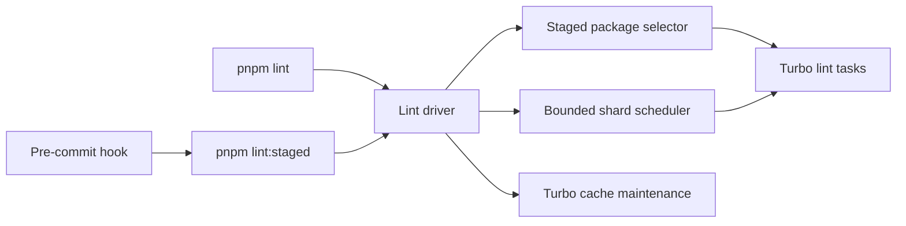

# Lint execution

This document is for maintainers who change ESLint rules, workspace packages, or Git hooks. Keep
local feedback within the limits below, and keep the complete clean-checkout gate in CI.

## Local commands

`pnpm lint:staged` reads the Git index. A documentation-only change returns without starting
ESLint. A workspace change lints the changed package and every dependent package through Turbo.
Changes to root lint configuration, root TypeScript configuration, the lockfile, the workspace
manifest, or repository scripts select the full lint path.

`pnpm lint` runs the complete workspace in two phases. The API and the small-package group run
together. Web and Admin run afterward so the three memory-heavy TypeScript programs never overlap.
Each Turbo shard runs packages serially. A shard fails after 180 seconds, and the complete command
fails after 300 seconds.

`pnpm lint:diagnose` runs the same schedule through `/usr/bin/time`. It prints Turbo cache hits,
elapsed time, CPU time, and peak memory for each shard.

The pre-commit hook runs `pnpm lint-staged` for formatting and then `pnpm lint:staged` for behavior.
CI still lints every package from a clean checkout. Do not move the complete gate out of CI.
The installer writes generated hooks below the current worktree's Git directory and stores
`core.hooksPath` in worktree config. Do not move them back to the shared common Git directory. An
older linked checkout can otherwise replace the staged hook with its own policy during install.

The component diagram shows how the local commands share one bounded execution path.

## Type-aware lint

The shared ESLint preset uses TypeScript project service. The API must pass `src` and `tests` to one
ESLint process so that process builds the TypeScript program once. Do not split the file set through
`xargs`, and do not add ESLint's file cache. An unchanged file can produce a different type-aware
result after one of its imports changes.

The API command alone receives a 4 GiB old-space limit. A cold 850-file run used 4.04 GB RSS and
finished in 55.6 seconds on the 8-core development machine. The former 3 GiB limit failed at 3.35 GB
RSS because the project service retained the complete typed program and both lint target trees.
Keep this limit on the API command. Do not raise `NODE_OPTIONS` for the workspace or shell.

## Turbo cache

Turbo owns package-level lint caching. `pnpm cache:status` reports the cache shared by all worktrees.
`pnpm cache:prune` removes artifacts older than 30 days first and then removes the oldest remaining
artifacts until the cache uses at most 20 GiB. The full lint command performs the same maintenance
with a 30-second budget before it starts linting. Cache deletion cannot remove source or generated
state that lacks another source of truth. Turbo recomputes every deleted artifact.
