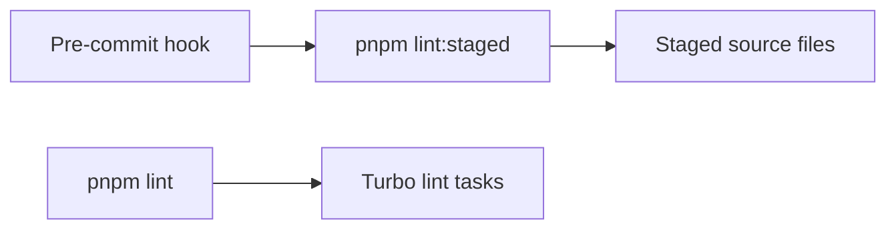

# Lint execution

This document is for maintainers who change ESLint rules, workspace packages, or Git hooks. Keep
local feedback within the limits below, and keep the complete clean-checkout gate in CI.

## Local commands

`pnpm lint` runs every package through Turbo serially. Turbo owns the task graph, caching, and
package scheduling. Do not add a second scheduler around it.

`pnpm lint:staged` runs Prettier and ESLint against staged source files. Turbo selects packages,
not files, so it cannot make a package-wide `eslint .` task fast enough for every commit. CI still
lints every package from a clean checkout. Do not move the complete gate out of CI.
The installer writes generated hooks below the current worktree's Git directory and stores
`core.hooksPath` in worktree config. Do not move them back to the shared common Git directory. An
older linked checkout can otherwise replace the staged hook with its own policy during install.

The component diagram shows the two distinct checks.

## Type-aware lint

The shared ESLint preset uses TypeScript project service. The API must pass `src` and `tests` to one
ESLint process so that process builds the TypeScript program once. Do not split the file set through
`xargs`, and do not add ESLint's file cache. An unchanged file can produce a different type-aware
result after one of its imports changes.

The API command alone receives a 4 GiB old-space limit. A cold 850-file run used 4.04 GB RSS and
finished in 55.6 seconds on the 8-core development machine. The former 3 GiB limit failed at 3.35 GB
RSS because the project service retained the complete typed program and both lint target trees.
Keep this limit on the API command. Do not raise `NODE_OPTIONS` for the workspace or shell.

The Web command receives a 3 GiB old-space limit. Its type-aware lint reaches Node's default 2 GiB
heap limit even when Turbo runs serially. Keep this limit in `apps/web/package.json`; it is a Web
resource requirement, not a root scheduler setting.
