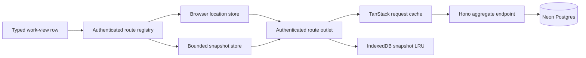
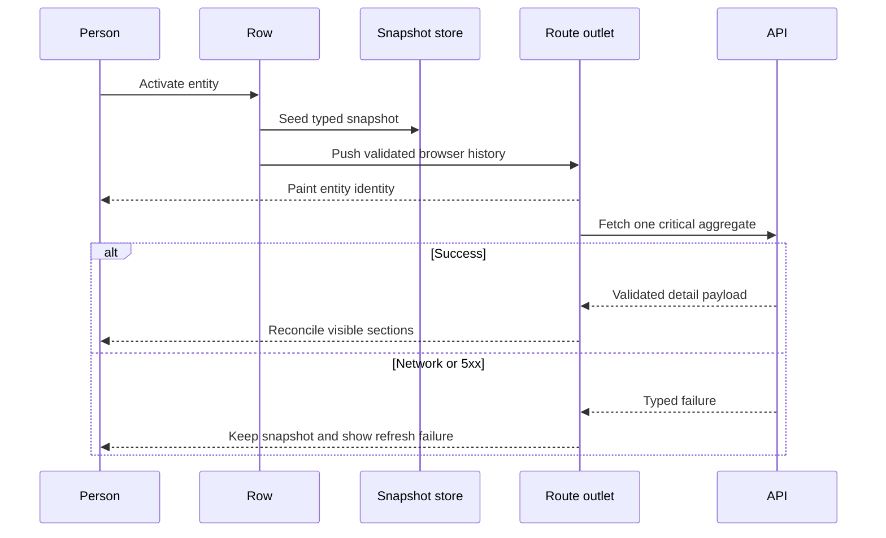

# Local-first detail navigation

This decision addresses authenticated navigation in Docket. Maintainers who change routes, entity
detail reads, or offline storage must preserve the contracts below.

## Decision

Docket will route authenticated same-tab navigation in the browser. Next will deliver the initial
document, public pages, authentication pages, and hard reloads. `AppLocationProvider` and the
generated authenticated route manifest will own subsequent route state online and offline.

A work-view row will carry a small typed entity snapshot. Activating the row will seed that snapshot,
commit browser history, and paint the destination identity before it starts the deferred detail
module. A hover or keyboard focus starts the module import only after 75ms of sustained intent, and
an immediate click cancels it. The detail route will then reconcile through one target-specific
aggregate read. Optional sections will load only when the user opens them.

TanStack Query will retain request state for minutes. It will no longer act as the offline database.
A three-entry memory store will hold navigation snapshots, while a per-user IndexedDB LRU will retain
validated snapshots for 24 hours up to 25 MB.

We rejected tuning Next prefetch because the RSC request would remain on the critical path. We also
rejected a second client router, retained hidden route trees, an edge read service, and a minimum
Cloud Run instance. Those choices add runtime, memory, or idle cost without improving the local
identity paint.

## Component diagram

## Navigation sequence

## Invariants

- A route parameter is branded and runtime-validated before any query can use it.
- A same-tab authenticated navigation does not request an RSC payload.
- A detail identity does not disappear because an optional section failed.
- One route leaf is mounted at a time. The current snapshot and two recent snapshots are the only
  entity navigation records retained in memory.
- Browser API calls remain same-origin because production session cookies are host-only. Server
  reads call the API origin directly.
- Sign-out, entity deletion, and access revocation remove the corresponding persisted snapshots.

## Performance and cost budgets

The authenticated shell must acknowledge row activation within 50 ms p95 and paint entity identity
within 200 ms p95. A warm aggregate refresh must settle within 500 ms p95. Scale-to-zero may delay
background reconciliation, but it cannot delay local navigation. The initial refresh uses one API
request and no more than four database round trips. Successful navigation telemetry is sampled at
five percent, while failures are recorded without raw paths, names, or user identifiers.

The team should change this decision only if measured production data shows that a bounded local
snapshot cannot paint within 200 ms or that one aggregate request costs more than the removed RSC
and fan-out path.
