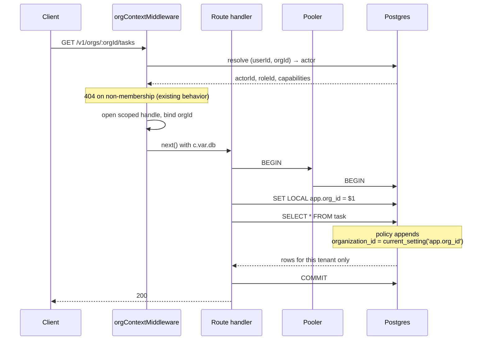

# Row-level security strategy

**Reader:** whoever implements phase 3 of the security remediation. When you finish this
you should know whether to start, what has to be true first, and which tables to do.

**Recommendation:** do not roll RLS out across all ~150 tables. Build the generated
cross-tenant probe matrix first — that is the control an auditor grades — then apply RLS
as a backstop to the dozen tables with the largest blast radius. A blanket rollout costs
a transaction per request and a rewrite of how every route obtains its database handle,
and it would be inert in CI as the test stack is configured today.

## Why the obvious version does not work

Four facts about this codebase decide the design, and three of them are blockers.

**The app almost certainly connects as the table owner.** `packages/db/src/migrate.ts`
does no role management and `DATABASE_URL` names one role for both migration and runtime.
Postgres does not apply RLS to a table's owner unless the table also declares `FORCE ROW
LEVEL SECURITY`, and never applies it to a superuser or a `BYPASSRLS` role. Written today,
every policy would be decorative.

**The connection is pooled in transaction mode.** `client.ts:106` sets `prepare: false`
with the comment that it "keeps the client compatible with Neon's pooled (pgbouncer)
endpoint." A transaction-mode pooler hands a different backend to each transaction, so
session-scoped `SET` is unusable — the next request inherits or loses it unpredictably.
Tenant context has to travel as `SET LOCAL` _inside a transaction_, which means every
RLS-protected read becomes a transaction. The API issues the overwhelming majority of its
reads as single statements today.

**PGlite runs as superuser.** Tests and local development use the embedded PGlite driver
(`client.ts:82-116`). Superusers bypass RLS unconditionally, so policies would be inert in
the entire existing suite. Shipping a control that no test can observe is the same defect
as `ok.ts` skipping validation in production, and it is worse here because the whole point
of RLS is to catch the bug the application-layer test missed.

**Roughly 150 tables, 157 `organizationId` columns, and ten tables keyed only by
`user_id` with no foreign key at all** — `contact_point`, `notification`,
`notification_preference`, `notification_recipient`, `event`, `event_recipient`,
`stream_subscription`, `daily_digest`, `activity_day`, `idempotency_key`, enumerated at
`apps/api/src/account/lifecycle.ts:41-54`. Two tenancy shapes means two policy families,
not one.

## The sequence, once the prerequisites hold

The point of the diagram is where the binding happens. `orgContextMiddleware` already
resolves and validates the tenant; it becomes the only place that binds it to a database
handle, so a handler cannot issue a query that skipped the binding.

## Prerequisites, in order

**A dedicated application role.** Migrations keep running as owner; the API connects as a
non-owner `docket_app` with `GRANT SELECT, INSERT, UPDATE, DELETE` and no `BYPASSRLS`.
Add `FORCE ROW LEVEL SECURITY` alongside every `ENABLE` so an accidental owner connection
is still constrained. Until this lands, nothing else in this document has any effect.

**A Postgres-backed conformance suite.** `docker-compose.yml` already runs Postgres 17 on
port 5433 for local development. The RLS suite runs there, not against PGlite, and
connects as `docket_app` so policies actually apply. It is a separate CI job from the main
suite, added to `deploy-production.needs` so `scripts/ci-gate-policy.ts` enrolls it
structurally.

**A scoped database handle, and one test that forbids the unscoped one.**
`orgContextMiddleware` puts `c.var.db` on the context; routes stop importing the `db`
singleton. A source-policy test in the
`packages/test-utils/tests/workspace-policies/` style walks the AST of
`apps/api/src/routes/**` and fails on a raw `db` import, with a named and justified
exemption set for the paths that are legitimately cross-org — cron sweeps, admin, account
lifecycle, and cross-org search. That test is what makes the boundary real; the policies
alone only make it enforceable.

## Policies, in three tiers

**Org-keyed tables** get one uniform policy, `USING (organization_id =
current_setting('app.org_id', true))`. Generate these from the Drizzle schema rather than
hand-writing 120 migrations: a script finds every table carrying an `organizationId`
column and emits the policy, and a test asserts every such table has one so a table added
next year cannot arrive uncovered.

**User-keyed tables** — the ten no-FK tables above plus the Better Auth tables — get
`USING (user_id = current_setting('app.user_id', true))`, which requires the session
middleware to bind `app.user_id` the same way.

**Global tables** get no RLS and an explicit list: `oauth_client`, `jwks`, the migration
journal, and the reference tables. Silence here reads as an oversight, so the list is
written down and tested against.

## Rollout order

Read policies (`USING`) before write policies (`WITH CHECK`). A wrong read policy returns
too few rows and a test sees it; a wrong write policy silently rejects writes in
production.

Start with `search_document`. It is one table and the single highest-value target in the
schema — a denormalized plaintext copy of task, comment, update, and project text with a
GIN index over it, carrying its own `organization_id`. Then `task`, `comment`,
`attachment`, `calendar_item`, and `athena_inbound_message`. The long tail after that is
mechanical and can be generated in one pass.

## What this does not buy

RLS does not help against a compromised application: the API binds the tenant, so anything
that can choose `app.org_id` can choose any tenant. It defends against the specific failure
this codebase is exposed to — a handler that forgets its `where` clause — and nothing else.
That is a real and likely failure mode across 99 routers, which is why it is worth doing on
the high-value tables. It is not worth doing on all 150.

SOC 2 CC6.1 asks for logical access controls and does not name RLS. Per-handler scoping
enforced at `orgContextMiddleware` and continuously verified by a generated probe matrix
satisfies the criterion on its own. RLS is defense in depth, and the control narrative
should describe it that way rather than claiming the database is the boundary.
