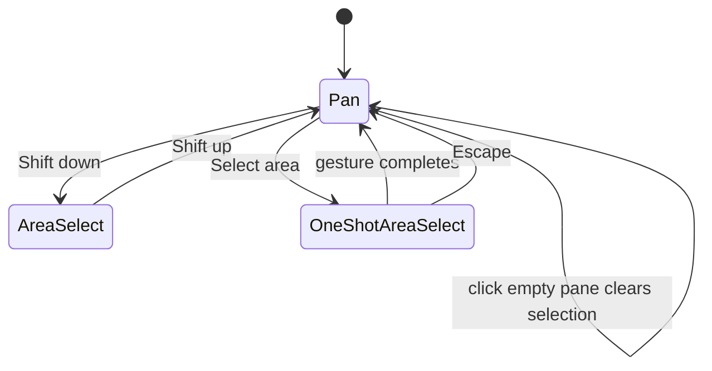

# Canvas interaction and command history

This specification is for maintainers who implement or review the Project Dependencies and Task
graph canvases. A reviewer should use it to reject any canvas change that makes right-click the
only path to an action, replaces the current page during creation, bypasses the shared object
command endpoint, or treats deletion as permanent.

## Decision

Project and Task graphs are editing surfaces. Both use the shared object-selection registry, the
same command receipt history, and the same pane, node, keyboard, and floating-bar actions. Each
canvas keeps domain-specific node rendering and layout measurement.

The interaction has three modes. Pan is the default. Holding Shift enables persistent area
selection. The pane command **Select area** enables one area gesture and then returns to pan.

## Selection invariants

`CanvasSelectionBridge` maps xyflow node types to one declared object kind. Task nodes publish Task
references. Project nodes publish Project references. Each node also carries `objectTargetProps`,
so the global object action system and the canvas selection system resolve the same identity.
`CanvasSelectionFrame` owns the shared selection container ref. Project and Task card roots register
as selectable rows with `treeitem`, `aria-selected`, and a roving `tabIndex`. Xyflow remains the
click owner, so row registration does not add a second click-selection path.

A right-click on a selected node preserves the complete selection. A right-click on an unselected
node selects only that node before it opens the node menu. An empty-pane click clears selection.
Escape clears selection when focus belongs to the canvas. A dialog, composer, picker, text field,
or content editor owns its own Escape and keyboard commands.

Node commands keep the right-click target separate from the retained selection. Open or peek acts
on the node whose menu is open. Selection commands such as Properties and Move to trash continue
to act on the full selection.

Right-click is optional. The floating selection bar exposes the selection count, Open or peek,
Properties, type-specific primary actions, Move to trash, and a canvas-owned history overflow.
That overflow exposes Undo and Redo without resolving the global object-action registry, because
legacy Task mutations do not produce replay receipts. Keyboard commands and the pane menu expose
the remaining actions. A visible viewport toolbar exposes Fit selection and Re-layout without a
context-menu gesture.

## Pane and viewport commands

The Project pane offers New Project. The Task pane offers New Task and preserves an active Project
scope. Both panes offer Select area, Undo, Redo, Fit selection, Fit all, and Re-layout.

Fit selection operates on selected node bounds and does not enlarge past `1.0`. Fit all may reach
the canvas minimum zoom of `0.1`. Re-layout increments an explicit layout epoch, which reruns the
deterministic component-aware engine without changing graph structure. The minimap stays visible
on focused Project and Task canvases. Fit selection and Re-layout also remain visible in a compact
canvas toolbar, so viewport actions do not require right-click.

Read-only viewers retain selection, Open or peek, Select area, Fit selection, Fit all, and
Re-layout. Mutation commands render disabled or remain absent. Menus use menu roles and disabled
states from the shared primitives. Permission loss also disables existing Undo and Redo history.

## Commands and history

All structured canvas writes call `POST /v1/orgs/:orgId/object-commands` through the typed TanStack
Query mutation layer. The client sends the request `commandId` as the `Idempotency-Key`. The client
never renders exception or Problem text. It shows application-owned result and failure copy.
Project and Task dependency changes, Task status actions, and Task hierarchy moves use the same
history instance as trash. Project dependency editing requires `contribute`. Project trash and
restore require `manage`, so a contributor never reaches the confirmation step for that action.

The command transaction owns the domain write, durable change-set receipt, completed idempotency
response, and versioned consequence job. A committed command therefore cannot remain permanently
`in_progress`, and a process exit cannot lose its activity or search consequences. The
after-response drain and the five-minute search-index cron both lease consequence jobs. Each job
checkpoints its next effect, uses the command id and occurrence time as stable dedupe input, retries
strict event failures with bounded backoff, and reclaims an abandoned lease after five minutes.
The worker removes at most 100 successful jobs per sweep after seven days. Failed jobs remain
retryable. The [object-command delivery component diagram](diagrams/object-command-delivery.md)
shows the module boundary.

Forward property writes batch the selected rows instead of issuing one update per object. Replay
loads and authorizes targets in batches, validates every object before writing it, and applies each
compatible property tuple in one update. A 500-object scalar write and replay must stay within the
query ceilings asserted by the scale suite. The server still treats a forward command as atomic.
Replay remains object-granular, so an inaccessible or collaborator-changed object appears in
`deniedIds` or `conflictingIds` while independent objects continue.

Reverse dependency is unavailable. The current server contract expresses dependency removal and
creation as separate commands, which leaves the graph half-reversed when the second write fails.
The canvas must not restore this action until one atomic composite command validates and commits
both changes in one transaction and returns one replay receipt.

The browser keeps at most 50 receipts for each route and graph scope. A successful forward command
pushes one normalized receipt and clears that scope's redo branch. Creation is not a command and
does not enter history. Reloading clears history.

Undo uses Command-Z on macOS and Control-Z elsewhere. Redo uses Command-Shift-Z,
Control-Shift-Z, or Control-Y. A canvas only handles those chords while its focus boundary owns the
event. Inputs, content editors, pickers, composers, and dialogs retain native undo and redo.

Replay trusts the server's returned receipt subset. If a collaborator changed an object or the
actor lost permission, the opposite history stack contains only entries the replay changed. The
canvas keeps the current selection and reports skipped items. A network failure restores the
untouched history entry to its original stack.

Command result notices mount independently of the selection bar. A trash refresh can remove every
selected object from the active graph without removing the notice or its Undo action.

Read-only canvases suppress undo and redo even when the current browser session already holds
receipts for the same route and scope. Command notices mount independently from the selection bar,
so trash feedback and its Undo action survive the archived objects leaving the active projection.

## Recoverable deletion

Delete and Backspace remove selected dependency edges through object-command history. When a
Project or Task node is selected, the same keys continue through `CanvasSelectionFrame` and mean
Move to trash. React Flow never receives a delete key binding, so it cannot remove nodes from local
render state. Normal canvas UI never calls permanent deletion.

A single Task moves immediately and shows Undo. A single Project with zero Tasks does the same. A
Project with Tasks requires confirmation that states the Task count and says that Tasks and graph
relationships remain linked for restoration. Every multi-object request requires confirmation and
states counts by object kind. The count model supports a future mixed-kind canvas even though the
current Project and Task canvases each hold one kind.

A failed confirmed trash command keeps its dialog open. The dialog shows application-owned error
copy and leaves the same selection ready for another attempt. It closes only after the server
returns a successful command result.

Undo replays the trash receipt. The server restore operation retains Task hierarchy, Project Task
membership, Labels, Initiatives, milestones, and dependency identities.

## Creation continuity

Canvas creation always requests `sameWorkspaceCompletion: 'stay'`. A Project-scoped Task graph
passes its Project as the Task draft default. Successful creation invalidates the current graph,
keeps the route and canvas instance mounted, selects the returned object when its refreshed node
arrives, focuses that node, and opens the existing peek surface. Cross-workspace creation may still
navigate because the invoking graph cannot represent the new object.

The selection bridge retries an unchanged requested id when both the host's structural node set and
xyflow's controlled node store contain it. Its store selector reads only the requested id's
membership boolean, so position-only node updates do not retrigger that work. DOM focus is scoped
to the invoking selection surface, because embedded canvases can render the same object id at once.

After the refreshed node appears, the canvas updates shared and xyflow selection, frames the node,
focuses its DOM card, and opens its peek. If the refresh settles while active filters still exclude
the node, the canvas shows **Created, but hidden by current filters** and a Clear filters action.

The host reports `Created, but hidden by current filters` after a settled refresh excludes the new
object. Clear filters resets the active predicates and search before retrying the same object id.
The Project Dependencies pane delegates creation to its work-view host, so one state machine owns
the composer request, settled refresh, selection, and hidden-object notice.

The stable creation provider stays above the application page. Destination resolution stays in the
composer subtree. Canceling a composer therefore leaves viewport, filters, tab state, and canvas
history in memory. Focus returns to the canvas through the composer's normal return-focus behavior.

## Alternatives rejected

Ordinary drag does not select because it would remove the expected infinite-canvas pan gesture.
Custom rectangle hit testing was rejected because xyflow already provides measured-node selection
and keyboard modifiers. A global undo stack was rejected because two graph embeds can coexist and
must not consume each other's receipts. Permanent delete was rejected because a missed Delete key
must not destroy Project or Task relationships. Client-side inverse patches were rejected because
they cannot detect collaborator changes; server-normalized receipts can.

## Bulk Properties contract

The floating selection bar opens one shared Properties editor for 1–500 homogeneous Tasks or
Projects. `ObjectRef` remains the scalar-only interaction identity. Each canvas also projects a
discriminated `CanvasPropertySnapshot` from the records it already renders, and the bar derives the
active snapshots from the selected ids. Project Dependencies projects from `ProjectOverviewItem`.
Task graph retains the approved Task values on `TaskNodeData` and projects from the filtered nodes.
A canvas-only retention provider keeps selected `ObjectRef` and snapshot pairs when a successful
command or active filter removes their nodes from the refreshed graph. Ordinary list selection
still prunes hidden rows. Canvas retention ends when selection clears or the route-and-graph scope
identity changes. The provider applies the server's successful receipt subset before the graph
query reconciles. A selected Task moved outside the current Project filter therefore exposes its
new Project to the next Properties command instead of reusing the stale visible projection. Undo
and redo project the narrowed replay receipt in their respective directions.

The Task editor includes status, priority, assignee, Project, Program, milestone, cycle, Labels,
anticipated start date, due date, and estimate. The Project editor includes status, health,
priority, lead, Team, Program, Initiatives, Labels, start timeframe, and target timeframe. It does
not offer bulk title, name, summary, or description replacement.

Every scalar shows **Mixed** when the selected values differ. Choosing a value replaces that
property on every selected object. Nullable properties keep their clear choice. Mixed Task dates
and Project timeframes add an explicit clear action because a picker cannot use `null` for both
Mixed and uniformly unset. Task status choices are the intersection of the selected Teams' status
keys, and status writes wait for the workspace registry to load. Milestone choices require one
shared non-null Project and are limited to that Project. Cycle choices require one shared Team and
are limited to that Team. Those two fields keep their clear choice when no shared reference exists.
Task assignees may include members and agents. Project lead options include active human members
only. The server repeats that semantic check inside the atomic command transaction. `ActorId`
remains the transport type because a ULID cannot encode Actor kind, status, or organization.
Estimate remains visible with explanatory copy when estimation is disabled.

Labels and Project Initiatives render one native mixed-state checkbox per association. **All**
means every selected object has the association, **Some** means only part of the selection has it,
and **None** means no selected object has it. Activating Some or None adds the association to every
selected object. Activating All removes it from every selected object. Workspace Labels are always
available. A Team Label is available for addition only when it is valid for every selected object's
Team. An incompatible Team Label already attached to some selected objects remains visible with a
**Remove from selected** action. An incompatible Label attached to all selected objects keeps the
ordinary all-to-none removal action.

Each choice constructs exactly one `ObjectCommandIn` and calls the owning
`CanvasCommandHistoryControls.execute`. The server validates and commits the whole selection in one
transaction. A permission, reference, Label-scope, or date failure therefore changes no object.
Success and failure both leave the editor open and preserve the selection. `CanvasCommandNotice`
owns result and application error copy. A selection above 500 remains inspectable, but the editor
states **Properties supports at most 500 selected objects.** and disables every write.

One controller in the canvas command context owns Properties visibility and focus return. The
floating button and the node context-menu command call that controller, so both open the same
editor. The shared Radix dialog traps focus, assigns the heading and description, closes on Escape,
and focuses its heading on open. The canvas controller restores focus to the connected invoking
control when one still exists.

Roster-backed controls never interpret a failed query as an empty roster. The editor shows
application-owned error copy with a retry action and disables only controls whose source failed.
Status, estimation, and fiscal-calendar settings expose their own retry states. Other loaded
properties remain editable while one source is unavailable.

The selection bar does not wrap its actions. The editor stays within the viewport, bounds its
height, and scrolls only its property body. The heading labels the editor dialog, every property has
an accessible group name, and every picker keeps its keyboard and focus behavior from `@docket/ui`.
