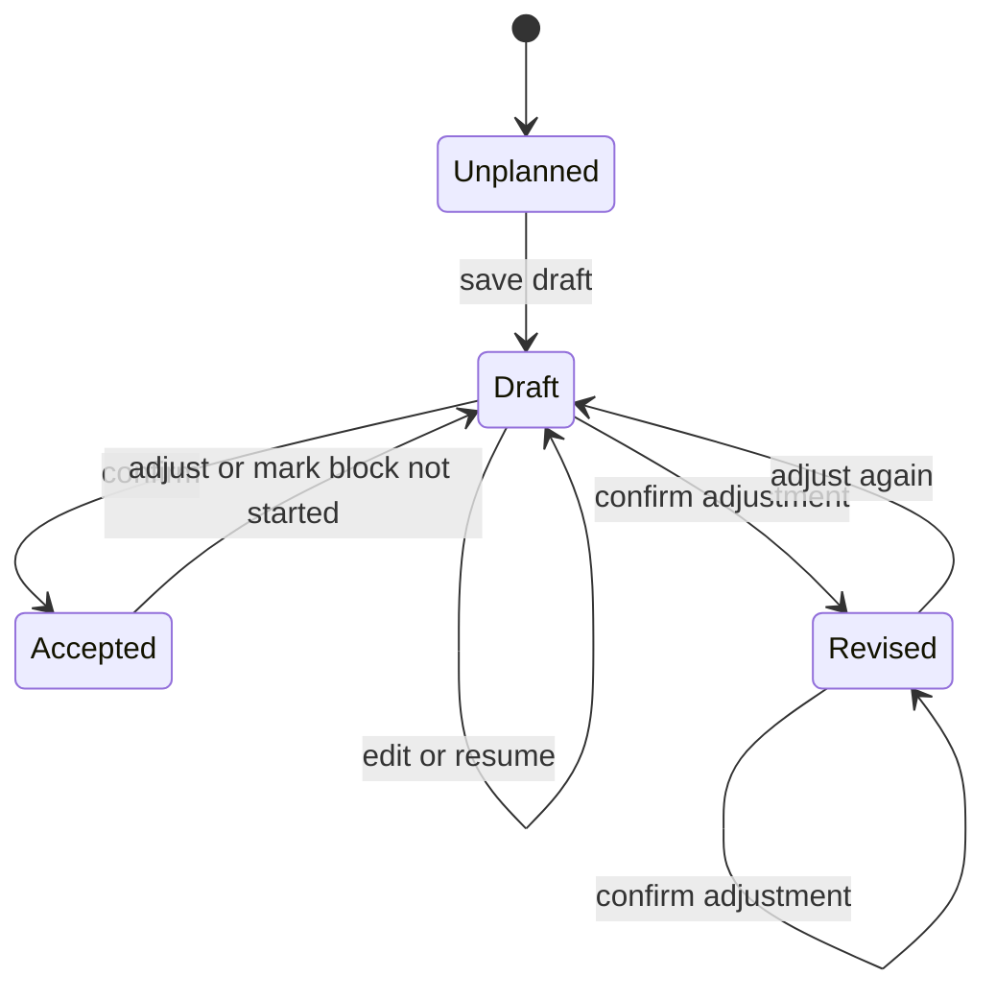

# Daily planning

This document is for engineers changing the morning planning flow. They should preserve the distinction between intended work, accepted revisions, and the time ledger when they edit Today, planning, or recovery.

Today is the default home. Its daily-plan card links to `/plan?view=day&date=YYYY-MM-DD` and names the saved state: Plan day, Resume planning, or Adjust today. After 3 p.m. in the Hub timezone, Today also offers Plan tomorrow. The `/plan` route without `view=day` keeps weekly planning. The daily route owns the full content width because it renders its own agenda.

The daily flow has four screens: Review yesterday, Plan today, Review plan, and Confirmation. Review yesterday also collects unresolved commitments from earlier days in one list. Plan today combines editable selected work with a timed agenda. Add work opens a separate search view and the existing task composer. Review plan starts with a short qualitative summary, then shows work and the agenda. Confirmation does not start a timer. Its Start action does.

The state machine is:

`GET /v1/daily-plan/day/:date` reads the draft, accepted history, current visible task state, prior unfinished work, agenda, and recorded human intervals in the Hub timezone. `PUT /day/:date/draft` saves selected tasks and timed sessions without changing the accepted plan. It rechecks current task visibility on every save. `POST /day/:date/confirm` takes the saved draft as the original commitment or appends an accepted revision. The selected-task projection also updates legacy `daily_plan_item` rows so Today and older clients read the accepted work. Each accepted session enters the shared agenda with a session id. A task may appear in two sessions without becoming two selected tasks.

Planned time is minutes of daily work. It is separate from a workspace task estimate, which can be points. A block can allocate time to several tasks. The time ledger remains the only source of recorded time. Completing a time interval does not complete its task. The Done action for a missed block opens exact-time entry with the planned bounds and task prefilled; the person can correct those bounds before saving. Not started removes the missed unpinned block in a visible draft preview. It leaves the task under Unscheduled and preserves fixed events and pinned blocks. Confirming that revision offers Undo, which appends a restoring version rather than rewriting history. The older cadence sweep does not auto-reorganize a day with an accepted daily plan.

The planner autosaves drafts after edits and saves on stage transitions. A failed save leaves the edit visible and exposes Retry. Task titles use the in-place editor in both planning and Today; task details have a separate action. Calendar placement has drag and explicit Schedule, Move, Duration, and Unschedule controls. The timed rectangles scale with duration. Short-block details appear outside the rectangle.

The unresolved-work read is limited to the most recent 100 older plan items. Review decisions are stored per older plan item. Backlog keeps the task out of future carryover prompts, Today adds it to the draft, and Another date creates a future daily item without changing the older accepted version. Athena does not generate task proposals in this flow. Work creation uses the existing task composer, and manual planning remains complete without Athena.
