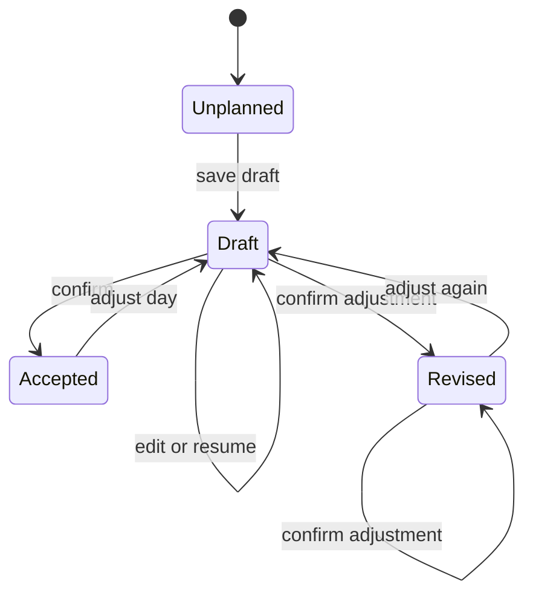

# Daily planning state

This document is for engineers implementing the daily planning screens and recovery loop. They should keep a person's intended work separate from recorded work while they connect Today, the planning flow, the agenda, and day review.

The planning flow has its own state under `/v1/daily-plan/day/:date`. A saved draft records the selected tasks, planned minutes, main task, and timed sessions. A session has task allocations, so one block can contain several tasks and one task can span several blocks. The first confirmation becomes `accepted.original`. Each later confirmation appends a version to `accepted.history` and advances `accepted.current`. The time ledger remains the source of recorded work.

The state machine is:

`GET /v1/daily-plan/day/:date` returns the draft, accepted versions, currently visible task details, agenda entries, and recorded intervals for that date. `PUT /day/:date/draft` validates every task against the caller's current organization membership and task visibility. `POST /day/:date/confirm` accepts the current draft without starting a timer. It uses a compare against the saved draft so a concurrent edit cannot be cleared by an older confirmation. The older `/v1/daily-plan` item routes and Today aggregation remain in place while the new flow is connected.

The pending UI work must keep Today as the home surface. Today should link to Review yesterday, Plan today, Review plan, and Confirmation according to the saved state. Planning must use the shared agenda geometry and edit the same task properties that Today displays. The API still needs review decisions, schedule preview and apply, and a migration from existing `daily_plan_item` rows before the new confirmation can replace the old morning gate. The current read includes legacy items as visible task candidates, but it does not treat them as an accepted version.
