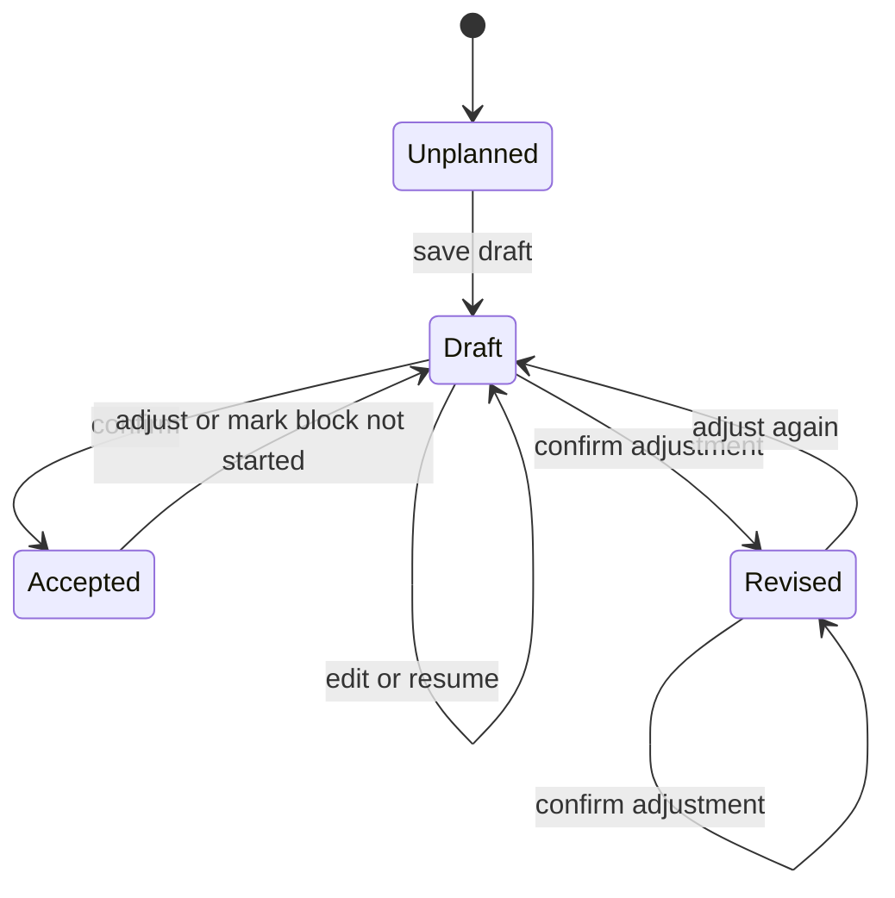

# Daily planning

This document is for engineers changing the morning planning flow. They should preserve the distinction between intended work, accepted revisions, and the time ledger when they edit Today, planning, or recovery.

Today is the default home. Its daily-plan card links to `/plan?view=day&date=YYYY-MM-DD` and names the saved state: Plan day, Resume planning, or Adjust today. After 3 p.m. in the Hub timezone, Today also offers Plan tomorrow. The `/plan` route without `view=day` keeps weekly planning. The daily route owns the full content width because it renders its own agenda.

The daily flow has four screens: Review yesterday, Plan today, Review plan, and Confirmation. Review yesterday also collects unresolved commitments from earlier days in one list. Plan today combines editable selected work with a timed agenda. Add work opens a separate search view and the existing task composer. Review plan keeps the agenda and editable work together. Athena can supply a short qualitative assessment asynchronously; confirmation does not wait for it. Confirmation does not start a timer. Its Start action does.

The state machine is:

```mermaid
stateDiagram-v2
    [*] --> Unplanned
    Unplanned --> Draft: save draft
    Draft --> Draft: edit or resume
    Draft --> Accepted: confirm
    Accepted --> Draft: adjust or mark block not started
    Draft --> Revised: confirm adjustment
    Revised --> Draft: adjust again
    Revised --> Revised: confirm adjustment
```

`GET /v1/daily-plan/day/:date` reads the draft, accepted history, current visible task state, prior unfinished work, agenda, and recorded human intervals in the Hub timezone. `PUT /day/:date/draft` saves selected tasks and timed sessions without changing the accepted plan. It rechecks current task visibility on every save. `POST /day/:date/confirm` takes the saved draft as the original commitment or appends an accepted revision. The selected-task projection also updates legacy `daily_plan_item` rows so Today and older clients read the accepted work. Each accepted session enters the shared agenda with a session id. A task may appear in two sessions without becoming two selected tasks.

Planned time is minutes of daily work. It is separate from a workspace task estimate, which can be points. A block can allocate time to several tasks. The time ledger remains the only source of recorded time. Completing a time interval does not complete its task. The Done action for a missed block opens exact-time entry with the planned bounds and task prefilled; the person can correct those bounds before saving. Not started removes the missed flexible block and proposes future placement. Still working preserves a manual continuation from the current time. Work that cannot fit remains under Unscheduled and preserves fixed events and pinned blocks. Confirming that revision offers Undo, which appends a restoring version rather than rewriting history. The older cadence sweep does not auto-reorganize a day with an accepted daily plan.

The planner autosaves drafts after edits and saves on stage transitions. A failed save leaves the edit visible and exposes Retry. Task titles use the in-place editor in both planning and Today; task details have a separate action. Calendar placement has drag and explicit Schedule, Move, Duration, and Unschedule controls. The timed rectangles scale with duration. Short-block details appear outside the rectangle.

The work list has its own order. Dragging a task onto another row, or choosing Move earlier or Move later, changes the intended sequence and the stored `sort` values. It does not change the task's priority, planned duration, or timed sessions. A separate drag onto the agenda places time. Confirmation projects the selected order into Today's existing daily-plan items. The day read includes project names only when the caller can view the project, and the row leaves that label out when no visible project exists. On a phone, Review plan places the agenda before the editable work list so the proposed day is visible directly beneath its summary.

The unresolved-work read is limited to the most recent 100 older plan items. Review decisions are stored per older plan item. Backlog keeps the task out of future carryover prompts, Today adds it to the draft, and Another date creates a future daily item without changing the older accepted version. Athena uses the selected owner runtime to assess the visible plan and propose up to three missing project tasks. A person must open the task composer and add a proposal; Docket never creates it silently. Stale assessment responses are discarded after draft edits. Work creation uses the existing task composer, and manual planning remains complete without Athena.

`POST /v1/daily-plan/day/:date/proposal` is read-only. It returns the proposed snapshot, task reasons and duration sources, fixed intervals, buffer minutes, unplaced reasons, and calendar differences. Explicit daily commitments precede eligible assigned due work and project/backlog suggestions. Dependency checks include unfinished blockers outside the chosen day. Edited Planned time precedes a minute estimate, recorded history, and an editable 45-minute default. A point estimate never supplies minutes.

The pure proposal service groups short related tasks and splits long work across free segments. It preserves fixed events, protected time, manual placements, pinned blocks, elapsed sessions, and actual work. It uses the remaining day and chosen finish time. A saved work schedule supplies availability; absent schedules produce visible editable start/finish bounds. The default buffer reserves 15% of free work time. Start, finish, buffer, sequence, and duration edits produce an agenda preview rather than changing the accepted plan.

Draft writes carry `expectedRevision`. The database compares that value atomically and rejects stale writes with HTTP 409. Confirmation carries the revision returned by the completed draft save and checks it before accepting the snapshot. Legacy bodyless confirmation remains compatible. The planner queues its saves, flushes them before proposing, retains failed edits, and lets a person inspect and explicitly choose the saved version after a conflict. Accepting a plan creates immutable history; undoing an accepted adjustment appends a restoring version.

Confirmation stamps `day_directive.agenda_acknowledged_at` in the same transaction as the accepted version. The first release timestamp survives later revisions. Directive and day-start reads also recognize the original acceptance timestamp of older daily plans that lack that stamp. A confirmed empty day releases the gate without requiring a weekly planning run. Legacy bodyless confirmation and draft writes without `expectedRevision` remain compatible; current clients send the revision for both writes.

The legacy directive agenda still reports native calendar blocks. Today and the shared daily agenda read accepted daily sessions. `POST /v1/directive/reorganize` rejects an accepted daily plan with HTTP 409 (`accepted_plan_requires_revision`) and directs the caller to preview a daily proposal. Legacy item timebox PATCH and DELETE requests return the same problem code to preserve the accepted sessions. Status and sort updates remain compatible. The morning decision endpoint also rejects legacy edits after daily acceptance. The cadence sweep excludes accepted days from automatic reorganization. Weekly days without an accepted daily snapshot keep their existing behavior.

Task placement and duration provenance distinguish human choices from generated values. `durationResolved` marks the budget from a generated proposal so later recorded work does not replace that commitment with a fresh estimate. A new task's unresolved 45-minute value gives way to its explicit minute estimate or recorded history. Current and future allocations reserve their own intervals within a grouped block. Actual ledger overlap subtracts time already recorded within those intervals so recorded work neither creates a duplicate block nor consumes the same budget twice.

Today derives Now and following work from individual accepted allocations. Recorded intervals and completed tasks remove work from execution without rewriting commitments. Fixed events take precedence over the next task unless work is already active. An accepted-plan edit enters the planner rather than invoking legacy inline timebox writes.

Accepted shared-agenda entries retain their session identity. Legacy inline bounds controls and item removal cannot mutate them; Adjust plan opens the revision flow. The API rejects legacy timebox edits and removal on accepted days. A pending move to tomorrow guards confirmation and navigation, applies removal against the latest draft only after success, and retains the edited task on failure.

## Release acceptance

The existing core-screen acceptance job runs the daily-planning browser journeys through `test:e2e:release`. This adds fourteen cases to the existing single browser worker and adds no workflow trigger or runner. The October 6 local artifact run took about five minutes for these cases, including signup rate-limit waits and visual evidence. The signal belongs on each delivery because the planner spans confirmation, recorded work, and accepted-history mutations.
