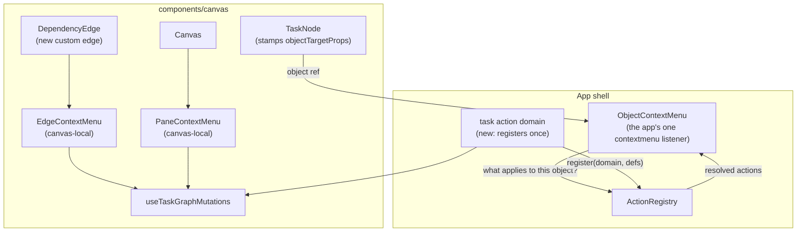

# Graph right-click routing

A component diagram of which module answers a `contextmenu` event on the dependency canvas.
One global listener already exists; the canvas contributes objects and two local menus.

