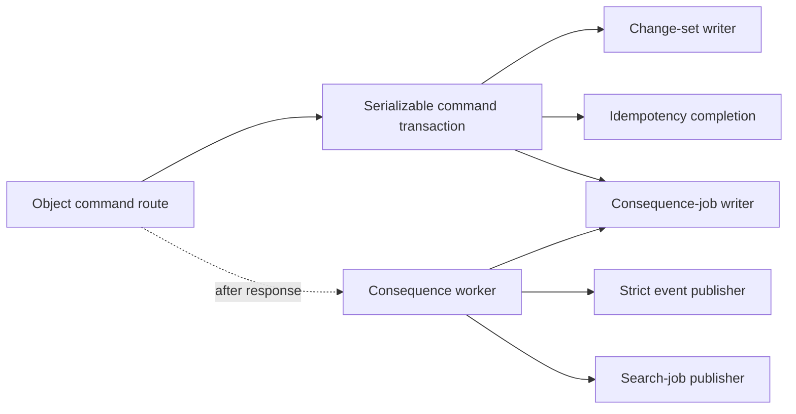

# Object-command delivery

This component diagram is for maintainers who change canvas command persistence or post-commit
effects. They should preserve the transaction boundary and keep every consequence retryable after
the response process exits.

The transaction commits the receipt, replay response, and consequence job beside the object
mutation. The route may then return without waiting for event or search delivery. The worker leases
the persisted job, checkpoints after each effect, and retries strict failures with stable dedupe
input. The regular search-index cron invokes the same worker, so process loss after commit delays
delivery instead of dropping it.
