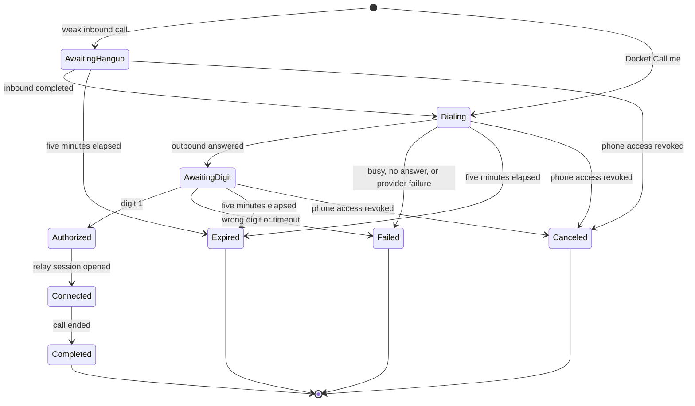

# Phone call authorization state machine

This state machine defines the durable authorization record for a weakly attested inbound call or
an authenticated Docket `Call me` request. A callback may dial only the E.164 value already stored
on the linked `phone_number` row.

All webhook transitions compare the expected call SID and current state. Repeated provider
webhooks return the current state and cannot create a second outbound call or voice session.
