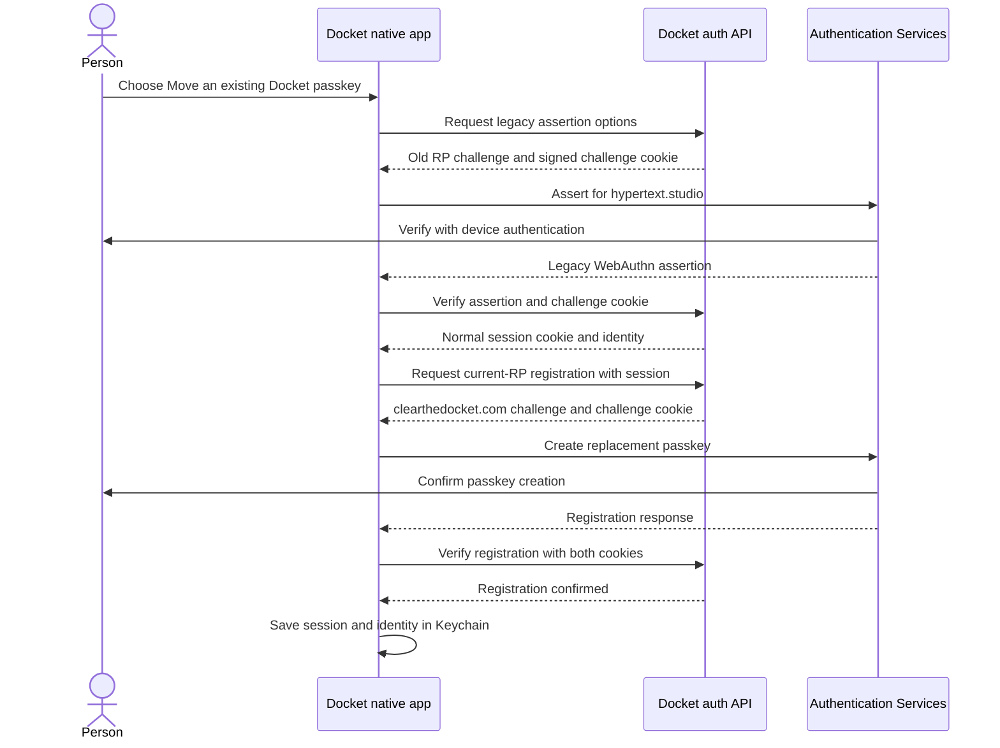

# Native credentials: what native clients need from Docket's auth server

> **Status**: Current as of 2026-09-09
> **Owner**: auth
> **Decision record**: `docs/engineering/DECISIONS.md` — "Android restore credentials are
> system-managed records, never ordinary passkeys"

Docket stays passwordless on every client. A phone signs in with a passkey or a social provider, and
it keeps the person signed in across reinstalls and device migrations without asking again. This
document tells native-client and auth maintainers which server contracts they must preserve. It
describes the three contracts that support Docket Android and the temporary Apple-platform bridge
that moves passkeys from `docket.hypertext.studio` to `clearthedocket.com`.

## 1. The three contracts

| Contract                    | Surface                                     | Who calls it                                |
| --------------------------- | ------------------------------------------- | ------------------------------------------- |
| Public Google configuration | `GET /v1/config` → `googleServerClientId`   | Android's Credential Manager bootstrap      |
| Typed passkey management    | `/v1/me/passkeys` (list, rename, delete)    | Web Security page; Android account screen   |
| Restore credentials         | `/api/auth/restore-credential/*` (5 routes) | Android only, automatically, never a person |

The contracts are additive. Existing sessions, passkeys, and older Android sign-in flows keep
working. Generic passkey management is retired now that web and Android management use the typed
resources; registration and authentication ceremonies remain available.

## 2. Public Google configuration

`PublicConfigOut.googleServerClientId` carries the Google OAuth **web** client ID so the Android
client can request a Google ID token addressed to Docket's server. It is `null` unless Google is
actually offerable to the caller: outside production it follows the configured `GOOGLE_CLIENT_ID`,
and in production it is published only when `GOOGLE_OAUTH_PUBLIC` is on, the same gate that
decides whether Google appears on the sign-in page. The field is nullable rather than optional, so
every consumer parses the same shape whether or not Google is enabled.

## 3. Typed passkey management

Better Auth's generic passkey plugin exposes list and delete routes whose payloads include material
a management screen has no business seeing. `apps/api/src/routes/me-passkeys.ts` replaces them with
three ownership-scoped routes typed by
`domains/identity-access/src/contracts/passkey-management.ts`:

- `GET /v1/me/passkeys` returns `PasskeyListOut`: id, name, device type, backed-up flag,
  transports, AAGUID, creation time, and **last used** time. Nothing in the summary can be
  replayed.
- `PATCH /v1/me/passkeys/:id` takes `PasskeyRenameIn` (a trimmed name of at most 100 characters).
- `DELETE /v1/me/passkeys/:id` returns `PasskeyDeleteOut`, which includes the provider credential
  id so the client can drop its local copy. The existing last-passkey lockout guard still applies:
  a person with no other sign-in method cannot delete their only passkey. Both passkey and linked
  identity deletion acquire the same owner-row lock, so concurrent removals of different sign-in
  methods cannot each rely on the method being removed by the other request. The owner row is locked
  while checking and deleting, so concurrent deletions cannot each treat the other passkey as a
  remaining method. A recovery-code set must contain unused codes; an exhausted set does not count.

`passkey.last_used_at` is written by the sign-in hook whenever an assertion succeeds, which is what
lets the Security page tell a stale enrollment from an active one. The web Security section already
reads these routes. Better Auth's generic list, update, and delete paths now return `404`, preventing
them from bypassing safe summaries or the transactional deletion guard.

Ordinary passkey ceremonies require user verification. Athena sets registration selection and
authentication options to `required`, then checks SimpleWebAuthn's verified `userVerified` result in
both Better Auth success callbacks before a credential can be stored or a session can be issued.
The callback guard is necessary because the pinned Better Auth passkey plugin does not expose a
server-verification option and otherwise invokes SimpleWebAuthn with user verification disabled.

## 4. Restore credentials

Android's Credential Manager can hold a cloud-backed **restore credential**: a discoverable
WebAuthn credential the OS creates on the person's behalf and restores onto a new device from their
Google backup. Docket treats it as lifecycle machinery, so it lives in its own table and its own
Better Auth plugin (`packages/auth/src/restore-credential.ts`) rather than in the passkey list.

### Routes

| Route                                                   | Auth                    | Purpose                                                       |
| ------------------------------------------------------- | ----------------------- | ------------------------------------------------------------- |
| `GET /restore-credential/generate-register-options`     | session ≤ 5 minutes old | Issue registration options bound to the signed-in person      |
| `POST /restore-credential/verify-registration`          | session ≤ 5 minutes old | Verify the attestation and store the credential               |
| `GET /restore-credential/generate-authenticate-options` | none (rate-limited)     | Issue a discoverable authentication challenge                 |
| `POST /restore-credential/verify-authentication`        | none (rate-limited)     | Verify the assertion, advance the counter, and mint a session |
| `POST /restore-credential/delete`                       | any session             | Revoke one restore record the caller owns                     |

### The ceremony, and what each guard refuses

1. Registration requires a session created within the last five minutes, the same freshness window
   the credential-change flows already use. An older session gets `401` with the stable code
   `reauth_required`; no session at all gets `401`.
2. Every challenge is a single-use `verification` row with a five-minute expiry, named by an opaque
   identifier that travels only in a dedicated signed cookie. Verification consumes the row and
   expires the cookie before checking anything else, so a replayed challenge fails whatever else is
   true.
3. A challenge records which ceremony it was minted for and, for registration, which person. A
   registration verified with an authentication challenge, or with a challenge issued to a different
   account, is refused.
4. The relying-party ID is `BETTER_AUTH_PASSKEY_RP_ID`. Android restore credentials accept only
   the comma-separated APK key-hash origins in `BETTER_AUTH_PASSKEY_NATIVE_ORIGINS`. Apple platform
   passkeys use the HTTPS origin derived from the non-local RP ID. An empty Android allowlist never
   widens Android verification to a web origin.
5. Registration requires a resident credential and user verification. Silent restore authentication
   requests `userVerification: discouraged`, and the server accepts an assertion without the UV flag,
   because Android's restore API is a passive first-launch mechanism and cannot display an
   authentication prompt. This exception applies only to the system-managed, cloud-backed restore
   credential. Ordinary passkey registration and authentication continue to require user
   verification. Restore authentication still proves possession of the private key and enforces the
   signed, single-use challenge, native-origin allowlist, RP ID, credential ownership, and counter.
6. Authentication looks the credential up by its WebAuthn id, verifies against the stored public key
   and counter, then conditionally writes the new counter and `last_used_at` only if the credential
   still exists with the counter that was verified. A deletion or a concurrent counter advance
   makes the assertion fail with `401` before any session is issued. Authenticators that report
   zero counters remain supported. A credential whose account has vanished is also refused.
7. Deletion is scoped to the caller: a record the caller does not own answers `404`, exactly like a
   missing one.
8. The two unauthenticated routes are rate-limited to ten calls per minute each.
9. Unexpected provider and persistence failures are replaced at the endpoint boundary with an
   application-owned error, without retaining the original error or cause. Better Auth must not
   log credential payloads, credential IDs, cookies, tokens, or account details from those failures.

The plugin takes its WebAuthn verifier and its database as injectable dependencies. Production uses
`@simplewebauthn/server` and the shared Drizzle client; the tests in
`packages/auth/tests/restore-credential.test.ts` substitute deterministic verifiers and a fake store
to exercise handler guards, persistence failures, revocation races, and counter updates. Those tests
do not replace real native-origin, provider, or cloud-restore acceptance. The auth package holds a
100% coverage floor; coverage alone is not proof of the complete Android restoration journey.

### Data model

`restore_credential` (migration `0123_native_credentials`) stores the public key, WebAuthn
credential id (unique), signature counter, device type, backed-up flag, transports, AAGUID, and
three timezone-aware timestamps: created, updated (auto-bumped), and last used. Rows cascade with
the owning user. The same migration adds `passkey.last_used_at`.

## 5. Apple passkey relying-party migration

A WebAuthn credential belongs to the relying-party ID that created it. Changing Docket's production
RP from `hypertext.studio` to `clearthedocket.com` cannot rename or silently copy an existing
passkey. The new native client must prove possession of the old credential and then create a new
credential under the new RP. Email verification does not meet that bar, and the existing sign-up
resolver must continue rejecting attempts to attach a new passkey to an account that already has a
passkey or linked social account.

### Chosen bridge

The API exposes a temporary legacy assertion ceremony when
`BETTER_AUTH_PASSKEY_LEGACY_RP_ID=hypertext.studio`. `GET
/api/auth/passkey-migration/generate-authenticate-options` creates a discoverable authentication
challenge for that RP. `POST /api/auth/passkey-migration/verify-authentication` verifies the old
assertion and issues the same Better Auth session cookie used by every other sign-in method.

The verifier accepts only the HTTPS origin derived from the configured legacy RP. It requires user
verification, consumes a signed one-use challenge before verification, looks up the existing
credential by its WebAuthn ID, enforces its stored signature counter, and advances the counter plus
`last_used_at` with a compare-and-update. A missing credential, wrong RP, wrong origin, absent user
verification, expired challenge, replayed challenge, deleted credential, concurrent counter advance,
or missing owner fails before the API issues a session. Unexpected errors become one
application-owned response and must not log credential payloads, cookies, account data, or provider
details.

After the old assertion succeeds, the native client keeps the returned session in memory. It calls
the existing session-bound `passkey/generate-register-options` and
`passkey/verify-registration` routes for `clearthedocket.com`, combining the normal session cookie
with the registration challenge cookie. The client writes the session and identity to Keychain only
after the replacement registration succeeds. Cancellation or failure leaves the person signed out,
although the short-lived server session may expire normally. The old credential remains available
during the transition and can be removed through ordinary passkey management after the replacement
has proved usable.

The following sequence diagram shows the two ceremonies. The first ceremony authenticates the old
credential. The second ceremony binds a replacement to the already-authenticated account.

### Discovery and domain contracts

`GET /v1/config` publishes `legacyPasskeyRpId: string | null`. It is non-null only when the legacy
bridge is configured and the value differs from `passkeyRpId`. The native signed-out screen keeps
current passkey sign-in as its primary action and shows **Move an existing Docket passkey** only when
that field is non-null.

The Apple target claims both `webcredentials:clearthedocket.com` and
`webcredentials:hypertext.studio` while migration is available. Each domain must return an
AASA document with `T95VDD3A4W.studio.hypertext.docket` directly at
`/.well-known/apple-app-site-association`. Apple does not accept a redirect for either AASA path.

### Rollout and removal

The rollout order is strict:

1. Publish the non-redirecting AASA response on both domains and deploy the legacy API ceremony.
2. Distribute a signed native build with both associated domains and the migration control.
3. Use a canary old passkey to prove legacy assertion, replacement registration, a fresh current-RP
   assertion, session restoration, and sign-out.
4. Keep the bridge enabled while supported clients still need migration.
5. Clear `BETTER_AUTH_PASSKEY_LEGACY_RP_ID` to hide the control and unmount the legacy ceremony after
   the support window. Remove the old associated domain and AASA exception in a later client release.

Clearing the environment value is the rollback. It removes public discovery and the migration
endpoints without changing current passkeys or sessions. The passkey table needs no migration because
the assertion's RP and origin determine which credential can be presented; credential IDs remain
globally unique across the old and new RPs.

### Rejected approaches

A web-only cross-domain handoff would require a second migration UI and a signed redirect token. It
would also keep more of the old web application live. Social-provider or recovery-code bootstrap
would reuse existing sign-in methods, but it would strand passkey-only accounts. Email verification
alone is rejected because it would turn inbox access into authority to add a credential to an
existing account.

## 6. Compatibility and rollout

- Current web and Android clients remain compatible. New fields are nullable and ceremony route
  shapes are unchanged; ordinary passkey authenticators must satisfy the already-present biometric,
  PIN, or screen-lock verification UX. Clients managing passkeys must use the typed
  resources; the three generic management routes are intentionally disabled.
- Deployment is separately authorized; the migration is additive and safe to apply ahead of the
  Android client that uses it.
- `BETTER_AUTH_PASSKEY_NATIVE_ORIGINS` is a deployment fact (which APK signatures may talk to this
  server), which is why it is an environment variable rather than an admin setting.
- `BETTER_AUTH_PASSKEY_LEGACY_RP_ID` is a temporary deployment fact. An unset value removes the
  migration surface instead of leaving a dormant endpoint that accepts an obsolete RP.

## 7. Files

| File                                                          | Role                                           |
| ------------------------------------------------------------- | ---------------------------------------------- |
| `domains/identity-access/src/contracts/public-config.ts`      | `googleServerClientId` on the public config    |
| `domains/identity-access/src/contracts/passkey-management.ts` | Typed passkey list, rename, and delete shapes  |
| `apps/api/src/routes/config.ts`                               | Resolves the server client id behind the gate  |
| `apps/api/src/routes/me-passkeys.ts`                          | `/v1/me/passkeys`                              |
| `packages/auth/src/restore-credential.ts`                     | The restore-credential Better Auth plugin      |
| `packages/auth/src/auth-builder.ts`                           | Mounts the plugin and records passkey last use |
| `packages/db/src/schema/auth.ts`                              | `restore_credential`, `passkey.last_used_at`   |
| `packages/db/drizzle/0123_native_credentials.sql`             | The additive migration                         |
| `apps/web/src/components/settings/passkeys-section.tsx`       | Web Security surface on the typed routes       |
| `packages/auth/src/passkey-migration.ts`                      | Temporary legacy-RP assertion ceremony         |
| `apps/api/src/routes/config.ts`                               | Publishes the gated legacy RP                  |
