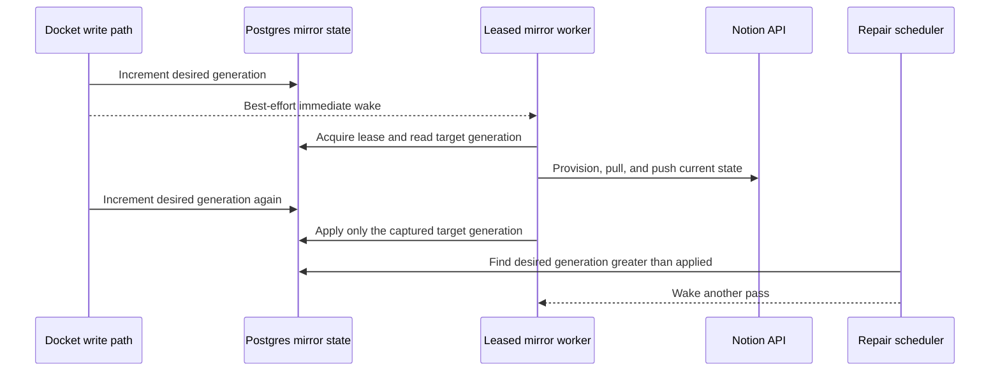

# Notion mirror reliability

> **Reader**: A Docket maintainer implementing or reviewing Notion synchronization.
> After reading this document, the maintainer should preserve one convergent reconciliation path
> and reject any change that makes a user edit depend on a successful Notion request.
>
> **Decision date**: 2026-08-24

Docket will treat every local write, Notion webhook, user-requested refresh, and repair sweep as a
signal to reconcile current state. One durable generation row per Notion integration will collapse
those signals. The existing leased Notion mirror remains the only engine that provisions, pulls,
resolves conflicts, and pushes.

This design does not promise exactly-once delivery. Notion and Postgres cannot commit one atomic
transaction. Docket instead provides at-least-once attempts, idempotent remote effects, and eventual
convergence after a process crash, a duplicate webhook, a lost wake-up, or an ambiguous provider
response.

## User contract

A Docket edit succeeds once Docket commits it. The request waits for the cheap local wake-up record,
but it never waits for Notion. Docket starts the mirror within seconds and applies another pass when
a second edit arrives during the first one.

Normal synchronization stays quiet. A connected planning surface shows `Updating Notion` only when
work remains pending for more than 10 seconds. It shows `Up to date` after a confirmed pass. A
retryable provider failure says that Docket saved the change and will keep retrying. An authorization,
permission, missing-parent, or ownership ambiguity names the repair action. Docket never reports
success from the age of a timer or from receipt of a webhook.

Opening or returning to a connected planning surface wakes a stale integration. This check closes
the visible delay when Notion has not delivered its webhook yet. The background repair sweep wakes
every integration that has not completed a pass in 15 minutes.

## One durable signal

`notion_mirror_state` has one row per integration. It stores the owning organization,
`desired_generation`, `applied_generation`, `next_attempt_at`, consecutive failures, the last
attempt and success times, and a stable failure code with safe user-facing detail. It does not own a
second lease. `runLeasedSync` and the existing `notion_mirror` sync-run purpose remain the one lease
and audit history.

Every trigger calls `wakeNotionMirror`:

- The existing entity-write bus wakes each active Notion mirror for the organization after a Task,
  Project, Initiative, Program, Team, Cycle, Milestone, Label, or Person write.
- The Notion ingest transaction inserts a new `inbound_event` and increments the generation. A
  duplicate provider event ID changes neither value.
- The Docket client may wake the integration when a relevant surface gains focus and the last
  confirmed pass is stale.
- The scheduler wakes an integration when the repair interval has elapsed.

The operation increments `desired_generation` and moves `next_attempt_at` to the present. It may
then request an immediate run. That process wake-up is an optimization. The database row remains
the durable work request when the process exits before the run starts.

The worker reads a target generation after it acquires the existing lease. A complete pass advances
`applied_generation` only to that target. A write that arrives during the pass leaves the desired
generation ahead and forces another pass. A pass that exhausts its write budget does not advance the
applied generation. A crash leaves the generations unequal, and the expired shared lease allows a
later worker to continue.

The retry schedule uses Notion's `Retry-After` value for rate limits. Network and provider failures
retry after 5 seconds, 15 seconds, 30 seconds, one minute, and then up to a five-minute ceiling with
jitter. Authentication and permission failures stop the hot retry loop and move the connection to
an action-required state. The repair sweep still retains the work request.

## Reconciliation sequence

This sequence diagram shows one change that overlaps another change during a mirror pass.

Notion webhooks do not enter a second event-reconciliation system. The ingest route verifies the raw
body with the official `@notionhq/client` signature helper. It then stores the provider event and
wakes the mirror in one database transaction. The route acknowledges only after that transaction
commits. The mirror fetches current provider state, so delivery order and event aggregation cannot
change the result. Self-authored webhooks may cause a redundant read, but hashes prevent a redundant
write. This makes bot-author inference unnecessary.

## Duplicate-proof provisioning

Notion does not accept an idempotency key for database or page creation. Docket must therefore make
creation recoverable from provider state.

Every Docket-designed database carries a stable Docket-managed ownership key in its Notion database
description. The key contains the Docket integration ID, mirror design ID, and entity type. Docket
writes the description in the same typed `databases.create` request that creates the initial data
source. A lost response therefore cannot separate creation from the marker. Notion exposes no
private application metadata, so a person can edit this visible description. Docket restores the
key while it retains the database binding. It stops for human review when both the binding and key
are missing instead of guessing from the title or schema.

The existing mirror design row records `creating` before the provider call. It changes to `ready`
only after Docket stores the returned database and data-source IDs. An ambiguous network result
leaves it `creating`. The next pass scans the exact parent twice before it attempts another create.
It adopts an exact key match. It retries creation only after both scans complete successfully with
no match. A permission or parent lookup failure cannot be mistaken for absence.

Before Docket creates a database with no stored Notion ID, the official SDK adapter lists the chosen
parent's child blocks and retrieves candidate databases through SDK methods. It adopts the one
database with the exact ownership key. It creates a database only when no candidate exists. More
than one candidate stops provisioning and produces an action-required state. Docket does not guess
from a title such as `Projects`, because a title is user-editable and does not establish ownership.

Every designed database also contains one Docket-managed rich-text property named `Docket ID`.
Docket stores its property ID with the database binding and restores the managed property if a
schema update removes it. Every row create writes the Docket entity ID into that property. The
local mirror-row record exists before the provider call with a null page ID, so the entity's unique
mapping row also acts as its durable creation intent.

Before creating a row without a stored Notion page ID, the adapter queries the data source by the
managed property. It adopts one exact match, creates after two successful zero-result reads, and
stops on multiple matches. A process may therefore die after `pages.create` and before the local
binding update without making a duplicate on retry. A permission or query failure leaves the
creation intent pending. A row created by a person in Notion has no Docket ID. When two-way pull
adopts that row as a Task or Project, Docket writes the new local ID back to the managed property.

Docket may trash an extra database only when all of these facts hold: the ownership key belongs to
the same integration and design, another exact candidate is already bound, and the extra database
contains zero rows. Docket records the cleanup in the audit history. Docket never deletes an
unmarked object or resolves an ambiguity through destructive cleanup.

## Idempotent row reconciliation

The mirror plans from current local state, current remote changes, and the last reconciled anchor.
Queued payloads never carry entity snapshots.

Task and Project keep a normalized anchor hash for the fields shared with Notion. A local hash that
differs from the anchor means Docket changed. A remote hash that differs from the anchor means
Notion changed. One changed side propagates to the other. Two changed sides produce the existing
Docket-wins conflict record before Docket pushes. Equal local and remote hashes advance the anchors
without another Notion write.

The other seven entity types remain push-only. Their current projected hash suppresses unchanged
writes. A successful provider write and its local mapping update remain separate operations, but the
database ownership key and row Docket ID make either operation safe to retry.

The mirror advances each database's pull cursor only after it has consumed every page of results.
An interrupted pagination run retains the old cursor and repeats data on the next pass. Page IDs,
provider event IDs, integration/entity keys, content hashes, and Docket IDs absorb those repeats.

## Failure presentation

The API derives four user states from durable facts:

- `up_to_date` means the generations match and the last complete pass succeeded.
- `updating` means the desired generation is ahead and no action-required failure exists.
- `retrying` means a retryable failure left unapplied work and has a scheduled next attempt.
- `action_required` means Docket needs authorization, page access, a parent choice, or a decision
  about ambiguous Docket-owned objects.

`Sync now` only calls `wakeNotionMirror`. It never invokes a separate synchronization path. The
settings surface shows the last confirmed success, the next retry when relevant, and the exact
repair action. Planning surfaces show only delayed or action-required states so normal work does not
fill the interface with transient status.

## Rejected designs

Synchronous Notion writes would make Docket saves depend on provider latency and availability. A
job per entity would add ordering, cancellation, deduplication, and conflict rules beside the full
mirror. Interpreting every webhook would make delivery order part of correctness. Title-and-schema
candidate adoption would create false matches after ordinary user edits. This design rejects all
four approaches.

## Verification

Tests must inject failure after each remote boundary. They cover a database response lost before
local persistence, a row response lost before its mapping insert, a duplicate webhook, a write that
arrives during a leased pass, lease expiry after a process crash, incomplete write-budget passes,
rate-limit retry timing, ambiguous ownership markers, and cleanup refusal for a non-empty database.

API tests cover generation transitions and webhook transactionality. Connections adapter tests use
the official SDK request and response types. Web tests cover the four user states, the 10-second
quiet period, focus-triggered recovery, and specific repair actions.

Before release, the live LVBT connection must complete OAuth, provision or adopt each marked
database under Home Base, and demonstrate one Task and one Project edit in each direction. All
Notion developer and account work must use the Hypertext Studio browser profile. The current public
integration's webhook subscription and production credentials remain live facts that the rollout
must verify rather than assume.
