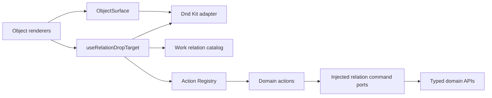

# Object interaction and relation drops

This specification is for engineers who add or change an object renderer. They must use the
shared interaction boundary and register any new relationship before they ship the surface.

## Decision

Every repeated object renderer uses `ObjectSurface` for identity, activation, and drag initiation.
Every relationship destination uses `useRelationDropTarget`. The work domain owns the closed
relation catalog and pure guards. Each application domain owns one registered action and one typed
command port for every relation it executes.

The application does not use native HTML drag payloads. It uses Dnd Kit 0.5 for in-document pointer,
touch, and pen transport. The Action Registry provides the same commands to keyboard and menu
entry points. Spatial movement, scheduling, ordering, and resizing remain separate intents.

We rejected a generic `/relations` route. Such a route would centralize domain knowledge in a
transport switch and would weaken the validation already owned by Task, Project, Program,
Initiative, and Calendar use cases. We also rejected per-surface payloads because they caused the
same relation to drift between list, board, timeline, calendar, and canvas views.

## Component diagram

This component diagram shows compile-time dependencies inside the web application and work domain.

The dependency direction stops UI code from choosing relationship meaning. A renderer supplies
only an `ObjectRef`, a destination, and an injected `href` or `onActivate`. The work catalog resolves
the default relation. The registry finds the one action that owns it. The action calls a narrowed
port, and that port calls the existing domain route.

## Surface contract

The entire non-control area opens the object once. Anchors, buttons, inputs, editors, menus, and
checkboxes keep their native behavior. A completed or cancelled drag suppresses the trailing click.
Title links remain anchors so modifier-click and middle-click still work.

Mouse and pen association drags activate after 6 pixels. Touch activates after a 250 ms hold with
8 pixels of tolerance. Timeline bars and canvas nodes reserve ordinary movement for positioning.
They use Option-drag for mouse or pen association and a stationary 450 ms touch hold for association.

An accepting target tints and outlines the full destination. It shows the exact effect in the
destination and the shared overlay. A rejecting target uses application-owned copy and a rejecting
cursor. Nested collisions prefer an object over a lane and a lane over a page root.

## Default relation matrix

The catalog has one default for each supported source-target pair. Explicit secondary actions do
not become drop defaults.

| Source        | Target        | Relation                | Effect                                 |
| ------------- | ------------- | ----------------------- | -------------------------------------- |
| Task          | Task          | `task.parent`           | Make the source a subtask              |
| Task          | Project       | `task.project`          | Set Project                            |
| Task          | Program       | `task.program`          | Set Program                            |
| Task          | Team          | `task.team`             | Run the Team transition use case       |
| Task          | Cycle         | `task.cycle`            | Commit to Cycle                        |
| Task          | Milestone     | `task.milestone`        | Set Milestone after Project validation |
| Task          | Actor         | `task.assignee`         | Assign                                 |
| Task          | Label         | `task.label`            | Add Label                              |
| Task          | Calendar item | `task.calendar-item`    | Link with the `related` role           |
| Task          | Calendar slot | `task.calendar-slot`    | Create and contain a time block        |
| Project       | Program       | `project.program`       | Set Program                            |
| Project       | Team          | `project.team`          | Set owning Team                        |
| Project       | Initiative    | `project.initiative`    | Add Initiative link                    |
| Project       | Actor         | `project.lead`          | Set lead                               |
| Project       | Label         | `project.label`         | Add Label                              |
| Project       | Project       | `project.blocks`        | Create dependency                      |
| Program       | Initiative    | `program.initiative`    | Add Initiative link                    |
| Program       | Actor         | `program.owner`         | Set owner                              |
| Program       | Label         | `program.label`         | Add Label                              |
| Initiative    | Initiative    | `initiative.parent`     | Reparent                               |
| Initiative    | Top level     | `initiative.root`       | Detach from parent                     |
| Initiative    | Team          | `initiative.lead-team`  | Set lead Team                          |
| Initiative    | Actor         | `initiative.owner`      | Set owner                              |
| Initiative    | Label         | `initiative.label`      | Add Label                              |
| Calendar item | Calendar item | `calendar-item.related` | Add a `related` edge                   |

`task.blocks`, `calendar-item.contained`, and `calendar-item.follow-up` are explicit actions. They do
not replace the defaults above.

## Validation and idempotency

The pure resolver rejects empty and mixed subject sets, unsupported pairs, cross-workspace targets,
self-relations, archived or locally forbidden targets, hierarchy cycles known to the current
surface, and locally provable Milestone ownership mismatches with stable reason codes. The server
remains authoritative for permissions, archived records, current hierarchy state, and other data
that may have changed since rendering.

Duplicate many-to-many links return success without another write. Single-valued relations replace
the current value. Each domain route retains its existing authorization and tenant validation.

## Change rule

An engineer who adds a relation must update the work catalog, register exactly one action with the
same `relationId`, implement a narrowed domain port, and add route-body, resolver, registry, and
surface tests. An engineer must not import Dnd Kit outside the interaction adapter or an approved
spatial module. The source-policy test enforces both rules.

Commands without an existing target open the shared relation picker. The picker queries the owning
domain and dispatches the same registered action as a drop.

## Visual evidence

The authenticated browser journey records the settled Initiative hierarchy and an active Task
relationship drop at 1440 by 900 pixels and 390 by 844 pixels in both themes. The hierarchy
captures prove that each ancestor rail stops or continues from its own sibling state. The active
captures prove that the full destination and the overlay show the same pending effect without
horizontal overflow.

- [Desktop hierarchy, light](../../design/audits/evidence/2026-08-23-object-relations-desktop-light.png)
- [Phone hierarchy, dark](../../design/audits/evidence/2026-08-23-object-relations-mobile-dark.png)
- [Desktop active drop, light](../../design/audits/evidence/2026-08-23-object-relation-drag-desktop-light.png)
- [Phone active drop, dark](../../design/audits/evidence/2026-08-23-object-relation-drag-mobile-dark.png)
