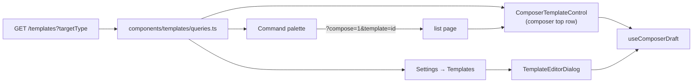

# Templates

> **Reader**: an engineer adding a template-aware surface, or changing what a template can store.
> **After reading**, you should know what a template is, where its payload may and may not point,
> and which of the four entry points you have to touch.
> **Status**: shipped 2026-08-05 (`TEMPLATES-001`).

A template is a named, scoped, reusable **pre-filled draft** for creating one of four work kinds:
Task, Project, Initiative, Program. It is the create-side counterpart to a saved view, and it is
modelled on `saved_view` on purpose — the repo had already answered "a named, scoped,
user-authored configuration with a jsonb payload" and there was no reason to answer it twice.

Cycles and Teams are not templatable. A cycle is a date window and a team is structural; neither
has a document to seed.

## Data

| Column                      | Notes                                                                                     |
| --------------------------- | ----------------------------------------------------------------------------------------- |
| `...auditColumns()`         | id, `organization_id` (tenant key), `created_by`, timestamps, `archived_at`               |
| `target_type`               | `template_target_type` enum: `task` \| `project` \| `initiative` \| `program`. Immutable. |
| `name`                      | Shown verbatim in the picker. `notBlank` CHECK. **Not** vocabulary-skinned.               |
| `description`               | One line on when to reach for it; rendered as the menu row's supporting text.             |
| `scope`                     | Reuses `view_scope`: `personal` \| `team` \| `organization`.                              |
| `owner_actor_id`, `team_id` | Same nullable pair `saved_view` uses. `team_id` is only meaningful at `team` scope.       |
| `payload`                   | jsonb, `$type<TemplateDraft>()`.                                                          |
| `is_seed`                   | Whether Docket seeded it. Presentational only — never a permission.                       |

Table: `packages/db/src/schema/crosscutting.ts`, directly after `savedView`. Index is
`(organization_id, target_type)`, because every read is "the templates this org has for this kind".
Migration `0068_cold_next_avengers.sql`.

## What a payload may hold

`TemplateDraft` (`packages/types/src/template.ts`) is a discriminated union on `targetType`, one
member per kind, each a **partial of that kind's `*Create` body**. That is what makes applying a
template a merge into the create call rather than a translation between two vocabularies — field
names match, so the only mapping step is dropping the discriminant.

Every field is optional. A template that sets only a markdown outline is as valid as one that sets
every property.

**A payload holds no reference to an actor, team, project, milestone, cycle, or date.** Those rows
come and go. A template naming a person who left, or a project that closed, is a template that
fails to apply, and pruning every such reference on delete costs more than the convenience is
worth. Two exceptions and one near-miss are worth knowing:

- `labelIds` **is** carried, on tasks only. Labels are org-scoped and long-lived, and a "Bug
  report" template that cannot apply a `bug` label is not doing its job.
- **Workflow state is not carried**, though it is neither a row reference nor a date. A state key
  belongs to one team's workflow and a template is org-wide, so any key stored would be wrong for
  most of the teams applying it. The composer already defaults the status to the chosen team's
  first state.
- **Absolute dates are not carried.** A target date baked into a reusable template is wrong the day
  after it is written. Relative dates ("due three days after creation") would need an expression
  evaluator; see _Not built_ below.

Adding a field to a payload has a hard prerequisite: **the template editor must be able to show
it.** A field the editor cannot render is a value nobody chose, written on the author's behalf.
That is why `estimate` is absent from `TaskTemplateDraft` (the task composer has no estimate
control) and `labelIds` is absent from `ProjectTemplateDraft` (the project composer links
initiatives, not labels).

## API

`/v1/orgs/:orgId/templates` — `apps/api/src/routes/templates.ts`, a near-copy of
`saved-views.ts`. `contribute` to mutate; any contributing member may author at `organization`
scope. Two departures from that template:

1. **`GET /` seeds on first call.** `seedDefaultTemplates(orgId, actorId)` runs before the select,
   so existing workspaces acquire their defaults the first time anyone opens a picker. No
   migration backfill.
2. **Nothing is written to the search index.** Templates are reached through the picker, the
   settings page, and the palette; a fourth route would mean widening `search_document_kind`,
   which `crosscutting.ts` asks callers not to do casually.

Validation the route enforces beyond the DTO:

| Rule                                         | Where                                      | Response |
| -------------------------------------------- | ------------------------------------------ | -------- |
| `payload.targetType` equals `targetType`     | `TemplateCreate.refine`                    | 422      |
| `scope: 'team'` names a `teamId`             | `TemplateCreate` / `TemplateUpdate` refine | 422      |
| A template may not change its kind           | route, PATCH                               | 422      |
| `teamId` is dropped when scope is not `team` | route, POST + PATCH                        | silent   |

`TemplateUpdate` has no nullable field. `description` clears with an empty string and `teamId` is
dropped server-side, so there is nothing an explicit null would express. This is _not_ a general
solution to the update-DTO clearing problem — see `DTO-CLEAR-001` in `docs/WORKLOG.md`.

## Shipped defaults

Twelve, three per kind, in `apps/api/src/lib/templates/defaults.ts`. They are **data, not code**,
seeded as ordinary `is_seed` rows a workspace may rename, rewrite, or delete — the same choice
`DEFAULT_RULES` makes for automation rules, and for the same reason: a default a user cannot edit
is not a default, it is a rule.

Every body is a heading outline rather than prose. A template that supplies sentences invites the
author to edit around them; a template that supplies questions makes the blank page theirs. Bodies
are four or five headings, because an outline long enough to scroll is a form.

Seeding is guarded on _"does this org hold any template at all"_. A workspace that deletes a
shipped default keeps it deleted. That is the intended reading of "editable", and it is asserted
by `apps/api/tests/routes/templates.test.ts`.

Three per kind is the whole opinion. Users add as many more as they like; there is no cap.

## The four surfaces

One implementation, several entry points — the rule `editor/slash-commands.ts` already states for
the slash menu.

**1. The composer control** — `components/composer/template-menu.tsx`. A `DropdownMenu` in the
dialog's top row, opposite the breadcrumb. It is deliberately **not** a suggestion-chip row: a chip
row suits a fixed set of two or three, and a template list is unbounded, has to show scope, and
needs a route out to management. It is also deliberately **not** in the property strip — every pill
there sets one field, and a template reaches the whole draft. See `docs/design/design-system.md`
§3, which this change revised.

**2. The draft, and what applying actually does** — `components/composer/use-composer-draft.ts`.
Each composer holds its fields as one value, and `templateMerge` decides how a template's fields
land. The rule is one sentence: **a template never removes anything the author wrote.**

| Field kind                          | Behaviour                               | Why                                                                                         |
| ----------------------------------- | --------------------------------------- | ------------------------------------------------------------------------------------------- |
| the document (`description`)        | **appended**, separated by a blank line | Two outlines stacked is a readable document; a replaced one is lost work.                   |
| single-line labels (title, summary) | filled only while blank                 | A title cannot be appended to, and overwriting one discards typed words.                    |
| everything else (enums)             | set                                     | They show in the property strip and are one click to change, so nothing written is at risk. |

This is the whole fix for the defect the slice exists to remove. The old picker called
`setBody(GUIDED_DOCUMENT)` and destroyed typed text; the answer is not a confirmation prompt or an
undo affordance but for the action to take nothing away in the first place. Two consequences worth
stating, because they are why there is no undo, no "Applied" banner, and no applied state on the
trigger:

- **Applying is repeatable.** A second template adds a second outline beneath the first.
- **A template picked by mistake is deleted the way any other text is** — select it and press
  delete. There is nothing bespoke to learn.

An earlier revision did ship an `Applied X. Undo` line under the property strip. It was removed:
it protected against a loss that no longer happens, and it cost a whole horizontal band between
the properties and the primary action, in the slot that otherwise renders errors.

> `updateDraft` returns the current state unchanged when a patch changes nothing. This is
> load-bearing, not an optimisation. The task composer fills its status from an effect whose
> dependencies are rebuilt each render; minting a fresh draft for a no-op patch made that effect
> re-run forever. Pinned by `apps/web/tests/composers/use-composer-draft.test.tsx`.

**3. Settings → Templates** — `app/(app)/orgs/[orgId]/settings/templates/page.tsx`, registered in
the Workflows group of `settings/sections.ts` and mirrored into the personal registry. Grouped by
kind, rows separated by tonal steps rather than rules. The editor (`TemplateEditorDialog`) is the
same `ComposerShell` and the same `*ComposerPickers` components the create dialog uses, with the
template's name, description, and scope above them — so authoring a template looks like creating
the thing it makes. The picker components take their reference axes as _optional_ props precisely
so the editor can omit them.

**4. The command palette** — `command-palette/use-command-actions.ts`. Four "New {kind}" actions
plus a `Create from template` section that stays hidden until the user types (`requiresQuery` on
`PaletteItem`), so a dozen seeded rows do not bury the destinations people open the palette for.

The palette owns no second copy of any dialog. A command navigates to the page that already owns
the composer and asks for it with `?compose=1&template=<id>`; `useComposeRequest`
(`components/composer/use-compose-param.ts`) consumes it once, copies the template id into state,
and strips both parameters with `router.replace` so a back-navigation does not reopen the dialog.

## Not built

- **Child work items.** A project template carrying milestones and a starter task list needs a
  second payload shape, a transactional multi-entity create, and its own editor.
- **A default template per team or kind**, auto-applied when a composer opens with no draft.
- **Relative dates.** Needs a date-expression evaluator.
- **Team-scoped authoring in the UI.** The schema, DTO, and API support `scope: 'team'` fully and
  the composer menu groups by it; the editor's scope picker offers only _Only you_ and _Everyone in
  this workspace_, because it has no team picker yet. A team-scoped template created through the
  API renders and applies correctly.
