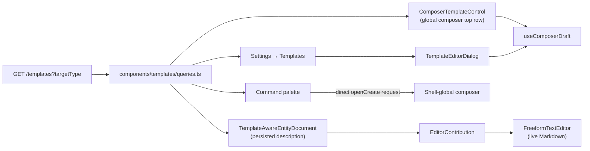

# Templates

> **Reader**: an engineer adding a template-aware surface, or changing what a template can store.
> **After reading**, you should know what a template is, where its payload may and may not point,
> and which of the four entry points you have to touch.
> **Status**: shipped 2026-08-05 (`TEMPLATES-001`).

A template is a named, scoped, reusable **pre-filled draft** for creating one of four work kinds:
Task, Project, Initiative, Program. The shell-global creation composer owns five kinds in total:
Task, Project, Initiative, Program, and Team. Team is deliberately outside the template system.
Templates are the create-side counterpart to a saved view, and are modelled on `saved_view` on
purpose — the repo had already answered "a named, scoped, user-authored configuration with a
jsonb payload" and there was no reason to answer it twice.

Cycles and Teams are not templatable. A cycle is a date window and a team is structural; neither
has a document to seed.

## Data

| Column                      | Notes                                                                                     |
| --------------------------- | ----------------------------------------------------------------------------------------- |
| `...auditColumns()`         | id, `organization_id` (tenant key), `created_by`, timestamps, `archived_at`               |
| `target_type`               | `template_target_type` enum: `task` \| `project` \| `initiative` \| `program`. Immutable. |
| `name`                      | Shown verbatim in the picker. `notBlank` CHECK. **Not** vocabulary-skinned.               |
| `description`               | One line on when to reach for it; rendered as the menu row's supporting text.             |
| `scope`                     | Reuses `view_scope`: `personal` \| `team` \| `organization`.                              |
| `owner_actor_id`, `team_id` | Same nullable pair `saved_view` uses. `team_id` is only meaningful at `team` scope.       |
| `payload`                   | jsonb, `$type<TemplateDraft>()`.                                                          |
| `is_seed`                   | Whether Docket seeded it. Presentational only — never a permission.                       |

Table: `packages/db/src/schema/crosscutting.ts`, directly after `savedView`. Index is
`(organization_id, target_type)`, because every read is "the templates this org has for this kind".
Migration `0068_cold_next_avengers.sql`.

## What a payload may hold

`TemplateDraft` (`packages/types/src/template.ts`) is a discriminated union on `targetType`, one
member per kind, each a **partial of that kind's `*Create` body**. That is what makes applying a
template a merge into the create call rather than a translation between two vocabularies — field
names match, so the only mapping step is dropping the discriminant.

Every field is optional. A template that sets only a markdown outline is as valid as one that sets
every property.

**A payload holds no reference to an actor, team, project, milestone, cycle, or date.** Those rows
come and go. A template naming a person who left, or a project that closed, is a template that
fails to apply, and pruning every such reference on delete costs more than the convenience is
worth. Two exceptions and one near-miss are worth knowing:

- `labelIds` **is** carried, on tasks only. Labels are org-scoped and long-lived, and a "Bug
  report" template that cannot apply a `bug` label is not doing its job.
- **Workflow state is not carried**, though it is neither a row reference nor a date. The composer
  defaults the status to the default status of the set the chosen team resolves to.

  The reason this bullet used to give — a state key belongs to one team's workflow and a template
  is org-wide, so any key stored would be wrong for most of the teams applying it — held while
  every team owned its own state list. Task statuses are now workspace-owned
  (`statuses.md`), and a team keeps its own set only by forking. **In a workspace where no team
  has forked, every team resolves to the same Task set, so an org-wide template could carry a
  status key and have it resolve correctly everywhere.** That is what the change enables and it is
  as far as the claim goes: a workspace with even one forked team is back in the original
  situation for that team, and a template that stored `in_review` would still be applying a key
  that team's set may not hold. Carrying it would therefore need a stated rule for what happens on
  a miss — silently fall back to the default, or refuse the apply — plus an editor control that
  can show which set it is picking from. None of that is designed yet, so the field stays out and
  the composer's default stands.

- **Absolute dates are not carried.** A target date baked into a reusable template is wrong the day
  after it is written. Relative dates ("due three days after creation") would need an expression
  evaluator; see _Not built_ below.

Adding a field to a payload has a hard prerequisite: **the template editor must be able to show
it.** A field the editor cannot render is a value nobody chose, written on the author's behalf.
That is why `estimate` is absent from `TaskTemplateDraft` (the task composer has no estimate
control).

`labelIds` is also absent from `ProjectTemplateDraft`, but **not** for that reason — the project
composer does carry a label picker, so the prerequisite is met. It is simply not carried yet.
Projects, initiatives, and programs are all labelable, and a project template that cannot apply a
label has the same gap the task one was written to close.

## API

`/v1/orgs/:orgId/templates` — `apps/api/src/routes/templates.ts`, a near-copy of
`saved-views.ts`. `contribute` to mutate; any contributing member may author at `organization`
scope. Two departures from that template:

1. **`GET /` seeds on first call.** `seedDefaultTemplates(orgId, actorId)` runs before the select,
   so existing workspaces acquire their defaults the first time anyone opens a picker. No
   migration backfill.
2. **Nothing is written to the search index.** Templates are reached through the picker, the
   settings page, and the palette; a fourth route would mean widening `search_document_kind`,
   which `crosscutting.ts` asks callers not to do casually.

Validation the route enforces beyond the DTO:

| Rule                                         | Where                                      | Response |
| -------------------------------------------- | ------------------------------------------ | -------- |
| `payload.targetType` equals `targetType`     | `TemplateCreate.refine`                    | 422      |
| `scope: 'team'` names a `teamId`             | `TemplateCreate` / `TemplateUpdate` refine | 422      |
| A template may not change its kind           | route, PATCH                               | 422      |
| `teamId` is dropped when scope is not `team` | route, POST + PATCH                        | silent   |

`TemplateUpdate` has no nullable field. `description` clears with an empty string and `teamId` is
dropped server-side, so there is nothing an explicit null would express. This is _not_ a general
solution to the update-DTO clearing problem — see `DTO-CLEAR-001` in `docs/WORKLOG.md`.

## Shipped defaults

Twelve, three per kind, in `apps/api/src/lib/templates/defaults.ts`. They are **data, not code**,
seeded as ordinary `is_seed` rows a workspace may rename, rewrite, or delete — the same choice
`DEFAULT_RULES` makes for automation rules, and for the same reason: a default a user cannot edit
is not a default, it is a rule.

Every body is a heading outline rather than prose. A template that supplies sentences invites the
author to edit around them; a template that supplies questions makes the blank page theirs. Bodies
are four or five headings, because an outline long enough to scroll is a form.

Seeding is guarded on _"does this org hold any template at all"_. A workspace that deletes a
shipped default keeps it deleted. That is the intended reading of "editable", and it is asserted
by `apps/api/tests/routes/templates.test.ts`.

Three per kind is the whole opinion. Users add as many more as they like; there is no cap.

## Global creation composer

`CreateObjectProvider` is mounted beside the command palette in the authenticated app shell. It
owns one closed request union and one independently selected destination workspace, so page
launchers and the command palette open the same composer instead of each retaining a local dialog.
The supported union is intentionally closed to these five kinds:

| Kind       | Global top row, in order                                           | Permission   |
| ---------- | ------------------------------------------------------------------ | ------------ |
| Task       | Workspace → Team when the destination has more than one → Template | `contribute` |
| Project    | Workspace → Program → Template                                     | `contribute` |
| Initiative | Workspace → Owner → Template                                       | `contribute` |
| Program    | Workspace → Owner → Template                                       | `manage`     |
| Team       | Workspace                                                          | `manage`     |

Cycles and workspace creation remain separate flows. Team has no template control: it is
structural rather than a template target. The top row is context, not a property strip. A template
still applies to the whole draft, and the promoted Team, Program, or Owner is the one primary
relationship most useful before the author starts writing.

### Destination workspace

Opening with no explicit destination snapshots the shell's active workspace. If the shell is still
resolving, the provider freezes that result once; it never guesses from membership order. Changing
the Workspace selector changes only the composer target: it does not navigate, change the shell
workspace, or write the last-workspace preference. With one available workspace it renders as a
quiet static label; with more it is an accessible native select. Creation is disabled until a
resolved destination is ready.

While a request is open, `CreationContextProvider` reads the target workspace detail, teams,
members, and roles under destination-keyed TanStack Query keys. The detail provides the target
vocabulary skin; the rosters supply composer options and identify the signed-in member's target
actor; the General team (or first team) supplies the task/project default. Permission is derived
from the target membership and roles, not from the workspace behind the modal: Task, Project, and
Initiative require `contribute`; Program and Team require `manage`. A failed destination read uses
application-owned error copy and prevents submit.

Kind-specific option reads and templates are likewise destination-owned. They are enabled only
while a ready composer is open, use the selected workspace id, share standard query keys, and use
static stale time for rosters. The workflow-state loader remains team-keyed. This prevents a
retargeted composer from displaying or posting options from the workspace underneath it.

On a destination change, portable text, dates, and generic enum choices stay in the draft; foreign
references do not. Tasks clear team override, workflow state, assignee, project, milestone, cycle,
and labels, then use the new destination's default team. Projects clear team override, lead,
program, and initiatives. Initiatives and Programs clear owner. Contextual launcher defaults and
auto-applied templates apply only while the target remains the opening workspace. This preserves
the author's work without allowing a person or object id from one workspace to cross into another.

### Completion and repeat creation

Every successful create invalidates destination-owned cache keys. When the destination is the
opening workspace, the launcher chooses whether to stay or open the created object, and may receive
its callback. For normal completion, a cross-workspace create opens the created object in its
destination and never calls the origin-page callback with foreign data. A cross-workspace Task
continuation is the explicit exception: it remains in the global modal while still invalidating
target caches and suppressing origin callbacks. Team is the exception to detail routing: it always opens the
destination workspace's Teams page because a newly created team has no standalone create completion
route.

Task's **Create more** switch is off by default, keeping ordinary Create as the close-and-complete
path. With it on, Create keeps the dialog open, invalidates as usual, suppresses navigation, clears
only title and description, resets the rich-text editor document, announces readiness through a
screen-reader status, and returns focus to the title. Existing field selections remain for fast
repetition. Cmd/Ctrl+Shift+Enter runs that same continuation exactly once (repeated key events are
ignored) without changing the switch, so it is a one-shot shortcut rather than a hidden mode.

### Template surfaces

One implementation has several entry points — the rule `editor/slash-commands.ts` already states
for the slash menu.

**1. The composer control** — `components/composer/template-menu.tsx`. A `DropdownMenu` in the
global dialog's top row. It is deliberately **not** a suggestion-chip row: a chip row suits a fixed
set of two or three, and a template list is unbounded, has to show scope, and needs a route out to
management. It is also deliberately **not** in the property strip — every pill there sets one
field, and a template reaches the whole draft. See `docs/design/design-system.md` §3.

The target workspace's organization templates are always visible. Personal templates are visible
only to their owning actor in that target workspace; team templates are visible only when their
team matches the selected Task or Project team. Initiative and Program intentionally pass no team,
so they do not expose a team-scoped template. The menu groups visible rows as Workspace, Team, and
Yours.

**2. Draft state and merge policy** — `components/composer/use-composer-draft.ts` holds each
composer's fields as one value. `components/templates/merge.ts` decides how a template's fields
land in both create drafts and persisted documents. The rule is one sentence: **a template never
removes anything the author wrote.**

| Field kind                          | Behaviour                               | Why                                                                                         |
| ----------------------------------- | --------------------------------------- | ------------------------------------------------------------------------------------------- |
| the document (`description`)        | **appended**, separated by a blank line | Two outlines stacked is a readable document; a replaced one is lost work.                   |
| single-line labels (title, summary) | filled only while blank                 | A title cannot be appended to, and overwriting one discards typed words.                    |
| everything else (enums)             | set                                     | They show in the property strip and are one click to change, so nothing written is at risk. |

This is the whole fix for the defect the slice exists to remove. The old picker called
`setBody(GUIDED_DOCUMENT)` and destroyed typed text; the answer is not a confirmation prompt or an
undo affordance but for the action to take nothing away in the first place. Two consequences worth
stating, because they are why there is no undo, no "Applied" banner, and no applied state on the
trigger:

- **Applying is repeatable.** A second template adds a second outline beneath the first.
- **A template picked by mistake is deleted the way any other text is** — select it and press
  delete. There is nothing bespoke to learn.

An earlier revision did ship an `Applied X. Undo` line under the property strip. It was removed:
it protected against a loss that no longer happens, and it cost a whole horizontal band between
the properties and the primary action, in the slot that otherwise renders errors.

> `updateDraft` returns the current state unchanged when a patch changes nothing. This is
> load-bearing, not an optimisation. The task composer fills its status from an effect whose
> dependencies are rebuilt each render; minting a fresh draft for a no-op patch made that effect
> re-run forever. Pinned by `apps/web/tests/composers/use-composer-draft.test.tsx`.

**3. Existing entity descriptions** —
`components/editor/apply-description-template.tsx`. Task, Project, Initiative, and Program detail
pages use `TemplateAwareEntityDocument`; Team remains outside the template target set. The feature
filters the same organization, team, and personal templates as the composer, then supplies an
`EditorContribution` to the shared document editor. `EntityDocument` owns document layout only.
It has no template branch and no action header.

An empty editable description shows one compact inline action: **Start from template**. Its menu
lists the eligible templates without a redundant scope heading. The action disappears as soon as
the document contains non-whitespace content. A populated description exposes templates only
through `/template`; the contextual slash rows stay hidden from the bare `/` menu until the author
types a query. Selecting one removes the typed command and appends the template body to the
editor's live Markdown. Reading the live document rather than the last persisted prop preserves
typing that has not reached the two-second autosave boundary.

The editor depends on the generic `EditorContribution` and `SlashCommand` contracts. Each feature
implements those contracts with its own empty-state renderer and command collection. This keeps
querying and template merge policy in the template feature while the shared editor dispatches all
commands through one keyboard and accessibility path.

`components/templates/merge.ts` owns the data-preserving merge policy. Create composers and
persisted editors both depend on that template-domain function; neither surface owns a private
version of the append and blank-label rules.

**4. Settings → Templates** — `app/(app)/orgs/[orgId]/settings/templates/page.tsx`, registered in
the Workflows group of `settings/sections.ts` and mirrored into the personal registry. Grouped by
kind, rows separated by tonal steps rather than rules. The editor (`TemplateEditorDialog`) is the
same `ComposerShell` and the same `*ComposerPickers` components the create dialog uses, with the
template's name, description, and scope above them — so authoring a template looks like creating
the thing it makes. The picker components take their reference axes as _optional_ props precisely
so the editor can omit them.

**5. The command palette** — `command-palette/use-command-actions.ts`. Four "New {kind}" actions
plus a `Create from template` section that stays hidden until the user types (`requiresQuery` on
`PaletteItem`), so a dozen seeded rows do not bury the destinations people open the palette for.

The palette closes and calls `openCreate` directly, retaining the page under the overlay; template
commands carry `defaultTemplateId` in that request. There is no creation `?compose=1` URL or
consume-and-strip bridge for global object creation.

Initiative **updates** remain a separate feature. Their existing
`?tab=updates&compose=1` route opens an update composer for an existing initiative and is not a
creation launcher, template transport, or exception to this direct-open model.

## Not built

- **Child work items.** A project template carrying milestones and a starter task list needs a
  second payload shape, a transactional multi-entity create, and its own editor.
- **A default template per team or kind**, auto-applied when a composer opens with no draft.
- **Relative dates.** Needs a date-expression evaluator.
- **Team-scoped authoring in the UI.** The schema, DTO, and API support `scope: 'team'` fully and
  the composer menu groups by it; the editor's scope picker offers only _Only you_ and _Everyone in
  this workspace_, because it has no team picker yet. A team-scoped template created through the
  API renders and applies correctly.
