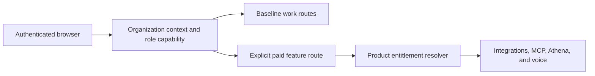

# Core shared-work release gate implementation plan

> **For Claude:** REQUIRED SUB-SKILL: Use superpowers:executing-plans to implement this plan task-by-task.

**Reader:** An Athena maintainer who will implement and review the production repair. After
finishing this plan, the maintainer must merge only a change that proves an unentitled shared
workspace can create core work and that a real paid boundary still returns 402.

**Goal:** Keep collaborative work creation in baseline Docket and block a production deployment
whenever the shared-workspace Initiative journey fails.

**Architecture:** Product ownership is a narrow input to explicit paid features. It must not alter
the meaning of a workspace, a role, or a core work route. The organization router resolves
membership and role capability. Paid modules add their own product guard. The release suite uses
the production Web build and PostgreSQL to create a shared workspace and an Initiative through the
browser.

**Tech Stack:** TypeScript, Hono, Drizzle, PostgreSQL 17, Next.js standalone output, Playwright,
and GitHub Actions.

---

## Incident and decision

On 2026-08-27, production returned HTTP 402 for
`POST /v1/orgs/01KY1N724K30F3MCPQMRC7GVD3/initiatives`. The source is
`sharedWorkCapabilityGuard` in `apps/api/src/product-capability.ts`. The guard runs around every
nested route in `apps/api/src/routes/orgs.ts` and asks for the paid `shared_work` capability on any
shared-workspace mutation. `CreateInitiativeDialog` only checks the actor's `contribute` role
capability, so it enables Create and later receives the 402.

The release job passed because `e2e/release/core-screen-acceptance.spec.ts` loads screens. It does
not submit a create form. Its setup creates a personal workspace, while the bug only applies to
shared workspaces. `seedOrg` also grants Docket Pro by default, which hides missing entitlement
from most API tests.

We will delete `shared_work` from the paid capability catalog and delete the global guard. Core
workspace, Team, Task, Project, Initiative, Program, Cycle, Milestone, status, label, view, and
workspace-setting routes remain governed by their existing tenant, membership, and role checks.
Docket Pro keeps explicit guards for integrations, MCP, Athena, and voice.

We will not repair this with a production entitlement, a LVBT exception, or a billing message in
the Initiative dialog. Those actions preserve the wrong authorization model. The release job uses
disposable PostgreSQL state, so no production record is needed for the proof.

## Authorization boundary

This component diagram states the required ownership. A core work request never reaches a billing
decision.



No middleware may infer a paid requirement from `isPersonal`, request method, or position under
`/:orgId`. A paid module owns its own `productCapabilityGuard` at the feature boundary.

## Acceptance contract

The [test dependency diagram](2026-08-27-core-shared-work-test-structure.mmd) shows how the three
test suites combine into the deployment decision.

1. An Owner in an unentitled shared workspace receives HTTP 201 from
   `POST /v1/orgs/:orgId/initiatives`.
2. A Member with `contribute` can create baseline work. A Guest cannot create it.
3. An unentitled shared workspace still receives HTTP 402 from an explicitly paid integration,
   MCP, Athena, or voice operation.
4. The release suite creates a shared workspace through the browser, submits a new Initiative,
   observes HTTP 201, sees it in the UI, and reloads its detail route.
5. The release suite treats an unexpected 402 on baseline work as a failure. It can allow 402 only
   for one named paid operation that the test intentionally exercises.
6. `deploy-production` continues to require the release job, so a red creation journey prevents
   migrations and production deployments.

## Task 1: Remove the global shared-work product capability

**Files:**

- Modify: `domains/billing/src/contracts.ts`
- Modify: `apps/api/src/product-capability.ts`
- Modify: `apps/api/src/routes/orgs.ts`
- Modify: `apps/api/tests/agent/entitlement.test.ts`
- Test: `domains/billing/tests/application/entitlement.test.ts`

**Step 1: Write the failing contract tests.**

Remove `shared_work` from the expected capability list. Assert that Docket Pro still grants
`integrations`, `mcp`, `athena`, and `voice`. Replace the old global-middleware tests with tests
that establish no global product guard exists for baseline organization routes.

**Step 2: Run the tests before changing source.**

```bash
pnpm --filter @docket/billing test -- tests/application/entitlement.test.ts --maxWorkers=2
pnpm --filter @docket/api test -- tests/agent/entitlement.test.ts --maxWorkers=2
```

The old expectations must fail before the implementation changes.

**Step 3: Make the narrow implementation change.**

Delete `shared_work` from `PRODUCT_CAPABILITIES`. Delete `sharedWorkCapabilityGuard`. Remove each
application of that guard from the organization router, including the explicit workspace settings
uses. Preserve `productCapabilityGuard`, `assertProductCapability`, tenant isolation, and role
capability checks. Search production source for both deleted names and require zero matches.

**Step 4: Run the focused tests again and commit the authorization slice.**

Use the `billing` scope. The commit body must state that collaborative core work is baseline and
that paid modules retain explicit product guards.

## Task 2: Make tests opt into paid access

**Files:**

- Modify: `apps/api/tests/support/routes-harness.ts`
- Modify: API tests that exercise explicit paid capabilities
- Test: affected billing, integrations, MCP, Athena, and voice suites

**Step 1: Write the fixture expectation.**

Require `seedOrg` to create an unentitled shared workspace by default. A test that needs Docket
Pro must pass an explicit grant or call `grantDocketPro` itself.

**Step 2: Change the default.**

Set `withDocketPro` to `false`. Do not restore an implicit entitlement to silence an unrelated
failure. Each exposed failure must either declare a paid capability or prove that its route is
baseline.

**Step 3: Prove both sides.**

Run the affected suites with no more than two workers. Core routes must pass with no entitlement.
Paid routes must fail without a grant and pass with an explicit grant.

## Task 3: Add the HTTP-level shared Initiative contract

**Files:**

- Create: `apps/api/tests/routes/shared-work-baseline.test.ts`
- Modify: `apps/api/tests/support/routes-harness.ts` only if it needs an authenticated Owner helper

**Step 1: Write the failing production-router test.**

Mount the real organization router through the route harness. Seed a shared workspace, an Owner,
roles, grants, statuses, and no entitlement. Send the Initiative JSON shape used by the browser to
the actual `POST /v1/orgs/:orgId/initiatives` route. Assert 201, the returned name and id, then
GET aggregate detail and assert 200. Add Member success and Guest denial cases.

**Step 2: Prove it fails against the old guard and passes after Task 1.**

```bash
pnpm --filter @docket/api test -- tests/routes/shared-work-baseline.test.ts --maxWorkers=2
```

The test must include the parent organization router. Testing the Initiatives router in isolation
would miss the middleware that caused the production outage.

## Task 4: Replace screen-only release coverage with core-product acceptance

**Files:**

- Create: `apps/web/e2e/release/core-work-creation.spec.ts`
- Modify: `apps/web/e2e/release/core-screen-acceptance.spec.ts`
- Modify: `.github/workflows/ci.yml`

**Step 1: Write the browser-only mutation journey.**

Use `signUp` for a fresh account. Open `/workspaces/new`, enter a unique workspace name, and press
**Create workspace**. Wait for the new shared workspace id. Open its Initiative list, press **New
Initiative**, enter a unique name, and press **Create**. Observe the Initiative POST return 201,
assert that the list shows the new record, reload its detail route, and assert the name remains.

The test can establish authentication with existing helpers. It must not create the workspace or
Initiative through API setup. Those browser operations are the contract that production broke.

**Step 2: Remove the blanket 402 waiver.**

`core-screen-acceptance.spec.ts` currently ignores every 402 while it watches screen responses.
Replace that exemption with an exact, named allow-list for the one intentional paid request on a
screen. The core-work creation test must fail on every 4xx and 5xx from either write.

**Step 3: Run the same production-build stack as CI.**

Use the existing PostgreSQL service, standalone Next.js build, API server, host mapping, and
Chromium configuration from `core-screen-smoke`. Run the suite with `--workers=1`. The old release
would fail at Initiative submission with 402. The completed release must pass without retry.

**Step 4: Gate the release directory.**

Change the workflow command from one filename to `e2e/release`. Rename the visible job and
artifact to Core product acceptance. Preserve `core-screen-smoke` in both `still-latest.needs` and
`deploy-production.needs`, so the new test is a release blocker rather than advisory coverage.

## Task 5: Verify, review, and release safely

**Files:**

- Modify: `docs/WORKLOG.md`

**Step 1: Run focused checks.**

Run the billing contract, API route, and release E2E tests with two workers at most. Save Playwright
trace and screenshot output only for a failure.

**Step 2: Run repository checks.**

Run `pnpm typecheck -- --concurrency=2`, `pnpm lint -- --concurrency=2`,
`pnpm test -- --maxWorkers=2`, and `pnpm build -- --concurrency=2`. The expected watchdog command
is unavailable on this host, so start with focused commands and reduce package or worker count if
the operating system kills a process.

**Step 3: Inspect the deployment edge.**

Run the CI gate-policy check and confirm `core-screen-smoke` remains in the `still-latest` and
`deploy-production` dependency lists.

**Step 4: Update the work log and review the diff.**

Record the 402 source, the final product catalog, explicit paid boundaries, every test result, and
any unrelated failure. Confirm that no production entitlement, account, or work record was created.

**Step 5: Merge only after the updated release job passes.**

The CI suite supplies the end-to-end proof because it uses disposable data and the production Web
build. Do not create a production Initiative as a smoke test without explicit approval.

## Risks and controls

Removing `shared_work` can expose a paid feature that depended on the parent guard. The explicit
premium tests and a source search for `productCapabilityGuard` control that risk. Making fixtures
unentitled can reveal a large number of hidden assumptions. That is required cleanup: each failure
must declare a product grant or establish a baseline route. Passkey setup makes the release test
slower, but the job already has a 12-minute budget and runs Chromium with one worker.

If Docket Pro must charge for collaboration in the future, it needs a distinct, opt-in
collaboration boundary, an honest disabled UI state, a migration path for existing organizations,
and separate product approval. It must never be inferred from the fact that a workspace is shared.
