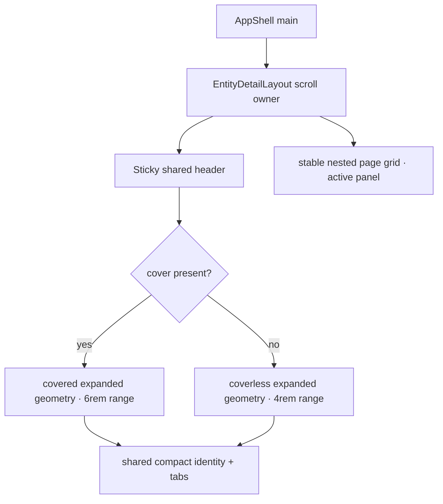

# Coverless Detail Header Collapse Implementation Plan

> **For agentic workers:** REQUIRED SUB-SKILL: Use superpowers:subagent-driven-development
> (recommended) or superpowers:executing-plans to implement this plan task-by-task. Steps use
> checkbox (`- [ ]`) syntax for tracking.

**Goal:** Make every core entity header collapse reliably while giving coverless pages a deliberate
expanded composition, a continuously resizing title, and an icon that moves from its own row into
the compact title row.

**Architecture:** Keep the behavior in `EntityDetailLayout` and its shared styles. Mark the covered
or coverless geometry on the scroll owner, wrap page content in a stable minimum-height body that
guarantees the scroll timeline can finish, and morph one identity DOM tree through padding, scale,
typography, and secondary-row animations. No route supplies tuning and no scroll listener runs per
frame.

**Tech Stack:** React 19, TypeScript, Tailwind utility classes, shared CSS scroll timelines, Vitest
source contracts.

---

### Task 1: Lock the shared collapse contract

**Files:**

- Create: `apps/web/tests/components/entity-detail-collapse-contract.test.ts`
- Read: `apps/web/src/components/views/entity-detail-layout.tsx`
- Read: `packages/ui/src/styles/globals.css`

- [ ] **Step 1: Write the failing source contract**

```typescript
import { readFileSync } from 'node:fs';
import { join, resolve } from 'node:path';

import { describe, expect, it } from 'vitest';

const root = resolve(import.meta.dirname, '../../../../');
const layout = readFileSync(
  join(root, 'apps/web/src/components/views/entity-detail-layout.tsx'),
  'utf8',
);
const css = readFileSync(join(root, 'packages/ui/src/styles/globals.css'), 'utf8');

describe('entity detail collapse contract', () => {
  it('derives covered and coverless geometry in the shared layout', () => {
    expect(layout).toContain("data-detail-cover={cover ? 'present' : 'absent'}");
    expect(css).toContain("[data-detail-cover='absent']");
    expect(css).toContain("[data-detail-cover='present']");
    expect(css).toContain('--detail-collapse-range: 4rem');
    expect(css).toContain('--detail-collapse-range: 6rem');
  });

  it('keeps enough stable body geometry for the scroll timeline to finish', () => {
    expect(layout).toContain('detail-body page-bleed page-grid');
    expect(css).toContain('.detail-body');
    expect(css).toMatch(/min-block-size:\s*calc\(/);
    expect(css).toContain('var(--detail-collapse-range)');
  });

  it('morphs one identity from stacked to compact without duplicating the icon', () => {
    expect(layout).toContain('className="detail-identity"');
    expect(layout.match(/className="detail-glyph/g)).toHaveLength(1);
    expect(layout.indexOf('detail-glyph')).toBeLessThan(layout.indexOf('detail-title'));
    expect(css).toContain('padding-block-start: var(--detail-expanded-glyph-row)');
    expect(css).toContain('padding-inline-start: var(--detail-compact-identity-inset)');
    expect(css).toContain('font-size: var(--text-title-medium)');
  });

  it('uses a discrete compact state for reduced motion', () => {
    expect(css).toContain('@media (prefers-reduced-motion: reduce)');
    expect(css).toContain('animation-timing-function: steps(1, end)');
    expect(css).toContain('animation-range: 0 1px');
  });
});
```

- [ ] **Step 2: Run only the new test in one worker and verify RED**

Run:

```bash
pnpm --filter @docket/web exec vitest run tests/components/entity-detail-collapse-contract.test.ts \
  --maxWorkers=1 --minWorkers=1 --no-file-parallelism
```

Expected: FAIL because the layout has no cover-state marker or stable body wrapper and the current
identity is an inline flex row.

- [ ] **Step 3: Commit the failing behavioral contract**

```bash
git add apps/web/tests/components/entity-detail-collapse-contract.test.ts
git commit -F - <<'EOF'
fix(web): Define the entity header collapse contract

Capture the shared covered and coverless geometry before changing the layout. The focused contract
requires a stable collapse range, one morphing identity tree, continuous title scaling, and a
reduced-motion state without introducing route-specific behavior.
EOF
```

### Task 2: Implement the stable shared header geometry

**Files:**

- Modify: `apps/web/src/components/views/entity-detail-layout.tsx`
- Modify: `packages/ui/src/styles/globals.css`
- Test: `apps/web/tests/components/entity-detail-collapse-contract.test.ts`

- [ ] **Step 1: Mark the variant and give page content a stable body**

On the scroll owner, add the shared variant marker:

```tsx
data-detail-cover={cover ? 'present' : 'absent'}
```

Replace the inline identity flex row with one positioned identity tree:

```tsx
<div className="detail-identity">
  <div className="detail-glyph">{icon}</div>
  <h1 className="detail-title text-on-surface text-headline-medium min-w-0 font-medium">{title}</h1>
</div>
```

Wrap the supplied panels after the header so their minimum height supplies the collapse runway while
the nested page grid preserves the existing measure:

```tsx
<div className="detail-body page-bleed page-grid">{children}</div>
```

- [ ] **Step 2: Define the covered and coverless geometry**

Add shared custom properties and variant ranges:

```css
[data-detail-cover] {
  --detail-collapse-range: 4rem;
  --detail-expanded-glyph-row: 3.25rem;
  --detail-compact-identity-inset: 2.25rem;
}

[data-detail-cover='present'] {
  --detail-collapse-range: 6rem;
}

.detail-body {
  min-block-size: calc(100% - 4rem + var(--detail-collapse-range));
}

.detail-identity {
  position: relative;
  min-width: 0;
}

.detail-glyph {
  position: absolute;
  inset-block-start: 0;
  inset-inline-start: 0;
  width: fit-content;
  transform-origin: left center;
}

.detail-title {
  min-width: 0;
  overflow-wrap: anywhere;
  padding-block-start: var(--detail-expanded-glyph-row);
}
```

The body formula reserves at least the requested animation range after the compact header. It does
not change the top-of-page spacing and only extends short panels at the end of their content.

- [ ] **Step 3: Morph title, glyph, cover, and secondary context on the same timeline**

Keep one scroll timeline and change the title keyframes to include identity placement:

```css
@keyframes detail-title-collapse {
  from {
    padding-block-start: var(--detail-expanded-glyph-row);
    padding-inline-start: 0;
    font-size: var(--text-headline-medium);
    line-height: var(--text-headline-medium--line-height);
  }
  to {
    overflow: hidden;
    padding-block-start: 0;
    padding-inline-start: var(--detail-compact-identity-inset);
    font-size: var(--text-title-medium);
    line-height: var(--text-title-medium--line-height);
    text-overflow: ellipsis;
    white-space: nowrap;
  }
}
```

The glyph keeps the existing `scale: 0.6` endpoint. The secondary row keeps its `1fr` to `0fr`
collapse and the covered backdrop keeps its own height collapse. All four use the variant's shared
range.

- [ ] **Step 4: Add a reduced-motion snap without a scroll listener**

Apply the same scroll-linked keyframes for all supporting browsers. In the reduced-motion branch,
override only timing and range:

```css
@media (prefers-reduced-motion: reduce) {
  .detail-backdrop-space,
  .detail-glyph,
  .detail-title,
  .detail-secondary {
    animation-range: 0 1px;
    animation-timing-function: steps(1, end);
  }
}
```

This leaves the full expanded context at scroll position zero and snaps to the shared compact state
after the first pixel rather than interpolating motion.

- [ ] **Step 5: Run the focused contract in one worker and verify GREEN**

Run:

```bash
pnpm --filter @docket/web exec vitest run tests/components/entity-detail-collapse-contract.test.ts \
  --maxWorkers=1 --minWorkers=1 --no-file-parallelism
```

Expected: one file passing with no persistent Node process after exit.

- [ ] **Step 6: Commit the implementation**

```bash
git add apps/web/src/components/views/entity-detail-layout.tsx packages/ui/src/styles/globals.css
git commit -F - <<'EOF'
fix(web): Stabilize collapsing entity headers

Give covered and coverless entity pages deliberate expanded geometry while preserving one compact
destination. A stable short-page body lets the CSS timeline finish, and the identity now moves from
an icon row and headline into the inline compact title without scroll listeners.
EOF
```

### Task 3: Reconcile documentation and validate the completed slice

**Files:**

- Modify: `docs/design/references/entity-detail-hierarchy.md`
- Modify: `docs/WORKLOG.md`
- Verify: `apps/web/src/components/views/entity-detail-layout.tsx`
- Verify: `packages/ui/src/styles/globals.css`

- [ ] **Step 1: Replace the stale two-branch hierarchy reference**

Document the current single scroller and shared header:



Explain that the body minimum height is the stable runway, that the icon is above the expanded
title and inline when compact, and that routes only supply slots.

- [ ] **Step 2: Run focused serial verification**

Run each command only after the prior one exits:

```bash
pnpm --filter @docket/web exec vitest run \
  tests/components/entity-detail-collapse-contract.test.ts \
  tests/components/projects/projects-experience-contract.test.ts \
  tests/components/initiative-visual-contract.test.ts \
  --maxWorkers=1 --minWorkers=1 --no-file-parallelism
pnpm --filter @docket/web typecheck
pnpm --filter @docket/ui typecheck
pnpm exec eslint apps/web/src/components/views/entity-detail-layout.tsx \
  apps/web/tests/components/entity-detail-collapse-contract.test.ts
pnpm exec prettier --check packages/ui/src/styles/globals.css \
  docs/design/references/entity-detail-hierarchy.md docs/WORKLOG.md
```

Expected: every command exits zero. Do not run a root build, root test suite, watcher, dev server,
browser MCP process, or parallel browser worker for this slice.

- [ ] **Step 3: Complete the WORKLOG entry**

Move `DETAIL-HEADER-001` from Active Tasks to Completed Tasks. Record the two implementation files,
the new focused contract, the hierarchy reference, exact serial validation results, and the lesson
that scroll-linked layout changes require invariant scroll geometry.

- [ ] **Step 4: Review the final diff and process state**

Run:

```bash
git diff --check
git diff --stat HEAD~2
ps -axo pid=,ppid=,command= | rg '[Nn]ode|pnpm|vitest|next' || true
git rev-list --merges --count origin/main..HEAD
```

Expected: no whitespace errors, no process tied to this worktree, and merge count `0`.

- [ ] **Step 5: Commit documentation and closeout**

```bash
git add docs/design/references/entity-detail-hierarchy.md docs/WORKLOG.md
git commit -F - <<'EOF'
fix(web): Document the shared detail header geometry

Replace the obsolete branched-layout reference with the covered and coverless states that now share
one scroll owner and compact destination. Close the work log with the focused serial evidence used
to verify the interaction without leaving persistent worker processes.
EOF
```
