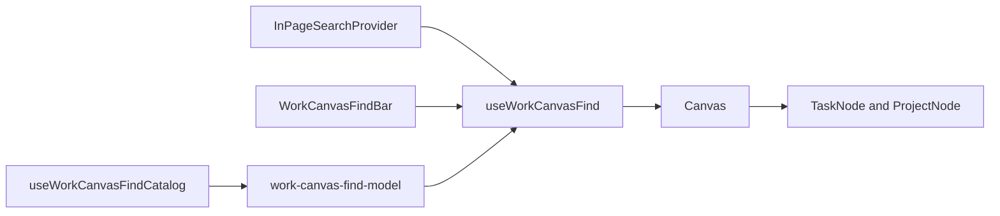

# Work Canvas Native Find Implementation Plan

> **For agentic workers:** REQUIRED SUB-SKILL: Use superpowers:subagent-driven-development
> (recommended) or superpowers:executing-plans to implement this plan task-by-task. Steps use
> checkbox (`- [ ]`) syntax for tracking.

**Goal:** Make Cmd/Ctrl+F find every Task or Project in the current Work Canvas, including
off-screen nodes, while preserving layout, relationships, filters, and selection.

**Architecture:** Each canvas host builds normalized search documents from its complete filtered
node collection and cached organization reference catalogs. A shared controller owns transient
query state, deterministic matching, result navigation, focus restoration, and viewport movement.
The shared canvas layer decorates matching nodes without replacing selection, critical-path,
blocked, or dependency-hover states.

**Tech Stack:** React 19, TypeScript, Next.js App Router, TanStack Query, React Flow, shadcn/ui,
Vitest, Testing Library, Playwright.

---

## Product contract

The implementation must preserve these approved behaviors:

- Cmd+F on macOS and Ctrl+F elsewhere open and select the Work Canvas find field.
- A visible Find command opens the same field on Task graph and Project Dependencies.
- Find searches every node in the current canvas scope after active filters. React Flow viewport
  virtualization does not limit the corpus.
- Task documents contain title, status, priority, assignee, Project, Program, team, milestone,
  cycle, labels, dates, and estimate. Project documents contain name, status, health, priority,
  lead, team, Program, initiatives, labels, and timeframes.
- Every normalized query token must match somewhere in one document. Exact and prefix title
  matches rank before title substrings, which rank before metadata-only matches. Equal scores use
  stable canvas reading order.
- Search never removes nodes, recomputes layout, changes filters, changes the URL, or replaces an
  existing multi-selection.
- Every match receives a semantic highlight. The active match receives the strongest focus ring.
  Nonmatches remain readable and become slightly quieter.
- Enter and the next button move forward. Shift-Enter and the previous button move backward. The
  count reads `3 of 18`, and a polite live region announces the same state.
- A settled non-empty query activates and centers its first match. Typing never selects that node
  or opens its peek.
- Moving to a result pans to its center. The controller preserves the user's zoom when it is at
  least `0.5`; otherwise it raises zoom to `0.5` so the card remains readable.
- Escape closes find, removes temporary decoration, and restores canvas focus. Reopening find on
  the same route restores the last query. A route or structural scope change resets it.
- A composer, dialog, picker, textarea, or rich-text editor prevents a background canvas from
  claiming Cmd/Ctrl+F.
- Optional reference-catalog failures reduce the searchable metadata. They never block title find
  or replace the canvas with an error state.
- Legacy Task graph links with `q` seed the transient find query once and then remove `q` from the
  URL.
- This slice excludes fuzzy matching, saved queries, archived objects, global workspace search,
  and objects outside the active scope or filters.

## Component diagram

This component diagram shows the Web modules and their dependencies. Every node represents one
client-side component or pure client module.



The Task and Project hosts supply documents to the matcher. The controller exposes find state to
the bar and passes match decoration plus the active id into `Canvas`. `Canvas` supplies that state
to both node renderers through one context, so selection and find remain separate state machines.

## File responsibilities

- Create `apps/web/src/components/canvas/work-canvas-find-model.ts` for normalization, document
  construction inputs, ranking, and stable ordering. This file remains pure and browser-free.
- Create `apps/web/src/components/canvas/work-canvas-find-documents.ts` for the Task and Project
  projection adapters. This module resolves ids through a supplied catalog and never fetches.
- Create `apps/web/src/components/canvas/use-work-canvas-find-catalog.ts` for lazily reading cached
  organization reference choices after find opens and converting them to id-to-name maps.
- Create `apps/web/src/components/canvas/use-work-canvas-find.ts` for route-scoped state, shortcut
  registration, match navigation, viewport movement, and focus restoration.
- Create `apps/web/src/components/canvas/work-canvas-find-bar.tsx` for the inset search surface,
  result controls, keyboard handling, live announcements, and responsive treatment.
- Create `apps/web/src/components/canvas/work-canvas-find-context.tsx` for read-only node decoration
  state. It must not own query or selection state.
- Modify `apps/web/src/components/in-page-search/in-page-search-provider.tsx` so background targets
  do not claim Find while a dialog or editable control owns focus.
- Modify `apps/web/src/components/canvas/canvas.tsx`, `task-node.tsx`, and `project-node.tsx` to pass
  and render find decoration independently from existing graph annotations.
- Modify `apps/web/src/components/canvas/canvas-viewport-toolbar.tsx` so both graph types expose the
  same visible Find action beside Fit selection and Re-layout.
- Modify `apps/web/src/components/canvas/graph-view-bar.tsx` to remove the destructive Task Search
  field. Title narrowing remains available through Add filter.
- Modify `apps/web/src/components/canvas/graph-display.ts` and `use-graph-display.ts` to remove live
  search from persistent display state while consuming legacy `q` links once.
- Modify `apps/web/src/components/canvas/task-graph-panel.tsx` to build Task documents, own the
  shared controller, retain all predicate-matching nodes, and render the find bar.
- Modify `apps/web/src/components/canvas/project-graph-panel.tsx` to build Project documents and use
  the same controller and bar.
- Add focused unit and component tests under `apps/web/tests/components/canvas/` and extend
  `apps/web/tests/components/in-page-search/in-page-search-provider.test.tsx`.
- Add `apps/web/e2e/work/work-canvas-find.spec.ts` for the browser interaction across both graph
  types and `docs/design/audits/2026-08-24-work-canvas-find.md` for the responsive theme review.

### Task 1: Pure document normalization and deterministic matching

**Files:**

- Create: `apps/web/src/components/canvas/work-canvas-find-model.ts`
- Create: `apps/web/tests/components/canvas/work-canvas-find-model.test.ts`

- [ ] **Step 1: Write the public model contract and failing tests**

  Pin these public types before production code:

  ```ts
  export interface WorkCanvasFindField {
    readonly key: string;
    readonly label: string;
    readonly values: readonly string[];
  }

  export interface WorkCanvasFindDocument {
    readonly id: string;
    readonly primary: string;
    readonly fields: readonly WorkCanvasFindField[];
    readonly position: { readonly x: number; readonly y: number };
  }

  export interface WorkCanvasFindMatch {
    readonly id: string;
    readonly score: number;
  }

  export function normalizeWorkCanvasFindText(value: string): string;

  export function matchWorkCanvasDocuments(
    documents: readonly WorkCanvasFindDocument[],
    query: string,
    direction: 'LR' | 'TB',
  ): readonly WorkCanvasFindMatch[];
  ```

  Cover case and accent folding, collapsed punctuation and whitespace, all-token matching across
  separate fields, exact title, title prefix, title substring, metadata-only ranking, empty-query
  identity, and stable spatial ties. `LR` ties sort by `x` then `y`; `TB` ties sort by `y` then `x`;
  both finish with `id` so coincident nodes remain deterministic.

- [ ] **Step 2: Run the model test and verify RED**

  Run:

  ```bash
  pnpm --filter @docket/web exec vitest run \
    tests/components/canvas/work-canvas-find-model.test.ts
  ```

  Expect failure because the model module does not exist.

- [ ] **Step 3: Implement normalization and matching**

  Use Unicode decomposition rather than locale-specific lowercasing:

  ```ts
  const COMBINING_MARK = /\p{Mark}/gu;
  const SEPARATOR = /[^\p{Letter}\p{Number}]+/gu;

  export function normalizeWorkCanvasFindText(value: string): string {
    return value
      .normalize('NFKD')
      .replace(COMBINING_MARK, '')
      .toLocaleLowerCase()
      .replace(SEPARATOR, ' ')
      .trim()
      .replace(/\s+/g, ' ');
  }
  ```

  Precompute one normalized primary string and normalized field strings per document within the
  matching call. Score exact primary as `0`, primary prefix as `1`, primary substring as `2`, and
  metadata-only matches as `3`. Reject a document unless every normalized query token occurs in
  either its primary text or one metadata value.

- [ ] **Step 4: Add the large-corpus performance regression**

  Generate deterministic documents with one title and twelve metadata values. Warm the matcher
  once, run five samples, and assert the median stays below 16 milliseconds for 363 documents and
  below 50 milliseconds for 5,000 documents. Keep fixture generation outside the timed region.

- [ ] **Step 5: Run the model suite and verify GREEN**

  Run the command from Step 2. Expect all normalization, ordering, and performance cases to pass.

### Task 2: Shared controller, focus ownership, and accessible find bar

**Files:**

- Create: `apps/web/src/components/canvas/use-work-canvas-find.ts`
- Create: `apps/web/src/components/canvas/work-canvas-find-bar.tsx`
- Create: `apps/web/tests/components/canvas/use-work-canvas-find.test.tsx`
- Create: `apps/web/tests/components/canvas/work-canvas-find-bar.test.tsx`
- Modify: `apps/web/src/components/in-page-search/in-page-search-provider.tsx`
- Modify: `apps/web/tests/components/in-page-search/in-page-search-provider.test.tsx`

- [ ] **Step 1: Write failing controller tests**

  Pin this host-facing interface:

  ```ts
  export interface WorkCanvasViewport {
    readonly getZoom: () => number;
    readonly centerNode: (id: string, zoom: number) => Promise<void> | void;
  }

  export interface UseWorkCanvasFindOptions {
    readonly scopeKey: string;
    readonly rootRef: React.RefObject<HTMLElement | null>;
    readonly documents: readonly WorkCanvasFindDocument[];
    readonly direction: 'LR' | 'TB';
    readonly viewport: WorkCanvasViewport | null;
    readonly initialQuery?: string;
    readonly onInitialQueryConsumed?: () => void;
  }
  ```

  The returned value must include `open`, `query`, `inputRef`, `matches`, `activeIndex`,
  `activeId`, `matchIds`, `openFind`, `closeFind`, `setQuery`, `next`, and `previous`. Tests must
  prove query retention within one `scopeKey`, reset after a scope change, active-id retention
  after documents refresh, wraparound navigation, empty-result safety, a minimum `0.5` navigation
  zoom, preservation of a larger zoom, first-match centering after a settled query, and exactly-once
  legacy-query consumption.

- [ ] **Step 2: Write failing background-focus tests in the application Find router**

  Add cases that focus a textarea, contenteditable editor, text input, listbox search field, and an
  element within `role="dialog"`. Cmd/Ctrl+F must remain unclaimed when the registered target is a
  background sibling. Keep the existing deepest-target behavior when the focused dialog registers
  its own in-page target.

- [ ] **Step 3: Run controller and provider tests and verify RED**

  Run:

  ```bash
  pnpm --filter @docket/web exec vitest run \
    tests/components/canvas/use-work-canvas-find.test.tsx \
    tests/components/in-page-search/in-page-search-provider.test.tsx
  ```

  Expect the controller import to fail and the new background-focus cases to show the canvas target
  claiming the command.

- [ ] **Step 4: Implement route-scoped controller state**

  Register the controller with `useInPageSearchTarget`. Keep the query in component state rather
  than URL state. Recompute matches with `useDeferredValue(query)`. Keep the active id when it
  survives recomputation; otherwise choose the first match. `next()` and `previous()` wrap and call
  the viewport with `Math.max(0.5, viewport.getZoom())`.

- [ ] **Step 5: Protect foreground editors in the Find router**

  Add one pure predicate to the provider:

  ```ts
  function ownsNativeFind(element: Element | null): boolean {
    if (!(element instanceof HTMLElement)) return false;
    if (element.closest('[role="dialog"], [role="alertdialog"]')) return true;
    if (element instanceof HTMLTextAreaElement || element.isContentEditable) return true;
    return element instanceof HTMLInputElement && element.type !== 'button';
  }
  ```

  Apply the predicate only when no enabled registered target contains the focused element or owns
  that exact input. This keeps a dialog-specific registered target ahead of browser fallback.

- [ ] **Step 6: Write failing find-bar interaction tests**

  Require `role="search"`, a textbox named `Find in Work Canvas`, `Previous match`, `Next match`,
  and `Close find` buttons, plus a polite live region. Prove Enter, Shift-Enter, button navigation,
  Escape, the `3 of 18` count, `No matches`, metadata-loading busy state, input selection on repeated
  open, and a single non-wrapping row at a simulated 320-pixel container width.

- [ ] **Step 7: Implement the inset find bar**

  Render the bar as a tonal raised surface with a minimum 40-pixel touch height. Keep the input
  flexible, the count fixed, and controls non-wrapping. Use application-owned labels. Do not render
  raw reference-query errors.

- [ ] **Step 8: Run the controller, bar, and provider suites and verify GREEN**

  Run all four test files from this task. Expect them to pass without React `act` warnings.

### Task 3: Independent node decoration and viewport movement

**Files:**

- Create: `apps/web/src/components/canvas/work-canvas-find-context.tsx`
- Create: `apps/web/tests/components/canvas/work-canvas-find-context.test.tsx`
- Modify: `apps/web/src/components/canvas/canvas.tsx`
- Modify: `apps/web/src/components/canvas/canvas-viewport-toolbar.tsx`
- Modify: `apps/web/src/components/canvas/task-node.tsx`
- Modify: `apps/web/src/components/canvas/project-node.tsx`
- Modify: `apps/web/tests/components/canvas/project-node-accessibility.test.tsx`
- Create: `apps/web/tests/components/canvas/task-node-find-state.test.tsx`
- Create: `apps/web/tests/components/canvas/canvas-find-viewport.test.tsx`
- Modify: `apps/web/tests/components/canvas/canvas-viewport-toolbar.test.tsx`

- [ ] **Step 1: Write failing decoration-state tests**

  Pin the context value:

  ```ts
  export type WorkCanvasFindNodeState = 'inactive' | 'match' | 'active' | 'quiet';

  export interface WorkCanvasFindDecoration {
    readonly open: boolean;
    readonly matchIds: ReadonlySet<string>;
    readonly activeId: string | null;
  }

  export function useWorkCanvasFindNodeState(id: string): WorkCanvasFindNodeState;
  ```

  Prove a closed or empty-query controller yields `inactive`, the active id yields `active`, other
  matches yield `match`, and nonmatches yield `quiet` only while a non-empty result set exists.

- [ ] **Step 2: Write failing node coexistence tests**

  Render selected and unselected Task and Project nodes under the decoration provider. Assert that
  `aria-selected` and the existing selected style remain intact. Assert `data-find-state` exposes
  the temporary state for visual tests without adding another interactive role or tab stop.

- [ ] **Step 3: Write the off-screen viewport test**

  Mount a React Flow test harness with `onlyRenderVisibleElements`, supply a document whose node is
  initially outside the viewport, navigate to that result, and assert the viewport callback uses
  its id and causes the node to mount. The input must keep focus after movement.

- [ ] **Step 4: Run the decoration and viewport tests and verify RED**

  Run:

  ```bash
  pnpm --filter @docket/web exec vitest run \
    tests/components/canvas/work-canvas-find-context.test.tsx \
    tests/components/canvas/task-node-find-state.test.tsx \
    tests/components/canvas/project-node-accessibility.test.tsx \
    tests/components/canvas/canvas-find-viewport.test.tsx
  ```

- [ ] **Step 5: Implement context and semantic node styles**

  Wrap `ReactFlow` in the decoration provider. Add `findDecoration` to `CanvasProps` without
  changing `nodes` or `edges`. Task and Project node surfaces must render these state layers:
  - `match` adds a semantic primary outline and keeps normal opacity.
  - `active` adds a two-step primary focus ring that remains distinct from selection.
  - `quiet` reduces opacity no lower than `0.62` and keeps labels readable in both themes.
  - `inactive` adds no class and preserves current rendering byte-for-byte.

  Do not reuse critical-path or hover highlight ids. Those states may coexist with find.

- [ ] **Step 6: Add a viewport adapter to Canvas**

  Expose the current zoom and a `centerNode` callback after React Flow initializes. Resolve node
  bounds from the React Flow store and call `setCenter` with a 250-millisecond duration. Do not call
  `fitView` because it can rewrite the user's zoom and include unrelated selected nodes.

  Add `onOpenFind` to `CanvasProps` and pass it into `CanvasViewportToolbar`. The toolbar must show
  one Find action for both graph types. At narrow widths, collapse the visible text while retaining
  `aria-label="Find in Work Canvas"`; do not let the control row wrap.

- [ ] **Step 7: Run the decoration and viewport suites and verify GREEN**

  Run the command from Step 4 and the existing viewport-toolbar, graph-highlight, selection, and
  node-accessibility tests. Expect all suites to pass.

- [ ] **Step 8: Commit the shared Work Canvas find foundation**

  Stage only the files from Tasks 1–3 and commit with a message file:

  ```bash
  git commit -F - <<'EOF'
  feat(web): Add native find behavior to Work Canvas

  Browser Find can only inspect mounted React Flow nodes, so large canvases hide off-screen work
  from Cmd+F. Work Canvas now owns a complete resident index, deterministic result navigation, an
  accessible find bar, and viewport-aware node decoration without replacing graph selection or
  layout state.

  The matcher stays pure and the canvas receives only decoration state. This keeps Task and Project
  document construction outside the shared rendering boundary and allows both graph types to use
  the same interaction without sharing their domain projections.
  EOF
  ```

### Task 4: Task graph integration and legacy URL migration

**Files:**

- Create: `apps/web/src/components/canvas/use-work-canvas-find-catalog.ts`
- Create: `apps/web/src/components/canvas/work-canvas-find-documents.ts`
- Create: `apps/web/tests/components/canvas/use-work-canvas-find-catalog.test.tsx`
- Create: `apps/web/tests/components/canvas/work-canvas-find-documents.test.ts`
- Modify: `apps/web/src/components/canvas/graph-display.ts`
- Modify: `apps/web/src/components/canvas/use-graph-display.ts`
- Modify: `apps/web/src/components/canvas/graph-view-bar.tsx`
- Modify: `apps/web/src/components/canvas/task-graph-panel.tsx`
- Modify: `apps/web/tests/components/canvas/task-graph-focused-minimap.test.tsx`
- Create: `apps/web/tests/components/canvas/task-graph-find.test.tsx`
- Create: `apps/web/tests/components/canvas/graph-display-find-migration.test.ts`

- [ ] **Step 1: Write failing Task document tests**

  Build two Tasks with the same title but different status, priority, assignee, Project, Program,
  team, milestone, cycle, labels, dates, and estimate. Prove each resolved user-facing value finds
  only the intended Task. Prove unresolved catalogs retain title, raw status, priority, dates, and
  estimate instead of producing an empty document.

  Pin the shared catalog and adapter interfaces:

  ```ts
  export interface WorkCanvasFindCatalog {
    readonly actorNames: ReadonlyMap<string, string>;
    readonly projectNames: ReadonlyMap<string, string>;
    readonly programNames: ReadonlyMap<string, string>;
    readonly initiativeNames: ReadonlyMap<string, string>;
    readonly labelNames: ReadonlyMap<string, string>;
    readonly teamNames: ReadonlyMap<string, string>;
    readonly milestoneNames: ReadonlyMap<string, string>;
    readonly cycleNames: ReadonlyMap<string, string>;
  }

  export function buildTaskFindDocuments(
    nodes: readonly Node[],
    catalog: WorkCanvasFindCatalog,
  ): readonly WorkCanvasFindDocument[];

  export function buildProjectFindDocuments(
    rows: readonly ProjectOverviewItem[],
    positions: ReadonlyMap<string, { readonly x: number; readonly y: number }>,
    catalog: WorkCanvasFindCatalog,
  ): readonly WorkCanvasFindDocument[];
  ```

- [ ] **Step 2: Write failing graph-behavior tests**

  Prove typing in find leaves the node and edge arrays unchanged, Enter calls `centerNode`, active
  filters define the corpus, hierarchy ancestors retained for context remain findable, and existing
  multi-selection survives result navigation. Prove the visible toolbar command opens the same bar
  as Cmd/Ctrl+F.

- [ ] **Step 3: Write failing legacy `q` migration tests**

  Parse `/graph?q=urgent&dir=TB`. Require `display` to retain `direction: 'TB'` without a `search`
  property, expose `urgent` as the one-time initial find query, and replace the URL without `q`
  after the controller consumes it. Preserve unrelated filter and scope parameters.

- [ ] **Step 4: Run Task integration tests and verify RED**

  Run:

  ```bash
  pnpm --filter @docket/web exec vitest run \
    tests/components/canvas/use-work-canvas-find-catalog.test.tsx \
    tests/components/canvas/work-canvas-find-documents.test.ts \
    tests/components/canvas/task-graph-find.test.tsx \
    tests/components/canvas/graph-display-find-migration.test.ts
  ```

- [ ] **Step 5: Implement lazy metadata catalogs**

  Read actors, Programs, labels, cycles, milestones, and teams through the existing typed query
  layer only while find is open. Reuse standard query keys and static stale times so Task graph
  queries already in cache do not refetch. Return maps plus `pending`; convert failed optional
  sources to empty maps without rendering their error text.

  Export this hook boundary:

  ```ts
  export interface WorkCanvasFindCatalogResult {
    readonly catalog: WorkCanvasFindCatalog;
    readonly pending: boolean;
  }

  export function useWorkCanvasFindCatalog(
    organizationId: string,
    enabled: boolean,
  ): WorkCanvasFindCatalogResult;
  ```

- [ ] **Step 6: Replace destructive Task title search with native find**

  Remove `display.search` from the filtering pipeline. Keep the Title field in `GraphCatalog`, so
  users can still narrow the graph through Add filter → Title. Remove the toolbar Search input,
  connect the shared viewport toolbar's Find action to the controller, render
  `WorkCanvasFindBar` inside the canvas, and pass controller decoration to `Canvas`.

- [ ] **Step 7: Implement legacy URL consumption**

  Keep `q` in the codec-owned key list so every subsequent display write strips it. Expose a
  `legacyFindQuery` and `consumeLegacyFindQuery()` from `useGraphDisplay`; the full graph host passes
  them into the controller. Embedded graphs have no legacy query.

- [ ] **Step 8: Run Task integration and existing graph suites and verify GREEN**

  Run the Task integration files plus graph display, hierarchy layout, canvas selection, graph
  layout lifecycle, and focused minimap tests. Expect the current CRUD and selection behaviors to
  remain green.

- [ ] **Step 9: Commit Task graph find**

  ```bash
  git commit -F - <<'EOF'
  feat(web): Make Task graph find preserve context

  The Task graph's old Search field removed every nonmatching node and changed the spatial context
  users were trying to inspect. The visible Find command and Cmd/Ctrl+F now search every Task in the
  filtered canvas, including off-screen nodes, and move through results without changing layout,
  relationships, or selection.

  Existing q links seed the transient find query once and then shed the obsolete URL parameter.
  Title filtering remains available through the shared filter catalog.
  EOF
  ```

### Task 5: Project Dependencies integration

**Files:**

- Modify: `apps/web/src/components/canvas/project-graph-panel.tsx`
- Modify: `apps/web/src/components/canvas/project-node.tsx`
- Modify: `apps/web/tests/components/canvas/project-graph-creation-continuity.test.tsx`
- Create: `apps/web/tests/components/canvas/project-graph-find.test.tsx`

- [ ] **Step 1: Write failing Project document tests**

  Build Projects that differ by status, health, priority, lead, team, Program, initiatives, labels,
  start timeframe, and target timeframe. Prove names resolved through the lazy catalog are
  searchable and title/name matches outrank metadata matches. Prove a failed optional catalog still
  permits name, status, health, priority, and timeframe find.

- [ ] **Step 2: Write failing Project interaction tests**

  Prove the visible Find command and Cmd/Ctrl+F open the shared bar, off-screen Project navigation
  centers the correct id, multi-selection remains intact, the selected Project peek remains open,
  and dependency edges and positioned nodes remain referentially unchanged while the query changes.

- [ ] **Step 3: Run Project tests and verify RED**

  Run:

  ```bash
  pnpm --filter @docket/web exec vitest run \
    tests/components/canvas/project-graph-find.test.tsx \
    tests/components/canvas/project-graph-creation-continuity.test.tsx
  ```

- [ ] **Step 4: Integrate the shared controller**

  Build Project documents from the overview rows and positioned node coordinates. Use the same lazy
  catalog, bar, keyboard registration, decoration, match ordering, and viewport adapter as Task
  graph. Do not add Project-specific find controls or matching rules outside its document builder.

- [ ] **Step 5: Run Project and shared canvas suites and verify GREEN**

  Run the command from Step 3 plus Project layout, Project node accessibility, canvas menus, canvas
  selection bridge, bulk properties, trash, undo, and viewport toolbar tests.

- [ ] **Step 6: Commit Project Dependencies find**

  ```bash
  git commit -F - <<'EOF'
  feat(projects): Add native find to Project dependencies

  Project Dependencies had no canvas-owned search, so Cmd/Ctrl+F could inspect only the Project
  cards React Flow happened to mount in the viewport. It now uses the same Work Canvas find
  controller as Task graph and searches names plus structured Project metadata without moving or
  filtering the dependency graph.

  Optional reference catalogs enrich Program, initiative, label, team, and lead matching after the
  bar opens. A catalog failure leaves name and built-in property matching available.
  EOF
  ```

### Task 6: Browser journeys, responsive review, and release gates

**Files:**

- Create: `apps/web/e2e/work/work-canvas-find.spec.ts`
- Create: `docs/design/audits/2026-08-24-work-canvas-find.md`
- Modify: `docs/WORKLOG.md`

- [ ] **Step 1: Add the browser journey**

  Use the authenticated Playwright fixture. Cover Task graph and Project Dependencies with these
  assertions:
  1. Cmd/Ctrl+F opens `Find in Work Canvas` and suppresses browser Find.
  2. A title query finds an off-screen node and Enter pans it into the viewport.
  3. A metadata-only query finds the intended object.
  4. Shift-Enter moves backward and result navigation wraps.
  5. Multi-selection and an open peek survive navigation.
  6. No-result and optional-catalog-failure states leave the graph usable.
  7. Escape closes the bar and returns focus to the canvas.
  8. A composer input keeps the shortcut and does not open background find.

- [ ] **Step 2: Run the targeted Playwright journey**

  Run:

  ```bash
  pnpm --filter @docket/web exec playwright test \
    e2e/work/work-canvas-find.spec.ts --workers=2
  ```

  Expect both graph journeys to pass without page errors, failed critical responses, or console
  warnings owned by Work Canvas.

- [ ] **Step 3: Run the responsive visual review**

  Capture both graph types at 1440×900, 1024×768, 390×844, and 320×720 in light and dark themes.
  Review closed, query, active-match, no-results, selection-plus-find, and open-peek states. Record
  exact screenshots, contrast results, overflow measurements, and any deviations in the design
  audit. The bar must remain within the canvas, controls must not wrap, and active versus selected
  states must remain distinguishable.

- [ ] **Step 4: Run focused Web validation**

  Run:

  ```bash
  pnpm --filter @docket/web exec vitest run \
    tests/components/in-page-search/in-page-search-provider.test.tsx \
    tests/components/canvas/work-canvas-find-model.test.ts \
    tests/components/canvas/use-work-canvas-find.test.tsx \
    tests/components/canvas/work-canvas-find-bar.test.tsx \
    tests/components/canvas/work-canvas-find-context.test.tsx \
    tests/components/canvas/canvas-find-viewport.test.tsx \
    tests/components/canvas/task-graph-find.test.tsx \
    tests/components/canvas/project-graph-find.test.tsx
  pnpm --filter @docket/web typecheck
  pnpm --filter @docket/web lint
  ```

  Expect zero failures and zero new warnings.

- [ ] **Step 5: Review the complete feature diff**

  Check every product-contract bullet at the top of this plan against a named test or live capture.
  Inspect node styling in both themes. Confirm no API route, database schema, object-command
  contract, or permanent search index changed. Run `git diff --check` and confirm the branch adds no
  merge commits.

- [ ] **Step 6: Run repository gates within machine limits**

  Run `~/.claude/resource-limits/agentctl status` before the large commands. If the command remains
  unavailable, record that fact and continue with bounded processes. Then run:

  ```bash
  pnpm format:check
  pnpm secret-scan
  pnpm exec turbo run typecheck --concurrency=2
  pnpm exec turbo run lint --concurrency=2
  pnpm test:tooling
  pnpm exec turbo run test:coverage --concurrency=2
  NODE_OPTIONS=--max-old-space-size=4096 pnpm exec turbo run build --concurrency=2
  ```

  Expect every command to exit zero. Do not rerun an exit 137 unchanged; reduce the package scope
  or worker count first.

- [ ] **Step 7: Complete the work record and commit review evidence**

  Move `[WORK-CANVAS-FIND-001]` to completed only after every required gate passes. Record exact
  test counts, performance medians, screenshot paths, review findings, and remaining exclusions.
  Commit the E2E journey, visual audit, and completed work record with the product slice that they
  verify. Use `git commit -F -`; do not create a documentation-only completion commit before its
  evidence exists.

## Completion evidence

The implementation is complete only when all of these statements have direct evidence:

- Both graph types claim Cmd/Ctrl+F only when Work Canvas owns the interaction.
- Search finds a node outside React Flow's mounted viewport.
- Title and every listed metadata category have a passing match case.
- Query changes preserve node count, edge count, positions, filters, selection, and peek state.
- Match navigation remains readable at low zoom and preserves zoom at or above `0.5`.
- Match, active match, selection, critical path, blocked, and hover states remain distinguishable.
- The 363-node and 5,000-node performance budgets pass.
- The bar passes keyboard, screen-reader, 320-pixel, and both-theme checks.
- Legacy `q` links migrate without losing unrelated URL state.
- Focused tests, Playwright, typecheck, lint, coverage, build, policy, format, and secret gates pass.
- A final code review reports no unresolved Critical or Important findings.
