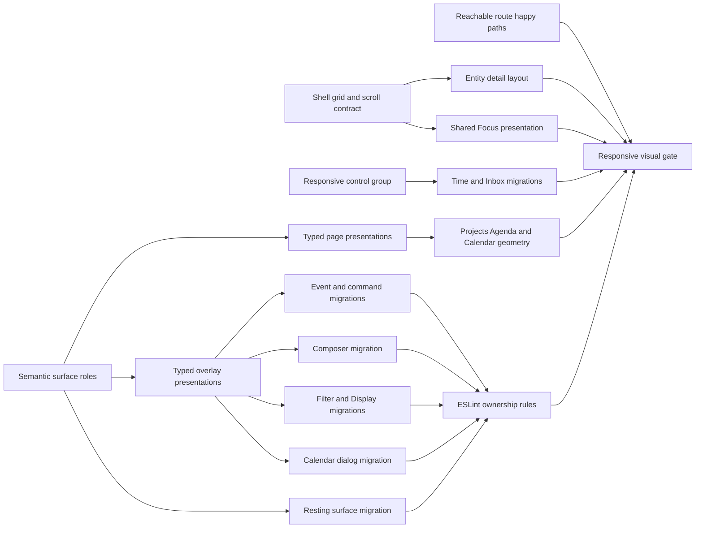

# Mobile Layout and Overlay Remediation Implementation Plan

> **For agentic workers:** REQUIRED SUB-SKILL: Use superpowers:subagent-driven-development
> (recommended) or superpowers:executing-plans to implement this plan task-by-task. Steps use
> checkbox (`- [ ]`) syntax for tracking.

**Goal:** Remove every responsive, spacing, scroll, overlay, and semantic-surface defect recorded
in the 2026-08-28 audit, then make the shared primitives and lint configuration reject the same
classes of defect before they reach review.

**Architecture:** The app will use one shell scroll contract, one semantic tonal role map, and typed
Dialog, Sheet, Popover, menu, banner, page, and responsive-toolbar presentations. Product code will
compose those APIs instead of rebuilding overlay geometry or applying raw resting surface tones.
ESLint will enforce ownership boundaries after every current call site has migrated. Vitest will
test component behavior, Playwright will measure rendered geometry and interaction, and ESLint
RuleTester will test source policy.

**Tech Stack:** Next.js App Router, React 19, TypeScript, Tailwind CSS 4, Radix UI, TanStack Query,
ESLint 9 flat config, Vitest, Testing Library, and Playwright.

**Spec:**
[`docs/design/audits/2026-08-28-mobile-layout-and-overlay-consistency.md`](../../design/audits/2026-08-28-mobile-layout-and-overlay-consistency.md)

## Global Constraints

- Treat 320 pixels as the minimum supported app width. No route, dialog, menu, popover, sheet,
  toolbar, form, or banner may increase the document width beyond the viewport.
- Keep one visible page scroll axis. A detail route or full-page workspace may own vertical scroll
  when the shell main region is locked. A floating surface may give one named body region vertical
  scroll. No parent and child may both own the same scroll axis.
- Keep controls on one line. Preserve the current or selected value and the highest-priority action
  inline. Put lower-priority controls in one named overflow menu. Do not use a horizontal scroller
  to hide controls.
- Use the shared semantic surface and overlay APIs for resting regions. Product code may use state
  layer utilities for hover, focus, selection, and pressed feedback. Product code may not choose a
  raw tonal step for a dialog, sheet, popover, menu, banner, card, app bar, page, or canvas frame.
- Let shared overlay presentations own position, viewport inset, surface tone, shape, elevation,
  scrim, layer, and overflow. A caller may select typed variants and pass content. A caller may not
  replace those visual contracts through `className`.
- Preserve Radix focus trapping, Escape dismissal, outside dismissal where appropriate, scroll
  lock, accessible names, and opener focus restoration.
- Product tests must exercise rendered behavior. They may not read source or CSS files and assert
  class strings. ESLint RuleTester may inspect AST behavior because the lint rules are the product
  under test.
- Use isolated local fixtures. Do not create demo or audit data in production. Do not start billing
  or a paid trial.
- Bound Vitest and Playwright to one worker for focused checks. Run full graph commands with at most
  two workers or tasks. Run `~/.claude/resource-limits/agentctl status` before a production build or
  full repository suite.
- Update `docs/WORKLOG.md` in every implementation commit. Use only scopes declared in
  `COMMIT_SCOPES.txt`. Create commits with `git commit -F`, a body longer than 100 characters, and
  the required Codex co-author trailer.
- Do not push, deploy, merge, or mutate production as part of this plan unless the user grants that
  authority in the execution turn.

## Acceptance Mapping

Every audit finding has one owning task and one rendered acceptance gate.

| Audit finding                                                     | Owning task | Required proof                                                                                                      |
| ----------------------------------------------------------------- | ----------: | ------------------------------------------------------------------------------------------------------------------- |
| Shell rail starts 40 pixels above the main surface                |           1 | Rail and main top and bottom edges differ by at most 1 pixel with and without tabs.                                 |
| Detail pages create an internal scrollbar without content         |           2 | Short details cannot scroll. Long details have exactly one scroll owner.                                            |
| Detail actions align to a synthetic padded title box              |           2 | Glyph, actions, and compact title align within 1 pixel at all tested widths.                                        |
| Floating surfaces use contradictory tonal roles                   |    3 and 14 | The role matrix is encoded in `Surface`; no raw resting surface violations remain.                                  |
| Menus can exceed a 320-pixel viewport                             |           4 | Every menu width computes to at most `viewport - 24px`.                                                             |
| Overlay primitives allow duplicate padding and arbitrary geometry |           4 | Typed presentations own geometry and expose one body scroll region.                                                 |
| EventDrawer and CommandPalette rebuild modal infrastructure       |           5 | Both inherit focus, dismissal, scrim, surface, layer, and mobile behavior from shared primitives.                   |
| Initiative composer loses width and scrolls horizontally          |           6 | One inset axis remains; 320-pixel content and controls do not overflow or wrap.                                     |
| Filter hides 241 pixels on a short viewport                       |           7 | Search and terminal action stay fixed; one body region scrolls to every option.                                     |
| Display is a 1,098-pixel form inside a 400-pixel popover          |           7 | Layout stays immediate; Organize and Properties open owned subpanels.                                               |
| Calendar Create overrides the whole dialog contract               |           8 | It selects the shared bottom-sheet or centered presentation without geometry classes.                               |
| Mobile and standalone Focus use a separate visual system          |           9 | Main app and Focus share top bar, canvas, density, inset, and control sizing.                                       |
| Mobile Focus can create nested scroll owners                      |           9 | The shell host is overflow-hidden and the Focus body is the sole owner.                                             |
| Time clips range and filter controls                              |          10 | Current range and primary action stay inline; all other actions remain available in overflow.                       |
| Inbox cuts the Announcements label in a horizontal scroller       |          10 | Selected feed stays inline and every hidden feed remains available by name.                                         |
| Projects canvas keeps gutters and over-cancels margins            |          11 | Canvas presentation reaches its frame at every width without negative margin repair.                                |
| Agenda retains an extra 12-pixel schedule gutter                  |          11 | Timed grid edge and rail frame differ by at most 1 pixel.                                                           |
| Calendar exposes horizontal scrollbar chrome                      |          11 | Schedule panning works without document overflow or visible secondary scrollbar chrome.                             |
| Four server pages call the client query helper                    |          12 | Production build and seeded list/detail navigation render happy paths without the RSC error.                        |
| Recovery banner clips through nested and negative insets          |          13 | Low-code fixture shows an unclipped banner with one internal axis at 320 and 390 pixels.                            |
| Bespoke overlays and raw surfaces can be added again              |          15 | Repository lint rejects direct Radix imports, bespoke modal shells, overlay style overrides, and raw resting tones. |
| The audit lacks a complete final 320-pixel batch                  |          16 | The final manifest produces `caseCount × 8` records, with 696 as the floor.                                         |

## Component Dependency Diagram

This component diagram shows the implementation dependencies. Each node names a component or
policy layer at the same abstraction level.



The implementation has four dependency waves. Wave one establishes shell, detail, and semantic
contracts. Wave two builds typed primitives and migrates high-risk overlays. Wave three repairs
route presentations and migrates resting surfaces. Wave four turns on enforcement and reruns the
complete visual audit. Each task names one or more atomic commits. No commit may leave type, lint,
or focused behavior checks broken.

The authoritative execution order is Task 12 Steps 1–4, Task 12 Steps 5–8, Task 1, Task 2, Task 3,
Task 4, Tasks 5–8 in order, Task 9, Task 10, Task 11, Task 13, Task 14, Task 15, and Task 16. The
runtime and local-fixture slices run first because an error screen cannot validate a layout. The
numbering keeps related audit findings together; it does not override this dependency order.

---

### Task 1: Align the shell rail with the route surface

**Files:**

- Create: `packages/ui/src/components/shell/ShellRailDock.tsx`
- Modify: `packages/ui/src/components/shell/AppShell.tsx`
- Modify: `packages/ui/src/components/shell/TabBar.tsx`
- Modify: `packages/ui/src/components/index.ts`
- Modify: `apps/web/src/components/app-shell-frame.tsx`
- Modify: `packages/ui/tests/components/shell/shell-full.test.tsx`
- Delete: `packages/ui/tests/components/shell/shell-layout-contract.test.tsx`
- Create: `apps/web/e2e/work/shell-rail-alignment.spec.ts`
- Modify: `docs/WORKLOG.md`

**Interfaces:**

- Consumes: `RailPanel`, `ShellAside`, `ShellActivityBar`, the optional `TabBar`, and the current
  desktop width and collapse state.
- Produces: one desktop rail dock whose content region shares the route surface's top and bottom
  edges.

- [ ] **Step 1: Add failing rendered shell geometry coverage**

  Create a browser fixture with tabs and a fixture without tabs. At 1024 by 900 and 1440 by 900,
  measure the route `<main>`, `ShellAside`, and `ShellActivityBar`. Require top and bottom deltas no
  greater than 1 pixel. Require the tab row to measure 40 pixels, plus or minus 1 pixel. Preserve
  the existing 40 percent, 416-pixel, and monotonic content-width guarantees through 3840 pixels.

- [ ] **Step 2: Run the browser test and record the red state**

  ```bash
  pnpm --filter @docket/web exec playwright test \
    e2e/work/shell-rail-alignment.spec.ts --workers=1
  ```

  Expected result: the fixture with tabs reports a 40-pixel top-edge mismatch.

- [ ] **Step 3: Implement one shared rail dock**

  Export the tab block size from `TabBar.tsx` and use the same value for the visible tab row and
  rail spacer:

  ```tsx
  export const TAB_BAR_BLOCK_SIZE_CLASS = 'h-10';

  export interface ShellRailDockProps {
    readonly panel: RailPanel;
    readonly panels: readonly RailPanel[];
    readonly activeId: string;
    readonly collapsed: boolean;
    readonly tabBarPresent: boolean;
    readonly onIconClick: (id: string) => void;
  }
  ```

  `ShellRailDock` must render the spacer only when a real tab row exists. It must keep
  `ShellAside` and `ShellActivityBar` inside the remaining height. `AppShellFrame` must pass `null`
  when `tabs.length === 0`; a React element that later returns `null` must not create a spacer.

- [ ] **Step 4: Replace source-contract coverage**

  Move interaction assertions that still matter into `shell-full.test.tsx`. Delete
  `shell-layout-contract.test.tsx` after the Playwright test measures the rendered contract. Do not
  replace it with another source reader.

- [ ] **Step 5: Run focused verification**

  ```bash
  pnpm --filter @docket/ui exec vitest run \
    tests/components/shell/shell-full.test.tsx --maxWorkers=1
  pnpm --filter @docket/ui typecheck
  pnpm --filter @docket/web exec playwright test \
    e2e/work/shell-rail-alignment.spec.ts --workers=1
  ```

  Expected result: the tests pass with and without tabs. Existing desktop collapse behavior stays
  unchanged.

- [ ] **Step 6: Commit the shell correction**

  Use `fix(ui): Align utility panels with the page surface`. The body must explain why a sibling
  rail ignored the tab row and why one shared block-size constant prevents the offset from
  returning.

---

### Task 2: Remove manufactured detail scrolling and align the masthead

**Files:**

- Modify: `apps/web/src/components/views/entity-detail-layout.tsx`
- Modify: `apps/web/src/components/views/entity-detail-collapse.ts`
- Modify: `apps/web/src/app/(app)/orgs/[orgId]/teams/[teamId]/team-detail-client.tsx`
- Modify: `packages/ui/src/styles/globals.css`
- Modify: `apps/web/tests/components/entity-detail-layout.test.tsx`
- Delete: `apps/web/tests/components/entity-detail-collapse-contract.test.ts`
- Modify: `apps/web/e2e/work/project-detail-header-evidence.spec.ts`
- Create: `apps/web/e2e/work/entity-detail-scroll-ownership.spec.ts`
- Modify: `docs/WORKLOG.md`

**Interfaces:**

- Consumes: real route content height, `useOwnPageScroll`, collapse progress, and the existing
  sticky masthead.
- Produces: a masthead with explicit identity and action rows, no fake height, and one route
  scroller only when content needs it.

- [ ] **Step 1: Write failing browser behavior for short and long details**

  Add isolated short Project and Team fixtures plus a long Project fixture. Assert the following
  behavior at 1440, 760, 480, and 390 pixels:

  ```ts
  expect(shortDetail.scrollHeight).toBeLessThanOrEqual(shortDetail.clientHeight + 1);
  expect(await assignAndReadScrollTop(shortDetail, 40)).toBe(0);
  expect(await scrollingAncestors(shortDetail)).toEqual([]);
  expect(await scrollOwners(longDetail)).toEqual(['entity-detail']);
  ```

  In the expanded state, require the action top and identity-glyph top to differ by no more than
  1 pixel. Force a two-line title and require the action top to stay fixed. In the compact state,
  require glyph, title, and actions to align within 1 pixel and never overlap.

- [ ] **Step 2: Run the tests and record both red failures**

  ```bash
  pnpm --filter @docket/web exec playwright test \
    e2e/work/project-detail-header-evidence.spec.ts \
    e2e/work/entity-detail-scroll-ownership.spec.ts \
    --workers=1
  ```

  Expected result: the short fixture reports overflow, and the expanded action lane reports a
  vertical mismatch.

- [ ] **Step 3: Replace the padded title illusion with explicit grid rows**

  Give `.detail-primary` named grid rows for identity, title, metadata, and content. Place
  `.detail-actions` in the identity row and align it to the start. Remove the 3.75rem title padding
  as a row substitute. Do not change `PublishAction` or `ControlGroup` sizes because those controls
  already use the correct size.

- [ ] **Step 4: Remove the fake content height**

  Remove `.detail-body`'s `min-block-size` formula and Team's duplicate calculated minimum-height
  class.
  Change `[data-detail-cover]` from `container-type: size` to `container-type: inline-size`. Keep
  `overflow-y-auto` on the detail root so long pages still scroll. Replace `pb-24` with:

  ```tsx
  'pb-[max(1rem,env(safe-area-inset-bottom))] lg:pb-6';
  ```

  The collapse animation must read real `scrollTop`. A short route must stay at its expanded
  endpoint because it has no scroll range.

- [ ] **Step 5: Delete the CSS source assertions and preserve pure math coverage**

  Delete `entity-detail-collapse-contract.test.ts`. Keep
  `entity-detail-collapse-progress.test.ts` because it tests the public progress calculation rather
  than a CSS spelling. Add component assertions for landmarks, labels, and action placement to
  `entity-detail-layout.test.tsx`.

- [ ] **Step 6: Run focused verification**

  ```bash
  pnpm --filter @docket/web exec vitest run \
    tests/components/entity-detail-layout.test.tsx \
    tests/components/entity-detail-skeleton.test.tsx \
    tests/components/entity-detail-collapse-progress.test.ts \
    --maxWorkers=1
  pnpm --filter @docket/web exec playwright test \
    e2e/work/project-detail-header-evidence.spec.ts \
    e2e/work/entity-detail-scroll-ownership.spec.ts \
    --workers=1
  pnpm --filter @docket/web typecheck
  ```

  Expected result: short routes cannot scroll, long routes expose exactly one route scroller, and
  both masthead endpoints meet the 1-pixel alignment threshold.

- [ ] **Step 7: Commit the masthead and scroll repairs separately**

  First commit the explicit masthead rows and expanded-state evidence as
  `fix(web): Align detail actions with the identity row`. Then commit fake-height removal,
  safe-area padding, and scroll-owner behavior as
  `fix(web): Stop short detail pages from scrolling`. Each body must explain its rendered invariant.

---

### Task 3: Define and encode the semantic surface role map

**Files:**

- Modify: `docs/design/design-system.md`
- Create: `docs/design/references/semantic-surfaces.md`
- Modify: `packages/ui/src/primitives/surface.tsx`
- Modify: `packages/ui/src/primitives/card.tsx`
- Modify: `packages/ui/src/primitives/hover-card.tsx`
- Modify: `packages/ui/src/primitives/tooltip.tsx`
- Modify: `packages/ui/src/styles/globals.css`
- Modify: `apps/web/src/components/canvas/task-graph-panel.tsx`
- Modify: `apps/web/src/components/canvas/canvas-command-notice.tsx`
- Modify: `apps/web/src/components/canvas/canvas-viewport-toolbar.tsx`
- Modify: `apps/web/src/components/canvas/bulk-actions-bar.tsx`
- Modify: `apps/web/src/components/canvas/canvas-created-hidden-notice.tsx`
- Modify: every current `Surface` call site returned by the migration search in this task
- Create: `packages/ui/tests/primitives/surface.test.tsx`
- Modify: `packages/ui/tests/primitives/design-contract.test.tsx`
- Modify: `docs/WORKLOG.md`

**Interfaces:**

- Consumes: the current MD3 tonal tokens and the roles used by shell, page, card, overlay, and
  inset regions.
- Produces: one named tonal vocabulary with no two roles mapped to the same conceptual job.

- [ ] **Step 1: Record the decision before changing components**

  Write the following mapping and rationale into `semantic-surfaces.md`:

  | Role        | Token                       | Owner and use                                                             |
  | ----------- | --------------------------- | ------------------------------------------------------------------------- |
  | `canvas`    | `surface-container`         | App shell backdrop and full-bleed workspace frame.                        |
  | `page`      | `surface`                   | Primary route content.                                                    |
  | `well`      | `surface-container-lowest`  | Regions below a page, such as code or drop wells.                         |
  | `card`      | `surface-container-low`     | Cards and inset furniture that sit one step from a page.                  |
  | `floating`  | `surface-container-high`    | Dialogs, sheets, banners, panel popovers, and hover cards.                |
  | `prominent` | `surface-container-highest` | Tooltips and transient surfaces that must clear another floating surface. |

  Explain the dark-theme ordering. Record that MD3 standard menus deliberately retain their
  specified `surface-container-low` menu surface through the menu primitive. A form or catalog
  popover uses `floating`, while a menu-shaped popover uses the menu primitive. Record that
  selected rows use state or selection roles instead of creating another resting surface role.
  Record that scrims use `scrim`, not black.

- [ ] **Step 2: Write failing role tests**

  Change `surface.test.tsx` to render every tone and assert its semantic token, default shape, and
  optional padding. Add `main` to the tested polymorphic elements. Change the design contract test
  to verify that `Card`, `HoverCardContent`, and `TooltipContent` choose the documented role through
  their rendered output.

- [ ] **Step 3: Run the primitive tests and record the red state**

  ```bash
  pnpm --filter @docket/ui exec vitest run \
    tests/primitives/surface.test.tsx \
    tests/primitives/design-contract.test.tsx \
    --maxWorkers=1
  ```

  Expected result: `canvas`, `well`, `floating`, `prominent`, and the `main` element are not
  implemented, and current card or floating roles disagree with the matrix.

- [ ] **Step 4: Implement the closed role API**

  Replace the current tone names with this public type and mapping:

  ```ts
  export const SURFACE_TONES = ['canvas', 'page', 'well', 'card', 'floating', 'prominent'] as const;

  export type SurfaceTone = (typeof SURFACE_TONES)[number];
  export type SurfaceShape = 'none' | 'small' | 'medium';
  export type SurfaceInset = 'none' | 'tight' | 'comfortable' | 'roomy';

  const SURFACE_TONE: Readonly<Record<SurfaceTone, string>> = {
    canvas: 'bg-surface-container text-on-surface',
    page: 'bg-surface text-on-surface',
    well: 'bg-surface-container-lowest text-on-surface',
    card: 'bg-surface-container-low text-on-surface',
    floating: 'bg-surface-container-high text-on-surface',
    prominent: 'bg-surface-container-highest text-on-surface',
  };

  export function surfaceToneColor(tone: SurfaceTone): string;
  export function surfaceToneVariable(tone: SurfaceTone): string;
  ```

  Add `data-surface-tone` to rendered surfaces so browser tests can identify the semantic role
  without reading class strings. Add `main`, `article`, and `figure` to `SurfaceElement`. Make
  `Card` choose `card`. Make hover
  cards choose `floating` and tooltips choose `prominent`. Remove `large` and `pill` from the
  surface shape API. Migrate pill-shaped notices to Badge or a named status component instead of
  treating a control shape as a region.

- [ ] **Step 5: Migrate every existing typed Surface use in the same commit**

  Run:

  ```bash
  rg -n "<Surface|tone=['\"](sunken|raised)['\"]|shape=['\"](large|pill)['\"]" \
    apps/web/src packages/ui/src \
    --glob '*.tsx'
  ```

  Replace `sunken` with `well` and `raised` with `floating`. Keep canonical `page`, `card`, and
  `prominent` uses where their meaning matches the role table. Replace surface `large` and `pill`
  shapes with the named component that owns that shape. The five canvas notices listed in this
  task use `shape="medium"`; interactive pills use Chip, Badge, or a typed control. Do not leave
  deprecated aliases because each committed state must type-check.

- [ ] **Step 6: Run focused verification**

  ```bash
  pnpm --filter @docket/ui exec vitest run \
    tests/primitives/surface.test.tsx \
    tests/primitives/design-contract.test.tsx \
    --maxWorkers=1
  pnpm --filter @docket/ui typecheck
  pnpm --filter @docket/ui lint
  ```

  Expected result: the role tests pass in light and dark token contexts. Type checking finds no old
  tone or removed shape name. Task 14 still migrates raw background utilities that never used
  `Surface`.

- [ ] **Step 7: Commit the role contract with its direct primitive consumers**

  Use `fix(design): Define semantic surface ownership`. The body must explain the dark-theme
  inversion that made `card` ambiguous and name the rejected alternative of letting call sites
  choose tonal steps.

---

### Task 4: Build typed Dialog, Sheet, Popover, and menu presentations

**Files:**

- Modify: `packages/ui/src/primitives/dialog.tsx`
- Modify: `packages/ui/src/primitives/sheet.tsx`
- Modify: `packages/ui/src/primitives/popover.tsx`
- Modify: `packages/ui/src/primitives/dropdown-menu.tsx`
- Modify: `packages/ui/src/primitives/context-menu.tsx`
- Modify: `packages/ui/src/primitives/hover-card.tsx`
- Modify: `packages/ui/src/primitives/tooltip.tsx`
- Modify: `packages/ui/src/primitives/menu-styles.ts`
- Create: `packages/ui/src/primitives/overlay-contract.ts`
- Create: `packages/ui/src/primitives/use-overlay-focus-restore.ts`
- Create: `packages/ui/src/primitives/virtual-menu-surface.tsx`
- Create: `packages/ui/src/components/menus/MenuListbox.tsx`
- Modify: `packages/ui/src/components/menus/MenuActionRow.tsx`
- Modify: `packages/ui/src/components/pickers/PickerList.tsx`
- Modify: `packages/ui/src/components/pickers/TimeframePicker.tsx`
- Modify: `packages/ui/src/primitives/settings-dialog.tsx`
- Modify: `packages/ui/src/primitives/index.ts`
- Modify: `apps/web/src/components/editor/suggestion-menu.tsx`
- Create: `packages/ui/tests/primitives/dialog-presentations.test.tsx`
- Create: `packages/ui/tests/primitives/sheet-presentations.test.tsx`
- Create: `packages/ui/tests/primitives/popover-presentations.test.tsx`
- Create: `packages/ui/tests/primitives/virtual-menu-surface.test.tsx`
- Create: `packages/ui/tests/components/menus/menu-listbox.test.tsx`
- Create: `packages/ui/tests/primitives/menu-styles.test.ts`
- Modify: `packages/ui/tests/primitives/overlay-layering.test.tsx`
- Create: `packages/ui/e2e/overlay-presentations.spec.ts`
- Modify: `docs/WORKLOG.md`

**Interfaces:**

- Consumes: Radix Dialog, Sheet, and Popover behavior plus the semantic surface roles from Task 3.
- Produces: closed presentation APIs that own geometry, inset, shape, layer, scrim, and scroll.

- [ ] **Step 1: Write failing component behavior tests**

  Test focus entry, Escape dismissal, opener focus restoration, accessible title and description,
  fixed header and footer placement, and one body scroll region. Test every presentation at 320 by
  600 and 390 by 600 in the browser. Assert that the content bounds stay at least 12 pixels from
  each narrow viewport edge unless the selected presentation is `fullscreen` or `bottom-sheet`.

- [ ] **Step 2: Define the Dialog API**

  Replace geometry-through-`className` with typed variants:

  ```ts
  export type DialogSize = 'compact' | 'standard' | 'large' | 'wide' | 'detail' | 'workspace';
  export type DialogHeight = 'content' | 'medium' | 'tall' | 'viewport';
  export type OverlayInset = 'none' | 'compact' | 'standard';

  export interface HostedDialogPosition {
    readonly top: number;
    readonly left: number;
    readonly width: number;
    readonly maxHeight: number;
  }

  export type DialogPresentation =
    | {
        readonly kind: 'centered' | 'top' | 'responsive-fullscreen' | 'fullscreen' | 'bottom-sheet';
        readonly size?: DialogSize;
        readonly height?: DialogHeight;
      }
    | {
        readonly kind: 'hosted';
        readonly size?: DialogSize;
        readonly height?: DialogHeight;
        readonly portalContainer: HTMLElement;
        readonly position: HostedDialogPosition;
        readonly backdrop?: 'none' | 'surface';
      };

  export interface DialogContentProps extends Omit<
    React.ComponentProps<typeof DialogPrimitive.Content>,
    'asChild' | 'className' | 'style'
  > {
    readonly presentation?: DialogPresentation;
    readonly showClose?: boolean;
    readonly closeLabel?: string;
    readonly containerQuery?: boolean;
  }
  ```

  `DialogContent` must be `p-0`, `gap-0`, and `overflow-hidden`. Add `DialogHeader`, `DialogBody`,
  and `DialogFooter` with `inset?: OverlayInset`. The header, body, and footer must share one
  horizontal axis. Only `DialogBody` may use `scroll="auto"` and it must expose
  `data-overlay-scroll-owner`. `DialogOverlay` must use `bg-scrim/40`. Hosted geometry must come
  from `HostedDialogPosition`, not `style` or an overlay class escape hatch.

- [ ] **Step 3: Define the Sheet and Popover APIs**

  ```ts
  export type SheetPresentation = 'edge' | 'fullscreen' | 'responsive-fullscreen';
  export type SheetSize = 'navigation' | 'standard' | 'wide';
  export type PopoverPresentation = 'menu' | 'panel';
  export type PanelWidth = 'sm' | 'md' | 'lg' | 'xl' | 'wide' | 'content';

  export interface PopoverContentProps extends Omit<
    React.ComponentProps<typeof PopoverPrimitive.Content>,
    'className'
  > {
    readonly presentation?: PopoverPresentation;
    readonly width?: MenuWidth | PanelWidth;
  }
  ```

  Add `SheetHeader`, `SheetBody`, `SheetFooter`, `PopoverHeader`, `PopoverBody`, and
  `PopoverFooter`. The outer containers must hide overflow. Only each named body may scroll. Sheet
  scrims must use `scrim`. `responsive-fullscreen` must use the full compact viewport and a bounded
  edge panel on desktop. A menu popover keeps the MD3 menu tone and shape. A panel popover uses the
  semantic floating tone and a panel shape.

  Remove `className` and `style` from DropdownMenu, ContextMenu, HoverCard, and Tooltip content
  shells as well. Give menu and submenu content typed `width` and `sections`. Give hover cards typed
  `width` and `inset`. Keep Tooltip on its fixed compact presentation. Remove Dialog and Sheet
  portal or overlay parts, raw menu-content builders, and collision constants from the public
  package barrel. Only shared primitive implementations may compose those parts.

- [ ] **Step 4: Make menu widths viewport-clamped**

  Replace `min-w-*` values with width values that cannot defeat the container maximum:

  ```ts
  export const MENU_WIDTH: Readonly<Record<MenuWidth, string>> = {
    sm: 'w-48 min-w-0',
    md: 'w-56 min-w-0',
    lg: 'w-72 min-w-0',
    xl: 'w-88 min-w-0',
  };
  ```

  Keep the shared `max-w-[calc(100vw-1.5rem)]` container bound and preserve the MD3 row metrics.
  Test computed widths at 320, 390, and 1440 pixels instead of asserting only literal source
  strings.

- [ ] **Step 5: Put virtual and listbox menus on shared components**

  Add this public wrapper and migrate the editor suggestion menu:

  ```ts
  export interface VirtualMenuSurfaceProps {
    readonly anchor: PopoverVirtualAnchorRef;
    readonly estimatedHeight: number;
    readonly width?: MenuWidth;
    readonly sideOffset?: number;
    readonly children: ReactNode;
  }
  ```

  `VirtualMenuSurface` must portal, flip, clamp with the shared collision padding, use the standard
  menu surface, and own its menu scroll. Remove public `menuContentClass` and viewport-fit class
  exports after the editor migration so app code cannot assemble a menu shell by hand.

  Add `MenuListbox`, `MenuOption`, `MenuSectionLabel`, and `MenuDivider` for command, mention, and
  suggestion lists whose text input keeps focus through `aria-activedescendant`. `MenuOption` must
  own MD3 row geometry, active and selected layers, leading, supporting, badge, and trailing slots.
  It must support click and pointer-down activation without moving focus. Move PickerList,
  TimeframePicker, and MenuActionRow onto relative internal style imports. Keep the current public
  style exports until Tasks 5 and 8 migrate their app consumers. Task 8 must then remove
  `menuItemClass`, `menuLabel`, `menuSeparator`, `menuBadge`, `menuSupporting`, and
  `menuTrailingText` from the public primitives barrel.

- [ ] **Step 6: Retire the sibling Settings dialog geometry**

  Reimplement `SettingsDialogContent` as a small compatibility wrapper over
  `DialogContent presentation={{ kind: 'responsive-fullscreen', size: 'workspace' }}`. Mark its
  public documentation for removal in Task 8 after all call sites migrate. It must not retain
  separate position, shape, padding, or overflow rules.

- [ ] **Step 7: Run focused verification**

  ```bash
  pnpm --filter @docket/ui exec vitest run \
    tests/primitives/dialog-presentations.test.tsx \
    tests/primitives/sheet-presentations.test.tsx \
    tests/primitives/popover-presentations.test.tsx \
    tests/primitives/virtual-menu-surface.test.tsx \
    tests/components/menus/menu-listbox.test.tsx \
    tests/primitives/menu-styles.test.ts \
    tests/primitives/overlay-layering.test.tsx \
    --maxWorkers=1
  pnpm --filter @docket/ui exec playwright test \
    e2e/overlay-presentations.spec.ts --workers=1
  pnpm --filter @docket/ui typecheck
  ```

  Expected result: every presentation fits the minimum viewport, focus lifecycle passes, and only
  the named body scrolls in a short viewport.

- [ ] **Step 8: Commit typed overlays and virtual menus separately**

  Commit Dialog, Sheet, Popover, and Settings compatibility work as
  `fix(ui): Own overlay geometry in shared presentations`. Commit menu width and editor suggestion
  migration as `fix(ui): Keep virtual menus inside the viewport`. The first body must name the
  presentation ownership invariant. The second must explain collision and scroll ownership.

---

### Task 5: Migrate EventDrawer and CommandPalette off bespoke modal infrastructure

**Files:**

- Modify: `apps/web/src/components/stream/event-drawer.tsx`
- Modify: `apps/web/src/components/command-palette/command-palette.tsx`
- Modify: `apps/web/src/components/command-palette/command-palette-provider.tsx`
- Modify: `apps/web/src/components/command-palette/palette-row.tsx`
- Create: `apps/web/tests/components/stream/event-drawer.test.tsx`
- Modify: `apps/web/tests/components/command-palette/command-palette.test.tsx`
- Create: `apps/web/e2e/work/overlay-infrastructure.spec.ts`
- Modify: `docs/WORKLOG.md`

**Interfaces:**

- Consumes: `SheetContent presentation="responsive-fullscreen"` for event details and
  `DialogContent presentation={{ kind: 'top', size: 'large' }}` for command search.
- Produces: the same product actions through shared modal focus, dismissal, scrim, layer, surface,
  shape, and responsive behavior.

- [ ] **Step 1: Pin the existing product behavior before changing infrastructure**

  Test event selection, event detail labelling, command search, keyboard result movement, command
  execution, empty results, and error copy with Testing Library. Add browser assertions that both
  overlays trap focus, close on Escape, restore focus to their opener, and lock background scroll.
  Require the event presentation to occupy the compact viewport without a 420-pixel fixed width.

- [ ] **Step 2: Run the new browser contract and record the red state**

  ```bash
  pnpm --filter @docket/web exec playwright test \
    e2e/work/overlay-infrastructure.spec.ts --workers=1
  ```

  Expected result: EventDrawer fails the focus lifecycle and shared presentation assertions.
  CommandPalette fails the modal layer and typed presentation assertions.

- [ ] **Step 3: Recompose EventDrawer with Sheet**

  Keep the event data, actions, and close callback. Remove the raw fixed wrapper, scrim button, and
  `aside`. Render `SheetContent presentation="responsive-fullscreen" size="standard" side="right"`
  with `SheetHeader`, `SheetBody`, and `SheetFooter`. Give the title a stable accessible
  relationship to the sheet. Let the sheet body own long-event scrolling.

- [ ] **Step 4: Recompose CommandPalette with Dialog**

  Keep the search state, submodes, result keyboard model, and action execution. Remove the raw
  portal, backdrop, 12vh top offset, 70vh cap, and manual `role="dialog"`. Render
  `DialogContent presentation={{ kind: 'top', size: 'large' }}`. Use compact-inset `DialogHeader`
  and `DialogBody`. Keep search in the fixed header and results in the body. Preserve the existing
  first Escape behavior that clears a nested palette mode. A second Escape must close the dialog.
  Render results through `MenuListbox` and `MenuOption`. Remove direct menu style helper imports
  from `command-palette.tsx` and `palette-row.tsx`.

- [ ] **Step 5: Run focused verification**

  ```bash
  pnpm --filter @docket/web exec vitest run \
    tests/components/stream/event-drawer.test.tsx \
    tests/components/command-palette/command-palette.test.tsx \
    tests/components/command-palette/sub-modes.test.ts \
    --maxWorkers=1
  pnpm --filter @docket/web exec playwright test \
    e2e/work/overlay-infrastructure.spec.ts --workers=1
  pnpm --filter @docket/web typecheck
  ```

  Expected result: product behavior stays intact, both overlays inherit the full focus lifecycle,
  and neither creates a second page scroll owner.

- [ ] **Step 6: Commit the bespoke overlay removal**

  Use `fix(web): Move event and command overlays onto shared primitives`. The body must explain
  that the migration removes infrastructure duplication without changing event or command logic.

---

### Task 6: Put every create composer on one responsive dialog axis

**Files:**

- Modify: `apps/web/src/components/composer/composer-shell.tsx`
- Modify: `apps/web/src/components/editor/freeform-text.tsx`
- Modify: `apps/web/tests/composers/create-task.test.tsx`
- Modify: `apps/web/tests/composers/create-project.test.tsx`
- Modify: `apps/web/tests/composers/create-program.test.tsx`
- Modify: `apps/web/tests/composers/create-initiative.test.tsx`
- Modify: `apps/web/tests/composers/create-cycle.test.tsx`
- Modify: `apps/web/tests/composers/create-team.test.tsx`
- Modify: `apps/web/tests/editor/composer-editor-parity.test.tsx`
- Delete: `apps/web/tests/composers/composer-reset-contract.test.ts`
- Modify: `apps/web/e2e/athena/verify-composer.spec.ts`
- Create: `apps/web/e2e/athena/composer-responsive-geometry.spec.ts`
- Modify: `docs/WORKLOG.md`

**Interfaces:**

- Consumes: `DialogContent`, `DialogHeader`, `DialogBody`, `DialogFooter`, the existing composer
  draft contract, `EntityMetadataRow`, and editor contributions.
- Produces: all six create flows with one mobile inset, one scroll body, nonwrapping properties,
  and no horizontal editor scrollbar.

- [ ] **Step 1: Add failing geometry and reachability checks**

  Open Task, Project, Program, Initiative, Cycle, and Team composers at 320 by 844 and 390 by 600.
  For each composer, require these conditions:

  ```ts
  expect(panelBox.width).toBeLessThanOrEqual(viewportWidth - 24);
  expect(headerAxis).toBeWithin(1, editorAxis);
  expect(editorAxis).toBeWithin(1, propertyAxis);
  expect(propertyAxis).toBeWithin(1, footerAxis);
  expect(panel.scrollWidth).toBeLessThanOrEqual(panel.clientWidth);
  ```

  Require every property control to remain reachable by an accessible name. Require the primary
  action and `Create more` control to stay on one row without text wrapping. Require the editor to
  grow with content until the body reaches its maximum height, rather than reserving an empty
  75dvh well.

- [ ] **Step 2: Run the responsive test and record the red state**

  ```bash
  pnpm --filter @docket/web exec playwright test \
    e2e/athena/composer-responsive-geometry.spec.ts --workers=1
  ```

  Expected result: the 320-pixel Initiative composer reports horizontal overflow and multiple
  content axes.

- [ ] **Step 3: Rebuild ComposerShell with typed regions**

  Use
  `DialogContent presentation={{ kind: 'centered', size: 'wide', height: expanded ? 'tall' : 'medium' }}`.
  Put context and title fields in `DialogHeader inset="standard"`, editor and properties in
  `DialogBody scroll="none"`, and continuation plus primary action in `DialogFooter`. The editor is
  the deliberate scroll owner. Remove the call-site 75dvh height, section-specific 24-pixel insets,
  and editor-specific lateral inset. Use a content-driven minimum with a typed height cap:

  ```tsx
  <DialogBody className="flex min-h-0 flex-1 flex-col">
    <FreeformTextEditor className="min-h-28 flex-1" />
    <ComposerProperties overflowLabel="More properties">{children}</ComposerProperties>
  </DialogBody>
  ```

  `ComposerProperties` must reuse the existing metadata-row overflow behavior. It may not add a
  horizontal scrollbar or page-specific menu.

  Give the editor placeholder `min-w-0` and truncate it before the template action. At 320 pixels,
  move `Create more` into `More creation options` while keeping the primary submit inline. Desktop
  may retain the visible switch.

- [ ] **Step 4: Preserve draft and editor behavior**

  Keep dirty-dismiss confirmation, create-in-flight inertness, create-and-continue, template
  contribution, mention hydration, keyboard submit, and opener focus restoration. Delete the
  source-reading reset contract after equivalent component tests cover reset generations and draft
  state.

- [ ] **Step 5: Run focused verification**

  ```bash
  pnpm --filter @docket/web exec vitest run \
    tests/composers/create-task.test.tsx \
    tests/composers/create-project.test.tsx \
    tests/composers/create-program.test.tsx \
    tests/composers/create-initiative.test.tsx \
    tests/composers/create-cycle.test.tsx \
    tests/composers/create-team.test.tsx \
    tests/editor/composer-editor-parity.test.tsx \
    --maxWorkers=1
  pnpm --filter @docket/web exec playwright test \
    e2e/athena/verify-composer.spec.ts \
    e2e/athena/composer-responsive-geometry.spec.ts \
    --workers=1
  ```

  Expected result: all six flows retain their functional behavior and share one inset axis at the
  minimum width.

- [ ] **Step 6: Commit the composer migration**

  Use `fix(web): Keep create composers inside mobile bounds`. The body must explain why one dialog
  inset replaced the nested panel, section, and editor insets.

---

### Task 7: Split Filter and Display into bounded command surfaces

**Files:**

- Modify: `apps/web/src/components/work-views/filter-builder.tsx`
- Modify: `apps/web/src/components/work-views/display-controls.tsx`
- Modify: `apps/web/src/components/work-views/work-view-toolbar.tsx`
- Delete: `apps/web/src/components/work-views/work-view-popover-styles.ts`
- Create: `apps/web/src/components/work-views/display-control-panel.tsx`
- Modify: `apps/web/tests/components/views/filter-toolbar.test.tsx`
- Modify: `apps/web/tests/work-views/work-view-toolbar.test.tsx`
- Create: `apps/web/tests/work-views/display-control-panel.test.tsx`
- Create: `apps/web/e2e/work/work-view-overlay-geometry.spec.ts`
- Modify: `docs/WORKLOG.md`

**Interfaces:**

- Consumes: `PopoverContent presentation="panel"`, the current filter draft parser, work-view
  definition parser, layout catalog, grouping fields, sort terms, and displayed properties.
- Produces: a bounded Filter catalog and compact Display command surface with owned subpanels.

- [ ] **Step 1: Add failing interaction and short-viewport checks**

  At 390 by 600, require Filter search to stay visible, `Advanced filter` to stay visible, and one
  body to scroll through every property. Require focus to remain in the popover when the user moves
  through results. Require the page behind it not to scroll from wheel or touch input directed at
  the body.

  Require Display to show `Find in this view` and layout choices immediately. Activating Organize
  or Properties must replace the body with a named subpanel and a Back action. The outer surface
  must not become a 1,098-pixel form or have mismatched 12- and 16-pixel axes.

- [ ] **Step 2: Run the browser test and record the red state**

  ```bash
  pnpm --filter @docket/web exec playwright test \
    e2e/work/work-view-overlay-geometry.spec.ts --workers=1
  ```

  Expected result: Filter clips its terminal action, and Display creates a long whole-panel
  scroller.

- [ ] **Step 3: Give Filter one fixed header, body, and terminal action**

  Render the search field in `PopoverHeader`, property and advanced condition rows in
  `PopoverBody`, and `Advanced filter` or Apply in `PopoverFooter` according to the current flow.
  Keep the filter draft state and facet paging behavior unchanged. Use one shared content axis and
  `presentation="panel" width="xl"`.

- [ ] **Step 4: Turn Display into immediate commands plus subpanels**

  Add this closed panel state:

  ```ts
  export type DisplayPanel = 'root' | 'organize' | 'properties';

  export interface DisplayControlPanelProps<TTarget extends ViewTarget> {
    readonly panel: DisplayPanel;
    readonly target: TTarget;
    readonly definition: WorkViewDefinitionFor<TTarget>;
    readonly onPanelChange: (panel: DisplayPanel) => void;
    readonly onChange: (definition: WorkViewDefinitionFor<TTarget>) => void;
    readonly onFind?: () => void;
  }
  ```

  The root keeps Find and Layout. Organize owns Group, Subgroup, and Sort. Properties owns the
  displayed-property checklist. The trigger closes only when the selected action completes or the
  user dismisses the popover. Back returns to root without resetting edits.

  Delete `work-view-popover-styles.ts`. Use `PickerList` for searchable property selection and the
  shared Button, Checkbox, Select, Stack, Text, and Separator components for panel controls. Do not
  preserve a feature-owned menu-row class builder inside the new panel.

- [ ] **Step 5: Run focused verification**

  ```bash
  pnpm --filter @docket/web exec vitest run \
    tests/components/views/filter-toolbar.test.tsx \
    tests/work-views/work-view-toolbar.test.tsx \
    tests/work-views/display-control-panel.test.tsx \
    --maxWorkers=1
  pnpm --filter @docket/web exec playwright test \
    e2e/work/work-view-overlay-geometry.spec.ts --workers=1
  ```

  Expected result: all fields and actions remain reachable at 390 by 600. Each overlay has one
  scroll body. Display navigation preserves changes and accessible names.

- [ ] **Step 6: Commit the work-view overlay repair**

  Use `fix(web): Bound work view filter and display controls`. The body must explain why Display
  uses subpanels instead of one nested form and why Filter reserves its terminal action.

---

### Task 8: Move Calendar Create and remaining over-styled overlays to typed variants

**Files:**

- Modify: `apps/web/src/components/calendar/create-block-form.tsx`
- Modify: `apps/web/src/components/calendar/use-clamped-dialog-position.ts`
- Modify: `apps/web/src/components/settings/settings-shell.tsx`
- Delete: `packages/ui/src/primitives/settings-dialog.tsx`
- Modify: `apps/web/src/components/athena/mcp-app-view.tsx`
- Modify: `apps/web/src/components/athena/voice-mode.tsx`
- Modify: `apps/web/src/components/athena/athena-conversation.tsx`
- Modify: `apps/web/src/components/mentions/mention-menu.tsx`
- Modify: `apps/web/src/components/mentions/mention-row.tsx`
- Modify: `packages/ui/src/primitives/index.ts`
- Modify: `packages/ui/src/components/shell/tab-overflow-menu.tsx`
- Modify: `apps/web/src/components/scheduling/scheduling-dense-overflow-ui.tsx`
- Modify: `apps/web/src/components/calendar/calendar-timezone-dialog.tsx`
- Modify: `apps/web/src/components/calendar/calendar-item-drawer.tsx`
- Modify: `apps/web/src/components/canvas/bulk-actions-bar.tsx`
- Modify: `apps/web/src/components/time-tracking/time-record-dialog.tsx`
- Modify: `apps/web/src/app/(app)/calendar/calendar-shared-item-details.tsx`
- Modify: `apps/web/src/components/cycles/close-cycle-dialog.tsx`
- Modify: `apps/web/src/components/recurrence/repeat-project-dialog.tsx`
- Modify: `apps/web/src/components/work-location/place-editor-dialog.tsx`
- Modify: `apps/web/src/components/work-location/schedule-editor-dialog.tsx`
- Modify: `apps/web/src/components/canvas/canvas-menus.tsx`
- Modify: `apps/web/src/components/composer/template-menu.tsx`
- Modify: `apps/web/src/components/initiatives/associations-panel.tsx`
- Modify: `apps/web/src/components/time-tracking/time-analytics.tsx`
- Modify: `apps/web/src/components/triage/triage-actions.tsx`
- Modify: `apps/web/src/components/triage/triage-row.tsx`
- Modify: `apps/web/src/components/views/add-filter-menu.tsx`
- Modify: `apps/web/src/components/mentions/mention-hovercard.tsx`
- Modify: `apps/web/tests/calendar/create-block-form.test.tsx`
- Modify: `apps/web/tests/athena/mcp-app-view.test.tsx`
- Modify: `apps/web/tests/recurrence/repeat-project-dialog.test.tsx`
- Modify: `apps/web/tests/work-location/place-editor-dialog.test.tsx`
- Modify: `apps/web/tests/components/canvas/canvas-bulk-actions-bar.test.tsx`
- Modify: `apps/web/e2e/calendar/agenda-quick-create-evidence.spec.ts`
- Create: `apps/web/e2e/calendar/create-block-presentation.spec.ts`
- Create: `apps/web/e2e/work/remaining-overlay-presentations.spec.ts`
- Create: `docs/design/audits/overlay-migration-inventory.md`
- Modify: every production call site listed by the inventory that passes geometry, surface,
  padding, shape, shadow, transform, or overflow classes to `DialogContent`, `SheetContent`, or
  `PopoverContent`
- Modify: `docs/WORKLOG.md`

**Interfaces:**

- Consumes: Task 4 typed presentations and the existing Calendar Create data and mutation model.
- Produces: zero product call sites that replace shared overlay infrastructure through classes.

`CreateBlockForm` is the proving migration in this task because it currently replaces every shared
Dialog geometry decision while producing an acceptable-looking compact result.

- [ ] **Step 1: Generate a reviewable call-site inventory**

  Run these deterministic searches and record each result, selected typed presentation, and
  migration status in `overlay-migration-inventory.md`:

  ```bash
  rg -n -U '<(DialogContent|SheetContent|PopoverContent)[^>]*className=' \
    apps/web/src packages/ui/src \
    --glob '*.tsx'
  rg -n "role=\\{?['\\\"](dialog|alertdialog|menu|menuitem)['\\\"]\\}?|aria-modal=|fixed inset-0" \
    apps/web/src packages/ui/src \
    --glob '*.tsx'
  rg -n "from ['\"]@radix-ui/react-(dialog|popover|dropdown-menu|context-menu|hover-card|tooltip)['\"]" \
    apps/web/src packages/ui/src \
    --glob '*.{ts,tsx}' \
    --glob '!packages/ui/src/primitives/**'
  ```

  Include every result. Mark primitive implementations and noninteractive fixed backdrops, such as
  the marketing paper layer, by their real role. The final inventory must contain no app-owned
  dialog or menu semantics and no open geometry or visual override.

- [ ] **Step 2: Add failing Calendar Create behavior and geometry coverage**

  Preserve field editing, validation, recurrence, relation actions, create mutation, dismissal,
  and focus restoration. At 390 pixels, require bottom-sheet geometry. At 760 and 1440 pixels,
  require the centered or hosted geometry chosen in the inventory. Require one scrolling body at a
  short viewport and a fixed action footer.

- [ ] **Step 3: Run the focused test and record the red state**

  ```bash
  pnpm --filter @docket/web exec playwright test \
    e2e/calendar/create-block-presentation.spec.ts --workers=1
  ```

  Expected result: the rendered form may look acceptable, but the test reports that its geometry
  comes from call-site overrides rather than the selected presentation markers.

- [ ] **Step 4: Migrate Calendar Create**

  Remove its position, size, transform, overflow, shape, border, padding, and shadow classes. Select
  `bottom-sheet` at compact widths and `centered` or `hosted` at larger widths through the primitive
  API. Change `useClampedDialogPosition` to return `HostedDialogPosition` instead of call-site
  `CSSProperties`. Put fields in `DialogBody` and actions in `DialogFooter`. Preserve field values
  and focus when the responsive presentation changes.

- [ ] **Step 5: Migrate every remaining inventory entry**

  Select the nearest closed presentation and size for each call site. If a call site cannot fit one
  variant, extend the primitive with a domain-neutral typed option and add primitive behavior
  coverage before using it. Do not add an exception or preserve a visual escape hatch.

  Migrate `settings-shell.tsx` to `responsive-fullscreen` and delete `settings-dialog.tsx`.
  Migrate `mcp-app-view.tsx`, `tab-overflow-menu.tsx`, and
  `scheduling-dense-overflow-ui.tsx` off raw fixed or intrinsic dialog shells. The tab overflow and
  dense schedule overflow use panel popovers because they do not need modal page infrastructure.
  MCP App View must move the existing iframe through a stable portal host or state-preserving
  adaptive dialog. Its component test must assert that the iframe DOM node identity survives
  expand and collapse. A lint exemption is not acceptable.
  Migrate `voice-mode.tsx`, `athena-conversation.tsx`, `calendar-timezone-dialog.tsx`,
  `bulk-actions-bar.tsx`, `time-record-dialog.tsx`, `calendar-shared-item-details.tsx`,
  `close-cycle-dialog.tsx`, `repeat-project-dialog.tsx`, `place-editor-dialog.tsx`, and
  `schedule-editor-dialog.tsx`, and `calendar-item-drawer.tsx` so each overlay has exactly one
  `DialogBody` or one intentional editor scroller. No outer content shell and inner form body may
  both scroll.

  Migrate Mention search to the panel or virtual-menu presentation already selected by its caret
  anchor. Render groups, labels, dividers, and rows through `MenuListbox`, `MenuSectionLabel`,
  `MenuDivider`, and `MenuOption`. After CommandPalette, editor suggestions, mentions, and dense
  schedule overflow no longer import menu style helpers, remove those helpers from the public
  primitives barrel. Only primitive and shared menu-component implementations may import
  `menu-styles.ts` directly.

  Migrate typed width, sections, inset, and presentation props in `canvas-menus.tsx`,
  `template-menu.tsx`, `associations-panel.tsx`, `time-analytics.tsx`, `triage-actions.tsx`,
  `triage-row.tsx`, `add-filter-menu.tsx`, and `mention-hovercard.tsx`. These files may select a
  shared variant. They may not retain a content-shell `className` or `style` escape hatch.

- [ ] **Step 6: Run focused and inventory verification**

  ```bash
  pnpm --filter @docket/web exec vitest run \
    tests/calendar/create-block-form.test.tsx \
    tests/athena/mcp-app-view.test.tsx \
    tests/recurrence/repeat-project-dialog.test.tsx \
    tests/work-location/place-editor-dialog.test.tsx \
    tests/components/canvas/canvas-bulk-actions-bar.test.tsx \
    --maxWorkers=1
  pnpm --filter @docket/web exec playwright test \
    e2e/calendar/agenda-quick-create-evidence.spec.ts \
    e2e/calendar/create-block-presentation.spec.ts \
    e2e/work/remaining-overlay-presentations.spec.ts \
    --workers=1
  rg -n -U '<(DialogContent|SheetContent|PopoverContent)[^>]*className=' \
    apps/web/src packages/ui/src \
    --glob '*.tsx'
  ```

  Expected result: product behavior passes. The search returns only the explicitly documented
  content-layout cases. Task 15 will reject geometry and visual override categories through AST.

- [ ] **Step 7: Commit the remaining overlay migrations in three slices**

  Commit Calendar Create as `fix(web): Standardize calendar overlay presentations`. Commit
  Settings, MCP App View, tab overflow, and dense schedule overflow as
  `fix(web): Remove remaining bespoke overlay shells`. Commit the remaining single-body migrations
  as `fix(web): Give dialogs one scroll body`. Run the relevant component and browser checks before
  each commit. The final body must state that the inventory reached zero infrastructure overrides.

---

### Task 9: Make Focus share the shell presentation and one scroll owner

**Files:**

- Create: `packages/ui/src/components/shell/ShellTopBar.tsx`
- Modify: `packages/ui/src/components/shell/AppShell.tsx`
- Modify: `packages/ui/src/components/shell/ShellAside.tsx`
- Modify: `packages/ui/src/components/index.ts`
- Create: `apps/web/src/hooks/use-persisted-density.ts`
- Modify: `apps/web/src/components/app-shell-frame.tsx`
- Modify: `apps/web/src/app/(focus)/layout.tsx`
- Create: `apps/web/src/components/time-tracking/focus-route-frame.tsx`
- Modify: `apps/web/src/components/time-tracking/focus-immersive.tsx`
- Modify: `apps/web/src/components/time-tracking/focus-panel.tsx`
- Modify: `apps/web/src/components/time-tracking/focus-session.tsx`
- Modify: `apps/web/src/components/time-tracking/focus-today.tsx`
- Modify: `apps/web/tests/time-tracking/focus-panel.test.tsx`
- Modify: `apps/web/tests/time-tracking/focus-immersive.test.tsx`
- Modify: `apps/web/tests/time-tracking/focus-window.test.ts`
- Modify: `apps/web/e2e/work/focus-companion.spec.ts`
- Modify: `docs/WORKLOG.md`

**Interfaces:**

- Consumes: the main shell canvas, mobile top bar, persisted density, utility `RailPanel`, and
  existing timer state.
- Produces: rail and page Focus presentations that share the app's responsive visual contract.

- [ ] **Step 1: Add failing parity and scroll-owner checks**

  Extend the Focus browser test at 390 and 320 pixels in light and dark themes. Compare main app and
  standalone Focus canvas token, top-bar height, horizontal inset, and `data-density`. Require no
  horizontal overflow and a 40 by 40 pixel minimum interactive target. Force long utility content
  and require exactly one scroll owner.

- [ ] **Step 2: Run the Focus evidence and record the red state**

  ```bash
  pnpm --filter @docket/web exec playwright test \
    e2e/work/focus-companion.spec.ts --workers=1
  ```

  Expected result: standalone Focus reports a different surface and density contract. The mobile
  utility path reports nested scrollable ancestors.

- [ ] **Step 3: Extract the shell top bar and persisted density**

  ```ts
  export interface ShellTopBarProps {
    readonly navigation: ReactNode;
    readonly title: ReactNode;
    readonly actions?: ReactNode;
    readonly className?: string;
  }

  export function usePersistedDensity(userId: string | null): Density;
  ```

  `ShellTopBar` must own mobile height, safe-area top inset, horizontal padding, border, semantic
  surface tone, and no-wrap behavior. The density hook must finish reading stored state before it
  writes. Both `AppShellFrame` and Focus must consume it.

- [ ] **Step 4: Give the utility host and panel one clear ownership boundary**

  Change the mobile Sheet host to `overflow-hidden`. Document on `RailPanel` that every node fills
  `h-full min-h-0` and owns its own body overflow. Mark the host with
  `data-slot="shell-utility-pane-body"` and the Focus body with
  `data-scroll-owner="focus-panel"` so browser tests can identify behavior without reading class
  source.

- [ ] **Step 5: Build the shared Focus route frame**

  ```ts
  export interface FocusRouteFrameProps {
    readonly userId: string | null;
    readonly children: ReactNode;
  }

  export type FocusPresentation = 'rail' | 'page';
  ```

  `FocusRouteFrame` must use `ShellTopBar`, `Surface tone="canvas"`, `Surface tone="page"`, and the
  same density attribute as the main shell. Use a full-bleed mobile page and the same desktop outer
  inset and rounded page surface. Replace the `comfortable` boolean in Focus components with the
  presentation type. Keep density separate from presentation.

- [ ] **Step 6: Run focused verification**

  ```bash
  pnpm --filter @docket/web exec vitest run \
    tests/time-tracking/focus-panel.test.tsx \
    tests/time-tracking/focus-immersive.test.tsx \
    tests/time-tracking/focus-window.test.ts \
    --maxWorkers=1
  pnpm --filter @docket/web exec playwright test \
    e2e/work/focus-companion.spec.ts --workers=1
  pnpm --filter @docket/web typecheck
  ```

  Expected result: rail and page presentations retain timer behavior, share shell styling, keep
  saved density, and expose one scroll owner below the pinned header.

- [ ] **Step 7: Commit the Focus unification**

  Use `fix(time): Keep Focus inside the shared shell contract`. The body must explain why
  presentation size and saved density are separate concerns.

---

### Task 10: Add one responsive control group and migrate Time and Inbox

**Files:**

- Create: `packages/ui/src/components/toolbar/ResponsiveControlGroup.tsx`
- Create: `packages/ui/src/components/toolbar/index.ts`
- Modify: `packages/ui/src/index.ts`
- Create: `packages/ui/tests/components/toolbar/responsive-control-group.test.tsx`
- Modify: `apps/web/src/components/time-tracking/time-analytics.tsx`
- Modify: `apps/web/tests/time-tracking/time-analytics.test.tsx`
- Modify: `apps/web/src/components/inbox/segmented-tabs.tsx`
- Modify: `apps/web/tests/components/inbox/inbox-client.test.tsx`
- Modify: `apps/web/e2e/work/work-views-responsive.spec.ts`
- Create: `apps/web/e2e/work/time-inbox-overflow.spec.ts`
- Modify: `docs/WORKLOG.md`

**Interfaces:**

- Consumes: measured available width, ordered control priority, one inline rendering, and one menu
  rendering per action.
- Produces: one nonwrapping control row plus a named overflow menu that keeps every action
  reachable.

- [ ] **Step 1: Define the shared closed contract**

  ```ts
  export interface ResponsiveControlItem {
    readonly id: string;
    readonly priority: number;
    readonly inline: ReactNode;
    readonly overflow: ReactNode;
    readonly alwaysVisible?: boolean;
  }

  export interface ResponsiveControlGroupProps {
    readonly label: string;
    readonly items: readonly ResponsiveControlItem[];
    readonly overflowLabel: string;
    readonly controlSize?: ControlSize;
  }
  ```

  The implementation must use `ResizeObserver` and measured item widths. It must keep
  `alwaysVisible` items, then the highest-priority items that fit, then one overflow trigger. It
  must not wrap or create horizontal overflow. A hidden action must have one accessible equivalent
  in the overflow menu. The selected action must remain announced after it moves.

- [ ] **Step 2: Write failing component and browser tests**

  In the component test, mock three container widths and assert the exact inline and overflow
  choices by accessible label. In the browser test, require the Time row and Inbox feeds to fit at
  320 and 390 pixels. Activate every moved action through overflow and require the same state change
  as its wide inline form.

- [ ] **Step 3: Run the tests and record the red state**

  ```bash
  pnpm --filter @docket/ui exec vitest run \
    tests/components/toolbar/responsive-control-group.test.tsx --maxWorkers=1
  pnpm --filter @docket/web exec playwright test \
    e2e/work/time-inbox-overflow.spec.ts --workers=1
  ```

  Expected result: the component does not exist. Time clips its right arrow and Filters. Inbox cuts
  the final feed label.

- [ ] **Step 4: Migrate Time**

  Remove `overflow-x-auto` from the analytics toolbar. Keep the selected period and `Add past time`
  inline. Give adjacent period navigation the next priority. Put lower-priority range choices and
  Filters into `More time controls`. Apply the same contract to the Breakdown dimension row at
  `time-analytics.tsx:686-725`: keep the selected dimension inline and move lower-priority
  Workspace, Project, Task, Category, or Capture source choices into `Breakdown dimension`. Delete
  the existing test assertion that requires horizontal overflow and replace it with accessible
  interaction assertions. A selection through either overflow must update the URL and preserve
  workspace and cycle state.

- [ ] **Step 5: Migrate Inbox**

  Remove `overflow-x-auto` from `SegmentedTabs`. Keep the selected feed and highest-priority feeds
  inline. Put remaining feeds into `More inbox feeds`. Selecting a hidden feed must update the
  active feed and bring its selected representation inline on the next measurement pass. Keep
  `Mark all read` reachable on the same nonwrapping toolbar. Do not render duplicate tab IDs for an
  item that moves between inline and overflow forms.

- [ ] **Step 6: Run focused verification**

  ```bash
  pnpm --filter @docket/ui exec vitest run \
    tests/components/toolbar/responsive-control-group.test.tsx --maxWorkers=1
  pnpm --filter @docket/web exec vitest run \
    tests/time-tracking/time-analytics.test.tsx \
    tests/components/inbox/inbox-client.test.tsx \
    --maxWorkers=1
  pnpm --filter @docket/web exec playwright test \
    e2e/work/work-views-responsive.spec.ts \
    e2e/work/time-inbox-overflow.spec.ts \
    --workers=1
  ```

  Expected result: neither row wraps, scrolls, or clips. Every moved action behaves like its inline
  form.

- [ ] **Step 7: Commit the primitive, Time, and Inbox as separate slices**

  Commit the shared measurement and overflow component as
  `fix(ui): Add priority overflow controls`. Commit both Time rows as
  `fix(time): Keep time review controls reachable on phones`. Commit Inbox as
  `fix(web): Keep inbox feeds reachable on phones`. Each product commit must preserve the same
  action semantics through the inline and overflow presentations.

---

### Task 11: Give canvas and schedule routes a full-bleed page presentation

**Files:**

- Modify: `apps/web/src/components/views/page-layout.tsx`
- Modify: `apps/web/src/components/work-views/work-view-page.tsx`
- Modify: `apps/web/src/components/canvas/project-graph-panel.tsx`
- Modify: `apps/web/src/components/timeline/timeline-canvas.tsx`
- Modify: `apps/web/src/components/agenda/agenda-canvas.tsx`
- Modify: `apps/web/src/components/agenda/agenda.tsx`
- Modify: `apps/web/src/components/scheduling/scheduling-canvas.tsx`
- Modify: `apps/web/src/components/scheduling/scheduling-canvas-header.tsx`
- Modify: `apps/web/src/components/scheduling/scheduling-time-grid.tsx`
- Modify: `apps/web/src/components/scheduling/scheduling-item-surface.ts`
- Modify: `apps/web/src/app/(app)/calendar/calendar-client.tsx`
- Create: `apps/web/tests/components/views/page-layout.test.tsx`
- Modify: `apps/web/tests/components/canvas/project-graph-creation-continuity.test.tsx`
- Delete: `apps/web/tests/timeline/timeline-surface.test.tsx`
- Modify: `apps/web/tests/agenda/agenda-canvas-interactions.test.tsx`
- Delete: `apps/web/tests/agenda/agenda-scroll-contract.test.ts`
- Modify: `apps/web/tests/scheduling/scheduling-canvas-agenda-presentation.test.tsx`
- Modify: `apps/web/tests/scheduling/scheduling-canvas-horizontal-viewport.test.tsx`
- Delete: `apps/web/tests/calendar/calendar-responsive-contract.test.ts`
- Create: `apps/web/e2e/work/full-bleed-workspaces.spec.ts`
- Modify: `apps/web/e2e/calendar/calendar-viewport-floor.spec.ts`
- Modify: `docs/WORKLOG.md`

**Interfaces:**

- Consumes: the shell route frame, page header and toolbar slots, graph canvas, Agenda timeline, and
  Calendar scheduling viewport.
- Produces: typed document, workspace, and canvas presentations with no feature-specific negative
  margin repair.

- [ ] **Step 1: Replace the ambiguous `fill` flag with a closed body presentation**

  ```ts
  export type ListPageBodyPresentation = 'inset' | 'full-bleed';

  export interface ListPageLayoutProps {
    readonly bodyPresentation?: ListPageBodyPresentation;
    readonly header?: ReactNode;
    readonly toolbar?: ReactNode;
    readonly children: ReactNode;
  }
  ```

  `inset` keeps the normal readable body padding. `full-bleed` lets the body reach the route frame
  on every edge while header and toolbar remain in inset bands. Keep `fill` only as the independent
  full-height and unrestricted-measure contract. It must no longer imply a padding choice.

- [ ] **Step 2: Add failing rendered geometry tests**

  At 390, 1024, and 1440 pixels, measure the Project dependency canvas and Timeline edge against
  the page frame, plus the Agenda timed grid against its rail. Require a delta no greater than 1
  pixel. Switch Projects back to List and require the standard inset to return. Require the Calendar
  document width to stay within the viewport. Require schedule panning to change the schedule
  viewport while the document remains fixed. Detect exposed scrollbar chrome with the schedule's
  computed scrollbar dimensions.

- [ ] **Step 3: Run browser coverage and record the red state**

  ```bash
  pnpm --filter @docket/web exec playwright test \
    e2e/work/full-bleed-workspaces.spec.ts \
    e2e/calendar/calendar-viewport-floor.spec.ts \
    --workers=1
  ```

  Expected result: Projects reports a 12-pixel mobile gutter and excess wide-screen cancellation.
  Agenda reports a 12-pixel inset. Calendar reports secondary horizontal scrollbar chrome.

- [ ] **Step 4: Migrate Projects and Agenda**

  Make Project Dependencies and Timeline choose `bodyPresentation="full-bleed"`. Remove
  `-mb-4 @2xl:-mb-6 @4xl:-mb-8` from `ProjectGraphPanel`. Make the containing page own its bottom
  edge. Remove `-mx-3 -mb-4 @2xl:-mx-6 @2xl:-mb-6 @4xl:-mx-8 @4xl:-mb-8` from `TimelineCanvas`.
  Delete the source-string Timeline test after the browser checks preserve edge behavior. Remove
  the outer `px-3` from `AgendaCanvas`; keep insets inside controls or timeline tracks that need
  them.

- [ ] **Step 5: Own Calendar panning without exposing page furniture**

  Keep the schedule's inherent horizontal and vertical panning. Contain both axes inside the
  scheduling viewport. Apply the shared scrollbar-hiding utility to the panning element while
  retaining keyboard, wheel, touch, and programmatic scrolling. Paint overscroll with the schedule
  surface role so no page-colored strip appears. Do not hide document overflow as a substitute for
  fixing width. The SchedulingCanvas owns page tone, clipping, overscroll, radius, and scrollbar
  treatment. The header owns card tone. The time gutter inherits the canvas. Scheduling item bases
  use `surfaceToneColor()` or `surfaceToneVariable()` instead of literal surface custom properties.
  `calendar-client.tsx` owns only placement and remaining height.

  Delete the Agenda and Calendar source-contract tests after their scroll, radius, panning, and
  edge claims move into component or browser behavior tests.

- [ ] **Step 6: Run focused verification**

  ```bash
  pnpm --filter @docket/web exec vitest run \
    tests/components/views/page-layout.test.tsx \
    tests/components/canvas/project-graph-creation-continuity.test.tsx \
    tests/agenda/agenda-canvas-interactions.test.tsx \
    tests/scheduling/scheduling-canvas-agenda-presentation.test.tsx \
    tests/scheduling/scheduling-canvas-horizontal-viewport.test.tsx \
    --maxWorkers=1
  pnpm --filter @docket/web exec playwright test \
    e2e/work/full-bleed-workspaces.spec.ts \
    e2e/calendar/calendar-viewport-floor.spec.ts \
    --workers=1
  ```

  Expected result: all three content types meet their frame, document overflow stays zero, and
  Calendar remains pannable without exposed secondary chrome.

- [ ] **Step 7: Commit the page contract and consumers in reviewable slices**

  Commit `ListPageLayout` and its component test as
  `fix(ui): Add owned full-bleed page bodies`. Commit Project Dependencies and its browser evidence
  as `fix(projects): Let project dependencies fill the page`. Commit Timeline as
  `fix(web): Let timelines fill the page`. Commit SchedulingCanvas, Calendar, and Agenda as
  `fix(ui): Keep schedule panning inside its frame`. Each body must explain why the typed body or
  schedule presentation replaces negative margins, extra gutters, or visible scrollbar furniture.

---

### Task 12: Restore reachable list and detail happy paths

**Files:**

- Modify: `apps/web/src/app/(app)/orgs/[orgId]/projects/[projectId]/page.tsx`
- Modify: `apps/web/src/app/(app)/orgs/[orgId]/programs/[programId]/page.tsx`
- Modify: `apps/web/src/app/(app)/orgs/[orgId]/initiatives/[initiativeId]/page.tsx`
- Modify: `apps/web/src/app/(app)/orgs/[orgId]/tasks/[taskId]/page.tsx`
- Create: `apps/web/e2e/helpers/mobile-audit-fixture.ts`
- Modify: `apps/web/e2e/release/core-screen-acceptance.spec.ts`
- Create: `apps/web/e2e/release/mobile-audit-fixture.spec.ts`
- Create: `apps/web/e2e/work/seeded-route-happy-paths.spec.ts`
- Modify: `apps/web/e2e/tools/capture-shots.ts`
- Modify: `docs/WORKLOG.md`

**Interfaces:**

- Consumes: server-safe `apiQueryOptions` from `@/lib/query-core`, hydrated TanStack Query state,
  and isolated workspace fixtures.
- Produces: reachable Programs, Projects, Initiatives, and Tasks list and detail screens in a
  production build.

- [ ] **Step 1: Add a failing production-mode detail journey**

  Extend `core-screen-acceptance.spec.ts` with Initiative, Program, Project, and Task detail cases.
  Require a successful document, one successful aggregate response, the named editable control,
  no `Page unavailable` copy, and no browser exception. The test must inspect route behavior. It
  must not scan imports.

- [ ] **Step 2: Run the detail journey against the current production build and record the red state**

  First check the machine ceiling:

  ```bash
  ~/.claude/resource-limits/agentctl status
  pnpm --filter @docket/web build
  pnpm --filter @docket/web exec playwright test \
    e2e/release/core-screen-acceptance.spec.ts --workers=1
  ```

  Expected result: affected detail routes report that `apiQueryOptions()` from the client module
  was called by a Server Component.

- [ ] **Step 3: Move the four server pages onto the server-safe definition**

  Change only their import source:

  ```ts
  import { apiQueryOptions } from '@/lib/query-core';
  ```

  Do not move client hooks into `query-core`. Do not add a re-export from the client module. Do not
  change client-only detail definition modules unless the production-build stack names one. Task
  15 will reject the wrong page import at the lint boundary.

- [ ] **Step 4: Verify and commit the runtime fix**

  ```bash
  pnpm --filter @docket/web typecheck
  pnpm --filter @docket/web build
  pnpm --filter @docket/web exec playwright test \
    e2e/release/core-screen-acceptance.spec.ts --workers=1
  ```

  Expected result: all four detail pages render and hydrate without the Server Component
  client-function error. Commit this slice as
  `fix(web): Restore server-safe entity detail loading` before changing audit fixtures.

- [ ] **Step 5: Build a complete local-only audit workspace fixture**

  Hard-fail unless both Web and API hosts are `localhost`, an IP loopback, or end in `.localhost`.
  Create a fresh shared organization. Grant its synthetic local Docket Pro entitlement through the
  API-origin `POST /internal/billing/webhook`; do not call checkout, contact Stripe, or send the
  event to the Web origin. Verify active Docket Pro ownership through the billing read endpoint
  before creating nested records.

  Seed the returned default Team and owner actor, an account-less Person, Initiative, Program, two
  long-named Projects plus one dependency, a current Cycle with the next unused team-local number,
  an assigned Task linked to Project and Cycle, a daily recurring-task series, and an inert Athena
  chat session. Return this typed result:

  ```ts
  export interface MobileAuditFixture {
    readonly orgId: string;
    readonly ownerActorId: string;
    readonly teamId: string;
    readonly personId: string;
    readonly initiativeId: string;
    readonly programId: string;
    readonly projectId: string;
    readonly blockingProjectId: string;
    readonly cycleId: string;
    readonly taskId: string;
    readonly recurrenceSeriesId: string;
    readonly recurringTaskId: string;
    readonly agentSessionId: string;
  }
  ```

- [ ] **Step 6: Prove the fixture and every shared route**

  Make `capture-shots.ts` and `core-screen-acceptance.spec.ts` consume the helper. In
  `mobile-audit-fixture.spec.ts`, verify every returned ID through its read endpoint and route. In
  `seeded-route-happy-paths.spec.ts`, navigate the shared lists and these detail routes:

  ```text
  /orgs/:orgId/initiatives/:initiativeId
  /orgs/:orgId/programs/:programId
  /orgs/:orgId/projects/:projectId
  /orgs/:orgId/cycles/:cycleId
  /orgs/:orgId/tasks/:taskId
  /orgs/:orgId/teams/:teamId
  /orgs/:orgId/people/:personId
  /orgs/:orgId/recurrence-series/:seriesId
  /orgs/:orgId/sessions/:sessionId
  ```

  Assert the named surface and no application failure. If a route still fails, capture its status,
  stable problem code, and server log. Do not hide a real 402 or inject fallback records.

- [ ] **Step 7: Run focused fixture verification**

  ```bash
  ~/.claude/resource-limits/agentctl status
  pnpm --filter @docket/web typecheck
  pnpm --filter @docket/web build
  pnpm --filter @docket/web exec playwright test \
    e2e/release/core-screen-acceptance.spec.ts \
    e2e/release/mobile-audit-fixture.spec.ts \
    e2e/work/seeded-route-happy-paths.spec.ts \
    --workers=1
  ```

  Expected result: every seeded entity resolves through its API and route. Shared lists and details
  render their intended surfaces without a generic unavailable state.

- [ ] **Step 8: Commit the local fixture separately**

  Use `chore(dx): Seed complete mobile audit workspaces`. The body must name the local-host guard,
  synthetic entitlement boundary, seeded entity set, and cleanup behavior.

---

### Task 13: Replace the recovery nudge with the shared inline banner

**Files:**

- Create: `packages/ui/src/components/feedback/InlineBanner.tsx`
- Create: `packages/ui/src/components/feedback/index.ts`
- Modify: `packages/ui/src/index.ts`
- Create: `packages/ui/tests/components/feedback/inline-banner.test.tsx`
- Modify: `packages/ui/src/components/shell/Sidebar.tsx`
- Modify: `packages/ui/tests/components/shell/shell-full.test.tsx`
- Modify: `apps/web/src/components/recovery-nudge-banner.tsx`
- Delete: `apps/web/tests/components/recovery-nudge-visual-contract.test.ts`
- Create: `apps/web/tests/components/recovery-nudge-banner.test.tsx`
- Create: `apps/web/e2e/auth/recovery-nudge-banner.spec.ts`
- Modify: `docs/WORKLOG.md`

**Interfaces:**

- Consumes: a semantic severity, title, message, optional action, and optional dismiss callback.
- Produces: one banner axis with no negative margins, separate internal and external insets, a
  40-pixel minimum close target, and one reachable navigation-sheet scroll owner on short screens.

- [ ] **Step 1: Define the reusable banner contract**

  ```ts
  export type InlineBannerTone = 'info' | 'warning' | 'critical';

  export interface InlineBannerAction {
    readonly label: string;
    readonly onSelect: () => void;
  }

  export interface InlineBannerProps {
    readonly tone: InlineBannerTone;
    readonly title: string;
    readonly children: ReactNode;
    readonly icon?: ReactNode;
    readonly action?: InlineBannerAction;
    readonly dismissLabel?: string;
    readonly onDismiss?: () => void;
  }
  ```

  The root must use `Surface tone="floating"`. A compact layout may stack the action below the copy,
  but title, message, action, and dismiss control must share one internal axis. The caller owns the
  banner's outside inset. The component may not use negative margins.

- [ ] **Step 2: Write failing behavior and visual coverage**

  Test accessible status semantics, action behavior, dismiss behavior, missing optional controls,
  keyboard focus, and long title wrapping. Add a local authenticated fixture with zero or one
  recovery code. Capture the navigation sheet at 320 by 844 and 390 by 600 in light and dark
  themes. Require every child bound to stay inside the banner bound, the close control to measure
  at least 40 pixels, and every banner action to remain inside or reachable through the single
  sheet scroll owner.

- [ ] **Step 3: Run the tests and record the red state**

  ```bash
  pnpm --filter @docket/ui exec vitest run \
    tests/components/feedback/inline-banner.test.tsx --maxWorkers=1
  pnpm --filter @docket/web exec playwright test \
    e2e/auth/recovery-nudge-banner.spec.ts --workers=1
  ```

  Expected result: the shared component does not exist. The current banner fixture exposes the
  negative close offset or independently indented action.

- [ ] **Step 4: Give the short navigation sheet one scroll owner**

  Keep the panel switcher fixed. Put the navigation list and footer inside one `min-h-0
overflow-y-auto` region. Let the footer use `mt-auto` when content is short and flow after the
  navigation when content is tall. The footer and banner must not create their own nested scroller.

- [ ] **Step 5: Implement and migrate the banner**

  Build `InlineBanner` with grid areas for icon, copy, action, and dismiss. Migrate
  `RecoveryNudgeBanner` without changing its recovery-code threshold, link destination, query
  behavior, or dismissal persistence. Remove `p-2.5`, the negative close margin, and the separate
  `ml-6` action indent from product code.

- [ ] **Step 6: Replace the source-scanning product test**

  Delete `recovery-nudge-visual-contract.test.ts`. In the new component test, render the healthy,
  low-code, dismissed, loading, and query-error states. Assert what the user can see and activate.

- [ ] **Step 7: Run focused verification**

  ```bash
  pnpm --filter @docket/ui exec vitest run \
    tests/components/feedback/inline-banner.test.tsx \
    tests/components/shell/shell-full.test.tsx \
    --maxWorkers=1
  pnpm --filter @docket/web exec vitest run \
    tests/components/recovery-nudge-banner.test.tsx --maxWorkers=1
  pnpm --filter @docket/web exec playwright test \
    e2e/auth/recovery-nudge-banner.spec.ts --workers=1
  ```

  Expected result: the banner fits both mobile widths, preserves functional states, and does not
  clip at the bottom safe area.

- [ ] **Step 8: Commit shell scrolling and banner content separately**

  Commit Sidebar scroll ownership as `fix(ui): Keep sidebar footers reachable in short sheets`.
  Commit `InlineBanner` and Recovery migration as
  `fix(auth): Keep recovery guidance inside the navigation sheet`. The second body must explain the
  boundary between footer inset and banner inset and state that behavior replaced the old source
  test.

---

### Task 14: Migrate every resting surface to a semantic owner

**Files:**

- Create: `docs/design/audits/semantic-surface-migration.md`
- Modify: production TSX files under `packages/ui/src` and `apps/web/src` listed by the committed
  inventory in `semantic-surface-migration.md`
- Modify: affected component tests under `packages/ui/tests` and `apps/web/tests`
- Create: `apps/web/e2e/work/semantic-surface-parity.spec.ts`
- Modify: `docs/WORKLOG.md`

**Interfaces:**

- Consumes: `Surface`, `Card`, named domain surfaces, and the role map from Task 3.
- Produces: no raw resting `bg-surface*` selection in product feature code and stable light/dark
  hierarchy for shell, Agenda, Calendar, dialogs, menus, cards, app bars, and inset wells.

- [ ] **Step 1: Generate the complete migration inventory**

  Record every match from this command with file, current token, semantic role, chosen owner,
  screenshot surface, and status:

  ```bash
  rg -n '\bbg-surface(?:-container(?:-(?:lowest|low|high|highest))?)?\b' \
    apps/web/src packages/ui/src \
    --glob '*.tsx'
  rg -n 'var\(--color-surface(?:-container(?:-(?:lowest|low|high|highest))?)?\)' \
    apps/web/src packages/ui/src \
    --glob '*.{ts,tsx}'
  ```

  Classify each match as one of these cases:
  - A resting region that must become `Surface`, `Card`, or a named domain surface.
  - A state layer such as hover, focus, selected, pressed, or disabled that remains a utility.
  - A shared primitive implementation that owns the token for its typed role.

  The inventory must cover all 553 audit-time occurrences and any new occurrences introduced by
  preceding tasks. It must not use a blanket grandfathered category.

- [ ] **Step 2: Add light and dark relationship tests before migration**

  In `semantic-surface-parity.spec.ts`, measure computed background colors as relationships rather
  than fixed RGB literals. Require page to differ from canvas, card to differ from page, floating
  to differ from card, prominent to differ from floating, and wells to differ from their parent.
  Cover main shell,
  Agenda, Calendar, a card route, one dialog, one sheet, one menu, one popover, tooltip, and hover
  card in both themes.

- [ ] **Step 3: Run the parity test and record the red state**

  ```bash
  pnpm --filter @docket/web exec playwright test \
    e2e/work/semantic-surface-parity.spec.ts --workers=1
  ```

  Expected result: Agenda and floating surfaces report contradictory role relationships in dark
  mode.

- [ ] **Step 4: Migrate shared UI and shell surfaces first**

  Convert reusable layout bands, cards, app bars, rails, menus, popovers, sheets, dialogs, tooltips,
  and hover cards. Prefer `Surface as="header|aside|nav|main|section"` over wrapper plus background
  class. Preserve state-layer utilities on interactive descendants. Commit this slice as
  `fix(ui): Route shared surfaces through semantic roles` before feature migration.

- [ ] **Step 5: Migrate app feature surfaces in bounded domain slices**

  Work through the inventory in this order: shell and shared views; Agenda and Calendar; Time and
  Focus; work views and entity details; settings, Inbox, and remaining routes. Run affected unit
  tests after each slice. Use named domain components when three or more occurrences share the
  same role and geometry. Do not create wrappers that only rename a color utility.

  Commit each domain slice with an allowed product scope. Use `web` for cross-feature app surfaces,
  `time` for Time and Focus, and `ui` for shared package work. Do not invent a Calendar scope.

- [ ] **Step 6: Close the inventory and run parity verification**

  Re-run the inventory command. Every remaining base occurrence must point to a primitive
  implementation row. Every state-layer occurrence must identify its state. Run:

  ```bash
  pnpm --filter @docket/ui typecheck
  pnpm --filter @docket/web typecheck
  pnpm --filter @docket/web exec playwright test \
    e2e/work/semantic-surface-parity.spec.ts --workers=1
  ```

  Expected result: the documented tonal relationships hold in both themes, and the inventory has
  no unowned resting region.

- [ ] **Step 7: Finish the task record**

  Record the number of migrated resting surfaces, allowed state layers, and primitive-owned token
  sites in `docs/WORKLOG.md`. Do not cite the old audit count as the final count; rerun it.

---

### Task 15: Enforce shared overlay and surface ownership in `@docket/eslint-config`

**Files:**

- Create: `tooling/eslint-config/rules/jsx-class-utils.js`
- Create: `tooling/eslint-config/rules/no-bespoke-overlay.js`
- Create: `tooling/eslint-config/rules/no-overlay-style-override.js`
- Create: `tooling/eslint-config/rules/no-raw-surface-role.js`
- Create: `tooling/eslint-config/plugin.js`
- Modify: `tooling/eslint-config/index.js`
- Modify: `tooling/eslint-config/package.json`
- Modify: `eslint.config.js`
- Create: `repo-tests/tooling/eslint-overlay-rules.test.ts`
- Create: `docs/engineering/linting.md`
- Modify: `AGENTS.md`
- Modify: `docs/WORKLOG.md`

**Interfaces:**

- Consumes: ESLint 9 flat config, JSX import bindings, string and conditional class expressions,
  and the shared component import paths.
- Produces: repository errors for bespoke overlay infrastructure, visual overlay overrides, raw
  resting surface roles, direct Radix overlay imports, and client query helpers in Server
  Components.

- [ ] **Step 1: Write RuleTester cases before the rules**

  Add valid and invalid cases for aliased imports, namespace imports, conditional arrays, `cn`,
  `cva`, literal and no-substitution template strings, and unrelated components with the same local
  name. Require exact rule IDs and correction messages. Include these invalid examples:

  ```tsx
  <div role="dialog" aria-modal="true" className="fixed inset-0" />
  <ul role="menu"><li role="menuitem">Archive</li></ul>
  <DialogContent className="fixed max-w-4xl bg-surface p-8 shadow-xl" />
  <section className={cn('bg-surface-container-high', active && 'opacity-100')} />
  ```

  Include valid state-layer examples such as `hover:bg-surface-container-high` and valid semantic
  components such as `<Surface tone="floating" />`.

  Configure RuleTester with `typescript-eslint`'s parser, JSX enabled, `projectService: false`, and
  Vitest adapters for `afterAll`, `describe`, `it`, and `itOnly`. The rule tests must exercise the
  AST nodes directly and must not invoke repository source scans.

- [ ] **Step 2: Run the tooling test and record the red state**

  ```bash
  pnpm exec vitest run repo-tests/tooling/eslint-overlay-rules.test.ts --maxWorkers=1
  ```

  Expected result: the rule modules or exported configuration do not exist.

- [ ] **Step 3: Implement `no-bespoke-overlay`**

  Reject intrinsic JSX that declares `role="dialog"` or `aria-modal` in app and component code.
  Also reject `alertdialog`, `menu`, and `menuitem`, including `aria-modal` supplied through a
  statically readable JSX object spread. Reject raw fixed full-viewport backdrop or scrim
  structures paired with an overlay-like panel.
  Ignore `packages/ui/src/primitives/**`, tests, and generated code. The message must direct the
  author to the typed Dialog or Sheet presentation.

- [ ] **Step 4: Implement `no-overlay-style-override`**

  Resolve imports from `@docket/ui/primitives` and package-relative equivalents. On
  Dialog, Sheet, Popover, DropdownMenu, ContextMenu, HoverCard, and Tooltip content shells, reject
  `className` or `style` that controls position, inset, width cap, height cap, transform, overflow,
  background, border, radius, shadow, z-index, or outer padding. Reject padding, margin, background,
  radius, overflow, and positioning overrides on shared Header, Body, and Footer sections. Allow
  content layout classes only where the public type retains `className`. The message must name the
  matching typed property.

- [ ] **Step 5: Implement `no-raw-surface-role`**

  Inspect class-bearing JSX attributes and recognized class helpers. Reject unmodified base
  `bg-surface*` tokens and literal `var(--color-surface*)` strings on product containers outside
  primitive implementations. Allow background tokens behind interaction or state modifiers.
  Direct authors to `Surface`, `Card`, `surfaceToneColor`, `surfaceToneVariable`, or an existing
  named domain surface. Do not add an allowlist of current files.

- [ ] **Step 6: Add built-in import boundaries**

  Export `overlayPrimitiveConfig`, `semanticSurfaceConfig`, and
  `serverComponentBoundaryConfig` from `@docket/eslint-config`, plus `uiOwnershipConfig` as their
  composed convenience export. Use `no-restricted-imports` to reject direct imports of Radix
  Dialog, Popover, Dropdown Menu, Context Menu, Hover Card, and Tooltip outside
  `packages/ui/src/primitives/**`. Add a Server Component override for
  `apps/web/src/app/**/{page,layout}.tsx` that rejects `@/lib/query` and directs imports to
  `@/lib/query-core`. Reject app imports of menu style builders from `@docket/ui/primitives`; direct
  authors to DropdownMenu, ContextMenu, PickerList, MenuListbox, MenuActionRow, or
  VirtualMenuSurface.

- [ ] **Step 7: Turn every rule on as an error**

  Add `uiOwnershipConfig` to root `eslint.config.js`. Update the package export and `files` entries
  so `plugin.js` and `rules/**/*.js` ship with the config package. Remove the base config's blanket
  ignore for `tooling/eslint-config/**` and add a non-typechecked JavaScript override for the rule
  implementation. Enable each migrated directory cohort only after it reaches zero. The final
  scope must cover `packages/ui/src/components`, `apps/web/src/components`, and
  `apps/web/src/app/(app)` without a warning baseline or file exemption. Fix every violation by
  using the shared API. Do not lower a rule to warning.

- [ ] **Step 8: Update agent guidance after enforcement exists**

  Increment `AGENTS.md` to version 2.0.2 with date 2026-08-28. Add a platform rule that agents must
  search `@docket/ui` before building UI infrastructure. State that agents may not implement a
  dialog, menu, popover, sheet, tooltip, hover card, banner, card, or resting surface with manual
  Tailwind or custom CSS when a shared component or typed variant exists. State that a missing
  presentation requires a domain-neutral primitive extension with behavior tests. Point to the
  lint configuration as enforcement, not to source-scanning product tests.

- [ ] **Step 9: Run tooling and repository lint verification**

  ```bash
  pnpm exec vitest run repo-tests/tooling/eslint-overlay-rules.test.ts --maxWorkers=1
  pnpm lint
  ```

  Expected result: RuleTester covers valid and invalid AST shapes. Repository lint reports zero
  ownership violations and no exemptions.

- [ ] **Step 10: Commit enforcement**

  Use `chore(dx): Enforce shared UI ownership`. The body must explain that behavior belongs in
  product tests while AST policy belongs in lint. It must list the four rejected categories and
  state that the rules start at error severity with no baseline.

---

### Task 16: Run the full functional, responsive, theme, and visual gate

**Files:**

- Modify: `apps/web/e2e/tools/capture-shots.ts`
- Create: `apps/web/e2e/helpers/mobile-layout-audit-cases.ts`
- Create: `apps/web/e2e/tools/mobile-layout-audit.ts`
- Create: `apps/web/e2e/work/mobile-layout-remediation.spec.ts`
- Create: `docs/design/audits/2026-08-28-mobile-layout-and-overlay-remediation.md`
- Create: `docs/design/audits/screenshots/2026-08-28-mobile-layout-remediation/*.png`
- Modify: `docs/design/audits/2026-08-28-mobile-layout-and-overlay-consistency.md`
- Modify: `docs/WORKLOG.md`

**Interfaces:**

- Consumes: all repaired route and interaction states, isolated local fixtures, both themes, and
  the audit's original 87-surface inventory.
- Produces: a complete replacement evidence set, scorecard, regression matrix, and final work log.

- [ ] **Step 1: Extend capture tooling with named interaction states**

  Freeze the 87 distinct case-name prefixes from the original audit into a typed manifest. Keep one
  manifest entry per route or state. Add callbacks for Filter, Display root and subpanels,
  Event detail sheet, Command palette, all create composers, Calendar Create, low-code recovery
  banner, short and long details, Time overflow, Inbox overflow, mobile Focus utility pane, and
  standalone Focus. Add explicit rows for the Time period menu, Time breakdown dimension menu,
  Inbox feed overflow, a selected lower-priority Inbox feed, panned Calendar, selected Project Peek,
  and the low-code Recovery banner when those states are not already distinct original rows. Each
  callback must wait for its accessible title or landmark before capture.

  Put the typed manifest in `mobile-layout-audit-cases.ts` and the bounded runner in
  `mobile-layout-audit.ts`. Extract the runtime checks from `core-screen-acceptance.spec.ts` into a
  shared helper so capture fails before it preserves an app error. Reuse the current clean-frame
  and black-tile detection. Use `domcontentloaded` plus application-specific settling instead of
  `networkidle`. Recycle browser contexts in bounded chunks. Retry a damaged frame and restart the
  browser after repeated compositor damage.

- [ ] **Step 2: Encode the responsive measurements in one browser gate**

  For every route, require:

  ```ts
  document.documentElement.scrollWidth <= window.innerWidth;
  ```

  For every high-risk overlay, require one scroll body, fixed header and footer when present, focus
  containment, Escape dismissal, opener focus restoration, and no background scroll. For every
  short detail, require no scroll. For every long detail, require exactly one route scroll owner.
  For Time and Inbox, require one-line controls and reachable overflow actions.

  Require Dialog and Sheet scrims to compute to the same semantic scrim color. Require panel
  popovers to compute to a 10-pixel radius, Dialog and Card to 14 pixels, standard menus to 16
  pixels, and fullscreen presentations to zero. Require desktop Event detail to be 420 pixels wide
  and its compact presentation to fill the viewport. Require Calendar Create to preserve field
  values across presentation changes and MCP App View to preserve iframe node identity.

- [ ] **Step 3: Run focused suites before the full graph**

  ```bash
  pnpm --filter @docket/ui typecheck
  pnpm --filter @docket/ui lint
  pnpm --filter @docket/web typecheck
  pnpm --filter @docket/web lint
  pnpm exec vitest run repo-tests/tooling/eslint-overlay-rules.test.ts --maxWorkers=1
  pnpm --filter @docket/web exec playwright test \
    e2e/work/mobile-layout-remediation.spec.ts --workers=1
  ```

  Expected result: focused type, lint, tooling, and rendered contracts pass.

- [ ] **Step 4: Run the repository gate with bounded concurrency**

  Check the machine ceiling first. Then run:

  ```bash
  ~/.claude/resource-limits/agentctl status
  pnpm typecheck -- --concurrency=2
  pnpm lint
  pnpm test -- --concurrency=2
  pnpm build -- --concurrency=2
  ```

  If the repository scripts do not accept `--concurrency`, use their documented Turbo equivalent.
  Do not rerun an exit 137 unchanged. Reduce the target or worker count first.

- [ ] **Step 5: Capture the complete evidence matrix**

  Capture every final manifest case at all four viewports and both themes. The required result is
  `finalCaseCount × 8` PNG files and the same number of manifest records. The original 87 cases set
  a floor of 696 files. The new state rows will raise that count when they were not already present:
  - 1440 by 900 in light and dark themes.
  - 390 by 844 in light and dark themes.
  - 320 by 844 in light and dark themes.
  - 390 by 600 in light and dark themes.

  Use one browser context per viewport and theme and a fresh page per case. Require exact PNG
  dimensions, a nonblank image, a 2xx document response, no authentication redirect, no Page
  unavailable or app-failure state, no page error, and no unexpected API response at or above 400.
  Reuse `captureCleanFrame`; do not launch one browser per route. Do not reuse the original
  screenshots as completion proof. Preserve them as before-state evidence.

- [ ] **Step 6: Score the result with the Docket Craft Rubric**

  Run the `design-review` skill against the final local production build. Score all eight
  dimensions. Record exact screenshot links next to each claim. The A11y, Responsive, Theme parity,
  No placeholder, and Screenshot-verified gates must all pass. A dimension below 3 blocks
  completion and returns work to its owning task.

- [ ] **Step 7: Close the original audit and work log**

  Add a supersession note to the original audit. In the remediation audit, record what changed,
  what remains open, final counts, and any state that could not be reached. Move
  `[MOBILE-UI-FOUNDATION-001]` to Completed only after every gate passes. Include final validation
  commands and screenshot count.

- [ ] **Step 8: Commit repeatable tooling and final evidence separately**

  Commit the typed manifest, runtime guard, and bounded runner as
  `chore(dx): Add a repeatable responsive audit matrix` after its own tests pass. Commit screenshots,
  remediation audit, original-audit supersession note, and completed work log as
  `chore(design): Record mobile layout remediation`. The evidence body must name the viewport and
  theme matrix, state the final rubric score, and identify any remaining open item. Do not claim the
  app is fixed when a required route, state, or viewport was skipped.

## Plan Self-Review Checklist

- [ ] Every row in the acceptance mapping has a task, failing proof, implementation owner, and
      passing proof.
- [ ] Every new public type has one spelling across Tasks 3 through 15.
- [ ] Product tests inspect rendered behavior. No product test reads a source or CSS file.
- [ ] Lint tests cover AST behavior and do not impersonate product functionality tests.
- [ ] The semantic-surface and overlay inventories reach zero open rows without exemptions.
- [ ] Every command is bounded to one or two workers.
- [ ] Every commit uses an allowed scope, a substantive body, `git commit -F`, and the Codex
      co-author trailer.
- [ ] The final screenshot matrix includes all original surfaces and all newly reachable happy
      paths.
- [ ] The final audit states any skipped state instead of inferring success from source.
