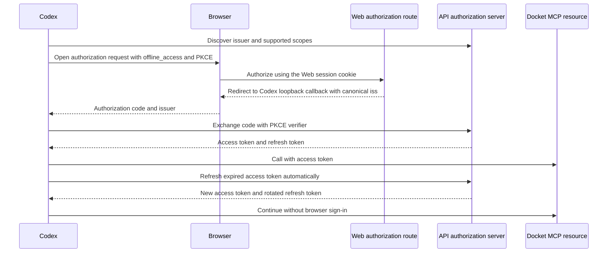

# Codex MCP sign-in durability plan

> **For agentic workers:** Use `superpowers:executing-plans` after this plan is approved.

**Goal:** Keep Codex connected to Docket MCP through normal access-token expiry without repeated
browser sign-in or manual token repair.

**Current evidence (2026-10-07):** Production protected-resource metadata, authorization-server
metadata, the 401 challenge, and the Codex `docket` MCP entry all agree on
`https://api.clearthedocket.com/api/auth` as issuer and include `offline_access`. Current
`origin/main` already pins the JWT issuer to that URL and offers 15-minute access tokens plus
30-day rotating refresh tokens. The live callback, the user's stored grant, and Codex's use of a
returned refresh token remain unobserved. Code review found a second failure path: after refresh
rotation, any same-client replay of the old token revoked the entire Docket grant. A concurrent
Codex request can produce that replay after another request already stored the rotated token.

**Approach:** Keep the existing canonical API issuer and Web-host consent route. Give legitimate
refresh retries a 30-second grace period before treating a same-client replay as theft and
revoking its grant. The replay still returns `invalid_grant`, while the successful rotation remains
usable. Replays after the grace period still revoke the exact grant family. Prove refresh-token
rotation locally, then verify a real Codex connection after a release. Explicit revocation, a
security event, and a grant unused past its refresh-token lifetime may still require consent.

**OAuth sequence:**

## Implementation tasks

### 1. Verify current production configuration

- Read the deployed protected-resource metadata and authorization-server metadata from the
  configured Docket MCP origin.
- Confirmed production metadata and Codex MCP configuration agree. The actual callback `iss`, the
  existing grant's scopes, and token refresh remain unobserved without a new authenticated Codex
  authorization.
- Never record token values.

### 2. Preserve the canonical issuer and consent host

- Current `origin/main` already configures the API `/api/auth` issuer. Do not duplicate that fix.
- Keep `consentPage` on the Web host so the host-only browser session cookie remains available.

### 3. Prove refresh-token issuance and renewal

- Extend the MCP OAuth end-to-end coverage in `apps/web/e2e/mcp/mcp-connect.spec.ts` to assert
  `offline_access` is requested and the code exchange returns a refresh token.
- Redeem the refresh token through the discovered token endpoint. Assert the new access token
  calls `/mcp`, the rotated refresh token can be used again, and no browser authorization occurs.
- Keep the existing 15-minute access-token and rolling 30-day refresh-token policy unless live
  evidence shows Codex fails to refresh despite receiving and successfully using the refresh token.
  Do not increase token lifetime to hide an issuer or client-refresh defect.
- A same-client replay within 30 seconds of rotation returns `invalid_grant` without revoking the
  fresh grant. A replay after that window still revokes the exact grant family.
- Confirm the supported-scope list, 401 challenge, authorization-server metadata, and consent
  screen all continue to include `offline_access`. Do not widen existing consent rows silently.

### 4. Release and verify the actual Codex connection

- Run focused auth and MCP OAuth tests, package typechecks, lint, and required deployment gates.
- Deploy the verified revision and re-read production metadata. Confirm the deployed issuer is the
  canonical API `/api/auth` URL and the Web authorization URL remains reachable.
- Complete one real Codex authorization. Confirm its callback `iss` matches discovery and the code
  exchange returns a refresh token without exposing credentials in logs.
- Exercise access-token refresh after expiry and verify Codex remains connected across app restart
  and subsequent MCP calls without another browser prompt. Close only after this live proof.

## Acceptance criteria

- Codex callback `iss` exactly matches the issuer from Docket discovery.
- A new grant includes `offline_access` and returns an OAuth refresh token.
- Expired access tokens renew through the token endpoint, including refresh-token rotation.
- Codex can restart and make later MCP calls without asking the user to sign in again during normal
  use.
- A revoked grant fails cleanly and asks for consent again. Ordinary token expiry does not.

## Risks and limits

- The current checkout lacks the issuer pin from the earlier Codex-specific fix, while that fix was
  not production-verified in the prior investigation. Confirm current production state before
  deciding whether this is a regression, a missing deployment, or a second token-refresh failure.
- If Codex already stored a grant without `offline_access`, it cannot be upgraded without fresh
  consent. The fix may require one reauthorization to replace that stale grant; it must eliminate
  the recurring sign-in afterward.
- Refresh tokens remain revocable and expire after 30 days without successful renewal. This plan
  removes routine daily sign-in; it does not override revocation or security-driven re-consent.
