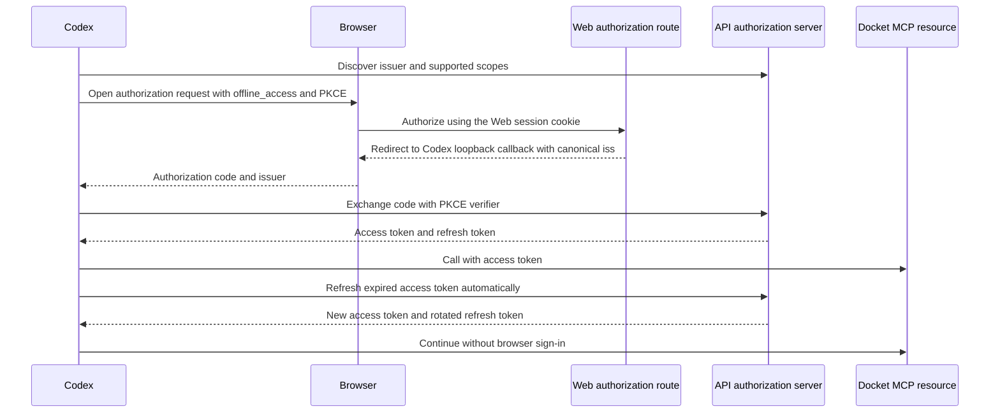

# Codex MCP sign-in durability plan

> **For agentic workers:** Use `superpowers:executing-plans` after this plan is approved.

**Goal:** Keep Codex connected to Docket MCP through normal access-token expiry without repeated
browser sign-in or manual token repair.

**Current evidence:** Codex previously rejected Docket's OAuth callback because its `iss` value
used the Web host while discovery named the API auth mount. The current checkout still registers
Better Auth's `jwt()` plugin without an explicit canonical issuer at
`packages/auth/src/auth-builder.ts:596`. The OAuth provider offers 15-minute access tokens and
30-day refresh tokens, but the refresh-token path only works when `offline_access` is granted.
The prior production callback and discovery evidence dates to August 2026, so the live deployment
must be checked before implementation assumes this is still the only failure.

**Approach:** Make the authorization server's callback issuer match the canonical issuer in
protected-resource and authorization-server metadata. Preserve the Web-host authorization route
needed for the user's session cookie. Prove that Codex can exchange the code, receive
`offline_access` and a refresh token, and renew access without returning to the browser. Keep
refresh tokens revocable and rolling; routine use must not require sign-in. Revocation, a security
event, or a grant unused past its refresh-token lifetime may still require consent.

**OAuth sequence:**

## Implementation tasks

### 1. Verify the live failure before changing the issuer

- Read the deployed protected-resource metadata and authorization-server metadata from the
  configured Docket MCP origin.
- Capture one real Codex OAuth callback. Treat `127.0.0.1:<port>/callback` as the expected Codex
  receiver. Compare the callback's `iss` exactly with the discovered issuer.
- Record whether the authorization request includes `offline_access`, whether the code exchange
  returns `refresh_token`, and whether a refresh-token grant succeeds. Never record token values.
- If the callback issuer already matches, follow the token exchange and refresh response instead
  of changing issuer configuration blindly.

### 2. Pin the authorization issuer to the discovered canonical issuer

- Configure the Better Auth JWT plugin in `packages/auth/src/auth-builder.ts` with the same
  canonical API auth issuer that MCP discovery publishes. Do not derive issuer identity from the
  incoming Web authorization host.
- Keep `consentPage` on the Web host so the host-only browser session cookie remains available.
- Add a regression test in `packages/auth/tests/builder/auth.test.ts` with distinct Web and API
  hosts. Assert the authorization response and provider issuer use the API `/api/auth` URL while
  the consent route uses the Web host.

### 3. Prove refresh-token issuance and renewal

- Extend the MCP OAuth end-to-end coverage in `apps/web/e2e/mcp/mcp-connect.spec.ts` to assert
  `offline_access` is requested and the code exchange returns a refresh token.
- Redeem the refresh token through the discovered token endpoint. Assert the new access token
  calls `/mcp`, the rotated refresh token can be used again, and no browser authorization occurs.
- Keep the existing 15-minute access-token and rolling 30-day refresh-token policy unless live
  evidence shows Codex fails to refresh despite receiving and successfully using the refresh token.
  Do not increase token lifetime to hide an issuer or client-refresh defect.
- Confirm the supported-scope list, 401 challenge, authorization-server metadata, and consent
  screen all continue to include `offline_access`. Do not widen existing consent rows silently.

### 4. Deploy and verify the actual Codex connection

- Run focused auth and MCP OAuth tests, package typechecks, lint, and required deployment gates.
- Deploy the verified revision and re-read production metadata. Confirm the deployed issuer is the
  canonical API `/api/auth` URL and the Web authorization URL remains reachable.
- Complete one real Codex authorization. Confirm its callback `iss` matches discovery and the code
  exchange returns a refresh token without exposing credentials in logs.
- Exercise access-token refresh after expiry and verify Codex remains connected across app restart
  and subsequent MCP calls without another browser prompt. Close only after this live proof.

## Acceptance criteria

- Codex callback `iss` exactly matches the issuer from Docket discovery.
- A new grant includes `offline_access` and returns an OAuth refresh token.
- Expired access tokens renew through the token endpoint, including refresh-token rotation.
- Codex can restart and make later MCP calls without asking the user to sign in again during normal
  use.
- A revoked grant fails cleanly and asks for consent again. Ordinary token expiry does not.

## Risks and limits

- The current checkout lacks the issuer pin from the earlier Codex-specific fix, while that fix was
  not production-verified in the prior investigation. Confirm current production state before
  deciding whether this is a regression, a missing deployment, or a second token-refresh failure.
- If Codex already stored a grant without `offline_access`, it cannot be upgraded without fresh
  consent. The fix may require one reauthorization to replace that stale grant; it must eliminate
  the recurring sign-in afterward.
- Refresh tokens remain revocable and expire after 30 days without successful renewal. This plan
  removes routine daily sign-in; it does not override revocation or security-driven re-consent.
