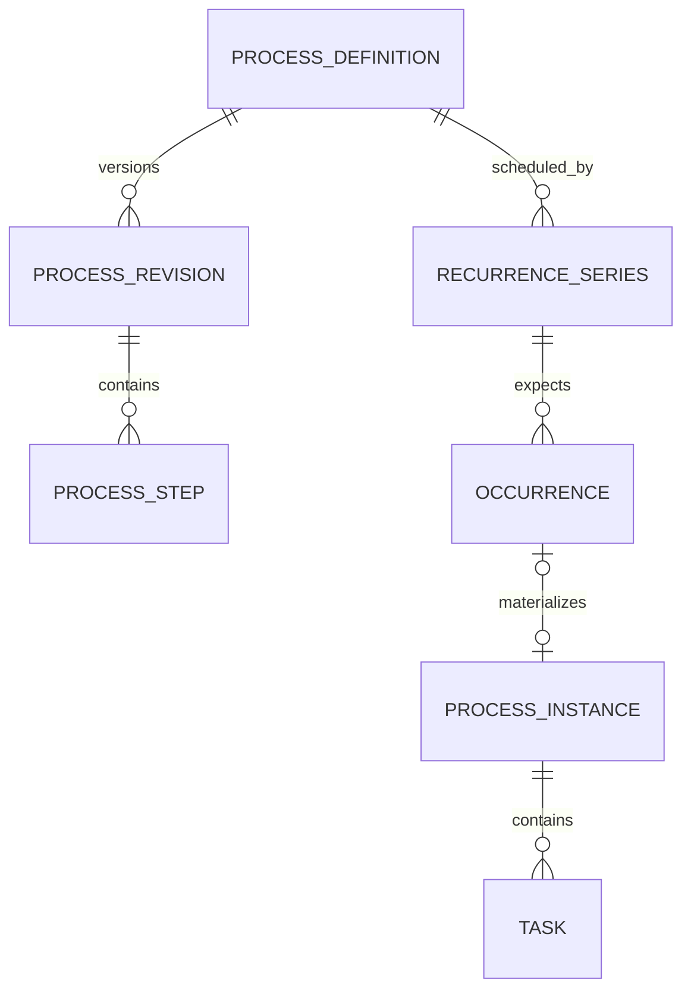
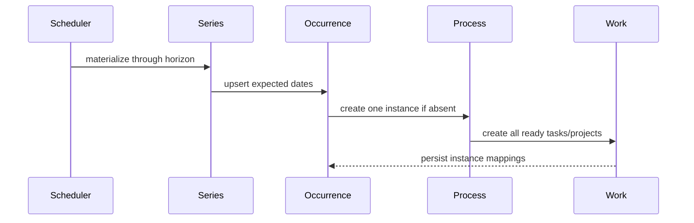
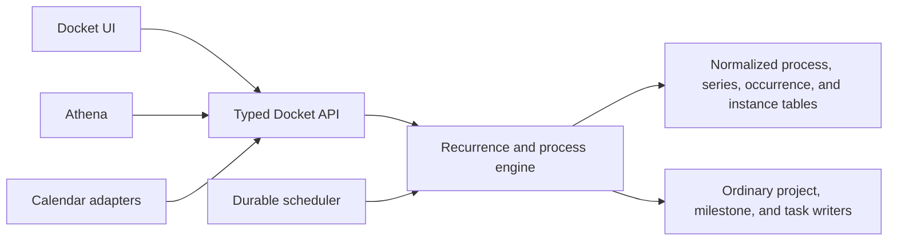

# Repeating Work and Process Execution

**Status:** Approved for implementation  
**Date:** 2026-08-11

## Objective

Let Docket represent both calendar recurrence and stateful repeated work without requiring Athena.
The same deterministic model must cover a daily run, a weekly meetup, a book-club season, a
workshop series, and a coordinator-recruiting pipeline. Athena may author or operate these records,
but it is never required to interpret them.

## Product Model

Docket separates four concerns that are often compressed into a single “repeat” field:

- A **process definition** describes reusable work: a project-shaped container, milestones, tasks,
  dependencies, relative timing, and readiness rules.
- A **recurrence series** describes when that definition is expected to run.
- An **occurrence** is one durable expected run on a particular date, including skipped or
  exception outcomes.
- A **process instance** is the concrete project/tasks materialized for one occurrence.

An ordinary repeating task is a one-step process. That keeps the simple experience simple while
preventing a separate task-only recurrence system from becoming a dead end.

This is only a domain-structure diagram. Runtime behavior and deployment architecture are separate
views below.

## Schedule Contract

The public contract is a named discriminated union rather than inline anonymous shapes:

- `DailySchedule`
- `WeeklySchedule`
- `MonthlySchedule`, discriminated again by `DayOfMonthPattern` or `NthWeekdayPattern`
- `YearlySchedule`
- `AfterCompletionSchedule`

The union is Docket’s canonical representation. An RRULE adapter may import and export compatible
calendar rules, but RRULE strings are not the internal behavioral model.

All calendar schedules carry a timezone and a date-only start. They may optionally end on a date or
after a number of occurrences. Completion-anchored schedules carry a duration after completion
instead of calendar weekdays.

## Materialization

Calendar-driven series are materialized into durable occurrences and ordinary Docket work for a
rolling horizon. The default is four weeks, extended when necessary to include at least the next two
occurrences. A unique `(series_id, scheduled_for)` key makes repeated scheduler runs idempotent.

Fixed processes create all unconditional steps when an instance is triggered. A later process
engine may hold conditional steps until their dependencies or transition predicates are satisfied.
That distinction belongs to the process revision, not to recurrence.

Past occurrences are immutable history. Editing a series offers “this occurrence” or “this and
future”; future changes create a new revision rather than rewriting completed work.

## Missed Work

Missed behavior is explicit because “overdue” is not correct for every repeated activity:

- `skip`: expiring routines such as a daily workout become skipped after their date.
- `carry`: persistent obligations remain open and overdue.
- `resolve`: fixed events require a person or integration to record what happened.
- `after_completion`: maintenance schedules calculate the next occurrence from actual completion.

The ordinary repeat control defaults to `skip`, matching the most intuitive routine behavior. The
advanced control explains and permits the other policies.

## User Experience

### Repeating a task

“Repeat” is an ordinary property in the task composer. Selecting it expands a compact editor in
place for common daily, weekly, monthly, or completion-anchored rules. The saved summary reads like
prose (for example, “Every week on Mon, Wed, Fri”) and previews the next dates. “More options” opens
a side panel for timezone, ending, missed-work policy, and rolling horizon.

Submitting a repeating task creates the series and its first rolling window. The generated tasks
are ordinary tasks everywhere else in Docket. A task detail surface links back to its series, where
the user can pause, end, or edit future occurrences.

### Repeating a project or process

“Repeat project” opens a focused setup surface because the user must review a collection: included
tasks and milestones, dependencies, relative dates, creation mode, and recurrence. This is not
forced into the compact task popover.

### Calendar events

The calendar integration continues to own recurring events. Docket may bind a process definition to
the external event series so each stable event occurrence creates at most one process instance.
User-facing copy is “Add tasks for each event” or “Plan work around this event,” never the internal
term “attach process.”

## Architecture Boundary

Athena’s intelligence is translation and assistance: it turns “six miles MWF and ten miles Sunday”
into two series over one-step process definitions, or proposes a workshop process graph. The API
validates and stores the same named union a person can author in the UI.

## Delivery Slices

1. **Foundation and repeating tasks:** shared union types, normalized persistence, deterministic
   occurrence generation, rolling materialization, task composer control, and a series detail view.
2. **Reusable multi-step processes:** versioned project/milestone/task specifications,
   dependencies, all-at-once instance creation, and process management UI.
3. **Stateful transitions:** readiness predicates, completion-anchored transitions, retries, and
   operational history.
4. **Calendar bindings:** stable external series/occurrence identities and “Add tasks for each
   event.”
5. **Athena authoring:** natural-language proposal, preview, and confirmation using the same APIs.

The first slice must create the storage and contract seams needed by every later slice; it must not
pretend that task recurrence is the complete model.
