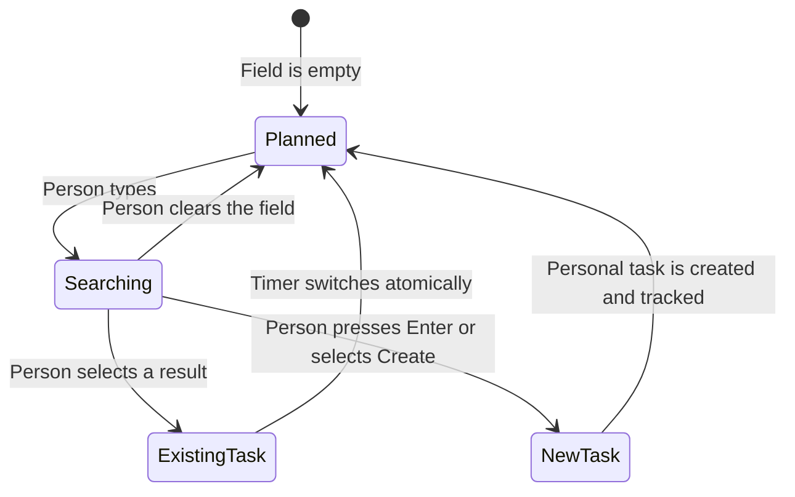

# Focus Sidebar Work Switching

> **Status:** Implemented
> **Date:** 2026-08-20
> **Reader:** The engineer changing Focus must make task creation and switching possible without
> leaving the sidebar.

## Decision

The Focus sidebar will combine task discovery, task creation, and upcoming work in one **Up next**
section. It will not render a separate “Switch task” section or instructional copy such as “Select
to switch.” The existing timer endpoint already creates a normal Personal task from a label and
atomically switches from one tracked task to another, so the sidebar will expose that contract
instead of adding another mutation path.

The active task title will occupy its own full-width row and wrap. Clicking the title opens the
task. Open and Rename will move into a task-actions overflow menu at the far end of the timer
controls. Pause or Resume and Finish will remain labeled, equal-height actions. Finish will use a
circled-stop icon because it ends tracking without completing the task.

The Focus Athena interruption field will be removed from both the sidebar and immersive Focus. The
user rejected that interruption path on this surface. Athena remains available through its normal
application entry points.

## Interaction

The **Up next** section will show accepted tasks from today’s Hub plan, excluding the active task.
Each task row will show its complete title and workspace name. Selecting a row will call the
existing timer start command with that task id, which starts or switches as one server transaction.

The first control in **Up next** will be a task field labeled for assistive technology as “Find or
create a task.” While empty, the section shows today’s planned tasks. Typing replaces those rows
with task-only Hub search results. Selecting a result switches tracking. Pressing Enter with text
creates a normal task in Personal and starts tracking it. The create consequence will appear as a
real result row when search settles, not as helper prose.

The following state-machine diagram records the field behavior:

The Focus-mode launcher will become one compact, end-aligned menu. Its rows will preserve both
existing destinations: the preferred pop-out behavior and explicit same-tab navigation.

## Data and failure behavior

The section will reuse `GET /v1/hub/today` through `queryKeys.today(date)` for planned work and
task-only `GET /v1/hub/search` queries for typed results. It will reuse `POST /v1/time/records` for
new tasks, existing tasks, and atomic switches. No API or schema change is required.

If the plan request fails, the search/create field will remain usable and the section will show
application-owned failure copy. If search fails, planned rows will return after the query is
cleared. If a timer mutation fails, the existing Focus notice will report that tracking could not
start. Raw server or provider copy will never render.

## Validation

Component tests will prove that the panel renders real plan rows, excludes the active task, creates
and tracks typed work, switches to a selected existing task, keeps the title on its own wrapping
row, and places Open/Rename in the end-aligned menu. The Focus launcher test will prove that both
destinations remain available from one compact control. The Focus end-to-end journey will create
and track a task from the sidebar and will stop expecting the removed Athena field.

The final browser pass will cover 1440 by 900 and 390 by 844 in light and dark themes. It will check
the running, paused, search-results, long-title, empty-plan, and plan-error states. A 320px overflow
probe and keyboard traversal will cover the hard responsive and accessibility boundaries.
