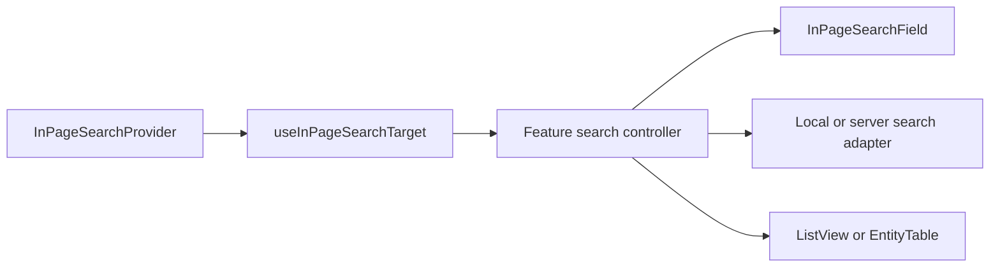

# Virtualized In-Page Search Design

## Reader and decision

This document is for the frontend maintainer who implements Ctrl/Cmd+F across Docket's
virtualized surfaces. The maintainer must add one shell-level shortcut router, keep data ownership
inside each feature, and prove that every registered search covers the surface's complete backing
collection rather than its mounted DOM rows or loaded cursor page.

We will add an application-owned in-page search contract. Ctrl/Cmd+F will focus the active
virtualized surface's search field. Docket will leave the browser's native find untouched when no
eligible surface is registered.

## Scope

The first integration covers every component that uses `@tanstack/react-virtual` on August 21,
2026: `ListView` and the opt-in virtualized path in `EntityTable`. That includes Library, Triage, My
Work, and the saved-view task runner. Non-virtualized pages keep native browser find.

Library continues to search its server-side resource corpus through 50-row cursor pages. Triage,
My Work, and saved task views currently receive the complete active-task list because they omit the
task endpoint's opt-in `limit`; they may search that complete resident collection locally. If one of
those callers adopts cursor pagination later, it must provide server search before it may remain a
registered in-page search target.

## Component boundaries

The design follows the single-responsibility and dependency-inversion principles:

- `InPageSearchProvider` owns document-level shortcut routing and target precedence. It knows
  nothing about tasks, resources, queries, filtering, or virtualization.
- `useInPageSearchTarget` registers a small target interface with the provider. The provider
  depends on that interface rather than on Library, `ListView`, or `EntityTable`.
- `InPageSearchField` owns the shared field treatment, accessible name, clear action, Escape
  behavior, and platform shortcut label. It does not fetch or filter data.
- Each feature controller owns its query state and search adapter. A controller chooses server
  search for a paginated corpus or local search for a complete resident corpus.
- `ListView` and `EntityTable` keep rendering, measurement, keyboard row navigation, and
  end-of-list notification as their only concerns. They receive already-matched rows.

The component diagram shows frontend modules at one level of abstraction:



## Shortcut routing

The provider installs one `keydown` listener. It claims an event only when all of these conditions
hold:

1. The key is `f`, exactly one of Control or Meta is held, Alt is not held, and the event is not a
   repeat.
2. At least one connected, enabled target is registered.
3. The selected target confirms that it can focus its field.

The provider then prevents the browser find dialog and calls the target's `focusSearch` command.
It does not prevent default when no target qualifies.

The provider selects the target containing current focus first. This makes a virtualized dialog or
popover outrank the page behind it. Otherwise it selects the most recently focused eligible target.
If no target has held focus yet, it selects the most recently registered eligible target. Closed
overlays unregister and cannot retain priority.

The target remembers the element focused before Ctrl/Cmd+F. Escape clears a non-empty query first.
A second Escape on an empty query blurs the field and restores that element when it remains
connected. Ctrl/Cmd+F while the field already has focus selects its current query.

## Search execution

The shared contract separates shortcut activation from query execution:

```ts
interface InPageSearchTarget {
  readonly id: string;
  readonly root: HTMLElement | null;
  readonly enabled: boolean;
  readonly focusSearch: () => boolean;
}
```

Feature controllers expose a draft query to `InPageSearchField` and pass matched rows to the
virtual surface. Local adapters normalize case and whitespace once per item and use deferred input
so a large resident list does not block keystrokes. Server adapters debounce for 180 milliseconds,
include the query in the TanStack Query key, cancel superseded requests, preserve successful cursor
pages during a later-page error, and retain server relevance order.

Local search applies before grouping so empty groups disappear and group counts describe the
matched set. Server search may return a flat relevance-ordered result when grouping would destroy
that order, as Library does today. Clearing the field restores the page's prior grouping, collapse
state, selection, and scroll position.

No adapter may search rendered text nodes. Virtualization deliberately removes most rows from the
DOM, so DOM search can never satisfy this contract.

## Shared field behavior

Every registered surface renders the same field component in its existing toolbar or immediately
above its scroll region. The field uses `type="search"`, a surface-specific accessible label and
placeholder, a visible clear action when non-empty, and a platform label of `⌘F` or `Ctrl F`.

The field reports pending server work without replacing existing results. It reports result counts
through a polite live region after a query settles. Initial failures use the feature's existing
error surface. Later-page failures stay at the virtual list's end with Retry.

The query remains feature state. Library keeps its existing `q` URL parameter and shared URL
transaction. Saved views keep their authored Filter and Display state separate from transient
in-page search. Triage and My Work do not add URL state because their search is a temporary
navigation aid.

## Performance and accessibility

The provider performs no collection work on keydown. Registration changes are O(1), and target
selection examines only the small set of mounted search surfaces. Local matching runs against the
data collection rather than the rendered row sequence and uses memoized normalized fields.

Search does not change the existing 12-row overscan or the Library requirement that a 10,000-row
fixture mount no more than 100 row elements. Stable item keys survive query changes. When the active
row disappears, the virtual surface moves its active descendant to the first remaining row without
moving DOM focus away from the search field.

The shortcut works with Control on Windows and Linux and Meta on macOS. Screen-reader users can
reach the same field and clear action without the shortcut. The result count live region never
announces on every keystroke before a debounced query settles.

## Failure handling

A target whose root unmounts between keydown and focus returns `false`; the provider then leaves the
event unclaimed when no fallback target can focus. A search adapter aborts superseded server work
and treats cancellation as neither an error nor an empty result. A registered target that only has
a partial local collection is a contract violation covered by a source-policy test.

## Rejected alternatives

Per-page key handlers duplicate platform detection, editable-element rules, focus restoration, and
native-find fallback. They would drift.

Putting query state or filtering inside `ListView` and `EntityTable` would make presentation
components depend on product APIs. It would also encourage those components to search only the rows
they happen to receive, which is wrong for cursor-backed collections.

A global workspace search overlay would search a different corpus and would erase the current
page's semantic constraints. The command palette already fills that role.

Intercepting Ctrl/Cmd+F on every route would remove native browser find where Docket has no better
complete-corpus search. The provider therefore claims the shortcut only for registered targets.

## Acceptance criteria

1. Ctrl/Cmd+F focuses the active registered surface and selects an existing query.
2. Native browser find remains available when no eligible target is mounted.
3. Nested virtualized overlays outrank the page and relinquish priority when closed.
4. Library searches the complete resource corpus through its existing cursor search.
5. Triage, My Work, and saved views search their complete resident task collections before
   grouping.
6. Clearing search restores prior grouping, collapse state, selection, and scroll position.
7. Search never reads rendered DOM text and does not increase the virtual DOM bound.
8. Keyboard focus, active-descendant state, live result counts, Escape, and clear controls pass
   accessibility tests.
9. A policy test prevents a cursor-backed surface from registering a local-only adapter.

## Conditions that would change this decision

If Docket later standardizes every list on one server query protocol, the feature adapters may
share a server-search implementation. The provider contract should remain unchanged. If an editor
needs document-text find with match-by-match navigation, it should register a separate adapter
behind the same target interface rather than adding editor rules to the provider.
