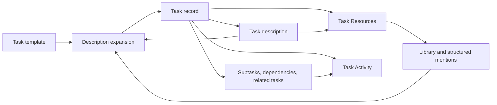

# Task descriptions, Resources, and Activity

This document is for the Athena maintainer who changes tasks, templates, the Library, or the
task-detail page. The maintainer must make a task one complete description of work, attach it to
the shared resource model, and preserve a single Activity history. Do not create another planning
record, task-only resource system, or separate generated description surface.

## Decision

A task is a description of work. Its title identifies the work, and its description explains what
someone must do. The description is the canonical record. It may be short or it may describe a
large outcome with contained tasks. A parent task is not a different kind of object. It is an
ordinary task that owns subtasks.

The task page will use the standard entity resource model and one Activity history. It will expose
task resources through the standard Resources tab. The description
keeps inline links where they explain the work. The Resources surface collects every resource tied
to the task, including those inline links, so a person can find supporting material without reading
the full description first.

The task-description expansion action acts as extended autocomplete. It improves the existing
description directly, links relevant material, applies supported metadata, and creates clearly
implied contained work. It does not create a second document, a proposal screen, or a conversational
agent surface.

## What the task owns

The task owns its title, description, lifecycle, assignee, priority, dates, estimates, labels,
relationships, resources, and Activity. Basic execution properties are available where someone is
working on the task: status, priority, assignee, and time tracking. Less-frequent properties remain
available without becoming a detached sidebar that competes with the description.

Templates define the expected description shape and defaults for a class of work. A research task,
customer request, release task, engineering issue, or personal task can therefore use different
structure without Athena imposing a universal format. Expansion follows the selected template when
one exists. A task with no template remains ordinary prose with only the structure the description
needs.

The current template integration merges a selected template into a create draft or persisted
description editor, but it does not retain the selected template on a committed task. This feature
requires durable template identity on the task, or an equivalent durable association. Without it,
later expansion cannot know which task-specific structure to preserve.

## Description expansion

Expansion takes the current task description, the selected template, explicit task values, visible
workspace context, and resources the caller may access. It updates the task in place.

The user’s text wins. Explicit task values also win over inferred values. The selected template
provides defaults and structure, but it cannot overwrite a deliberate value. Expansion may clarify,
organize, and connect the description. It must not change the requested outcome or invent facts.

When evidence supports the result, expansion will:

- improve the description in place;
- add structured links to relevant Library resources and existing work;
- create clearly implied subtasks;
- create a dependency only when the description explicitly says that identified work blocks or
  waits on other identified work; and
- fill missing task properties such as project, team, owner, priority, dates, labels, or estimates.

When evidence is unclear, expansion leaves the field unset. It must not guess at an owner,
deadline, dependency, source, or factual claim. The action records its description, relationship,
resource, and property changes in Activity. One Undo reverses the whole expansion as one user
operation.

## Task relationships

Tasks use three distinct relationships.

### Subtasks

A subtask is contained work that contributes to its parent’s outcome. It has one parent. It may
have its own description, assignee, dates, resources, Activity, subtasks, and dependencies. A
parent can therefore hold an engineering feature, an operational project, a research effort, or
any other outcome that needs decomposing.

The workspace setting **Complete parent tasks when all subtasks are done** defaults to enabled.
When every active child is complete, the system completes the parent and records that completion in
Activity. Canceled children do not keep the parent open. Reopening a child reopens a parent that
the rollup completed. A parent someone completed manually stays complete until they explicitly
reopen it.

### Dependencies

A dependency is directed sequencing, not ownership. One task may block another task anywhere in
the workspace. A dependency can cross projects, teams, and task trees. A subtask may depend on a
task outside its parent. Parent tasks show relevant blocking state through their children, but do
not inherit every child dependency as their own.

### Related tasks

A related-task link records association without containment or scheduling meaning. It covers
duplicate work, follow-on work, alternatives, and work that belongs in the same discussion. The
link is reciprocal. It never blocks, assigns, or rolls up completion.

## Resources and the Library

Task resources use the existing shared Library and mention model. The following all appear in one
task Resources collection:

- files and links explicitly attached to the task;
- Library resources mentioned in its description;
- linked mail and calendar items;
- resources expansion adds to the description or task; and
- resources explicitly connected from another task.

The description and Resources are two views of the same resource relationships. A structured
mention in the description remains inline and also appears in Resources. An attached resource
appears in Resources even when no sentence refers to it. No task-only attachment type or second
resource index is allowed.

Project, parent-task, and template resources provide context but do not automatically flood the
task’s direct Resources collection. Expansion may add one as a direct task resource when it uses
that material. The Library presents the reverse relation, so people can see every task, project,
or other entity that uses a resource.

## Activity

Activity is the task’s single chronological record. It contains comments, description changes,
property changes, status changes, assignment, time tracking, resource changes, relationships, and
expansion results. Filters narrow that one history. They do not send a type of event to a separate
history or conversation surface.

A parent’s Activity includes meaningful child events. Child completion, status changes,
reassignment, blocking, deadline changes, and description changes name the child that changed and
can be filtered from direct parent changes.

A task does not receive the complete Activity of a dependency. It records only dependency changes
that alter its ability to proceed: adding or removing a blocker, a blocking task completing or
being canceled, a blocker becoming blocked, or a deadline change that affects this task. Related
tasks contribute link and unlink events only.

## Starting time tracking

Starting time tracking reduces routine task administration. When someone starts tracking an
unassigned task, the system assigns that task to the person who started it. When the task has not
yet started, the system moves it into progress. It never takes a task from an existing assignee, reopens
completed work, or changes priority.

The timer start, assignment, and status transition must succeed or fail together. Activity records
the timer start and each task change clearly enough that a reader can distinguish an automatic
change from an explicit edit.

## Component diagram

This component diagram keeps the task record and its supporting systems at one level of
abstraction. The description is the source for structured mentions. Expansion updates the same
task record rather than producing a parallel plan.

## Rejected designs

Do not patch the existing task page while retaining separate file attachments, mail attachments,
description links, comments, and metadata history. That preserves the exact fragmentation this
design removes.

Do not add a separate planning record. The user should not have to choose between a raw task and
an expanded task, or synchronize two records after changing the work.

Do not make dependency links a generic relation system. Their scheduling meaning is necessary for
planning and must remain distinct from containment and ordinary association.

Do not let expansion create plausible-looking unsupported metadata. An unset value gives someone a
visible decision to make. A fabricated deadline or owner silently damages planning.

## Acceptance criteria

1. A task has one canonical description of work and retains its selected template identity.
2. Description expansion updates that description directly and remains one undoable operation.
3. Expansion respects explicit user text and values, creates only supported metadata and
   relationships, and leaves uncertain fields unset.
4. Subtasks, dependencies, and related tasks retain their separate semantics.
5. Workspaces default to auto-completing a parent when all active subtasks are complete, and users
   can disable that behavior.
6. Resources combines structured mentions, attachments, mail, calendar items, and direct Library
   links for a task without a task-only resource model.
7. The Library shows every entity that uses a resource.
8. Activity is one filterable task history and includes only meaningful propagated child and
   dependency changes.
9. Starting time tracking claims an unassigned task and starts an unstarted task without stealing
   an assignment or reopening completed work.

## Conditions that would change this decision

If templates become single-use starter text rather than an ongoing task contract, expansion cannot
depend on template identity after task creation. In that case it must use only the description and
explicit metadata, and the product must state that limitation. If resource visibility rules cannot
support a direct task-to-resource link for a given provider, expansion must leave the provider link
out rather than creating an unprotected task-specific copy.
