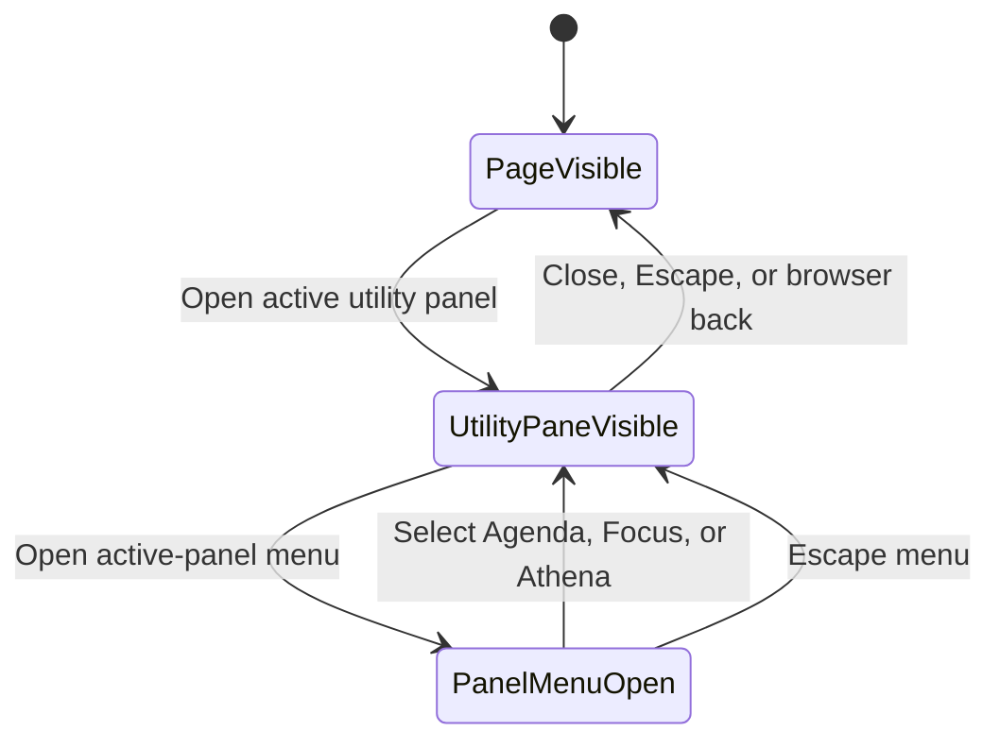

# Use one full-screen utility pane below the desktop breakpoint

This design is for maintainers who change Docket's shell or utility panels. They must stop the
compact Agenda, Focus, and Athena presentation from exposing an unusable strip of the page beneath
it while preserving the desktop rail and every panel interaction.

## Decision

Docket will treat the utility panel as the current pane at every width below the existing 1024px
desktop breakpoint. Opening Agenda, Focus, or Athena will cover the shell's content viewport from
edge to edge. The panel will not use the generic modal side-sheet width cap, outside rounded
corners, a visible scrim, or an exposed page strip. The underlying page may remain mounted for
state continuity, but it will not occupy visible screen area or accept input while the panel is
open.

At 1024px and wider, the existing docked supporting rail and vertical activity bar will remain
unchanged. Docket will not add a second breakpoint for the utility panel.

This follows Material 3 adaptive guidance for supporting panes: compact and medium windows show
one pane at a time, while large windows may show the primary and supporting panes side by side. The
utility panel contains a planning workspace rather than a brief confirmation, so a partial modal
sheet is the wrong compact presentation.

## Compact pane structure

The full-screen pane will use the full dynamic viewport height and width, including the existing
safe-area treatment. Its top app bar will remain 48px tall before safe-area inset. The active-panel
menu stays at the leading edge, and the existing Sheet close action stays at the trailing edge.
The app bar will use the panel surface with a bottom outline-variant divider. Panel content will
own the remaining height and keep its current scroll behavior.

The component-state sequence is:

The shell will continue to own active-panel state, persistence, focus trapping, dismissal, and
panel resolution. Agenda, Focus, and Athena will not know whether the shell presents them as a
desktop rail or compact full-screen pane.

## Alternatives rejected

A wider side sheet that leaves 16px or 24px of scrim would still spend compact screen area on page
content that nobody can use. It would preserve the visual defect instead of fixing the pane model.

A bottom sheet would fit brief actions, but Agenda is a full-height timeline and Athena can hold a
long session. Moving either into a vertically constrained sheet would create nested scrolling and
hide the relationship between the active-panel selector and its content.

A dedicated route for each utility panel would remove the overlay, but it would duplicate shell
state and change desktop behavior. The adaptive shell already has the correct shared panel model.

## Accessibility and continuity

The compact pane remains a modal focus scope because only one pane is available at this breakpoint.
Opening it moves focus inside. Escape and the close action return focus to the invoking shell
control. The active-panel menu keeps its current keyboard behavior and accessible name. The panel
will block pointer and assistive-technology access to the page beneath it.

The full-screen geometry will not remount the selected panel when someone switches between compact
and desktop widths. Panel-local state, Agenda scroll position, date selection, running Focus state,
and Athena session state will remain continuous.

## Validation

Shell tests will prove that the compact panel uses the full viewport width and height, has square
outer edges, exposes no side-sheet width cap, preserves its close action and panel menu, and leaves
desktop rail geometry unchanged. Tests will cover 320px, 390px, 768px, and the 1024px boundary.

The authenticated visual review will capture Agenda at 320 by 844, 390 by 844, and 768 by 1024 in
both themes. Each capture must show no underlying page strip, no horizontal overflow, one top app
bar, readable timeline edges, hidden scrollbar chrome, and a visible keyboard focus state. A
1024px capture will prove that the docked rail still appears beside the page.

No API, database, persistence, or panel-content contract changes in this slice.
