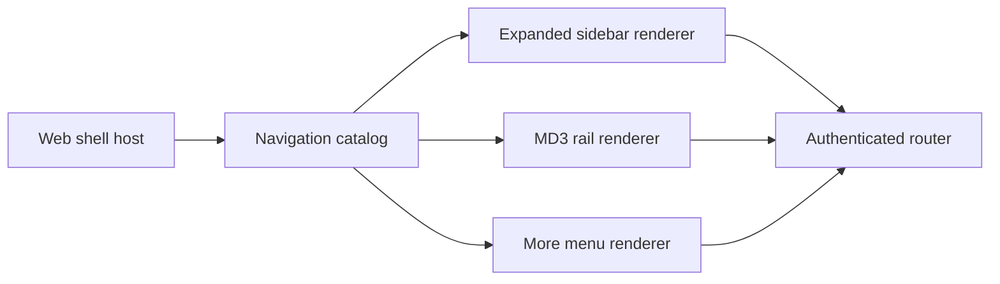

# Make sidebar collapse a Material 3 navigation rail

This design is for maintainers who change Docket's app shell. They must replace the current
icon-only collapsed sidebar with a real Material 3 navigation rail without creating another
navigation model or making the application jump between unrelated layouts.

## Decision

At 1024px and wider, Docket will present navigation in two density modes. The expanded mode will
remain the full workspace sidebar. The collapsed mode will become a Material 3 navigation rail,
not a compressed copy of the whole sidebar and not a zero-width Linear-style hide action.

The rail will keep these seven product-wide destinations visible: Today, My Work, Calendar, Inbox,
Search, Athena, and More. Each item will have an icon and a short visible label. The active item
will have one tonal selection indicator. The active workspace avatar will remain at the top. The
account control will remain at the bottom.

More will open an anchored menu grouped by Workspace and Manage. It will contain every destination
that does not belong in the daily rail. It will not expand the sidebar. This preserves immediate
access to daily work while giving infrequent configuration and hierarchy pages a consistent home.

Below 1024px, navigation will remain the existing full off-canvas drawer. A compact phone cannot
use a docked rail and an open app drawer at the same time.

## The navigation model

The shell will own one catalog of destination records. A record will define its stable identifier,
label, icon, route kind, workspace requirement, grouping, rail priority, and menu placement.
Route construction remains in the Web host because it owns authenticated navigation. Vocabulary
resolution remains at the catalog boundary so both renderers receive the same display label.

The expanded sidebar and rail will be separate renderers of that catalog. Neither renderer will
infer destinations from CSS state or duplicate the destination arrays. The sidebar will retain its
Home and Workspace browse groups. The rail will select its fixed primary records and render More
from the remaining eligible records.

The following component diagram shows the ownership boundary.

`Sidebar.tsx` currently owns destination arrays, vocabulary, responsive layout, collapse behavior,
loading cases, drawer dismissal, and footer layout. This split removes that mixed responsibility.
The catalog owns identity. Each renderer owns one presentation. The shell owns the selected density
and persists it under the existing sidebar preference key.

## Expanded sidebar

The expanded sidebar remains the information-dense browse surface. It will keep the workspace
switcher, Home and Workspace groups, route selection, unread state, recovery notice, update card,
and account menu. It will not render a special second set of destinations just to support the rail.

The expanded surface may later let people reorder favorites and move low-use destinations into
More. That personalization is outside this slice. The initial rail priority remains product-owned
so Docket has one clear daily navigation grammar before it adds personal configuration.

## Navigation rail

The rail is a persistent, labeled destination surface. It will have a fixed width that gives each
item a 40px target, an icon, and one visible label. The rail will not rely on hover tooltips for
basic navigation. Tooltips may provide keyboard shortcuts or expanded descriptions, but they are
not the only way to learn a destination name.

The workspace avatar opens the existing workspace switcher. It does not become an account menu.
The More item opens the anchored menu without moving the main canvas. The menu will put task and
planning destinations under Workspace, then put people, Views, Graph, and Settings under Manage.
It will keep active-route indication and close after a navigation.

The rail only appears when the shell has enough horizontal space for the present page. It does not
replace the right-side Agenda, Focus, and Athena utility rail. The left rail answers where to go.
The right rail answers what work supports the current page.

## Motion and shared elements

Changing density will run inside the application's existing same-document View Transition wrapper.
The browser will animate only elements that retain identity across both presentations. The workspace
avatar, every rail-primary destination, and the active destination's tonal indicator will receive
stable transition names. The transition will not animate the root page snapshot, so the main page
does not fade or become a static overlay while its width changes.

The left navigation column and main canvas will use normal 200ms layout motion. During collapse,
text fades and clips after the destination indicator settles into its rail position. During
expansion, the sidebar reaches readable width before labels fade in. The More menu uses the
existing anchored-menu opening and closing motion. The rail never hard-swaps into a separate
composition.

One rendered state may contain each transition name only once. The shell must not mount named
sidebar and rail copies together during a View Transition. Browsers skip a transition when a state
contains duplicate `view-transition-name` values.

When a person requests reduced motion, the shell will switch density immediately. Keyboard focus
will remain on the collapse or expand control. The action will announce the resulting navigation
state through its accessible name and pressed state.

## Loading, accessibility, and failure behavior

The rail's seven labels and icons are static product knowledge. They render while workspace data is
loading. The workspace avatar can show its existing loading placeholder, and workspace-only items
remain disabled until the host resolves an active workspace. The More menu must not claim that no
workspace exists during the one-render binding gap between a workspace list and active context.

Every item remains a semantic link or button. The active destination uses `aria-current="page"`.
Inbox continues to expose its unread count in the accessible name even when the visual rail uses a
compact badge. More has an explicit accessible label and returns focus to its trigger after Escape.
The mobile drawer retains the full labeled sidebar and closes after navigation.

No API, database, route, or account-state contract changes belong in this slice.

## Validation

Unit and shell-contract tests will prove that the catalog gives both renderers the same routes,
labels, selected state, availability rules, and unread semantics. They will prove that the rail
contains exactly the seven primary destinations, More contains the remaining permitted records,
workspace switching remains available, and a collapsed preference does not alter the mobile drawer.

Motion tests will verify the transition wrapper, unique shared names, reduced-motion behavior, and
focus retention. The shell geometry contract will replace the old 56px icon-rail arithmetic with
the rail's measured width and preserve the main-content floor at every desktop width.

An authenticated visual audit will inspect 1024 by 900 and 1440 by 900 in light and dark themes.
It will capture expanded navigation, the collapsed rail, an open More menu, selected Inbox with an
unread badge, keyboard focus, and the collapse and expand transition. The review must reject
clipped labels, horizontal overflow, competing selected treatments, duplicated workspace context,
or a transition that snapshots the main page.

## Alternatives rejected

Keeping all 22 destinations as icons makes the collapsed surface an icon dictionary. It requires
hover or memory to navigate and removes meaningful group structure.

Hiding the sidebar entirely follows Linear's focus-first collapse model, but Docket's daily
planning work benefits from persistent orientation. It also does not meet the requirement for a
Material 3 navigation rail.

Opening the full sidebar when someone selects More makes More a disguised expand action. It moves
the main canvas, makes the rail state unstable, and preserves the current layout split instead of
giving secondary navigation a stable home.

## Open scope

The first implementation uses a product-owned rail order. Personal reordering, saved favorites,
and per-user hidden items require a separate persistence and customization design. The initial
slice must not add that product surface without a clear user need.
