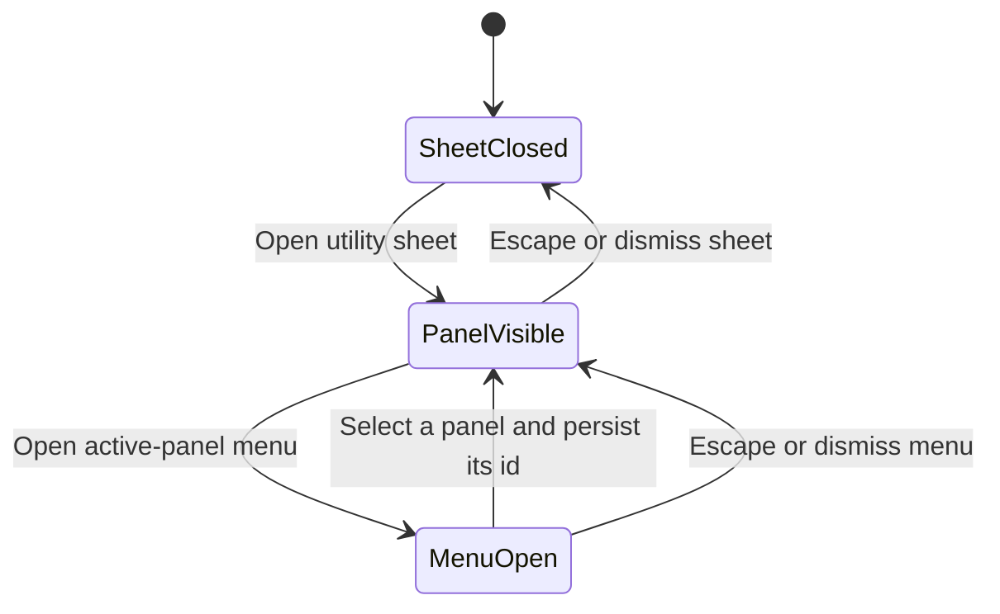

# Scale the utility-panel switcher and narrow the work-location track

This design is for maintainers who change the utility rail or scheduling composition. They must
replace the mobile sheet's horizontal panel buttons and reduce the partial-day location track
without weakening navigation, pointer targets, keyboard editing, or event collision geometry.

## Decision

The mobile utility sheet will show one active-panel trigger instead of one button per available
panel. The trigger will contain the active panel icon, its full name, and a disclosure icon. It will
open a vertical menu that lists every panel supplied by `AppShellAside`. Selecting a row will switch
the existing shell-owned active panel, persist that id, close the menu, and keep the sheet open.

The trigger will remain one line and 40px tall. A long panel name will truncate inside the trigger.
The menu may grow independently of the sheet header and will scroll when its rows exceed the
available height. Live panel status will appear in the row and its accessible name. The mobile
shell button that opens the sheet will continue to use the active panel icon.

Desktop will keep `ShellActivityBar`. Its fixed 48px vertical column already avoids horizontal
wrapping, and this change does not need a second desktop navigation model.

The partial-day work-location composition will reserve 32px instead of 40px for intersecting event
clusters. It will render a 12px tinted band around a two-pixel semantic rail. The 24px Home or place
marker will remain unchanged. Move and resize controls will remain 40 by 40 pixels, but their boxes
will start eight pixels inside the time-axis gutter and end at the 32px event boundary. They will
not overlap event cards.

## Structure

The state-machine diagram shows how the sheet and its menu change visible panel state.

`AppShell` will continue to resolve stale persisted ids against the panels available on the current
route. The new menu will consume that resolved set and the same `handlePanelIconClick` semantics
through a selection callback that never collapses the open mobile sheet. No panel will own or copy
the selector state.

Scheduling will keep one generic leading-inset contract. Work-location composition will return the
new 32px value for intervals that intersect a partial-day location. Scheduling cards, previews, and
dense overflow controls will continue to receive one cluster inset. Work-location rendering will
use the same constant to place its visuals and hit targets.

## Alternatives rejected

A horizontally scrolling tab row would postpone wrapping but would hide choices off-screen. It
would also make the number of panels control header width, which is the failure this change removes.

An icon-only overflow button would use less space, but it would hide which panel the sheet currently
shows. The active icon and label cost one fixed row and make the sheet's identity clear.

Keeping the 40px location track while only narrowing its tint would reduce the colored area but
would not return width to event cards. Shrinking pointer targets with the track would violate the
existing touch and keyboard interaction contract. Offsetting the 40px targets into the unused time
gutter preserves both requirements.

## Accessibility and failure behavior

The active-panel trigger will expose its panel name, menu state, and menu relationship. Menu rows
will use normal arrow-key, Home, End, Enter, and Escape behavior from the shared menu primitive.
Focus will return to the trigger when the menu closes. Selecting a panel will update the utility
sheet's accessible name with the visible content.

The work-location marker, tooltip, accessible time description, keyboard movement, resize commands,
announcements, focus ring, rejected-edit behavior, and exact-time persistence will not change. The
narrower visual treatment will retain the existing non-text contrast threshold in both themes.

No new network, API, database, or error state is introduced.

## Validation

Shell tests will render at least five panels and prove that the mobile sheet shows one trigger, no
horizontal panel tablist, a complete menu, stable sheet content after selection, persisted active
state, status copy, keyboard navigation, and a non-wrapping 320px header. Existing desktop activity
bar tests will prove that desktop switching and collapse behavior remain unchanged.

Scheduling and work-location tests will prove the 32px cluster inset, the 12px band, 40px gesture
targets ending before event content, matching resting and preview geometry, dense overflow parity,
boundary-crossing clusters, short adjacent intervals, and both themes' contrast.

The final visual review will use authenticated 390 by 844 and 320 by 844 captures with at least five
panel choices. It will also capture populated partial-day overlap in both themes. The review must
show one fixed-width selector, no horizontal document overflow, a narrower location track, readable
event cards, hidden scrollbar chrome, visible keyboard focus, and unchanged native scrolling.

No product behavior remains undecided in this slice.
