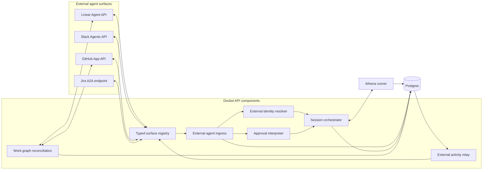
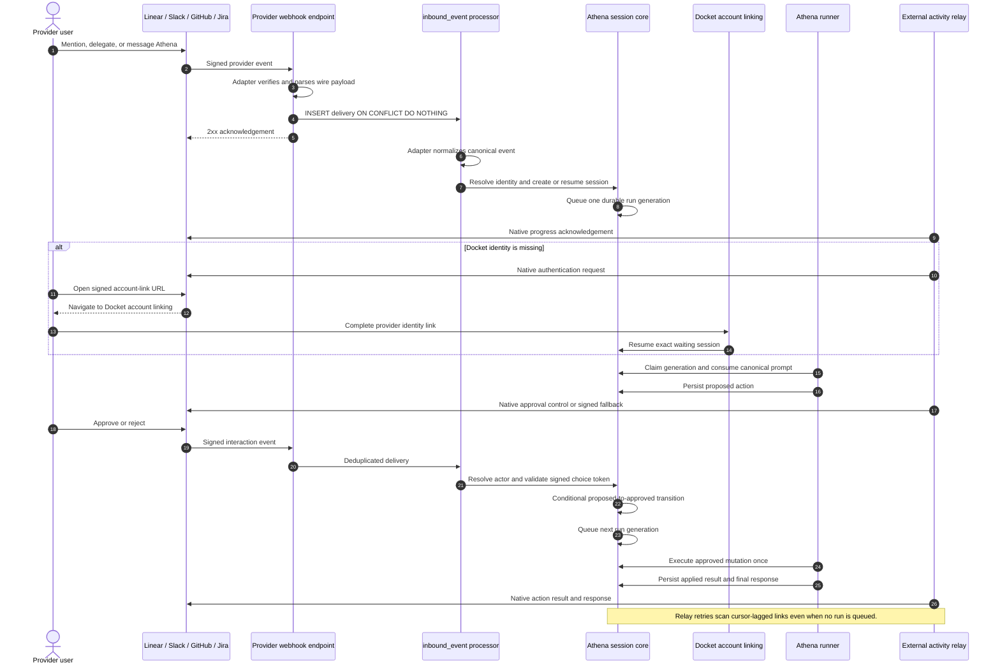

# External Agent Interoperability Architecture

> **Reader:** Athena maintainers who will implement external agent surfaces. After reading this
> specification, they should preserve the durable Athena session core and add provider behavior
> only through the typed adapter registry defined here.

## Decision

Athena will treat Linear, Slack, GitHub, and Jira as external agent surfaces rather than separate
agent runtimes. Each surface receives provider-native events and renders provider-native output.
The existing Docket inbox, session-run queue, activity stream, approval gate, and external-session
link remain the authoritative execution substrate.

Linear ships first. Slack is the second required adapter. GitHub is the third. Jira's Rovo Agent
Connector is the first standards-based follow-up because it exposes remote agents through A2A 1.0.

TypeScript generics will bind each provider identifier to its own install, webhook, reference,
context, outbound, and receipt types at the adapter boundary. The durable core will consume a
non-generic canonical event union. Provider wire types must not enter session orchestration,
approval, storage, or tool execution.

This architecture adds no queue, worker, or general plugin framework. It reuses `inbound_event`,
`agent_session_run`, `session_activity`, and `agent_session_external_link`.

## Product contract

A person can invoke Athena from a supported provider, continue the conversation there, authorize
Athena there, stop Athena there, and receive progress and results there. Athena may send the person
to Docket only when the provider cannot host an authorization ceremony or the person requests the
full Docket session.

Every supported provider must preserve these invariants:

1. Athena stores an authenticated inbound delivery before it acknowledges the provider.
2. Athena processes one provider delivery once even when the provider retries it.
3. Athena attributes a prompt to a Docket actor before it performs an authorized mutation.
4. Athena ties an approval to one proposed action and checks the approver's current Docket access.
5. Athena executes an approved mutation at most once.
6. Athena relays persisted activity in order without rerunning the agent after a relay failure.
7. Athena stops future tool calls after a provider stop request reaches the session.
8. Provider failures remain visible and retryable without exposing provider error text to users.

The outbound activity projection is at-least-once. Linear does not document an idempotency key for
`agentActivityCreate`, so no architecture can promise exactly-once message display after an
ambiguous network timeout. The execution and approval paths remain exactly-once at Docket's
mutation boundary.

## System boundaries

The design has three boundaries.

The durable agent core owns session state, execution, approvals, audit, and activity. It knows only
canonical Docket types.

An agent-surface adapter owns provider authentication, webhook verification, wire parsing, native
context normalization, capability declaration, activity rendering, and provider API calls.

A work-graph connector owns task and planning-object synchronization. It remains separate because
Slack has conversations but no equivalent work graph. A GitHub or Linear installation may use both
boundaries without either boundary depending on the other.

## Component diagram

This component diagram shows modules at the Docket API component level. Provider APIs and the
existing Athena runner sit outside that module boundary.



The registry selects one adapter. Ingress and relay never branch on provider names. Work-graph
reconciliation does not pass through the agent-surface registry.

## Typed adapter registry

The generic contract associates each provider with its wire types. It does not make the canonical
core generic.

```ts
export type AgentSurfaceProvider = 'linear' | 'slack' | 'github' | 'jira_a2a';

export interface ExternalRef {
  readonly id: string;
  readonly url?: string;
}

export interface SurfaceTypeFamily<P extends AgentSurfaceProvider> {
  readonly provider: P;
  readonly verification: object;
  readonly install: object;
  readonly webhook: object;
  readonly workspaceRef: ExternalRef;
  readonly sessionRef: ExternalRef;
  readonly actorRef: ExternalRef;
  readonly nativeContext: object;
  readonly outbound: object;
  readonly receipt: ExternalRef;
}

type DefineSurfaceRegistry<
  T extends { readonly [P in AgentSurfaceProvider]: SurfaceTypeFamily<P> },
> = T;

export type AgentSurfaceRegistry = DefineSurfaceRegistry<{
  readonly linear: LinearSurfaceTypes;
  readonly slack: SlackSurfaceTypes;
  readonly github: GitHubSurfaceTypes;
  readonly jira_a2a: JiraA2ASurfaceTypes;
}>;

export type SurfaceTypes<P extends AgentSurfaceProvider> = AgentSurfaceRegistry[P];
```

Each provider type family uses schemas owned by its adapter. The `webhook` member is the inferred
type of a strict Zod schema after signature verification. The raw body remains `unknown` until that
schema succeeds.

```ts
export interface LinearSurfaceTypes extends SurfaceTypeFamily<'linear'> {
  readonly verification: LinearAgentVerification;
  readonly install: LinearAgentInstall;
  readonly webhook: LinearAgentWebhook;
  readonly workspaceRef: LinearWorkspaceRef;
  readonly sessionRef: LinearAgentSessionRef;
  readonly actorRef: LinearActorRef;
  readonly nativeContext: LinearPromptContext;
  readonly outbound: LinearAgentActivityInput;
  readonly receipt: LinearAgentActivityRef;
}

export interface SlackSurfaceTypes extends SurfaceTypeFamily<'slack'> {
  readonly verification: SlackAgentVerification;
  readonly install: SlackAgentInstall;
  readonly webhook: SlackAgentEvent;
  readonly workspaceRef: SlackTeamRef;
  readonly sessionRef: SlackThreadRef;
  readonly actorRef: SlackUserRef;
  readonly nativeContext: SlackAppContext;
  readonly outbound: SlackAgentMessageInput;
  readonly receipt: SlackMessageRef;
}

export interface GitHubSurfaceTypes extends SurfaceTypeFamily<'github'> {
  readonly verification: GitHubAgentVerification;
  readonly install: GitHubAgentInstall;
  readonly webhook: GitHubAgentWebhook;
  readonly workspaceRef: GitHubInstallationRef;
  readonly sessionRef: GitHubDiscussionRef;
  readonly actorRef: GitHubUserRef;
  readonly nativeContext: GitHubWorkContext;
  readonly outbound: GitHubAgentOutput;
  readonly receipt: GitHubOutputRef;
}

export interface JiraA2ASurfaceTypes extends SurfaceTypeFamily<'jira_a2a'> {
  readonly verification: JiraA2AVerification;
  readonly install: JiraA2AInstall;
  readonly webhook: A2ARequest;
  readonly workspaceRef: JiraSiteRef;
  readonly sessionRef: A2ATaskRef;
  readonly actorRef: AtlassianUserRef;
  readonly nativeContext: A2ATaskContext;
  readonly outbound: A2AMessageOrArtifact;
  readonly receipt: A2AEventRef;
}
```

These provider types live beside their adapters. They name wire contracts and provider references.
They are not database DTOs.

```ts
export interface RawWebhook {
  readonly body: string;
  readonly headers: Readonly<Record<string, string | undefined>>;
  readonly receivedAt: Date;
}

export interface VerifiedWebhook<TPayload extends object> {
  readonly deliveryId: string;
  readonly eventType: string;
  readonly payload: TPayload;
}

export interface AgentSurfaceAdapter<P extends AgentSurfaceProvider> {
  readonly provider: P;
  readonly capabilities: AgentSurfaceCapabilities;

  verify(
    input: RawWebhook,
    verification: SurfaceTypes<P>['verification'],
  ): Promise<VerifiedWebhook<SurfaceTypes<P>['webhook']>>;

  parse(payload: unknown): SurfaceTypes<P>['webhook'];

  route(input: VerifiedWebhook<SurfaceTypes<P>['webhook']>): AgentSurfaceRoute;

  normalize(
    input: VerifiedWebhook<SurfaceTypes<P>['webhook']>,
    context: SurfaceTypes<P>['nativeContext'],
  ): Promise<readonly CanonicalAgentEvent[]>;

  render(
    activity: CanonicalAgentActivity,
    context: ExternalSessionProjectionContext,
  ): SurfaceTypes<P>['outbound'];

  publish(
    install: SurfaceTypes<P>['install'],
    session: SurfaceTypes<P>['sessionRef'],
    output: SurfaceTypes<P>['outbound'],
  ): Promise<SurfaceTypes<P>['receipt']>;
}
```

The registry uses `satisfies` so adding a provider without a complete adapter fails type checking.

```ts
export const agentSurfaceAdapters = {
  linear: linearAgentSurface,
  slack: slackAgentSurface,
  github: githubAgentSurface,
  jira_a2a: jiraA2aAgentSurface,
} satisfies {
  readonly [P in AgentSurfaceProvider]: AgentSurfaceAdapter<P>;
};

export function agentSurfaceFor<P extends AgentSurfaceProvider>(
  provider: P,
): (typeof agentSurfaceAdapters)[P] {
  return agentSurfaceAdapters[provider];
}
```

The provider families may contain types such as `LinearAgentSessionEvent`, `SlackEventEnvelope`,
`GitHubAppWebhook`, and `A2AMessage`. Those names must not appear in the canonical types below.

## Canonical ingress contract

Every adapter normalizes provider input into this closed union:

```ts
export interface CanonicalExternalActor {
  readonly externalId: string;
  readonly email?: string;
  readonly displayName?: string;
}

export interface CanonicalPromptContext {
  readonly prompt: string;
  readonly guidance: readonly string[];
  readonly workItem?: {
    readonly externalId: string;
    readonly title?: string;
    readonly url?: string;
  };
  readonly references: readonly ExternalRef[];
}

export type CanonicalAgentEvent =
  | {
      readonly type: 'session_started';
      readonly workspaceId: string;
      readonly externalSessionId: string;
      readonly actor: CanonicalExternalActor;
      readonly context: CanonicalPromptContext;
      readonly trigger: 'mention' | 'delegation' | 'message';
    }
  | {
      readonly type: 'prompt_received';
      readonly externalSessionId: string;
      readonly externalActivityId: string;
      readonly actor: CanonicalExternalActor;
      readonly body: string;
    }
  | {
      readonly type: 'approval_selected';
      readonly externalSessionId: string;
      readonly externalActivityId: string;
      readonly actor: CanonicalExternalActor;
      readonly choiceToken: string;
    }
  | {
      readonly type: 'stop_requested';
      readonly externalSessionId: string;
      readonly externalActivityId: string;
      readonly actor: CanonicalExternalActor;
    };
```

The canonical prompt carries only content Athena can use across providers. The verified raw payload
stays in `inbound_event.payload` for diagnostics and future reprocessing. Provider-specific context
does not enter the model transcript unless the adapter translates it into the canonical envelope.

## Canonical activity and surface capabilities

`session_activity` remains the canonical source. Relay converts each row into a provider-native
payload. Controls describe intent rather than provider widgets.

```ts
export type AgentSurfaceCapabilities = Readonly<{
  progress: 'activity' | 'message_status' | 'check_run' | 'stream';
  approval: 'select' | 'buttons' | 'check_actions' | 'reply';
  authentication: 'signal' | 'button_link' | 'plain_link';
  stop: 'signal' | 'button' | 'reply';
  plans: boolean;
}>;

export type CanonicalAgentControl =
  | {
      readonly type: 'approval';
      readonly activityId: string;
      readonly approveToken: string;
      readonly rejectToken: string;
    }
  | {
      readonly type: 'authentication';
      readonly url: string;
      readonly externalActorId: string;
    };

export type CanonicalApprovalStatus =
  'proposed' | 'approved' | 'executing' | 'rejected' | 'applied';

export interface ExternalSessionProjectionContext {
  readonly provider: AgentSurfaceProvider;
  readonly externalWorkspaceId: string;
  readonly externalSessionId: string;
  readonly externalWorkItemId?: string;
}

export interface CanonicalAgentActivity {
  readonly id: string;
  readonly type: 'thought' | 'action' | 'response' | 'elicitation' | 'error';
  readonly body: SessionActivityBody;
  readonly approvalStatus: CanonicalApprovalStatus | null;
  readonly control?: CanonicalAgentControl;
  readonly ephemeral: boolean;
  readonly updatedAt: Date;
}
```

Capabilities are runtime data because relay must choose fallbacks. Generics enforce wire type
correctness. They do not pretend that every provider has the same controls.

## Provider projections

The first four adapters project the canonical contract as follows:

| Capability     | Linear                      | Slack                                | GitHub                                                                        | Jira A2A                   |
| -------------- | --------------------------- | ------------------------------------ | ----------------------------------------------------------------------------- | -------------------------- |
| Start          | `AgentSessionEvent.created` | app mention or agent DM              | issue or pull-request command; configured assignment where available          | A2A task/message           |
| Follow-up      | `prompted` activity         | thread or DM message                 | `issue_comment`                                                               | A2A message                |
| Progress       | thought/action activities   | agent session status and messages    | issue/PR comment or check run                                                 | A2A status/artifact stream |
| Approval       | `select` signal             | Block Kit Approve/Reject buttons     | check-run requested actions on pull requests; signed reply fallback elsewhere | A2A input request          |
| Authentication | `auth` signal               | Block Kit link button                | signed link in comment or check output                                        | A2A input request with URL |
| Stop           | stop signal                 | Block Kit button or explicit message | signed comment command or requested action                                    | A2A cancel task            |
| Result         | response activity           | thread or DM message                 | issue/PR comment and check conclusion                                         | A2A artifact/final message |

Linear uses `promptContext` as the initial canonical prompt. Slack uses the current app context only
after it verifies that the installation can read the referenced channel. GitHub uses issue,
pull-request, repository, and comment context available to the GitHub App installation. Jira uses
the A2A task context supplied by Rovo.

GitHub requested actions exist only on check runs in pull-request views. The adapter must use a
signed reply fallback for an issue with no check-run surface. This is a capability difference, not
a reason to leak GitHub branches into approval orchestration.

## Durable data model

The implementation will reuse existing tables.

`inbound_event` becomes the single inbox for `linear_agent`, `slack_agent`, `github_agent`, and
`jira_a2a`. The unique `(provider, external_event_id)` index remains the delivery replay fence.

`agent_session_run` remains the only execution queue and lease. A provider event may queue one new
generation after its canonical event commits.

`session_activity` remains the canonical transcript and outbound projection source. An inbound
human prompt is inserted once by the inbox processor. The relay never echoes that row back to its
origin surface.

`agent_session_external_link` remains one origin surface per Athena session. It will retain
`provider`, `externalWorkspaceId`, and `externalSessionId`. `externalIssueId` will become the more
general `externalWorkItemId`. The table will add `relayStatus`, `relayAttempts`, `nextRelayAt`, and
`lastRelayError`. The existing `(lastRelayedActivityUpdatedAt, lastRelayedActivityId)` cursor will
continue to order delivery. A unique constraint on `(provider, externalWorkspaceId,
externalSessionId)` will prevent two Athena sessions from claiming one provider thread.

`integration.connection` will store the provider workspace reference and provider app/bot actor
reference after installation. Credentials remain sealed in `integration_credential`.

No table will store provider authorization as Docket authority. External identities only locate a
Docket actor. Every mutation rechecks the actor's current Docket permission.

## HTTP-style process diagram

This sequence diagram shows the common request path. The adapter changes the wire messages and
controls. The core sequence stays fixed.



The webhook request never waits for model execution. A provider-specific fast acknowledgement may
run after persistence with a strict timeout. Its failure leaves the same persisted activity for the
relay sweep.

## Approval and authentication

An approval control carries opaque signed values. A value binds the provider, organization,
session, proposed activity, and decision. The server does not trust visible button labels or free
text. The conditional `approval_status = 'proposed'` update is the replay fence.

The provider actor must resolve to a Docket actor. The approval handler then runs the existing
authorization policy against that actor and the proposed tool. Mapping an external account does not
grant workspace access.

An authentication control carries a short-lived signed continuation containing the provider,
external actor, Docket session, and return surface. The existing account-link callback consumes the
continuation and queues the exact waiting session. The design needs no pending-auth table.

## Relay and failure policy

The relay sweep selects external links whose cursor trails session activity or whose retry time is
due. It does not select through `agent_session_run`. A terminal run can therefore continue relaying
after a provider outage or after a later approval changes an existing action row.

Relay advances its compound activity cursor only after a successful provider call or a deliberate
skip of an inbound human row. It stops at the first failure to preserve order. Backoff and attempt
state live on the external link. A permanently revoked installation marks the integration and link
as errored and notifies the integration owner through application-owned copy.

The provider receipt is diagnostic. Docket's activity row remains canonical. A timeout with an
unknown provider outcome retries because losing a response is worse than displaying a duplicate
response. The duplicate can never cause a second Docket mutation.

## Work-graph synchronization

Agent-surface interoperability does not expand the work-graph contract.

Linear will gain write-capable OAuth and full two-way issue creation, field updates, relationships,
completion, and cancellation. Projects, cycles, and label definitions will remain explicitly
inbound-only until their outbound adapters exist.

GitHub work synchronization may later map issues and pull requests through `WorkGraphConnector`.
The GitHub Agent surface must ship without depending on that mapping. Slack will not implement a
work-graph connector merely to satisfy a shared interface.

## Security boundaries

Each adapter verifies the provider signature against the exact raw request body. It rejects stale
requests according to the provider's replay contract. It resolves the installed workspace before
it resolves a user or session.

Provider payloads, prompts, comments, issue bodies, and guidance are untrusted input. The adapter
envelopes them before the model reads them. Provider errors never become user-facing copy.

The external session link is tenant-scoped. A provider session cannot move between Docket
organizations. Account linking and approval use signed, expiring continuations. Tool execution
uses current Docket permissions and never the provider's role as a substitute.

Slack channel context requires a successful access check before Athena reads channel content.
GitHub access remains bounded by the installation's repository permissions. Jira remains bounded
by the Rovo installation and A2A task. Linear remains bounded by the installed workspace.

## Rollout order

The first slice extracts the typed registry and provider-neutral relay while keeping Linear as the
only registered adapter. Its tests prove that the refactor preserves existing behavior.

The second slice closes Linear installation, workspace routing, prompt ingestion, identity,
approval, stop, retry, OAuth write scope, and live round-trip blockers.

The third slice adds Slack Agents with app mentions, direct messages, context, Block Kit approvals,
account linking, stop, and streamed or status-backed progress.

The fourth slice adds a GitHub App surface for issue and pull-request prompts, comments, check-run
progress, requested-action approvals, and signed fallbacks.

The fifth slice implements Jira's A2A 1.0 adapter. It validates that the registry supports a
standards-based transport without changing the durable core.

Each slice must pass provider contract tests against the same canonical event fixtures. Each
provider also needs a sandbox round trip before its adapter can be enabled in production.

## Rejected alternatives

A new generic plugin SDK would add lifecycle, loading, versioning, and security machinery before a
second adapter exists. A closed in-process registry gives compile-time coverage without that cost.

A generic inbox or outbox table beside the existing durable tables would duplicate leases,
retries, and operational tooling. The existing inbox and activity cursor already express the
required invariants.

A fully generic session core would carry provider type parameters through database and runtime
code. That would couple durable behavior to wire formats and make mixed-provider processing harder.
Generics belong at the adapter boundary.

A lowest-common-denominator UI contract would discard Linear selections, Slack buttons, GitHub
check actions, and A2A input requests. The capability manifest preserves native interaction and
requires explicit fallbacks.

One Athena session mirrored simultaneously into several external providers would create ambiguous
audience, identity, and disclosure rules. One external origin per session remains the rule. Athena
may create separate linked sessions for separate surfaces.

## Open constraints

Linear's Agent API remains a developer preview. Jira's A2A connector remains a preview. GitHub
requested actions apply to check runs rather than every issue. Slack paid-plan and installation
requirements vary by agent feature. Adapter contract tests and sandbox release gates must therefore
detect provider drift.

The providers do not all expose idempotent message creation. The architecture guarantees durable
retry and mutation idempotency. It does not claim exactly-once rendering on a remote surface.

## Provider references

- Linear defines Agent sessions, activities, selections, authentication, and stop signals in its
  [Agent interaction](https://linear.app/developers/agent-interaction) and
  [Signals](https://linear.app/developers/agent-signals) documentation.
- Slack defines its current session and context model in
  [Developing an agent](https://docs.slack.dev/ai/developing-agents/) and its interactive controls
  in [Block Kit](https://docs.slack.dev/block-kit/).
- GitHub defines installation-scoped webhook delivery in
  [Using webhooks with GitHub Apps](https://docs.github.com/en/apps/creating-github-apps/registering-a-github-app/using-webhooks-with-github-apps)
  and approval-like pull-request controls in
  [Check runs and requested actions](https://docs.github.com/en/rest/guides/using-the-rest-api-to-interact-with-checks).
- Atlassian defines remote Jira agents and A2A 1.0 transport in the
  [Rovo Agent Connector](https://developer.atlassian.com/platform/forge/manifest-reference/modules/rovo-agent-connector/).
