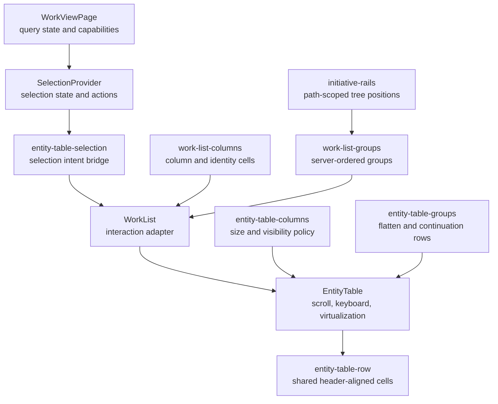
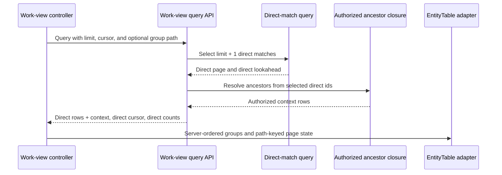

# Shared work roster correctness design

> **Reader:** The engineer who implements and reviews the work-view roster correction. The reader
> must preserve these ownership boundaries and must not release the change until the acceptance
> gate passes against a production build.

## Decision

The web app will use `EntityTable` as the only column-aligned roster layout. `WorkList` will stop
building a header next to a separate `ListView` body. The shared table will own column sizing,
responsive disclosure, header placement, horizontal scrolling, row height, virtualization,
grouping, and grid semantics. Feature adapters will supply columns, rows, grouping data, selection,
navigation, and drag behavior.

The correction also fixes the data contracts that made the Initiative roster wrong after it
rendered. The API will page direct Initiative matches before it adds ancestor context. Work-view
cache keys will live below their entity collection keys. Group page state will use full group paths
and will keep each failure beside the request that failed.

This design does not add a second `RosterLayout` abstraction. The repository already has the
shared component that the product needs. Adding another component would preserve the duplicate
ownership that caused the defect.

## Confirmed causes

The visible defect comes from several contracts that disagree:

- `WorkList` renders its header outside the virtual body. The header and rows use different left
  insets and live in different scroll coordinate spaces.
- Every selected Initiative property appears at the 672px container breakpoint. Those fixed
  columns consume 592px before the identity cell gets useful space.
- The identity column can shrink to zero because the shared flex-column style discards its
  declared minimum width.
- Initiative rails inspect the wrong node when they decide whether an ancestor line continues.
  One existing test records the wrong result.
- Group pages append in network completion order. They derive counts from loaded rows, hide their
  continuation buttons from sighted users, and key duplicate context rows by entity id alone.
- The API lets ancestor context consume the direct-row page limit. A child can therefore appear
  without its parent, and the cursor can describe a context row instead of a direct match.
- Initiative writes invalidate the owner workspace's legacy Initiative collection but not the
  separate work-view and facet cache families. A foreign-owned Initiative can appear in another
  workspace's hierarchy, so nesting keys under the route workspace alone cannot refresh every
  affected roster. A mounted roster can remain stale for 30 seconds.
- The controller combines initial load, continuation, facet, preference, save, and default-view
  failures into one fatal error. A recoverable failure can replace a loaded roster.
- `EntityTable` and `SelectionProvider` both implement arrow-key focus. Combining their current
  container props gives one grid two active rows and two focus strategies. List, card, and board
  renderers also own different parts of selection and Initiative context behavior. Context
  ancestors can become selectable or draggable, and hidden ids can remain selected.
- Team and Cycle rosters repeat the same manual header/body grid pattern. An unused Program row
  renderer repeats it as dead code.

The current focused unit suite passes despite these failures because it asserts class strings and
the bad rail result. The optional screenshot suite uses short, shallow fixtures and does not run in
the release gate.

## Component ownership

The following component diagram shows the modules inside the shared roster boundary. Every node is
a UI or web application module.



`EntityTable` owns one scrollport. Its header and every data cell consume the same `Column<T>[]`,
the same `columnStyle`, the same gap, and the same horizontal padding. The header stays inside the
grid and sticks to the top of that scrollport while virtual rows move below it.

`WorkList` becomes a thin adapter. It converts target rows into navigation objects, composes the
shared selection-intent and drag bindings, and passes the resulting columns and groups to
`EntityTable`. It does not declare a width, breakpoint, header cell, group count, scrollbar, or
focus model.

`work-list-columns` owns the target field catalog and the identity cell. The identity header and a
root row reserve the same 32px glyph slot plus a 12px gap. Hierarchy indentation occurs inside that
cell and cannot move any other column boundary.

`work-list-groups` turns the server summaries and path-keyed page state into nested
`EntityTableGroup` values. It preserves the order of `response.groups` even when page requests
finish in a different order. It uses the server count and adds a visible continuation or retry at
the end of the exact group that owns it.

`initiative-rails` remains pure. It computes positions per group-path membership rather than in
one global map keyed by Initiative id. A context ancestor can appear in two groups without sharing
rail state.

## Shared table contract

The shared package will extend `EntityTable` without changing the default behavior of existing
callers. The new group contract supports either rows or child groups:

```typescript
interface EntityTableGroupBase {
  readonly id: string;
  readonly label: string;
  readonly decoration?: React.ReactNode;
  readonly count?: number;
  readonly continuation?: EntityTableContinuation;
}

interface EntityTableContinuationBase {
  readonly id: string;
  readonly label: string;
}

type EntityTableContinuation = EntityTableContinuationBase &
  (
    | { readonly state: 'idle' | 'error'; readonly onActivate: () => void }
    | { readonly state: 'loading'; readonly onActivate?: never }
  );

type EntityTableGroup<T> = EntityTableGroupBase &
  (
    | { readonly rows: readonly T[]; readonly children?: never }
    | { readonly children: readonly EntityTableGroup<T>[]; readonly rows?: never }
  );
```

The group id is the encoded full group path. `count` is authoritative when present. The table uses
`rows.length` only for existing callers that omit it. A typed continuation becomes a real
flattened row. Its stable id, visible label, pending state, and activation callback let
virtualization, keyboard indexing, row counts, and Enter activation include it without DOM probing.
The table-level contract accepts the same continuation for an ungrouped root page. Existing
arbitrary `endAdornment` content remains display-only for backward compatibility.

An idle or error continuation renders as a valid grid or treegrid row with one gridcell and a
visible application-owned action label. A loading continuation renders the same row with
`aria-disabled="true"` and `aria-busy="true"`. It has no activation callback. Pointer activation and
Enter therefore cannot start a duplicate page request while the first request is pending.

`EntityTableProps<T>` gains these capabilities:

- `tone: 'outlined' | 'tonal'` preserves the current outlined default and lets work rosters use
  their existing tonal panel without wrapping a second layout around the table.
- `rowHeight?: number` sets the rendered row minimum and the virtualizer estimate together. The
  table derives the estimate from shared density when the caller omits it.
- `gridRole: 'grid' | 'treegrid'` defaults to `grid`.
- `getRowAria?: (row: T) => EntityTableRowAria` supplies `level`, `posInSet`, `setSize`, and
  `expanded` without coupling the UI package to Initiative types.
- Active-entry and selection-command callbacks expose row navigation, Shift extension, toggle,
  select-all, and clear intents while `EntityTable` retains one `aria-activedescendant`.

The selection boundary uses this generic contract:

```typescript
interface EntityTableSelectionModifiers {
  readonly shiftKey: boolean;
  readonly metaKey: boolean;
  readonly ctrlKey: boolean;
}

interface EntityTableSelectionCommand {
  readonly command:
    'replace' | 'toggle' | 'range' | 'move-active' | 'extend-active' | 'select-all' | 'clear';
  readonly activeEntryKey: string | null;
  readonly targetSelectionKey: string | null;
  readonly anchorSelectionKey: string | null;
  readonly orderedSelectionKeys: readonly string[];
  readonly modifiers: EntityTableSelectionModifiers;
}
```

`getRowSelectionKey(row)` returns a key for an eligible route-owned direct data row and `undefined`
for context or foreign-owned rows. The table derives `orderedSelectionKeys` from its flattened
entries. Group headers and continuations can become the active entry without joining that array.
The application supplies its current selection anchor and maps each command to `SelectionIntent`.
It never reconstructs flattened table order. `SelectionProvider` exposes
`dispatchInOrder(intent, orderedSelectionKeys)`. That method validates the keys against provider
items and applies the intent against the order supplied by the table. Existing `dispatch(intent)`
keeps its current item order for non-table surfaces.

The existing `containerInteraction` remains available for scroll observation and refs, but its
type excludes `onKeyDown`, `role`, `tabIndex`, and `aria-activedescendant`. Row interaction can add
pointer, selection, and drag/drop state. It cannot add a focus ref or row `tabIndex`. The TaskTable
migration removes the only production caller that currently injects both focus systems. These type
boundaries stop another feature from restoring dual keyboard ownership.

The shared flex-column style will honor `minWidth`. The package will extend `ColumnPriority` from
three optional tiers to the existing container scale through 1280px. Existing priorities 1 through
3 retain their current 448px, 512px, and 576px meanings.

## Responsive sizing contract

The identity column uses `min(22rem, calc(100cqw - 1.5rem))` as its preferred minimum. It keeps a
32px glyph slot and a 12px gap. Each Initiative depth adds 1.5rem inside the identity cell. At
containers of at least 376px, these values produce the following text floors:

| Row     | Identity width | Fixed leading space | Hierarchy indent | Minimum title width |
| ------- | -------------: | ------------------: | ---------------: | ------------------: |
| Root    |          352px |                44px |              0px |               308px |
| Depth 2 |          352px |                44px |             24px |               284px |
| Depth 3 |          352px |                44px |             48px |               260px |
| Depth 4 |          352px |                44px |             72px |               236px |
| Depth 5 |          352px |                44px |             96px |               212px |

Below 376px, the identity cell uses the available row content width instead of forcing a horizontal
scrollbar for a one-column mobile list. At a 320px table container, the identity cell is 296px and a
root title retains 252px. A table scrolls horizontally only when visible metadata makes the full
column set wider than the container.

The work-view column builder stores numeric widths for every optional field. It reveals a property
only at the smallest container breakpoint that can hold the identity floor, row padding, gaps, and
all properties revealed before it. This calculation is pure and does not use `ResizeObserver`.
If a person selects more columns than the 1280px tier can hold, the `EntityTable` scrollport owns
the overflow. The document never gains horizontal overflow.

The table will test these container boundaries: 448px, 512px, 576px, 672px, 768px, 896px, 1024px,
1152px, and 1280px. Visible columns must form a monotonic set as width grows. Header and body cells
must change visibility together.

## Initiative hierarchy contract

The ordered Initiative model computes these facts for each rendered membership:

- The row depth starts at one.
- `aria-posinset` and `aria-setsize` describe siblings within the rendered parent.
- The elbow ends at 50 percent of the actual row height. Summary presence does not move it.
- An ancestor rail at depth `d` continues only when the next node on the current path has a later
  sibling. In a root-first ancestor array, that test uses `ancestors.slice(1)`.
- Context rows remain navigable. They are not selectable, draggable, editable, or counted as
  direct results.
- A detected corrupt cycle terminates deterministically. The model chooses the lexically smallest
  id in that cycle as the displayed root and marks the row for diagnostics. It never loops or emits
  a depth-two root.

The tree renderer uses `role="treegrid"`. Data rows expose `aria-level`, `aria-posinset`, and
`aria-setsize`. Decorative rails remain hidden from assistive technology. Flat Task, Project, and
Program rosters keep `role="grid"`.

## Query and pagination contract

The following sequence diagram shows one Initiative page. Each participant is a runtime component
that handles the request.



The page limit, keyset predicate, lookahead, and cursor apply to direct Initiative matches. The API
then adds the complete authorized ancestor closure for the selected direct page. The response
`rows` array may exceed `limit` only because of context. `totalCount` and every group count include
direct matches only. `nextCursor` describes the last direct row.

The wire response does not change. Existing `isContext` marks ancestor rows. The work-list adapter
includes them in the tree. Card, board, and timeline renderers exclude them unless that renderer
has an explicit context presentation.

A direct Initiative is presentable only when the caller can read its complete ancestor chain in
the requested context. The recursive CTE traverses hierarchy links in that context independently
from the authorized row join. A chain reaches a real root only when no parent link exists. If a
link exists and its parent row is unauthorized, the chain fails instead of treating the missing
authorized join as a root. The API removes that child from the direct universe before counts,
paging, and cursors. It returns neither the child nor the unreadable parent id. The API never turns
the child into a fake root and never leaks a dangling `parent` or `parentLinkId`.

Group state uses `workViewGroupPathKey(path)`. Each path stores its rows, next cursor, loading
state, and error. The controller derives visible group order from `response.groups`, not from state
insertion order. A retry repeats the failed path and cursor.

## Cache and mutation contract

Work-view query and facet keys will become descendants of their target entity collection:

```text
['org', orgId, 'initiatives', 'work-view', target, instance, timezone, request]
['org', orgId, 'initiatives', 'work-view-facets', target, instance, timezone, request]
```

The key builder will map all four targets to the corresponding Tasks, Projects, Programs, or
Initiatives collection prefix. Collection invalidation then refreshes ordinary same-workspace
overview, roster, and facet reads through TanStack Query prefix matching. Order and timeline
mutations will stop using raw `['org', orgId, 'work-view']` arrays and will call the same key builder.

Key ancestry is not sufficient for cross-workspace Initiative context. One centralized
`invalidateWorkTargetQueries` helper will invalidate the mutated owner's collection and every
cached roster or facet for that target across route workspaces. It returns the active-refetch
promise, while product mutations start that promise without keeping their controls pending.
Initiative create, patch, delete, status, label, display, relation, hierarchy, and order mutation
paths will call it. A real `QueryClient` test will put a workspace-B Initiative in workspace A's
hierarchy, subscribe to both queries, mutate it through B, and prove that A's mounted roster and
facet refetch immediately while Project work views do not refetch.

## Selection, permissions, and drag behavior

`EntityTable` will be the sole focus and keyboard-navigation owner for table presentations. It will
navigate its complete flattened sequence, including group headers and typed continuation rows,
through one `aria-activedescendant`. An application adapter will translate table callbacks into the
pure `SelectionIntent` model. It will not spread `SelectionProvider.containerProps`, row `tabIndex`,
or row focus refs onto the table.

`SelectionProvider` will retain selection state, its anchor, action registration, pruning, and
selected objects. Its item list will contain visible route-owned direct rows only. Group headers,
continuations, context rows, and foreign-owned rows remain keyboard-navigable where appropriate but
never enter the selection order. A foreign-owned direct row retains its single-row Open and Copy
link actions. It cannot join bulk Copy links because the current action context has one owning
workspace and cannot route a mixed-workspace selection safely. It never enters a drag payload or an
entity/property write. The provider receives a React `key` that includes organization, target, and
query execution identity. Its surface id uses the same identity. Switching workspace, saved view,
search, or effective query therefore remounts the selection state and clears the old selection.

The copied state will use the exact selected-object signature. A changed selection returns the
action label to `Copy links`. A rejected clipboard write never reports success.

`WorkViewPage` will read route capabilities once. Route `manage` controls saved defaults. Route
`contribute` controls creation and route-owned context operations. A row is eligible for an entity
write or generic drag only when it is a direct row, its `organizationId` equals the route
organization, and the route grants that operation. Foreign-owned rows remain read-only in this
roster even when they are direct matches. The person can navigate to the owner workspace to use its
owner-scoped controls. The API remains authoritative.

The route organization and a row's owning organization remain separate values. The Initiative root
drop target uses the route organization. Navigation and object identity use the row owner. The
client shows a rejecting preview for a cycle only when it can prove the cycle from loaded ancestry.
It shows a neutral preview when unloaded descendants make the result unknown, and the API decides
the drop.

Work-list density comes from `definition.presentation.density`, not shell density and not a fixed
56px value. One map assigns 44px to `compact` and 56px to `comfortable`. The row CSS, virtualizer,
rail center, and browser assertions consume the same resolved height.

## Failure ownership

Only an initial roster query failure with no cached rows replaces the roster. Other failures stay
where the person can recover from them:

| Failure            | Owner             | Recovery                                    |
| ------------------ | ----------------- | ------------------------------------------- |
| Initial roster     | Page body         | Retry the initial query                     |
| Root continuation  | Root table tail   | Retry that cursor                           |
| Group continuation | Owning group tail | Retry that path and cursor                  |
| Facet query        | Filter builder    | Retry that facet request                    |
| Saved-view list    | Saved-view tabs   | Keep cached tabs and retry the list         |
| Save view          | Save dialog       | Keep form input and submit again            |
| Set default        | Default action    | Keep roster and retry the action            |
| Preference write   | Changed control   | Keep local presentation and retry the write |

Application-owned copy replaces exception and provider text in every case.

## Remaining roster cleanup

After `WorkList` moves to `EntityTable`, Team and Cycle row presentations will use the same shared
component. The unused `ProgramRows` implementation will be removed while `ProgramCards` remains.
The two CSS-string exports in `views/roster-grid.ts` will then have no callers and will be deleted.

An architecture test will reject `role="columnheader"` in `apps/web/src`. The UI package owns
column-header markup. Product features can add a new data-grid primitive in the UI package if a
future surface needs a different contract.

## Release acceptance

The deterministic release test will run from `apps/web/e2e/release`. It will use a production Web
build and PostgreSQL. It will assert behavior and geometry instead of checking class strings.

The browser matrix includes 1440x900, 1016x1724, 768x900, 390x844, and 320x844 for Task, Project,
Program, and Initiative work rosters. The Team and Cycle adapters run at 1016x900 and 390x844. The
1016px Initiative case runs with the sidebar expanded and collapsed because the table responds to
its container rather than to the viewport. The fixture includes two roots, an only child, a
grandchild, a later sibling, long titles, duplicate context across groups, and a group with 101
direct rows. The 1016px and 390px Initiative cases run in compact and comfortable density so the
same test checks 44px and 56px row geometry.

The release test will prove all of these outcomes:

- Each visible header/body `data-col` pair has the same x-coordinate and width within one CSS
  pixel before and after horizontal scrolling.
- Header label text aligns with root row text. Cell-edge equality alone does not satisfy the test.
- Root and depth-five titles keep their stated minimum widths at containers of at least 376px. At
  320px, the identity cell fills the available row content without creating document overflow.
- Column visibility grows monotonically with the container.
- Row CSS, virtualization, and rail centers use the same saved-density height.
- The header stays visible during vertical scrolling.
- Only the table scrolls horizontally. The document does not.
- Group counts remain server counts while pages load.
- Visible Load more and Retry actions operate on the owning group.
- Initial and continuation failures preserve the correct surface.
- Keyboard navigation, selection, and activation work through the grid.
- Create, rename, and reparent update a mounted Initiative roster without a reload.
- A viewer cannot see write affordances, and context rows cannot enter selection or drag payloads.
- A foreign-owned direct row remains navigable and keeps its single-row Copy link action, but it
  cannot enter bulk selection, expose a write, or enter a drag payload.

The existing evidence suite will capture light and dark images at 1440px, 1016px, and 390px. Those
images support visual review. The geometry and interaction assertions block deployment.

The required `core-screen-smoke` CI job will run the complete `e2e/release` directory through one
package script. Its timeout will increase from 12 minutes to 30 minutes to cover the existing
five-minute screen budget, one production build, and the roster matrix with one worker. The gate
policy test will reject `continue-on-error`, an individual-spec command, a timeout below 30
minutes, or a deployment dependency that skips the release job.

A root `test:release` command will run the same contract locally. Its script builds a run id from
the shell PID and `RANDOM`. It names the PostgreSQL 17 container `docket-release-<run-id>` and the
database `docket_release_<run-id>`, with hyphens converted to underscores. Docker binds
`127.0.0.1::5432` so it chooses an unused database port. The script also chooses unused loopback API
and Web ports. It exports the same `APP_MODE=test`, URL, passkey, trusted-origin, auth, and database
variables as CI. The migration receives the generated database URLs explicitly and never inherits
`DATABASE_URL` from `.env.local`. The script builds the Web app, copies `.next/static` and `public`
into the standalone tree, records every owned PID, waits for API and Web health, and runs Playwright
with one worker. `EXIT`, `INT`, and `TERM` traps stop the processes and remove the container and
temporary directory. The tooling test inspects these fail-closed rules. The larger E2E workflow can
remain advisory until its unrelated suites meet the same deterministic standard. The repository
commits the runner with executable mode.

## Rejected alternatives

Patching `WorkList` widths was rejected because it would retain two layout owners and two scroll
spaces. A new `RosterLayout` was rejected because it would duplicate `EntityTable`. Adding a
separate `contextRows` response was rejected because `isContext` already expresses the distinction
and the wire change adds no behavior. Route-key ancestry alone was rejected because foreign-owned
Initiatives cross that cache boundary. Spreading both table and selection keyboard props was
rejected because a grid cannot have two active rows. Making the whole E2E workflow a deployment
gate was rejected because that workflow still contains evidence-only and unrelated flaky cases.

## Rollout and rollback

The shared UI extension keeps current defaults, so existing `EntityTable` callers do not change
until their adapters migrate. The API keeps the same response schema and needs no database
migration. The cache-key change creates a cold cache once and changes no persistent data.

Each implementation slice will land as one validated commit. The WorkList migration can be
reverted without reverting the API correction. The API correction can be reverted without a data
rollback. Production deployment remains blocked until the required release test passes for the
exact commit that will deploy.
