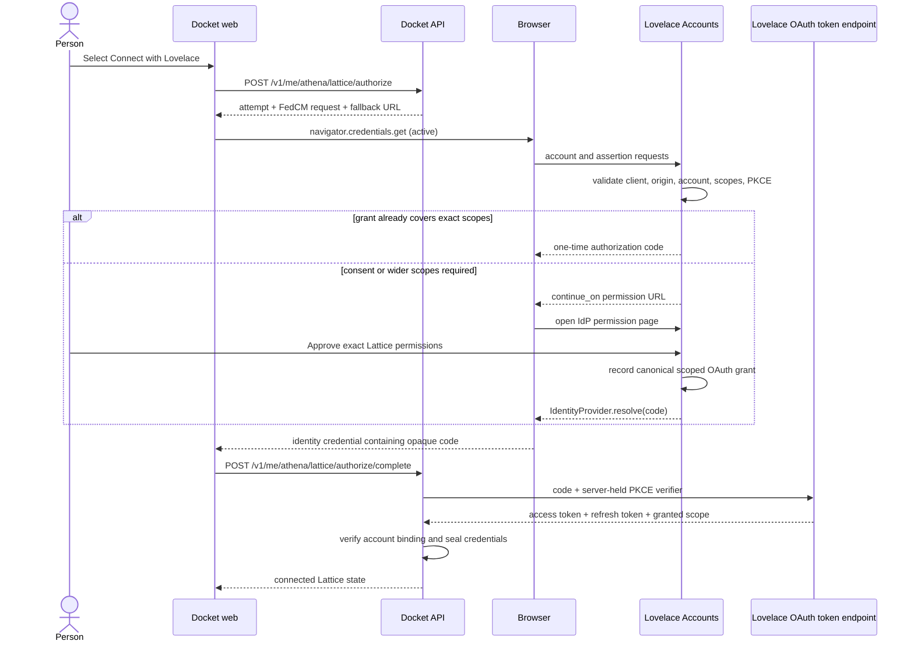

# FedCM-First Lovelace Lattice Authorization

> **Status**: Awaiting written-spec review
> **Date**: 2026-09-01
> **Audience**: Docket and Lovelace maintainers implementing connected Lattice access
> **Required action**: Approve this protocol and product boundary before implementation planning

## Decision

Docket will prefer the browser's native, user-activated FedCM dialog when a signed-in Docket user
chooses **Connect with Lovelace**. FedCM will select and authenticate the Lovelace account. Lovelace
OAuth 2.1 authorization code plus PKCE will continue to authorize the resulting Lattice access.

This is connected-service authorization, not Docket account sign-in. The person already has a
Docket session. Their Lovelace account supplies a grant that lets Docket list that account's paired
computers, submit Athena work to the chosen computer, and remain connected for scheduled work.
Docket will not create, merge, or replace its user record from the FedCM identity assertion.

The supported protocol is:

`Docket session -> active FedCM account selection -> Lovelace scoped grant -> one-time OAuth code -> Docket server token exchange -> Lattice`

When FedCM is unavailable, Docket will preserve the existing top-level OAuth redirect. Once a
FedCM dialog has opened, dismissal or a generic FedCM failure will not trigger a surprise redirect;
Docket will return to settings and offer an explicit **Continue in Lovelace** action.

## Standards Basis

The design uses the FedCM [active mode, Parameters API, and Continuation
API](https://developer.chrome.com/docs/identity/fedcm/implement/identity-provider) documented for
identity providers. The browser can return an OAuth authorization code from the continuation and
the relying party can exchange it through the ordinary token endpoint. Protocol behavior follows
the [W3C FedCM specification](https://w3c-fedid.github.io/FedCM/); browser support remains a runtime
capability, so redirect OAuth stays part of the product rather than acting as a temporary shim.

## Actors And Authority

- **Docket web** is the relying-party UI. It starts the browser ceremony and hands the resulting
  one-time code to the authenticated Docket API.
- **Docket API** is the public OAuth client `docket-athena`. It creates authorization attempts,
  holds the PKCE verifier, exchanges the code, seals the resulting credentials, and owns the
  connection lifecycle.
- **Lovelace Accounts** is both the FedCM identity provider and the OAuth authorization server. It
  authenticates the chosen Lovelace account, presents exact Lattice permissions when necessary,
  records the canonical scoped grant, and issues the OAuth authorization code.
- **Lattice** is the protected resource service. It accepts Lovelace access tokens with the required
  account-bound scopes. It is not an identity provider and never receives the Docket session.
- **The browser** owns the native account chooser and continuation dialog. Docket must not imitate
  those surfaces or assume that their exact copy, dimensions, or error detail are stable.

The OAuth grant is the authority for scopes and ongoing access. Lovelace's FedCM
`approved_clients` state may tell the browser that an account has previously interacted with
Docket, but it must never imply that a particular OAuth scope has been granted.

## Product Experience

### First Connection Or Wider Permissions

1. The person selects **Connect with Lovelace** from Docket's Athena Lattice settings.
2. Docket creates a short-lived authorization attempt and invokes FedCM in active mode from that
   click. No passive prompt, page-load prompt, or auto-reauthentication is allowed.
3. The browser shows the native Lovelace account selector. If Lovelace needs a login, the IdP's
   browser-managed login route handles it before account selection resumes.
4. Lovelace sees that the selected account lacks one or more requested scopes and returns a FedCM
   `continue_on` URL for an IdP-owned permission page inside the browser-controlled dialog.
5. The permission page names the actions Docket will be allowed to take:
   - **See your paired computers**
   - **Run Athena work on the computer you choose**
   - **Stay connected for scheduled work**
6. Approval records one canonical OAuth grant and resolves the FedCM ceremony with a one-time
   authorization code. Declining resolves no credential.
7. Docket exchanges the code server-side, shows the available computers, and lets the person pick
   one using the existing Lattice selection UI.

### Returning Connection

When the selected account's active Lovelace grant already covers the exact requested scope set,
Lovelace may return a fresh one-time authorization code immediately after the native account
selection. The user still initiates the flow. Widening the requested scope set always requires the
Lovelace continuation permission page.

### Unsupported Or Interrupted FedCM

If the browser is clearly incapable of FedCM before Docket invokes it, the click may go directly to
the existing Lovelace OAuth page. If Docket invokes FedCM and receives no credential, it cannot
reliably distinguish every privacy-preserving browser failure from user dismissal. It will show:

> Lovelace connection wasn't completed.

The page will retain **Continue in Lovelace** and **Cancel** actions. Only the first navigates to the
fallback authorization URL. This avoids turning a dismissed native dialog into an unexpected
cross-site navigation.

## End-To-End Protocol



The browser receives only an opaque, short-lived, one-use authorization code. Lovelace access and
refresh tokens never enter browser JavaScript, Docket logs, URLs, or analytics.

## Docket Authorization Attempt

`POST /v1/me/athena/lattice/authorize` will evolve from returning only a redirect URL to returning
one authorization-attempt envelope:

```json
{
  "attemptId": "opaque-random-id",
  "expiresAt": "2026-09-01T19:10:00.000Z",
  "fedcm": {
    "configURL": "https://auth.uselovelace.com/web-identity/config.json",
    "clientId": "docket-athena",
    "nonce": "opaque-random-nonce",
    "params": {
      "purpose": "oauth_authorization",
      "response_type": "code",
      "redirect_uri": "registered-docket-callback",
      "scope": "openid offline_access lattice:compute:inference lattice:compute:catalog:read",
      "nonce": "opaque-random-nonce",
      "code_challenge": "base64url-s256-challenge",
      "code_challenge_method": "S256"
    }
  },
  "fallbackAuthorizationUrl": "https://auth.uselovelace.com/oauth/authorize?..."
}
```

Values shown as opaque or registered are examples of shape, not literal runtime values. The scope
string is the current connection scope set. Adding durable delegation scopes later must go through
the same exact-scope consent rule rather than being silently absorbed by FedCM approval.

The API will create a cryptographically random attempt id, nonce, verifier, and signed fallback
state. An attempt expires after ten minutes. A new `lattice_authorization_attempt` record will hold
the owner, status, expiry, and a sealed payload containing the verifier, nonce, expected client,
redirect URI, and exact scope set. Its statuses are `pending`, `exchanging`, `completed`,
`superseded`, `expired`, and `failed`.

This record must be separate from `lattice_credential`. The current redirect implementation
replaces the one stored credential with its pending PKCE verifier. Keeping that behavior would
destroy a valid active connection as soon as its owner tried to relink and would leave them
disconnected if FedCM were dismissed. `lattice_credential` will return to holding only a usable,
sealed OAuth credential for the active connection. The migration will preserve every existing
connected credential.

One Docket owner has at most one open connection attempt, enforced by a partial unique index over
`pending` and `exchanging` states. Starting another transactionally marks the earlier pending
attempt superseded before inserting its replacement. FedCM and fallback redirect share the same
attempt; the first completion atomically claims `pending -> exchanging`. A repeat, stale tab, or
late callback returns a stable expired or superseded result and cannot replace a valid connection.

A successful exchange transactionally writes the new sealed credential and connected account,
then marks the attempt completed. A definite validation failure marks it failed. An ambiguous token
endpoint transport failure also ends that one-time attempt with `gateway_error`; Docket never
replays an authorization code whose redemption may already have succeeded. Every failed path
leaves the previously connected credential and runtime selection unchanged.

The fallback URL remains fully formed by the Docket API. The web app will not reconstruct OAuth
parameters or handle the PKCE verifier.

## Lovelace FedCM Authorization-Code Mode

Lovelace's existing FedCM assertion route issues an identity JWT for sign-in. Lattice connection
needs a separate result contract: an opaque OAuth authorization code. The accounts service will
extend the established FedCM provider configuration and assertion endpoint with an explicit
`params.purpose = "oauth_authorization"` branch. The current identity-JWT behavior remains the
default for existing Lovelace relying parties.

The authorization branch must reject the request unless all of these are true:

- the FedCM `Origin` matches a registered allowed origin for `docket-athena`;
- the OAuth client exists, is active, is public, and explicitly allows FedCM authorization-code
  mode;
- the selected `account_id` matches the active Lovelace browser session;
- the redirect URI exactly matches a registered URI for that client;
- every requested scope belongs to the client's allowed scope set;
- the request uses authorization code response type and an S256 PKCE challenge;
- the nonce, challenge, and request values satisfy their length and character constraints; and
- rate, session, FedCM `Sec-Fetch-Dest`, and credentialed-origin controls already required by the
  accounts service pass.

Lovelace will build the result through a dedicated authorization-code service, not through the
identity-JWT validator. That service will reuse the same OAuth grant and authorization-code stores
as the top-level `/oauth/authorize` route. FedCM must not create a parallel consent database.

If existing grant scopes are insufficient, Lovelace creates a one-time continuation transaction
and returns only its opaque URL in `continue_on`. The URL carries no scopes, account identifier,
email, PKCE verifier, or Docket state in its query. Server-side transaction state binds the
selected account, client, origin, redirect URI, scope set, nonce, and PKCE challenge. The
continuation page runs on the Lovelace IdP origin, applies the accounts service session and CSRF
controls, and calls `IdentityProvider.resolve(code)` only after explicit approval.

An authorization code expires after 60 seconds and is usable once. It is bound to the Lovelace
account, client id, exact granted scopes, redirect URI, nonce, and PKCE challenge. Code redemption
uses the current OAuth token endpoint; FedCM does not introduce a second token format or token
endpoint.

## Consent And Scope Semantics

The requested first-release scopes are:

- `openid` to verify the stable Lovelace subject associated with the connection;
- `lattice:compute:catalog:read` to list the account's paired runtimes;
- `lattice:compute:inference` to submit model work to the selected runtime; and
- `offline_access` to refresh authorization for scheduled Athena work without asking the person to
  remain in the browser.

The current redirect flow also requests `profile email`. Docket does not use either claim to
authorize Lattice access, so the FedCM-first release will remove them from both transports. If a
future product surface genuinely needs one, it must add that scope through the same wider-scope
consent path. The FedCM account chooser may display account information under browser and IdP
rules, but Docket will not retain those profile fields merely because the chooser displayed them.

The permission surface will describe capabilities, not merely reproduce scope identifiers.
`offline_access` must always be visible as **Stay connected for scheduled work** on first grant or
when added later. The native FedCM disclosure about identity data does not substitute for this
Lattice permission surface.

Grant lookup compares a normalized set. An equal or narrower request may complete without a second
permission page. Any wider request requires explicit approval for the complete resulting set so
the person can understand the connection as it will exist after approval.

## Completion, Token Custody, And Account Binding

Docket web will send the opaque browser result to a new authenticated endpoint:

```http
POST /v1/me/athena/lattice/authorize/complete
Content-Type: application/json

{"attemptId":"opaque-random-id","authorizationCode":"opaque-one-time-code"}
```

The API will require the same Docket owner who created the attempt. It will load and decrypt that
owner's attempt, compare the id and expiry, claim it with a status compare-and-set, and exchange the
code with the server-held verifier. It will then require the token response to contain the complete
expected scope set.

Docket will obtain the stable Lovelace issuer and subject from a server-verified OIDC result. It
will never bind the connection from browser-supplied email, display name, or unverified token
claims. The existing `lattice_connection.accountId` will continue to hold the stable Lovelace
account binding, while the sealed credential stores access token, refresh token, granted scope,
and token expiry. Reconnecting the same Docket owner to a different Lovelace subject clears the
selected runtime before the new connection becomes enabled.

The fallback OAuth callback and the FedCM completion endpoint will converge on one internal
completion service. Both paths perform the same owner, state or attempt, code, PKCE, issuer,
subject, scope, account-switch, encryption, and audit checks.

## Error Contract

Docket will expose application-owned outcomes and copy. It will not render Lovelace exception
messages or browser diagnostics. The connection flow distinguishes:

- `fedcm_unavailable`: no usable FedCM API was present before invocation;
- `fedcm_not_completed`: the invoked browser ceremony returned no credential or failed opaquely;
- `authorization_declined`: Lovelace reports an explicit denial from its continuation page;
- `authorization_expired`: the Docket attempt or Lovelace code exceeded its lifetime;
- `authorization_superseded`: a newer attempt replaced this one;
- `authorization_invalid`: client, state, code, nonce, PKCE, issuer, or account validation failed;
- `insufficient_scopes`: the redeemed grant omitted a required scope; and
- `gateway_error`: Lovelace could not complete an otherwise valid request.

Browser privacy behavior means Docket may not receive enough detail to label a FedCM rejection as
an explicit user cancellation. `fedcm_not_completed` is therefore the normal neutral copy. The
server logs the stable class, opaque attempt id, client id, transport, and trace id. It never logs
the code, verifier, nonce, token, email, account id, scope-bearing continuation URL, or provider
prose.

## Disconnect, Revocation, And Account Switching

Disconnecting must end Docket's usable access immediately. One Docket transaction will mark the
connection disconnected, clear its selected runtime, remove its active `lattice_credential`, and
move the sealed OAuth material into a `lattice_grant_revocation` record that ordinary Lattice code
cannot load. A revocation worker will use that isolated credential only to call Lovelace's
grant-level revocation operation, then delete the record. FedCM's disconnect operation runs as
browser-state cleanup when supported; it is not OAuth revocation and cannot substitute for it.

If Lovelace is temporarily unavailable, Docket remains disconnected and retries revocation with
bounded exponential backoff for 24 hours. Exhaustion deletes the retained secret, records a stable
remote-revocation failure on the disconnected connection, and forces full Lovelace consent on a
future reconnect. A new connection attempt while revocation is pending first gives the revocation
operation one current attempt; if it still cannot reach Lovelace, Docket does not establish a
second overlapping grant.

Choosing another Lovelace account is a disconnect followed by a new authorization. Docket must
clear the previously selected computer and must not let a runtime identifier from one Lovelace
account survive into another account's connection.

## Native Android Boundary

This design applies to Docket web, where `navigator.credentials.get()` can request the browser's
FedCM dialog. A native Android Compose screen cannot call the web FedCM API directly. The
first-release Android path will continue to use Android Credential Manager for Docket sign-in and a
verified external-browser OAuth redirect plus app link for Lattice connection. It will not embed
Lovelace Accounts in a WebView.

A future Android browser handoff may prefer FedCM only after the target browser and handoff surface
prove the native account chooser on real devices. Making that handoff feel native is a separate
product and implementation decision. It must not delay the web FedCM path or lead Docket Android to
receive Lovelace access or refresh tokens.

## Security And Privacy Invariants

- FedCM runs only in a secure context and only after the person's Connect action.
- Docket API, not browser JavaScript, generates and retains the PKCE verifier.
- Only an authorization code crosses from the browser to Docket API.
- The code and attempt are short-lived, single-use, client-bound, account-bound, origin-bound, and
  PKCE-bound.
- Lovelace checks registered origins, redirect URIs, allowed scopes, and active client state on
  every request; it does not trust Docket's custom FedCM parameters by themselves.
- Docket claims the pending attempt atomically before code redemption so concurrent tabs cannot
  establish conflicting connections, and it never replays a code after an ambiguous exchange.
- Docket verifies issuer, subject, nonce, expected scope, and account-change semantics server-side.
- Neither repository logs secrets, provider exceptions, task content, or personal profile data for
  this flow.
- Existing valid Docket and Lattice cached state survives transient network failure. A failed
  connection attempt never destroys a currently valid connection until replacement succeeds or
  the person explicitly disconnects.

## Repository Boundaries

### Docket (`athena-web`)

- `apps/api/src/routes/lattice.ts`: create the shared attempt envelope, add FedCM completion, and
  converge redirect and FedCM completion on one service.
- `packages/integrations/src/lattice-oauth.ts`: model the exact request and completion contracts
  while reusing current PKCE generation and token exchange.
- `apps/web/src/app/(app)/settings/athena/lattice-section.tsx`: invoke active FedCM from the Connect
  action, classify unsupported versus not-completed behavior, and expose the explicit redirect
  fallback.
- Database and credential modules: add the authorization-attempt lifecycle, keep active
  credentials independent from pending attempts, and add revocation-only state required by the
  lifecycle above.

### Lovelace

- `apps/lovelace-accounts-service/src/routes/fedcm/assertion.ts`: dispatch the explicit OAuth
  authorization purpose without changing the existing identity-JWT default.
- Accounts-service domain services and OAuth stores: validate the request, find or create the
  canonical scoped grant, create the continuation transaction, and mint the standard code.
- Lovelace Accounts UI: render the FedCM continuation permission page and resolve or reject the
  browser ceremony.
- `packages/libraries/fedcm`: carry typed custom parameters, opaque authorization results, active
  mode, and continuation responses without assuming every successful result is a JWT.
- RP auth packages: retain their current sign-in behavior; only extract a generic lower-level
  authorization primitive if Docket can reuse it without coupling Lattice connection to Lovelace
  identity sign-in.

## Test And Release Gates

### Contract And Unit Gates

- Docket tests attempt creation, ten-minute expiry, supersession, owner binding, atomic consumption,
  exact-scope enforcement, account switching, and preservation of an existing valid connection on
  failed replacement.
- Lovelace tests client and origin rejection, redirect mismatch, invalid scope, non-S256 PKCE,
  account/session mismatch, equal-scope fast path, widened-scope continuation, explicit denial,
  60-second code expiry, one-use redemption, and reuse of the canonical OAuth grant.
- Shared FedCM tests cover active mode, custom parameters, legacy identity JWTs, opaque codes,
  `continue_on`, and structured browser responses without weakening older-browser behavior.
- Disconnect tests prove local credentials become unusable even during a Lovelace outage and that
  pending remote revocation cannot silently restore an old grant.

### Browser Gates

One real secure-origin browser run must prove each path:

1. supported browser, signed-in Lovelace account, first grant, native chooser, continuation consent,
   server-side token exchange, and runtime list;
2. supported browser, already sufficient grant, native chooser, no duplicate permission page, and
   successful token exchange;
3. wider requested scopes, mandatory continuation consent;
4. native dialog dismissal, no automatic navigation, explicit fallback remains available;
5. unsupported browser, top-level redirect fallback and the same final connection state; and
6. two tabs, where only the latest pending attempt may complete.

Unit tests and direct HTTP requests cannot prove the browser-native dialog or continuation. The
release evidence must include the actual Docket origin, actual Lovelace IdP origin, browser version,
selected transport, and screenshots or recordings that exclude personal data and credentials.

### Production Gate

Production is complete only when a real Docket user connects through the native FedCM path, Docket
stores no browser-exposed Lovelace token, the user selects a real paired runtime, one Lattice call
succeeds with the stored grant, disconnect makes the stored grant unusable, and the top-level OAuth
fallback is independently proven. Local green tests, a FedCM demo page, or an OAuth token exchange
alone do not prove this end-user path.

## Rollout

The feature will ship behind a Docket server-controlled FedCM connection flag and a Lovelace
client-level authorization-mode flag. Lovelace deploys first because an older Docket client can
continue using redirect OAuth against the extended IdP. Docket API support deploys next, followed
by the web UI flag for internal accounts, then a small production cohort, then all eligible web
users.

Rollback disables the Docket UI flag and returns all new attempts to the existing redirect path.
Already issued OAuth grants and sealed credentials remain valid because FedCM changed ceremony,
not token semantics. Lovelace must retain the identity-JWT assertion branch throughout rollout.

The Docket migration will leave every existing `lattice_oauth` credential untouched. A
`lattice_oauth_pending` credential that was created before deployment may finish through the
legacy callback for one existing authorization-state lifetime, but no new flow will write that
shape. After that compatibility window, Docket expires the old pending connection and asks its
owner to connect again; a PKCE verifier alone cannot be promoted into the richer attempt record
safely.

Metrics count attempt creation, FedCM invocation, code completion, explicit fallback selection,
stable failure class, connection success, scope widening, and revocation pending. They do not carry
account identifiers, email addresses, codes, nonces, tokens, or raw error strings.

## Non-Goals And Rejected Alternatives

- **FedCM identity JWT as a Lattice bearer token** is rejected. It would merge identity assertion
  with resource authorization and lose OAuth scope, refresh, and revocation semantics.
- **Returning Lovelace access or refresh tokens through FedCM** is rejected. Browser JavaScript does
  not need them, and exposing them expands the theft boundary.
- **Treating FedCM disclosure as Lattice consent** is rejected. Identity data disclosure does not
  explain compute, catalog, or offline access.
- **A second Lovelace grant store for FedCM** is rejected. Redirect and FedCM must authorize the
  same connection and revoke through the same source of truth.
- **Passive FedCM on settings-page load** is rejected. Connecting a compute service is an explicit
  user action with durable consequences.
- **Automatic redirect after a dismissed FedCM dialog** is rejected. Browser privacy errors can be
  ambiguous, and dismissal should return control to Docket.
- **Replacing Docket sign-in with Lovelace sign-in** is out of scope. Docket retains its own user,
  session, workspace, and authorization model.
- **A native Android FedCM implementation** is out of scope for the first release because FedCM is
  a browser API; Android browser handoff can be designed separately.

## Acceptance Criteria

The design is implemented when all of the following are true:

- Connect with Lovelace uses an active native FedCM dialog on a supported production browser.
- New or widened Lattice permissions appear in a Lovelace-owned continuation page inside the
  browser-controlled dialog.
- A returning exact-scope grant can complete after account selection without repeating permission
  consent.
- Docket API receives a one-time code and performs the existing OAuth PKCE token exchange; browser
  JavaScript never receives Lovelace access or refresh tokens.
- The resulting connection is bound to the authenticated Docket owner and a server-verified stable
  Lovelace subject, with exact required scopes.
- Unsupported browsers retain the current redirect flow, while dismissed dialogs require an
  explicit fallback action.
- Redirect and FedCM completion share validation, encryption, account-switch, and error semantics.
- Disconnect revokes or durably schedules revocation of the canonical OAuth grant, clears local
  credential and runtime state, and treats FedCM disconnect as browser cleanup only.
- Existing Lovelace FedCM identity sign-in clients continue to receive and verify their identity
  JWTs without behavior changes.
- The browser and production proof gates pass in addition to repository checks.
