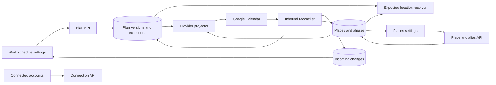

# Work Schedule And Places

> **Status**: Approved for implementation
> **Date**: 2026-09-05
> **Area**: Personal settings, planning, work location, calendar providers

## Decision

This design is for the person who sets their own work pattern and for the engineers who must keep
that pattern consistent across Docket and connected calendars. The person should finish with one
default answer to where and when they work. The engineers should implement one canonical model
instead of teaching the interface to organize unrelated location assertions.

Docket will replace `Work locations` with two top-level personal settings sections. `Work schedule`
will own the person's default working times and places. `Places` will own saved places, provider
aliases, map positions, and automatic location. `Connected accounts` will continue to own provider
permissions and per-account synchronization controls.

The work schedule will be authoritative. Docket will apply recognized changes from a connected
calendar to that schedule. Docket will ask the person to resolve a change only when it cannot map a
provider label or cannot apply two conflicting edits without losing intent. Docket will not create
a saved place from an arbitrary provider label.

This design supersedes the authoring model and settings structure in
`2026-08-13-unified-work-location-design.md` and
`2026-08-14-work-location-settings-simplification-design.md`. Those documents still govern current
location evidence, privacy, and provider capability checks where this document does not replace
them.

## Information Architecture

The personal settings navigation will include these destinations:

1. `Work schedule` will show the current default plan, dated changes, and incoming schedule changes.
2. `Places` will show saved places, unresolved provider labels, and automatic location.
3. `Connected accounts` will show whether each Google account can read and update work-location
   events. It will also let the person reconnect or disable that account.

`Calendar sync` will not exist as a page or subsection. The phrase hides two separate jobs. The
schedule page owns the schedule. The account page owns the connection. Provider delivery retries
remain background state unless a person must reconnect an account.

The settings table of contents will use nested links under each top-level destination. `Work
schedule` will expose `Default plan` and `Dated changes`. It will expose `Incoming changes` only when
at least one item needs a decision. `Places` will expose `Saved places`, `Unmatched names` only when
needed, and `Automatic location`.

## Canonical Schedule Model

A work schedule consists of immutable plan versions. Each version has an anchor date, an IANA
timezone, an effective start date, an optional effective end date, and a repeating cycle from one
through twenty-eight days. A normal seven-day week is the default presentation. The longer cycle
supports 9/80, A/B weeks, four-on/four-off, 2-2-3, and rotating day/evening/night schedules without
creating a separate recurrence language for each case.

Each cycle day contains zero or more ordered work segments. A segment has a start minute, a duration
from one minute through seven days, and one location state. The state is a saved place, mobile work,
or undecided. An empty cycle day means the person does not normally work that day. A segment may
cross midnight, so a night shift remains one segment instead of two unrelated rows.

A dated exception replaces the generated schedule for one civil date. Its replacement may contain
zero or more segments. This shape distinguishes a day off from an absent schedule. It also supports
a split shift, a temporary client site, and an overnight replacement without merging patches into a
base plan.

Editing the default plan creates a new version that starts on a date chosen by the person. The
previous version ends on the preceding date. This preserves history and lets a future roster start
without changing the answer for past dates. Docket rejects overlapping versions and rejects
segments that overlap within the same generated day.

Current-location observations remain separate evidence. A browser position can update the answer
to where the person is now. It cannot rewrite the default schedule.

## Resolution And Compatibility

The expected-location resolver will expand active plan versions and dated exceptions into half-open
instant intervals. A scheduled saved place produces the existing resolved place. Mobile work and
undecided work produce an explicit work interval with no saved place. The public result will expose
the location state so clients can distinguish `mobile`, `undecided`, `not_working`, and `unknown`.

During migration, Docket will convert compatible weekly and one-off assertions into a seven-day plan
and dated exceptions. If old assertions overlap or express incompatible recurring rules, Docket will
retain them as legacy evidence. The new plan will take precedence whenever it covers the requested
date. The compatibility API will remain available for existing clients, but the new settings UI will
not create or edit legacy assertions.

## Provider Convergence

Google Calendar stores working locations as events on the primary calendar. Docket will translate
each generated plan segment with a saved place into a provider event. Weekly seven-day plans may use
weekly recurrence. Longer cycles, mobile work, and irregular exceptions will use dated events within
a rolling ninety-day window. The sweep will extend that window before it expires.

Google custom working locations contain a free-form label instead of a stable place identifier.
Docket will normalize that label and look for an account-scoped alias. A known alias maps to one
saved place. A new label creates an unmatched-name item. It does not create a place. The person can
link the name to an existing place, create a place from the proposed name, or ignore that provider
event. The decision becomes an alias for future changes from the same account.

A recognized remote change creates or replaces the dated schedule for that day. Docket will show a
single incoming-change item before it applies an edit when the same plan date changed locally after
the provider version that Google observed. Every actionable row will use the verb `Resolve`. The
detail view will state the concrete decision, such as `Choose Tuesday's location`. The interface will
not use generic `Review` or `Compare` verbs.

The following component diagram shows the ownership boundaries:

## Interface Behavior

The `Work schedule` page will use a constrained reading width. It will show one current-plan surface
with a cycle summary and a direct `Edit default schedule` action. A seven-day plan will render as day
rows. The interface will group days that have the same segments when that makes the plan easier to
scan. A longer rotation will use named cycle days and will show the anchor date that determines the
current position.

The plan editor will use nested navigation. Its first view sets the cycle, timezone, and effective
date. Each cycle day opens a day editor. Each day editor can add, reorder, or remove segments. Each
segment editor sets start, end, and location. The person can copy one day to selected days. The
editor will show overnight end dates directly instead of hiding them behind a duration.

The `Dated changes` section will show future exceptions in date order. It will use `Add dated change`
as its primary action. Past exceptions remain available through a history disclosure instead of
filling the main page.

The `Places` page will use a content width that matches its rows. Each place row will show its name,
optional address, and meaningful states. Provider names will appear only when they explain an alias
or a problem. The current-location action will use a text label in the row overflow or a visible
button when it is the next action. It will not rely on an unexplained target icon.

Automatic location will show `Set up automatic location` when no place has a map position. That
action will open the relevant place workflow. It will never show a disabled `Start` button without
a recovery action. Once at least one place has a map position, the section will show an MD3 switch
with a concise state description.

The design will use the shared MD3 primitives from `@docket/ui`. Tonal containers will separate the
current plan, dated changes, and problems. Shape, type scale, state layers, focus rings, and motion
will come from shared tokens. The page will not add decorative cards inside decorative cards.

## Important Schedule Cases

The implementation must preserve these behaviors:

- A split shift can use different locations before and after the break.
- A shift can cross midnight or last longer than twenty-four hours.
- A rotating cycle can start midway through the calendar week.
- A person can mark work as mobile when no saved place applies.
- A person can leave a work segment undecided without marking the day off.
- A dated replacement can remove all work from a normal workday.
- A future plan can start while the current plan remains authoritative until that date.
- A timezone change creates a new plan version instead of moving historical intervals.
- A provider label can differ by punctuation or spacing and still use an approved alias.
- Two provider accounts can map the same label to different places.
- An offline local edit and a later provider edit can produce one explicit incoming change.

## Privacy And Error Ownership

Docket will keep geofence coordinates owner-only. The browser will continue to match positions
locally and send only a place identifier and accuracy. Provider event labels may appear in unmatched
name items. They will not become public place data until the person saves or links them.

The API will return stable problem codes. The interface will map those codes to Docket-owned copy.
The interface will never render provider error text. A transient delivery failure will remain
background state. A missing grant will appear under the affected connected account with a `Reconnect`
action.

## Rejected Alternatives

The design rejects a collection of independent weekly rules because it cannot express one coherent
default. It also creates duplicate rows when providers return one event per date.

The design rejects a fixed Monday-through-Friday grid because rotating rosters and overnight work
would require exceptions for normal behavior.

The design rejects a generic synchronization dashboard because schedule decisions, place identity,
and account authorization have different owners. Combining them recreates the ambiguous page this
work replaces.

The design rejects automatic place creation from Google labels because a provider label has no
stable identity. The same cafe can arrive with several spellings, and the same name can refer to
different places in two accounts.

## Validation

Contract tests will cover cycle bounds, overlapping segments, cross-midnight segments, location
states, version dates, and exception replacement. Resolver tests will cover seven-day and rotating
cycles, plan precedence, version boundaries, and daylight-saving transitions. Repository and route
tests will cover owner scope, atomic version replacement, aliases, unmatched names, and conflict
resolution. Provider tests will cover recurring and rolling-window projection without creating
places from labels.

Component tests will cover the two top-level settings sections, the nested plan editor, the recovery
action for automatic location, one `Resolve` verb, and the absence of `Calendar sync`, `Imported`,
`Review`, and `Compare` from the new surfaces. Playwright will cover creating a default plan, adding
a dated change, resolving an unmatched name, and reconnecting an account. The design review will
capture 1440 by 900 and 390 by 844 screenshots in both themes. It will also check 320-pixel overflow
and keyboard focus.

## Open Limits

The first implementation will limit a single segment to seven days. It will not model an unknown
future end for an active shift. The first implementation will name cycle days by their ordinal and
weekday position. Custom labels such as `Blue crew` can follow if real rosters show that ordinal
labels fail. Microsoft remains a capability contract rather than a connected provider.
