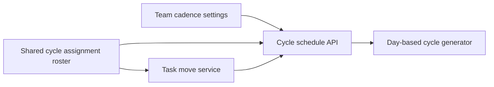

# Configurable future cycle planning

This specification is for the Docket maintainer who owns team cadence and task planning. The
maintainer must let a team choose cycle lengths down to one day and assign work to a cycle at any
future date without moving work that the team already planned.

## Decision

Docket will replace its whole-week cadence with a team-owned day cadence. A team stores a positive
`cycleCadenceDays` and a calendar-date `cycleCadenceAnchor`. The supported length is 1 through 365
days. New teams default to seven days. Existing teams migrate from `cycleCadenceWeeks` to
`cycleCadenceDays = cycleCadenceWeeks * 7`, with the existing Monday boundary as their anchor, so
their current cycle dates do not change.

The product will not pre-create a fixed number of future cycles. A bounded, idempotent API operation
will ensure native cycles through a requested date. The task composer, task detail editor, and canvas
editor will initially ensure enough cycles to cover the end of the next calendar quarter. Their
cycle picker will also offer **Go to date…**, which ensures the bounded pages needed to reach any
later date and selects the resulting window. A person can therefore plan years ahead without Docket
creating years of unused daily cycles up front.

The design rejects a larger fixed rolling window because four, twelve, or fifty-two future cycles
all impose a product ceiling and behave inconsistently across one-day and quarterly cadences. It
also rejects virtual, unsaved picker options because an option without a stable cycle id complicates
links, task moves, automations, integrations, and concurrent assignments.

## Component diagram

The component diagram shows the modules involved in planning a task into a future cycle. All nodes
are application components at the same level.

Team settings and assignment pickers share the same schedule API. The generator owns date math and
idempotent materialization. The existing task move service remains the only operation that changes a
task's `cycleId`; it validates that the target cycle belongs to the task's team.

## Team settings

The Team detail page will add a **Settings** tab for members with the `manage` capability. The cadence
form has two fields:

- **Cycle length** accepts an integer from 1 through 365 and describes the value in days.
- **New cadence starts** accepts a calendar date at or after the safe change boundary.

The form previews the next three windows before saving. It uses calendar-day arithmetic rather than
millisecond multiplication, so a one-day cycle still represents one local calendar day across a
daylight-saving transition. API storage remains canonical UTC boundaries after the workspace date
has been resolved.

A connected provider owns the cadence for a provider-linked team. Docket will show that cadence as
read-only and direct the manager to the provider instead of creating overlapping native cycles.

## Cadence changes

Docket will never move a task merely because a manager changes cadence. The API will find the latest
future native cycle that has any task reference. It will preserve the old schedule through that
cycle, including empty windows between the current cycle and that last planned cycle. It will delete
only empty native-generated cycles after the preserved boundary. Provider cycles and manually
created cycles remain untouched.

The earliest allowed new anchor is the day after the preserved boundary. When no future cycle
contains work, the boundary is the end of the current cycle. A manager may choose a later anchor and
leave an intentional planning gap. The settings response will report the effective anchor and the
count of empty generated cycles removed, so the UI can confirm what changed without claiming that
work moved.

Saving the same cadence twice is an idempotent no-op. Concurrent cadence writes use the team's row
lock. A stale request receives a conflict response instead of applying date math against a schedule
that changed after the form loaded.

## Cycle identity and generation

Native generation will key idempotency on the team and window start date rather than on the current
week-based sequence number. The database will enforce one native-generated cycle per team and start
date. The existing `number` remains a compatibility and ordering field, but no UI may use it as the
cycle's name or as the generation key.

The generator accepts a team schedule, an inclusive start date, and an inclusive through date. One
request may create at most 400 windows. This covers more than a year of daily cycles while bounding
write size. A client that targets a later date advances through repeated bounded requests. Each
request inserts missing starts with conflict-safe semantics and returns the created or existing
windows in date order.

The cycle API will expose an explicit mutation for ensuring a range. It requires `contribute`,
validates that the team belongs to the workspace, rejects a through date before the schedule anchor,
and refuses provider-owned cadence. Read-only list operations will stop being responsible for
creating farther-future data. Existing rolling-window reads may keep their current compatibility
behavior while callers migrate, but assignment surfaces use the explicit operation.

## Assignment experience

One shared cycle roster will serve task creation, task detail, and canvas editing. It will scope
cycles to the selected task team and order them by start date. The picker will separate **Current**
and **Upcoming** options and will search cycle names and formatted date windows. Completed cycles do
not appear as new assignment targets, but the currently assigned completed cycle remains visible
until the task is moved.

Opening the picker ensures through the next quarter before listing. **Go to date…** accepts a date,
ensures the containing window, and scrolls that option into view. The task is not assigned until the
person selects the cycle. Selection continues through the existing atomic task move operation.

If generation fails, the picker keeps its previously loaded choices and shows application-owned
copy beside the date action. It does not display provider or database errors. If the cadence changes
between generation and selection, task move revalidates the cycle and returns a stable conflict that
the picker resolves by refreshing the roster.

## Validation

Pure generator tests will cover one-day, seven-day, ten-day, and 365-day cadences; leap days;
daylight-saving boundaries; anchor alignment; stable starts; and the 400-window limit. Migration
tests will prove that existing weekly teams retain the same current and future boundaries.

API tests will cover conflict-safe repeated generation, a target several years ahead, cross-team
rejection, provider-owned cadence, stale settings writes, preserved future assignments, deletion of
only empty generated cycles after the safe boundary, and unchanged task `cycleId` values after a
cadence change.

Web behavior tests will cover the Team Settings permission boundary, previewed windows, one-day
configuration, quarter-ahead initial options, **Go to date…**, and successful assignment from the
task composer, task detail, and canvas. Visual acceptance will capture Team Settings and a task
picker containing a cycle at least one quarter ahead at 1440 by 900 and 390 by 844 in light and dark
themes. The 320-pixel overflow check must pass.

## Open boundary

Cycle dates currently resolve from UTC timestamps, while this design describes calendar days. The
implementation must use the workspace's existing canonical timezone when it converts an anchor date
to stored boundaries. It must not introduce a separate team timezone in this slice. A later product
decision may add team-local timezones, but that would require an explicit migration policy for every
existing cycle and is outside this work.
