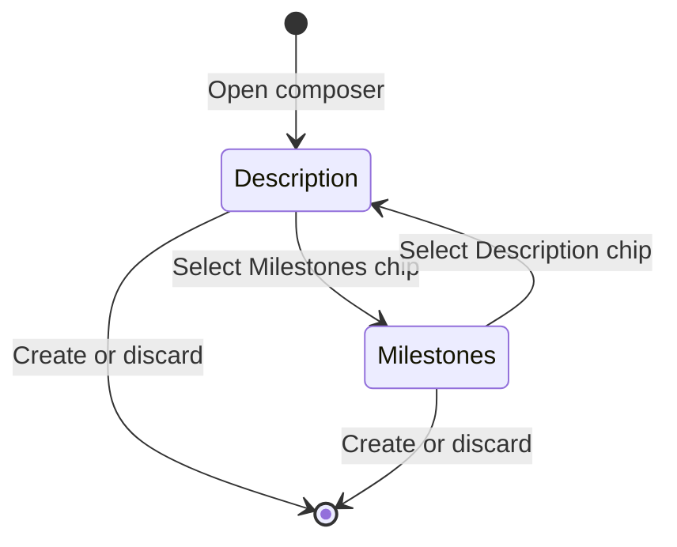

# Project composer section switcher

This specification is for the engineer who changes the Create Project composer. The engineer must
replace its vertically stacked milestone fields with a section switcher that keeps the description
editor usable at every supported viewport size.

## Decision

The title header will include a compact section switcher directly below the summary. It will reuse
the shared `Tabs` primitive in its segmented treatment. It will contain `Description` and
`Milestones · n`, where `n` is the current draft count. `Description` will be selected whenever the
composer opens.

The selected section will own the entire scrolling body. The description editor will therefore use
the full body height instead of sharing it with milestone rows. The milestone section will use the
same body rectangle for its own list and add controls. Switching sections will preserve both drafts,
the description editor instance, and each section's scroll position.

The section switcher will use filled rounded controls. It will not use underlines, horizontal rules,
or a second resting surface. The selected shape will provide the visual state.

This state machine describes the interaction:

## Shared layout contract

The modal will follow the main detail page's anatomy at its smaller scale: destination context,
identity fields, section navigation, active content, metadata, and actions. The same shared `Tabs`
and `EntityMetadataRow` primitives will own navigation and properties on both surfaces. The modal
will keep the segmented tab treatment because it switches two compact editing modes. The detail
page will keep its wider section-navigation treatment because it navigates a full page.

The create flow will continue using draft-aware inputs rather than importing persisted-page mutation
components. Alignment means one information hierarchy and one set of shared primitives. It does not
mean coupling unsaved draft state to detail-page network mutations.

`ComposerShell` will replace its open-ended `trailingFields` slot with a typed optional section
contract. A caller will supply each section's id, accessible label, visible label, optional count,
and body. The shell will always provide the description section when the composer has a body.

Composers without supplemental sections will render no switcher and will retain their current
layout. The Project composer will supply one `Milestones` section. This keeps future supplemental
entity content from entering the editor's flex column and recreating the same height failure.

The editor-height rule is structural. When `Description` is active, its editor will fill the body
region and cannot be shortened by supplemental content. Browser acceptance will also assert that
the visible editor is at least two-thirds of the available composer body height.

## Milestone behavior

The milestone section will retain the current draft fields, validation limit, add behavior, order,
and atomic project-create request. Its rows will scroll inside the shared body. The section chip will
update its count as drafts are added or removed.

Keyboard focus will move to the first useful control in the selected section. Switching back to the
description will restore focus to the editor without recreating its document. Screen readers will
receive a tablist and tabpanel relationship with the selected state exposed.

## Rejected directions

A compact milestone shelf still spends editor height on supplemental content. It also needs another
overlay for editing, which splits one task across two presentations.

A permanent desktop sidecar protects height but cuts the editor's reading measure. It also requires
a different phone interaction because the two columns cannot fit at 320 or 390 pixels.

## Acceptance

Component tests will cover the section contract, default selection, count changes, draft retention,
editor-instance retention, focus movement, and accessible tab semantics. Project composer tests will
cover milestone creation and validation from the milestone section.

Shared-shell tests will also verify the detail-page-aligned order: title and summary, section tabs,
active body, metadata, then actions. They will verify that callers without supplemental sections do
not receive empty navigation chrome.

Browser checks will cover 1440×900, 390×844, and 320×844 layouts in light and dark themes. They will
assert the two-thirds editor-height floor, fixed header and footer, no horizontal overflow, preserved
footer rows, and no state loss while switching sections.
